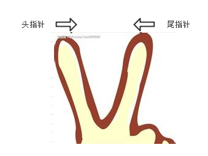
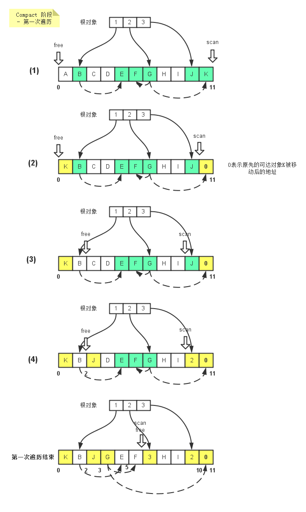
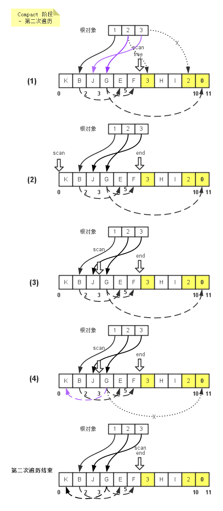
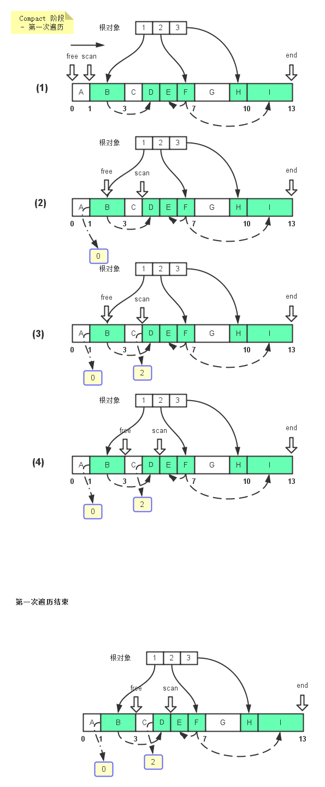
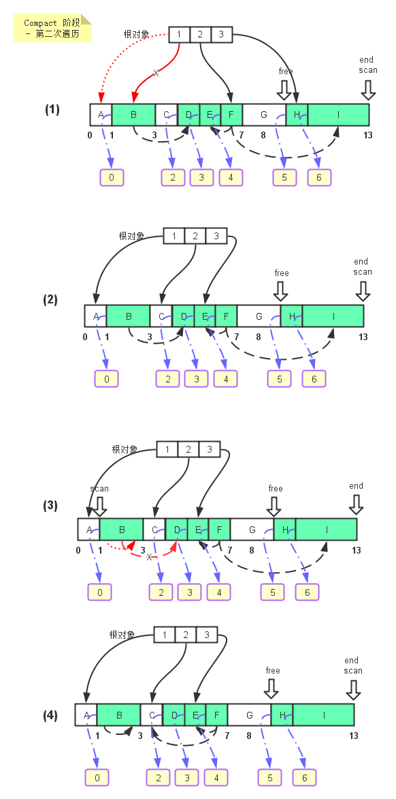
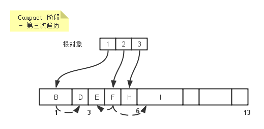

### 前言
内存碎片一直是非移动垃圾回收器(指在垃圾回收时不进行对象的移动)的一个问题，比如说在标记-清除垃圾回收器就有这样的问题。而标记-压缩垃圾回收算法能够有效的缓解这一问题。
### 算法原理
既然叫标记-压缩算法，那么它也分为两个阶段，一个是标记(mark)，一个是压缩(compact). 其中标记阶段跟标记-清除算法中的标记阶段是一样的。

而对于压缩阶段，它的工作就是移动所有的可达对象到堆内存的同一个区域中，使他们紧凑的排列在一起，从而将所有非可达对象释放出来的空闲内存都集中在一起，通过这样的方式来达到减少内存碎片的目的。

在压缩阶段，由于要移动可达对象，那么需要考虑移动对象时的顺序，一般分为下面三种：
> 1. 任意顺序 - 即不考虑原先对象的排列顺序，也不考虑对象间的引用关系，随意的移动可达对象，这样可能会有内存访问的局部性问题。
> 
> 2. 线性顺序 - 在重新排列对象时，会考虑对象间的引用关系，比如A对象引用了B对象，那么就会尽可能的将A，B对象排列在一起。
> 
> 3. 滑动顺序 - 顾名思义，就是在重新排列对象时，将对象按照原先堆内存中的排列顺序滑动到堆的一端。

现在大多数的垃圾收集算法都是按照任意顺序或滑动顺序去实现的。下面我们分别来看下它们各自的算法原理。
### Two-Finger 算法
Two-Finger算法来自Edwards, 它在压缩阶段移动对象时是任意顺序移动的，它最适用于处理包含固定大小对象的内存区域。由于Mark阶段都是跟标记-清除算法一致的，这里我们只关注Compact阶段。

Two-Finger算法是一个Two Passes算法，即需要遍历堆内存两次，第一次遍历是将堆末尾的可达对象移动到堆开始的空闲内存单元去，第二次遍历则需要修改可达对象的引用，因为一些可达对象已经被移动到别的地址，而原先引用它们的对象还指向着它们移动前的地址。

在这两次遍历过程中，首尾两个指针分别从堆的头尾两个位置向中间移动，直至两个指针相遇，由于它们的运动轨迹酷似两根手指向中间移动的轨迹，因此称为Two Finger算法。


#### 第一次遍历
下面我们先看下第一遍遍历的伪代码 - 来自<<GC手册>>,
```c++
compact():
    relocate(HeapStart,HeapEnd)
    updateReferences(HeapStart,free)
 
relocate(start,end)
    free <- start
    scan <- end
 
    while free < scan 
        // 找到一个可以被释放的空间
        while isMarked(free)
            unsetMarked(free)
            free <- free + size(free)
 
        // 找到一个可以移动的可达对象
        while not isMarked(scan) && scan > free
            scan <- scan - size(scan)
 
        if scan > free
            unsetMarked(scan)
            move(scan, free) // 将scan位置的可达对象移动到free位置上
            *scan <- free // 将可达对象移动后的位置写到原先可达对象处于的位置
            free <- free + size(free)
            scan <- scan - size(scan)
```
第一次遍历的原理是，头指针(free)沿着堆头向堆尾前进，直到找到一个空闲的内存单元（即没有被标记为可达对象的内存单元），如遇到可达对象，则清除其标记。接着尾指针(scan)从堆尾向堆头方向前进，直到找到一个被标记为可达的内存单元。最后，collector将可达对象从尾指针(scan)指向的位置移动到头指针(free)指向的位置，最后将可达对象移动后的位置(当前free指针指向的位置)写到原先可达对象处于的位置(当前尾指针scan指向的位置), 为下一次的遍历 - 更新对象相互间的引用做好准备。注：当移动可达对象时，其引用的对象在可达对象移动后保持不变，如下图中的G对象移动后依然指向位置5和位置10。


#### 第二次遍历
而第二次的遍历则是为了更新引用关系，一个可达对象可以被其他对象引用，比如上图中的K对象，如果其被移动后，引用它的对象比如说G并不知道它被移动了，那么这第二次的遍历就是为了告诉G它所引用的对象K已经被移动到新的位置上去了，它需要更新它对K的引用。
```c++
updateReferences(start,end)
    for each fld in Roots // 先更新mutator根对象所引用的对象关系
        ref <- *fld
        if ref >= end
            *fld <- *ref 
    scan <- start
    while scan < ned
        for each fld in Pointers(scan)
            ref <- * fld
            if ref >= end 
                *fld <- *ref
        scan <- scan + size(scan)
```
第二次遍历，collector先会对根对象进行遍历，比如根对象2引用着位置6的内存单元，根据算法，该位置大于等于end指针所指向的位置 - 即第一次遍历free指针和scan指针相遇的位置，那么我们就认为这个位置的对象已经被移动，需要更新根对象2的引用关系，即从引用位置6改为引用位置2(位置6的内存单元中记录着该对象被移动后的新位置)。同理，在移动G对象的时候，也是要判断看G所引用的内存单元位置是否大于end指针指向的位置，如果小于，则不处理。否则则修改G的引用关系。


### LISP2 算法
Lisp2算法是一种应用更为广泛的压缩算法，它属于滑动顺序算法中的一种。它跟Two-Finger算法的不同还在于它可以处理不同大小的对象，而不再是固定大小的对象。同时，计算出来的可达对象的迁移地址需要额外的空间进行存储而不再是复写原先对象所在的位置。最后，Lips2算法需要进行3次堆内存的遍历。
#### 第一次遍历
第一次遍历，collecor仅仅是计算和记录可达对象应该迁移去的地址。
```c++
compact():
    computeLocations(HeapStart,HeapEnd,HeapStart)
    updateReferences(HeapStart,HeapEnd)
    relocate(HeapStart,HeapEnd)
 
computeLocations(start,end,toRegion):
    scan <- start
    free <- toRegion
    while scan < end
        if isMarked(scan)
            forwardingAddress(scan) <- free
            free <- free + size(scan)
        scan <- scan + size(scan)
```


1. 指针free, scan同时指向堆起始位置，同时scan指针向堆尾移动，目的是要找到被标记的可达对象。

2. 找到可达对象后，在scan指针对应的位置分配一个额外的空间来存储该可达对象应该迁移到的地址 - 就是free指针指向的位置0，同时free指针向堆尾移动B对象大小的距离- free'指针指向的位置。最后scan指针继续往前走，直到寻找到下一个可达对象D - scan'指针指向的位置。

3. 同理，在可达对象D处分配一块空间来保存对象D应该迁移到的位置，由于B对象已经占用了2个内存单元，所以对象E的迁移地址是从位置2开始，也就是当前free指针指向的位置。

4. 指针free，scan继续向前移动。

5. 第一次遍历完后，所有的可达对象都有了对应的迁移地址，free指针指向位置9，因为所有的可达对象总共占了9个单元大小的空间。
#### 第二次遍历
第二次遍历主要是修改对象间的引用关系，基本跟Two Finger算法的第二次遍历一样。
```c++
updateReferences(start,end):
    for each fld in Roots
        ref <- *fld
        if ref != null
            *fld <- forwardingAddress(ref)
 
    scan <- start
    while scan < end
        if isMarked(scan)
            for each fld in Pointers(scan)
                if *fld != null
                    *fld <- forwardingAddress(*fld)
        scan <- scan + size(scan)
```


1. 修改根对象的引用关系，根对象1引用对象B，对象B的迁移地址为0，于是collector将根对象对B对象的引用指向它的迁移地址 - 位置0， 现在A对象所处的位置。

2. 同理，对于根对象2，3都执行同样的操作，将它们对其所引用的对象的引用修改为对应的它们所引用的对象的迁移地址。

3. 通过scan指针遍历堆内存，更新所有的可达对象对其引用对象的引用为其引用对象的迁移地址。比如说，对于可达对象B， 它引用了对象D，D的迁移地址是2，那么B直接将其对D对象的引用重新指向2这个位置。

4. 第二次遍历结束后的对象之间的引用关系。
#### 第三次遍历
第三次遍历则是根据可达对象的迁移地址去移动可达对象，比如说可达对象B，它的迁移地址是0，那么就将其移动到位置0，同时去除可达对象的标记，以便下次垃圾收集。
```c++
relocate(start,end):
    scan <- start
    while scan < end
        if isMarked(scan)
            dest <- forwardingAddress(scan)
            move(scan,dest) // 将可达对象从scan位置移动到dest位置
            unsetMarked(dest)
        scan <- scan + size(scan)
```
所有可达对象移动结束后，内存单元展示为：


### 后记
标记-压缩算法虽然缓解的内存碎片问题，但是它也引用了额外的开销，比如说额外的空间来保存迁移地址，需要遍历多次堆内存等。
