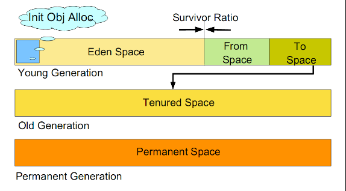

### 为什么要进行分代回收?
JVM使用分代回收测试，是因为:不同的对象，生命周期是不一样的。因此不同生命周期的对象采用不同的收集方式。可以提高垃圾回收的效率。

Java程序运行过程中，会产生大量的对象，其中有些对象是与业务相关的。比如Http请求的Session对象，线程，Socket连接等。但是还有一些对象，主要是程序运行过程中生成的临时变量(比如方法中的局部变量)，这些对象生命周期会比较短，比如：String对象，由于其不变类的特性，系统会产生大量的这些对象，有些对象甚至只用一次即可回收。

试想，在不进行对象存活时间区分的情况下，每次垃圾回收都是对整个堆空间进行回收，花费时间相对会长，同时，因为每次回收都需要遍历所有存活对象，但实际上，对于生命周期长的对象而言，这种遍历是没有效果的，因为可能进行了很多次遍历，但是他们依旧存在。因此，分代垃圾回收采用分而治之的思想，进行代的划分，把不同生命周期的对象放在不同代上，不同代上采用最适合它的垃圾回收方式进行回收。
### 如何分代

虚拟机中的共划分为三个代：年轻代（Young Generation）、年老点（Old Generation）和持久代
（Permanent Generation）。其中持久代主要存放的是Java类的类信息，与垃圾收集要收集的Java对象关系不大。年轻代和年老代的划分是对垃圾收集影响比较大的。
#### 年轻代

所有新生成的对象首先都是放在年轻代的。年轻代的目标就是尽可能快速的收集掉那些生命周期短的对象。

年轻代分三个区。一个Eden区，两个Survivor区(一般而言)。大部分对象在Eden区中生成。当Eden区满时，还存活的对象将被复制到Survivor区（两个中的一个），当这个Survivor区满时，此区的存活对象将被复制到另外一个Survivor区，当这个Survivor去也满了的时候，从第一个Survivor区复制过来的并且此时还存活的对象，将被复制“年老区(Tenured)”。需要注意，Survivor的两个区是对称的，没先后关系，所以同一个区中可能同时存在从Eden复制过来 对象，和从前一个Survivor复制过来的对象，而复制到年老区的只有从第一个Survivor去过来的对象。而且，Survivor区总有一个是空的。同时，根据程序需要，Survivor区是可以配置为多个的（多于两个），这样可以增加对象在年轻代中的存在时间，减少被放到年老代的可能。
#### 老年代
在年轻代中经历了N次垃圾回收后仍然存活的对象，就会被放到年老代中。因此，可以认为年老代中存放的都是一些生命周期较长的对象。
#### 持久代
用于存放静态文件，如今Java类、方法等。持久代对垃圾回收没有显著影响，但是有些应用可能动态生成或者调用一些class，例如Hibernate等，在这种时候需要设置一个比较大的持久代空间来存放这些运行过程中新增的类。持久代大小通过-XX:MaxPermSize=进行设置。
### 什么情况下触发垃圾回收
由于对象进行了分代处理，因此垃圾回收区域、时间也不一样。GC有两种类型：Scavenge GC和Full GC。
#### Scavenge GC
一般情况下，当新对象生成，并且在Eden申请空间失败时，就会触发Scavenge GC，对Eden区域进行GC，清除非存活对象，并且把尚且存活的对象移动到Survivor区。然后整理Survivor的两个区。这种方式的GC是对年轻代的Eden区进行，不会影响到年老代。因为大部分对象都是从Eden区开始的，同时Eden区不会分配的很大，所以Eden区的GC会频繁进行。因而，一般在这里需要使用速度快、效率高的算法，使Eden去能尽快空闲出来。
#### Full GC
对整个堆进行整理，包括Young、Tenured和Perm。Full GC因为需要对整个对进行回收，所以比ScavengeGC要慢，因此应该尽可能减少Full GC的次数。在对JVM调优的过程中，很大一部分工作就是对于FullGC的调节。有如下原因可能导致Full GC：

* 年老代（Tenured）被写满
* 持久代（Perm）被写满
* System.gc()被显示调用

