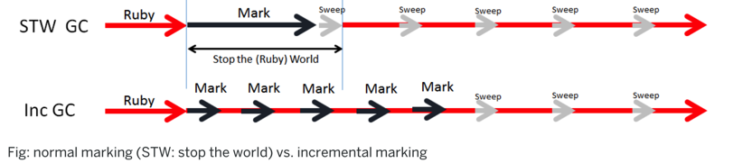
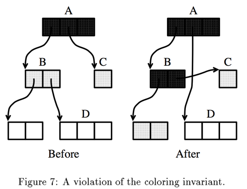
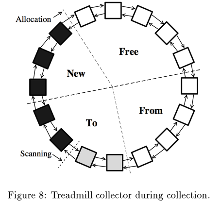

### 增量式 GC 思路
增量式（incremental）GC 顾名思义，允许 collector 分多个小批次执行，每次造成的 mutator 停顿都很小，达到近似实时的效果。

引用计数类 GC 本身就具有增量式特性，但由于其算法自身的缺陷与效率问题，一般不会采用。而追踪类 GC 实现增量式的难点在于：
> 在 collector 遍历引用关系图，mutator 可能会改变对象间的引用关系

这其实是一个并发问题，collector 线程与 mutator 线程同时去读/写一些共享的数据结构（引用关系图），这就要求把它保护起来，使 collecotr 与 mutator 能够感知其改变，并作出相应调整。

在 GC 期间，对 mutator 改变「引用关系图」的保守度（conservatism）是增量式 GC 一大特性。如果 mutator 在 collector 遍历某对象后将其释放（floating garbage），那么这个对象在本次 GC 不会被回收，但在下一轮 GC 开始时会被回收。

这种弱一致性（relaxed consistency）是允许的，因为它不会对程序逻辑造成影响，只是延迟了垃圾对象的回收，而且一致性越弱，遍历算法的实现就可以更灵活。
### 三色标记
三色标记（tricolor marking）抽象屏蔽了 GC 实现的算法（MS/Copying）、遍历策略（宽度优先/深度优先）等细节，对于理解增量式 GC 十分有帮助。具体来说是在 GC 遍历引用关系图时，对象会被标为三种颜色：
> 1. 黑色black，表明对象被 collector 访问过，属于可到达对象
> 
> 2. 灰色gray，也表明对象被访问过，但是它的子节点还没有被 scan 到
> 
> 3. 白色white，表明没有被访问到，如果在本轮遍历结束时还是白色，那么就会被收回

对于 MS 来说，设置标记位就是着色的过程：有 mark-bit 的即为黑色。对 Copying GC 来说，把对象从 fromspace 移动到 tospace 就是着色过程：在 fromspace 中不可到达的对象为白色，被移动到 tospace 的对象为黑色。

对于增量时 GC 来说，需要在黑白之间有个中间状态来记录「那些之前被 collector 标记黑色，后来又被 mutator 改变的对象」，这就是灰色的作用。

对于 MS 来说，灰色对象是用于协助遍历 queue 里面的对象，即上文中描述的 worklist 里面的对象。对于 Copying GC 来说，灰色对象就是那些在 topspace 中还没被 scan 的对象，如果采用 Cheney 的宽度优先遍历算法 ，那么就是 scan 与 free 指针之间的对象。

增加的中间状态灰色要求 mutator 不会把黑色对象直接指向白色对象（这称为三色不变性 tri-color invariant），collector 就能够认为黑色对象不需要在 scan，只需要遍历灰色对象即可。

上图描述了一个违法着色不变性的情况。假设 A 已经被完全地 scan，它本身被标为黑色，字节点被标为灰色，现在假设 mutator 交换了 A–>C 与 B–>D 的指针，现在指向 D 的指针只有 A，而 A 已经被完全地 scan 了，如果继续 scan 过程的话，B 会被置为黑色，C 会被重新访问，而 D 则不会被访问到，在本轮遍历后，D 由于是白色，会被错误的认为是垃圾并被回收掉。
### 增量策略
为了解决上面的问题，一般有两类方式来协调 mutator 与 collector 的行为：
> 1. 读屏障（read barrier），它会禁止 mutator 访问白色对象，当检测到 mutator 即将要访问白色对象时，collector 会立刻访问该对象并将之标为灰色。由于 mutator 不能访问指向白色对象的指针，也就无法使黑色对象指向它们了
> 
> 2. 写屏障（write barrier），它会记录下 mutator 新增的由黑色–>白色对象的指针，并把该对象标为灰色，这样 collector 就又能访问有问题的对象了

读/写屏障本质是一些同步操作——在 mutator 进行某些操作前，它必须激活 collector 进行一些操作。

在实际应用中，调用 collector 只需要一些简单的操作，compiler 可以在输出 mutator 机器码（machine code）的同时，额外输出一些指令（instructions），在进行读/写指针时，会额外执行这些指令。根据读/写屏障复杂度，整个屏障操作可以内联（inline），也可以是个额外的过程调用（out of line procedure call）。
#### 写屏障
如果要使 collector 错误地回收可到达对象，mutator 必须做到以下两点（缺一不可）：
> 1. 把指向白色对象的指针存储在一黑色对象中。称为条件1
> 
> 2. 在 collector 访问该白色对象之前，破坏指向它的原有指针。称为条件2

写屏障也从这两个方面入手，下面分别阐述。
##### Incremental Update
Incremental Update 算法（后面简写IU）避免条件1的发生。IU 最常用的实现是由 Dijkstra 提出1，该算法核心思想阐述如下：
> 它会启发式（或者说是保守式）保留在 GC 遍历结束时 live 的对象。在遍历期死亡的对象（该对象还没被遍历到），不会再被访问、标记。

为了避免指向白色对象的指针被隐藏在黑色对象中，这些指针在存储到黑色对象中时会被捕捉到，这时会把白色对象重新置为灰色，这个过程会一直迭代下去，直到没有灰色对象为止。

新创建的对象在 Dijkstra 算法中会被乐观的认为是白色，这是该算法的一大优势，因为大多数对象的生命周期都比较短。如果在 GC 遍历到它们之前就已经不可到达，这就意味着它们永远不用访问了。

Guy Steele 提出的算法中建议采用一种启发性方式，部分新对象是白色，部分是黑色，来保证短生命周期的对象尽快被回收的同时，避免遍历长生命周期的对象。但这种方式是否更有效不能很好证明。

在 Steele 算法中，如果指向白色对象的指针被储存在了黑色对象内，会把黑色对象变为灰色。Dijkstra 采用的方式与这种方式相比，显得更保守些，因为那些白色对象很有可能会在再次变为白色。这里举一实际例子进行说明：
> 假设程序使用一由双向链表实现的 stack 来存储数据，GC 遍历到栈顶元素，并将其标为黑色，这时程序进行一些 push/pop 操作，按照 Dijkstra 算法，pop 出来的所有元素会依次被标为灰色，那么就意味着在本次 GC 时不会被回收；而按照 Steele 算法，则有可能回收掉大部分 pop 出来的元素。

##### Snapshot at beginning
Snapshot at beginning（后面简写 SAB）算法避免条件2的发生。该算法在开始 GC 之前，会使用 copy-on-write 的方式复制一份当时的引用关系图。也就是说，在 GC 开始时引用关系图是固定的。

该算法最为人所知的实现由 Yuasa 提出，在该实现中，如果改变某个指针的地址，那么之前的地址会被加入一 marking stack，便于后面再次检查，这样就可以保证在 GC 时，所有的对象都会被遍历到，即使指向它们的指针发生了改变。拿上面三色标记举例来说，B–>D 的指针会被保存在一个 stack 中。
#### 读屏障
目前来说，最有名的实时性 GC 是 Baker 提出的增量式复制（incremental copying）GC。
##### Incremental Copying
Baker’s GC 大部分逻辑与 Copying GC 相似，使用 Cheney 的宽度优先算法遍历引用关系图，把所有引用的对象拷贝到 topspace 的 scan 指针处。但这个过程是与mutator并行的，而且 mutator 为了保证引用关系图的一致性，也可能会触发拷贝操作。下面具体阐述该算法工作流程：
> 1. GC 开始时会有一个原子性的 flip 过程，会把由 root set 可直接到达的对象由 fromspace 拷贝到 tospace
> 
> 2. mutator 恢复执行，与 collector 交替执行
> 
> 3. 当 mutator 访问到 fromspace 中的对象时，立刻将之拷贝到 topspace 中。这个 copy-on-demand 使用 read-barrier 来保证

Barker 算法一个重要特点是：在增量回收时，新分配的对象直接分配在 tospace，当作已遍历对象，也就是三色标记中的黑色。为保证 GC 能在内存耗尽前发现所有可到达对象并复制到 tospace，复制的速率与分配对象的速率息息相关。
##### Non-copying—Treadmill
Baker 在1991年对其增量式算法提出了 non-copying 版本，称为 Treadmill。Treadmill 使用双向链表来区别不同颜色的对象集合，这样就可以通过修改指针来避免移动对象与更新指针的操作。不同集合首尾相连形成环结构，便于对象的转化。如下图：

该环结构分为四个区域：
> 1. new 区。在 GC 期间的对象分配在这里，默认为黑色。在 GC 开始时，该区为空
> 
> 2. from 区。对应 fromspace，GC 开始前对象分配区域
> 
> 3. to 区。对应 tospace。在 GC 开始时，该区为空
> 
> 4. free 区。与 new、from 区相连，别于分配新对象

GC 工作过程与之前方式相似，再将 from 区对象连接到 to 区后，遍历 to 区里面的灰色对象，直到全部为黑色时GC结束。然后，new 与 to 合并后形成新 to 区，from 与 free 合并形成新的 free 区。
#### 实现细节
如果没有特殊的硬件支持，写屏障一般来说效率要高于读屏障，主要原因是：
> heap 指针的读操作要多于写操作

其中比较特别的是 Lisp Machine 有特殊的硬件支持重定向指针（forwording pointer），可以在不进行 forward 检测的前提下，交替使用新旧两个地址。
### 总结

