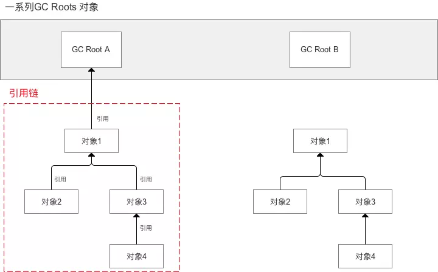
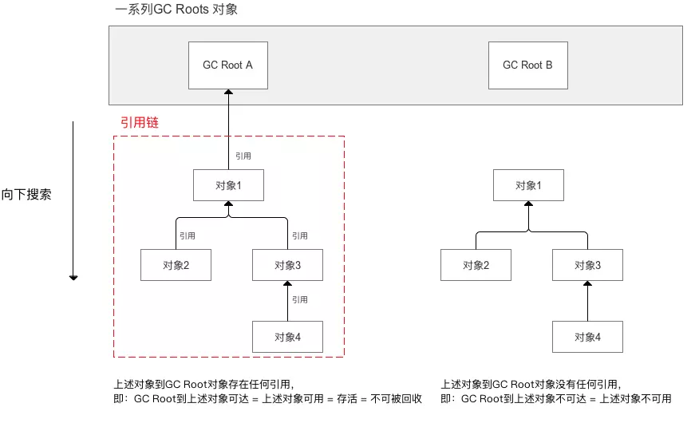
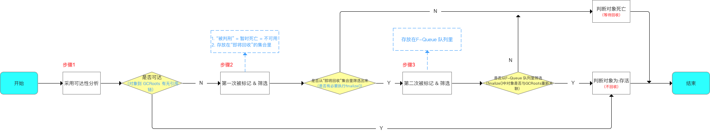

### 判断方式
垃圾收集器对 Java堆里的对象 是否进行回收的判断准则：Java对象是存活 or 死亡

判断对象为死亡才会进行回收

在Java虚拟机中，判断对象是否存活有2种方法：

* 引用计数法
* 引用链法（可达性分析法）

### 引用计数法
#### 方式描述
给 Java 对象添加一个引用计数器

每当有一个地方引用它时，计数器 +1；引用失效则 -1；
#### 判断对象存活准则
当计数器不为 0 时，判断该对象存活；否则判断为死亡（计数器 = 0）。
#### 优点

* 实现简单
* 判断高效

#### 缺点
无法解决 对象间相互循环引用的问题
> 即该算法存在判断逻辑的漏洞

具体描述
```java
<-- 背景 -->
// 对象objA 和 objB 都有字段 name
// 两个对象相互进行引用，除此之外这两个人对象没有任何引用
objA.name = objB；
objB.name = objA；

<-- 问题 -->
// 实际上这两个对象已经不可能再被访问，应该要被垃圾收集器进行回收
// 但因为他们相互引用，所以导致计数器不为0，这导致引用计数算法无法通知垃圾收集器回收该两个对象
```
正由于该算法存在判断逻辑漏洞，所以Java虚拟机没有采用该算法判断Java是否存活。
### 引用链法（可达性分析法）
很多主流商用语言（如Java、C#）都采用引用链法判断Java对象是否存活。

含3个步骤：
> 1. 可达性分析
> 
> 2. 第一次标记 & 筛选
> 
> 3. 第二次标记 & 筛选

#### 可达性分析
##### 方式描述
将一系列的 GC Roots 对象作为起点，从这些起点开始向下搜索。
> - 可作为 GC Root 的对象有：
> 
> 1. Java虚拟机栈（栈帧的本地变量表）中引用的对象
> 
> 2. 本地方法栈 中 JNI引用对象
> 
> 3. 方法区 中常量、类静态属性引用的对象
> 
> - 向下搜索的路径 = 引用链

如下图：


##### 判断 对象是否可达 标准
当一个对象到 GC Roots 没有任何引用链相连时，则判断该对象不可达
> 没有任何引用链相连 = GC Root到对象不可达 = 对象不可用



**特别注意**

可达性分析 仅仅只是判断对象是否可达，但还不足以判断对象是否存活 / 死亡

当在 可达性分析 中判断不可达的对象，只是“被判刑” = 还没真正死亡
> 不可达对象会被放在”即将回收“的集合里。

要判断一个对象真正死亡，还需要经历两个阶段：

* 第一次标记 & 筛选
* 第二次标记 & 筛选

#### 第一次标记 & 筛选
对象 在 可达性分析中 被判断为不可达后，会被第一次标记 & 准备被筛选
> a. 不筛选：继续留在 ”即将回收“的集合里，等待回收；
> 
> b. 筛选：从 ”即将回收“的集合取出

**筛选的标准**：该对象是否有必要执行 finalize()方法

若有必要执行（人为设置），则筛选出来，进入下一阶段（第二次标记 & 筛选）；

若没必要执行，判断该对象死亡，不筛选 并等待回收
> 当对象无 finalize()方法 或 finalize()已被虚拟机调用过，则视为“没必要执行”

#### 第二次标记 & 筛选
当对象经过了第一次的标记 & 筛选，会被进行第二次标记 & 准备被进行 筛选
##### 方式描述
该对象会被放到一个 F-Queue 队列中，并由 虚拟机自动建立、优先级低的Finalizer 线程去执行 队列中该对象的finalize()
> finalize()只会被执行一次
> 
> 但并不承诺等待finalize()运行结束。这是为了防止 finalize()执行缓慢 / 停止 使得 F-Queue队列其他对象永久等待。

##### 筛选标准
在执行finalize()过程中，若对象依然没与引用链上的GC Roots 直接关联 或 间接关联（即关联上与GC Roots 关联的对象），那么该对象将被判断死亡，不筛选（留在”即将回收“集合里） 并 等待回收
### 总结

