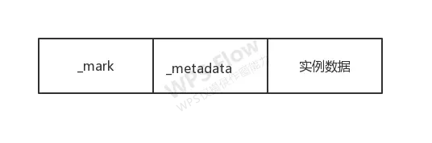
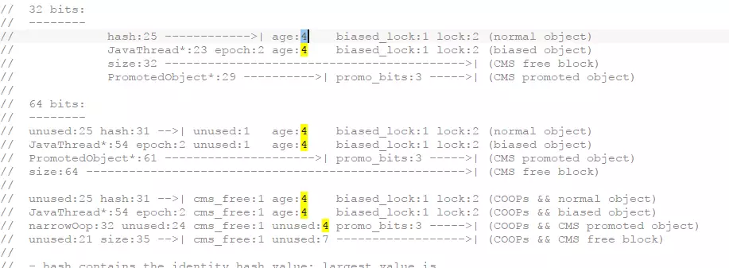
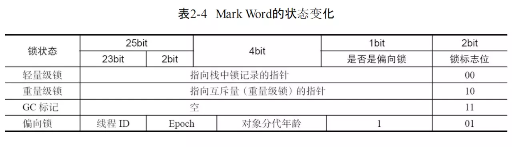
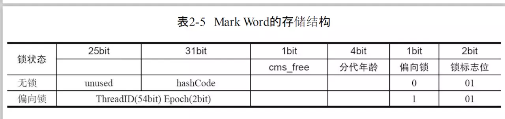
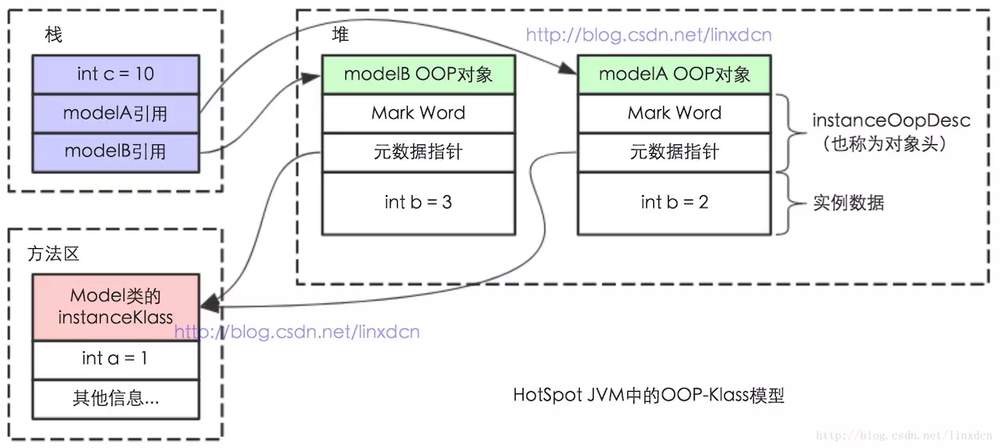

OOP-Klass Model（Ordinary Object Point-Klass Model）指的是普通对象指针，用来描述 java 类和对象在 JVM 中的表现形式，OOP 用来表示 java 实例在 JVM 中的表现，Klass 用来表示类在 JVM 中的表现。之所以要一分为二的设计是因为想要避免每个 Java 对象都存在一个虚函数，所以 oop 实例没有虚函数，而 Klass 类有虚函数，虚函数则是实现多态的关键所以 Java 最终也是通过虚函数来实现多态的，下面来分别深入了解下。
### OOP
OOP（Ordinary Object Point）普通对象指针，它的定义如下，提取了需要讲解的部分关键代码
```c++
class oopDesc {
 private:
  // mark word 相关信息
  volatile markOop  _mark;
  // 元数据
  union _metadata {
    // 实例对应的 Klass （实例对应的类）的指针
    Klass*      _klass;
    // 压缩指针
    narrowKlass _compressed_klass;
  } _metadata;

 private:
  // field addresses in oop
  // 私有的读取实例数据的方法实现在 oop.inline.hpp 中
  void*     field_base(int offset)        const;
  jbyte*    byte_field_addr(int offset)   const;
  jchar*    char_field_addr(int offset)   const;
  jboolean* bool_field_addr(int offset)   const;
  jint*     int_field_addr(int offset)    const;
  jshort*   short_field_addr(int offset)  const;
  jlong*    long_field_addr(int offset)   const;
  jfloat*   float_field_addr(int offset)  const;
  jdouble*  double_field_addr(int offset) const;
  Metadata** metadata_field_addr(int offset) const;
 
 // 公有的读取或者写入实例数据的方法
 public:
  void byte_field_put(int offset, jbyte contents);

  jchar char_field(int offset) const;
  void char_field_put(int offset, jchar contents);

  jboolean bool_field(int offset) const;
  void bool_field_put(int offset, jboolean contents);

  jint int_field(int offset) const;
  void int_field_put(int offset, jint contents);
};
```
由此我们可以看到 oop 主要包括了 3 部分内容



我们将下面的分成 3 块内容来讲

* 对象头
    * mark word
    * _metadata 元数据指针
* 插入实列数据以及获取实列数据

#### 对象头，markOop _mark
mark 也就是 mark word 是对象头的一部分在 markOop.hpp 中它含有哪些内容呢，源码注释定义如下



为了方便大家观看，盗图 2 张（来自并发编程艺术）





结合源码注释可以看到，第一张图是 32 位虚拟机下 Mark Word 的表示，第二张图 是 64 位 Mark Word 的表示
#### 对象头，union _metadata
元数据指针，它包含了 2 部分内容，klass 和 _compressed_klass 他们指向了对象所属的类，具体的在 Klass 中讲解
#### public 的 *_filed 和 对应的 put 方法
查找和插入实例数据方法，举一个列子来看，其它的都是类似的
```c++
jint int_field(int offset) const;
void int_field_put(int offset, jint contents);
```
实现在 oop.inline.hpp 中
```c++
inline jint oopDesc::int_field(int offset) const { 
    return *int_field_addr(offset); 
}

inline void oopDesc::int_field_put(int offset, jint contents) { 
    *int_field_addr(offset) = contents;  
}

inline jint* oopDesc::int_field_addr(int offset) const { \
    return (jint*) field_base(offset);
}

inline void* oopDesc::field_base(int offset) const { 
    return (void*)&((char*)this)[offset]; 
}
```
可以看到上面的方法可以根据传入的 offset 在内存中，查找或者插入指定的数据并且返回其内存地址。

由上面这些内容可以看出，oop 其实就是描述了类的实例，包含了对象头，实例数据等，而由于在 java 中我们的对象类型有很多种，比如数组对象，自定义对象等等同时也对应了不同的 oop，部分数据如下
```c++
// 各种 oop 的基类
typedef class oopDesc*                            oop;
// 表示一个 java 实例
typedef class   instanceOopDesc*            instanceOop;
// 表示一个数组实例
typedef class   arrayOopDesc*                    arrayOop;
// 表示一个对象数组实例
typedef class     objArrayOopDesc*            objArrayOop;
// 表示一个容纳基本类型的数组
typedef class     typeArrayOopDesc*            typeArrayOop;
```
上面这些 oop 都是继承与 oopDesc 在 jdk1.7 hotspot 中没有其它的操作，就只是一个空继承，在 jdk1.8 hotspot，有增加一些方法，我们挑选 1 个来看看，感兴趣的可以去看看源码
```c++
class instanceOopDesc : public oopDesc {
 public:
  // aligned header size.
  static int header_size() { return sizeof(instanceOopDesc)/HeapWordSize; }

  // If compressed, the offset of the fields of the instance may not be aligned.
  static int base_offset_in_bytes() {
    // offset computation code breaks if UseCompressedClassPointers
    // only is true
    return (UseCompressedOops && UseCompressedClassPointers) ?
             klass_gap_offset_in_bytes() :
             sizeof(instanceOopDesc);
  }

  static bool contains_field_offset(int offset, int nonstatic_field_size) {
    int base_in_bytes = base_offset_in_bytes();
    return (offset >= base_in_bytes &&
            (offset-base_in_bytes) < nonstatic_field_size * heapOopSize);
  }
};
```
所以，当我们使用 new 创建一个自定义的 Java 对象的时候，会创建一个 instanceOopDesc 来表示这个实列，当使用 new 创建一个数组时候会创建一个 objArrayOopDesc 来表示数组这个实列...
### 元数据
讲 oop 的时候我们说过，它有一个元数据指针指向它所属的类，能够想到，我们创建对象的时候有时候是有一些常量，方法等信息会保存在元数据中，元数据的定义如下
```c++
// The metadata hierarchy is separate from the oop hierarchy

//      class MetaspaceObj
// 这是关于 oop 的一些信息
// 表示一个 java 方法中不变的信息包括方法名、方法的访问修饰符、字节码、行号表、局部变量表等等
class   ConstMethod;
// 主要用于存储某些字节码指令所需的解析（resolve）好的常量项，
// 例如给[get|put]static、[get|put]field、
// invoke[static|special|virtual|interface|dynamic]等指令对应的常量池项用
class   ConstantPoolCache;
// 记录了 Java 方法执行时候的性能相关的 profile 信息，包括条件跳转是否总是走一个分支
// 某处判断从不为 null 等信息
class   MethodData;
//      class Metadata
class   Method;
// class 文件中的常量池
class   ConstantPool;
//      class CHeapObj
class   CompiledICHolder;
```
可以看到 MetaspaceObj 分类下主要是用于描述 oop 相关的信息，Metadata 主要用于描述 Klass 相关信息
### Klass
Klass 系统结构如下
```c++
// The klass hierarchy is separate from the oop hierarchy.

class Klass;
class   InstanceKlass;
class     InstanceMirrorKlass;
class     InstanceClassLoaderKlass;
class     InstanceRefKlass;
class   ArrayKlass;
class     ObjArrayKlass;
class     TypeArrayKlass;
```
class 向 JVM 提供了 2 个功能

* 实现语言层面的Java类（在Klass基类中已经实现）
* 实现Java对象的分发功能（由Klass的子类提供虚函数实现）

而 Klass 又是继承于 Metadata，因此像 Method、ConstantPool 都会以成员变量（或指针）的形式存在于 klass 体系中。

由此我们来总结一下，当我们 new 一个对象的时候，JVM 首先会判断这个类是否加载，没有的话会进行加载并创建一个 instanceKlass 对象来描述 Java 类，用它可以获取到类对应的元数据信息，如运行时常量池等信息，然后到初始化的时候会创建一个 instanceOopDesc 来表示这个 Java 对象实例，然后会进行 oop 的填充，包括填充对象头，使元数据指针指向 instanceKlass 类，然后填充实例数据。 创建完成后，instanceKlass 保存在方法区中，instanceOopDesc 保存在堆中，对象的引用则保存在栈中。

talk is cheap ,show me the code ：
```java
class Model
{
    public static int a = 1;
    public int b;

    public Model(int b) {
        this.b = b;
    }
}

public static void main(String[] args) {
    int c = 10;
    Model modelA = new Model(2);
    Model modelB = new Model(3);
}
```

