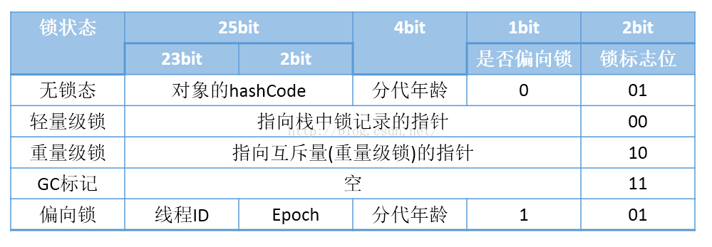
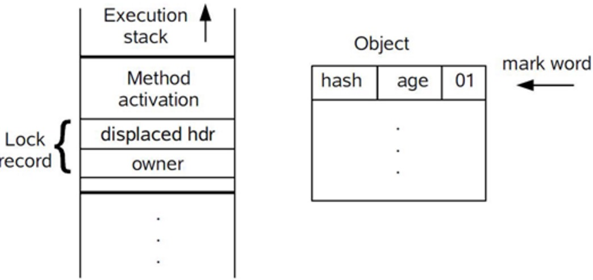
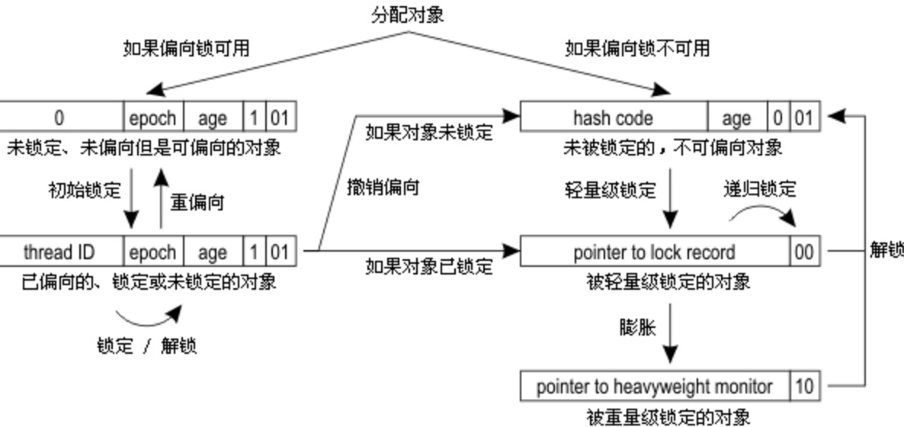

### 对象头
HotSpot虚拟机中，对象在内存中存储的布局可以分为三块区域：对象头（Header）、实例数据（Instance Data）和对齐填充（Padding）。 

HotSpot虚拟机的对象头(Object Header)包括两部分信息，第一部分用于存储对象自身的运行时数据， 如哈希码（HashCode）、GC分代年龄、锁状态标志、线程持有的锁、偏向线程ID、偏向时间戳等等，这部分数据的长度在32位和64位的虚拟机（暂 不考虑开启压缩指针的场景）中分别为32个和64个Bits，官方称它为“Mark Word”。

对象需要存储的运行时数据很多，其实已经超出了32、64位Bitmap结构所能记录的限度，但是对象头信息是与对象自身定义的数据无关的额 外存储成本，考虑到虚拟机的空间效率，Mark Word被设计成一个非固定的数据结构以便在极小的空间内存储尽量多的信息，它会根据对象的状态复用自己的存储空间。例如在32位的HotSpot虚拟机 中对象未被锁定的状态下，Mark Word的32个Bits空间中的25Bits用于存储对象哈希码（HashCode），4Bits用于存储对象分代年龄，2Bits用于存储锁标志 位，1Bit固定为0，在其他状态（轻量级锁定、重量级锁定、GC标记、可偏向）下对象的存储内容如下表所示。  

对象头的另外一部分是类型指针，即是对象指向它的类的元数据的指针，虚拟机通过这个指针来确定这个对象是哪个类的实例。并不是所有的虚拟机实现都必须在对象数据上保留类型指针，换句话说查找对象的元数据信息并不一定要经过对象本身。另外，如果对象是一个Java数组，那在对象头中还必须有一块用于记录数组长度的数据，因为虚拟机可以通过普通Java对象的元数据信息确定Java对象的大小，但是从数组的元数据中无法确定数组的大小。

这里要特别关注的是锁标志位，  锁标志位与是否偏向锁对应到唯一的锁状态。

所以锁的状态保存在对象头中，所以再理解下面两个问题，就好懂了！

* Synchronized锁的到底是什么, 锁住的是代码还是对象)（答案锁的是对象）？
* java中锁，锁的是对象，它是怎么实现的？

### 锁的状态
锁的状态总共有四种：无锁状态、偏向锁、轻量级锁和重量级锁。随着锁的竞争，锁可以从偏向锁升级到轻量级锁，再升级的重量级锁（但是锁的升级是单向的，也就是说只能从低到高升级，不会出现锁的降级）。JDK 1.6中默认是开启偏向锁和轻量级锁的，我们也可以通过-XX:-UseBiasedLocking来禁用偏向锁。
#### 轻量级锁的加锁过程
（1）在代码进入同步块的时候，如果同步对象锁状态为无锁状态（锁标志位为“01”状态，是否为偏向锁为“0”），虚拟机首先将在当前线程的栈帧中建立一个名为锁记录（Lock Record）的空间，用于存储锁对象目前的Mark Word的拷贝，官方称之为 Displaced Mark Word。这时候线程堆栈与对象头的状态如图所示。

（2）拷贝对象头中的Mark Word复制到锁记录中。

（3）拷贝成功后，虚拟机将使用CAS操作尝试将对象的Mark Word更新为指向Lock Record的指针，并将Lock record里的owner指针指向object mark word。如果更新成功，则执行步骤（4），否则执行步骤（5）。

（4）如果这个更新动作成功了，那么这个线程就拥有了该对象的锁，并且对象Mark Word的锁标志位设置为“00”，即表示此对象处于轻量级锁定状态，这时候线程堆栈与对象头的状态如图所示。

（5）如果这个更新操作失败了，虚拟机首先会检查对象的Mark Word是否指向当前线程的栈帧，如果是就说明当前线程已经拥有了这个对象的锁，那就可以直接进入同步块继续执行。否则说明多个线程竞争锁，轻量级锁就要膨胀为重量级锁，锁标志的状态值变为“10”，Mark Word中存储的就是指向重量级锁（互斥量）的指针，后面等待锁的线程也要进入阻塞状态。 而当前线程便尝试使用自旋来获取锁，自旋就是为了不让线程阻塞，而采用循环去获取锁的过程。
### 偏向锁
引入偏向锁是为了在无多线程竞争的情况下尽量减少不必要的轻量级锁执行路径，因为轻量级锁的获取及释放依赖多次CAS原子指令，而偏向锁只需要在置换ThreadID的时候依赖一次CAS原子指令（由于一旦出现多线程竞争的情况就必须撤销偏向锁，所以偏向锁的撤销操作的性能损耗必须小于节省下来的CAS原子指令的性能消耗）。上面说过，轻量级锁是为了在线程交替执行同步块时提高性能，而偏向锁则是在只有一个线程执行同步块时进一步提高性能。
#### 偏向锁获取过程：
（1）访问Mark Word中偏向锁的标识是否设置成1，锁标志位是否为01——确认为可偏向状态。

（2）如果为可偏向状态，则测试线程ID是否指向当前线程，如果是，进入步骤（5），否则进入步骤（3）。

（3）如果线程ID并未指向当前线程，则通过CAS操作竞争锁。如果竞争成功，则将Mark Word中线程ID设置为当前线程ID，然后执行（5）；如果竞争失败，执行（4）。

（4）如果CAS获取偏向锁失败，则表示有竞争。当到达全局安全点（safepoint）时获得偏向锁的线程被挂起，偏向锁升级为轻量级锁，然后被阻塞在安全点的线程继续往下执行同步代码。

（5）执行同步代码。
#### 偏向锁的释放：
偏向锁的撤销在上述第四步骤中有提到。偏向锁只有遇到其他线程尝试竞争偏向锁时，持有偏向锁的线程才会释放锁，线程不会主动去释放偏向锁。偏向锁的撤销，需要等待全局安全点（在这个时间点上没有字节码正在执行），它会首先暂停拥有偏向锁的线程，判断锁对象是否处于被锁定状态，撤销偏向锁后恢复到未锁定（标志位为“01”）或轻量级锁（标志位为“00”）的状态。
#### 重量级锁、轻量级锁和偏向锁之间转换

