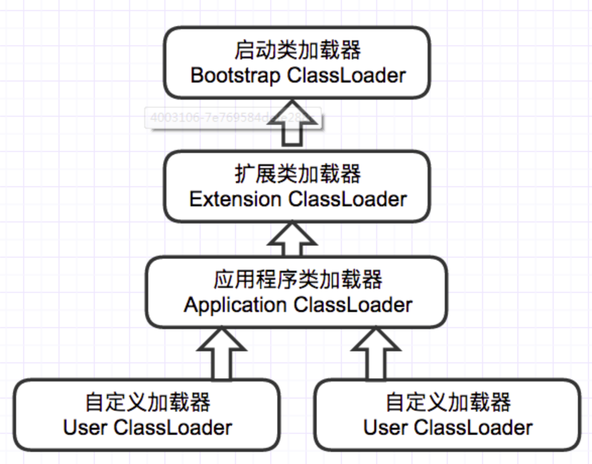

##类加载器ClassLoader源码解析

###1、ClassLoader作用

类加载流程的"加载"阶段是由类加载器完成的。

ClassLoader的主要责任就是加载类。ClassLoader通过一个类的名字，定位并且把这个class文件加载进JVM的内存里，生成可以表示这个类的结构。ClassLoader是JDK为我们提供的一个基础的类加载器，它本身是一个抽象类，我们在实现自己特殊需求的类加载器的时候，只需要根据我们自己的需要，覆写findClass方法（通过类的全限定名查找该类的class文件）。

ClassLoader的构造函数是private的，所以不能直接new一个ClassLoader实例。而是在ClassLoader中提供了一些静态方法，产生特定ClassLoader。如：

```java
//该方法返回系统类加载器，该类加载器也是典型的用来启动应用的类加载器。
//该方法在运行时的启动序列里被首次调用，在这个时间点上，该方法构造的类加载器被设置为调用线程的上下文类加载器。
@CallerSensitive
    public static ClassLoader getSystemClassLoader() {
        initSystemClassLoader();
        if (scl == null) {
            return null;
        }
        SecurityManager sm = System.getSecurityManager();
        if (sm != null) {
            checkClassLoaderPermission(scl, Reflection.getCallerClass());
        }
        return scl;
    }
private static synchronized void initSystemClassLoader() {
        if (!sclSet) {
            if (scl != null)
                throw new IllegalStateException("recursive invocation");
            sun.misc.Launcher l = sun.misc.Launcher.getLauncher();
            if (l != null) {
                Throwable oops = null;
                scl = l.getClassLoader();
                try {
                    scl = AccessController.doPrivileged(
                        new SystemClassLoaderAction(scl));
                } catch (PrivilegedActionException pae) {
                    oops = pae.getCause();
                    if (oops instanceof InvocationTargetException) {
                        oops = oops.getCause();
                    }
                }
                if (oops != null) {
                    if (oops instanceof Error) {
                        throw (Error) oops;
                    } else {
                        // wrap the exception
                        throw new Error(oops);
                    }
                }
            }
            sclSet = true;
        }
    }
private ClassLoader(Void unused, ClassLoader parent) {
        this.parent = parent;
//判断类加载器是否支持并发
        if (ParallelLoaders.isRegistered(this.getClass())) {
            parallelLockMap = new ConcurrentHashMap<>();//并发情况下，每个线程通过同一个ClassLoader实例进行类的加载时，都会获得各自的锁
            package2certs = new ConcurrentHashMap<>();
            domains =
                Collections.synchronizedSet(new HashSet<ProtectionDomain>());
            assertionLock = new Object();
        } else {
            // no finer-grained lock; lock on the classloader instance
            parallelLockMap = null;
            package2certs = new Hashtable<>();
            domains = new HashSet<>();
            assertionLock = this;
        }
    }
```

###2、类加载器结构




结构：BootstrapClassLoader（祖父）-->ExtClassLoader（爷爷）-->AppClassLoader(也称为SystemClassLoader)（爸爸）-->自定义类加载器（儿子）

关系：看括号中的排位；彼此相邻的两个为父子关系，前为父，后为子

####2.1、BootstrapClassLoader
+ 下边简称为boot

+ C++编写

+ 为ExtClassLoader的父类，但是通过ExtClassLoader的getParent()获取到的是null（在类加载器部分：null就是指boot）

+ 主要加载：E:\Java\jdk1.6\jre\lib\*.jar（最重要的就是：rt.jar）

####2.2、ExtClassLoader：

+ 下边简称为ext

+ java编写，位于sun.misc包下，该包在你导入源代码的时候是没有的，需要重新去下

+ 主要加载：E:\Java\jdk1.6\jre\lib\ext\*.jar（eg.dnsns.jar）

####2.3、AppClassLoader：

+ 下边简称为app

+ java编写，位于sun.misc包下

+ 主要加载：类路径下的jar

####2.4、自定义类加载器：

+ 下边简称为custom

+ 自己编写的类加载器，需要继承ClassLoader类或URLClassLoader，并至少重写其中的findClass(String name)方法，若想打破双亲委托机制，需要重写loadClass方法

+ 主要加载：自己指定路径的class文件

###3、全盘负责机制

概念：假设ClassLoaderA要加载class B，但是B引用了class C，那么ClassLoaderA先要加载C，再加载B，"全盘"的意思就是，加载B的类加载器A，也会加载B所引用的类

###4、双亲委托机制

类加载的入口是从loadClass方法开始的，而类加载器的双亲委派模型也是在这里实现的。

过程：假设我现在从类路径下加载一个类A，

1）那么app会先查找是否加载过A，若有，直接返回；

2）若没有，去ext检查是否加载过A，若有，直接返回；

3）若没有，去boot检查是否加载过A，若有，直接返回；

4）若没有，那就boot加载，若在E:\Java\jdk1.6\jre\lib\*.jar下找到了指定名称的类，则加载，结束；

5）若没找到，boot加载失败；

6）ext开始加载，若在E:\Java\jdk1.6\jre\lib\ext\*.jar下找到了指定名称的类，则加载，结束；

7）若没找到，ext加载失败；

8）app加载，若在类路径下找到了指定名称的类，则加载，结束；

9）若没有找到，抛出异常ClassNotFoundException

注意：

+ 在上述过程中的1）2）3）4）6）8）后边，都要去判断是否需要进行"解析"过程 （符号引用转化为直接引用）

+ 类的加载过程只有向上的双亲委托，没有向下的查询和加载，假设是ext在E:\Java\jdk1.6\jre\lib\ext\*.jar下加载一个类，那么整个查询与加载的过程与app无关。

+ 假设A加载成功了，那么该类就会缓存在当前的类加载器实例对象C中，key是（A，C）（其中A是类的全类名，C是加载A的类加载器对象实例），value是对应的java.lang.Class对象

+ 上述的1）2）3）都是从相应的类加载器实例对象的缓存中进行查找

+ 进行缓存的目的是为了同一个类不被加载两次

+ 使用（A,C）做key是为了隔离类，假设现在有一个类加载器B也加载了A，key为（A,B），则这两个A是不同的A。这种情况怎么发生呢？假设有custom1、custom2两个自定义类加载器，他们是兄弟关系，同时加载A，这就是有可能的了

总结：

+ 从底向上检查是否加载过指定名称的类；从顶向下加载该类。（在其中任何一个步骤成功之后，都会中止类加载过程）

+ 双亲委托的好处：假设自己编写了一个java.lang.Object类，编译后置于类路径下，此时在系统中就有两个Object类，一个是rt.jar的，一个是类路径下的，在类加载的过程中，当要按照全类名去加载Object类时，根据双亲委托，boot会加载rt.jar下的Object类，这是方法结束，即类路径下的Object类就没有加载了。这样保证了系统中类不混乱。

###5、源代码
```java
     /**
      * 根据指定的binary name加载class。
      * 步驟：
      * 假设我现在从类路径下加载一个类A，
      * 1）那么app会先查找是否加载过A（findLoadedClass(name)），若有，直接返回；
      * 2）若没有，去ext检查是否加载过A（parent.loadClass(name, false)），若有，直接返回；
      * findBootstrapClassOrNull(name) 3)4)5)都是这个方法
      * 3）若没有，去boot检查是否加载过A，若有，直接返回；
      * 4）若没有，那就boot加载，若在E:\Java\jdk1.6\jre\lib\*.jar下找到了指定名称的类，则加载，结束；
      * 5）若没找到，boot加载失败；
      * findClass(name) 6)7)8)9)都是这个方法
      * 在findClass中调用了defineClass方法，该方法会生成当前类的java.lang.Class对象
      * 6）ext开始加载，若在E:\Java\jdk1.6\jre\lib\ext\*.jar下找到了指定名称的类，则加载，结束；
      * 7）若没找到，ext加载失败；
      * 8）app加载，若在类路径下找到了指定名称的类，则加载，结束；
      * 9）若没有找到，抛出异常ClassNotFoundException
      * 注意：在上述过程中的1）2）3）4）6）8）后边，都要去判断是否需要进行"解析"过程
	  * 该方法返回系统类加载器，该类加载器也是典型的用来启动应用的类加载器。
	  * 该方法在运行时的启动序列里被首次调用，在这个时间点上，该方法构造的类加载器被设置为调用线程的上下文类加载器。
      */
     protected synchronized Class<?> loadClass(String name, boolean resolve)
             throws ClassNotFoundException {
         Class c = findLoadedClass(name);//检查要加载的类是不是已经被加载了
         if (c == null) {//没有被加载过
             try {
                 if (parent != null) {
                     //如果父加载器不是boot，递归调用loadClass(name, false)
                     c = parent.loadClass(name, false);
                 } else {//父加载器是boot
                     /*
                      * 返回一个由boot加载过的类;3)
                      * 若没有，就去试着在E:\Java\jdk1.6\jre\lib\*.jar下查找 4)
                      * 若在bootstrap class loader的查找范围内没有查找到该类，则返回null 5)
                      */
                     c = findBootstrapClassOrNull(name);
                 }
             } catch (ClassNotFoundException e) {
                 //父类加载器无法完成加载请求
             }
             if (c == null) {
                 //如果父类加载器未找到，再调用本身（这个本身包括ext和app）的findClass(name)来查找类
                 c = findClass(name);
             }
         }
         if (resolve) {
             resolveClass(c);
         }
         return c;
     }
```
说明：

+ 该段代码中引用的大部分方法实质上都是native方法

解释：

1. app_loadClass()方法执行到ext_loadClass()，这时候对于app_loadClass()中剩余的findClass()会在栈中向下压；

2. 然后执行ext_loadClass()，当执行到findBootstrapClassOrNull(name)，这时候ext_loadClass()中剩余的findClass()也会从栈顶向下压，此时ext_loadClass()_findClass()仅仅位于app_loadClass()_findClass()的上方；

3. 然后执行findBootstrapClassOrNull(name)，当boot检测过后并且执行完加载后并且没成功，boot方法离开栈顶；

4. 然后执行此时栈顶的ext_loadClass()_findClass()

5. 然后执行此时栈顶的app_loadClass()_findClass()

这样，就完成了双亲委托机制。

具体的逻辑分析如下：

在加载类期间，调用线程会一直持有一把锁。基于loadClass方法的逻辑，我们可以很容易理解为什么loadClass方法的主要逻辑需要在一个同步块里。后续的逻辑里有很多对ClassLoader共享变量的操作如parent的赋值等。
```java
	/**
     * Returns the lock object for class loading operations.
     * For backward compatibility, the default implementation of this method
     * behaves as follows. If this ClassLoader object is registered as
     * parallel capable, the method returns a dedicated object associated
     * with the specified class name. Otherwise, the method returns this
     * ClassLoader object. </p>
     * 为了向前兼容，该方法实现如下：如果ClassLoader对象被注册为支持并发，那么该方法会new一个Object作为锁返回；否则，同步块的锁就是ClassLoader本身；
     * @since  1.7
     */
    protected Object getClassLoadingLock(String className) {
        Object lock = this;
        if (parallelLockMap != null) {
            Object newLock = new Object();
            lock = parallelLockMap.putIfAbsent(className, newLock);//parallelLockMap是一个ConcurrentHashMap
            if (lock == null) {
                lock = newLock;
            }
        }
        return lock;
    }
检查类是否已经加载。
 protected final Class<?> findLoadedClass(String name) {
        if (!checkName(name))
            return null;
        return findLoadedClass0(name);
    }
//简单的检查加载的类的名字是否为空或是无效
private boolean checkName(String name) {
        if ((name == null) || (name.length() == 0))
            return true;
        if ((name.indexOf('/') != -1)
            || (!VM.allowArraySyntax() && (name.charAt(0) == '[')))
            return false;
        return true;
    }
private native final Class findLoadedClass0(String name);

```
我们发现findLoadedClass0是一个native方法。查了下openjdk源码如下：

```c++
JNIEXPORT jclass JNICALL
Java_java_lang_ClassLoader_findLoadedClass0(JNIEnv *env, jobject loader,
                                           jstring name)
{
    if (name == NULL) {
        return 0;
    } else {
        return JVM_FindLoadedClass(env, loader, name);
    }
JVM_ENTRY(jclass, JVM_FindLoadedClass(JNIEnv *env, jobject loader, jstring name))
  JVMWrapper("JVM_FindLoadedClass");
  ResourceMark rm(THREAD);

  Handle h_name (THREAD, JNIHandles::resolve_non_null(name));
  Handle string = java_lang_String::internalize_classname(h_name, CHECK_NULL);

  const char* str   = java_lang_String::as_utf8_string(string());
  // Sanity check, don't expect null
  if (str == NULL) return NULL;

  const int str_len = (int)strlen(str);
  if (str_len > Symbol::max_length()) {
    //类名长度有限制
    // It's impossible to create this class;  the name cannot fit
    // into the constant pool.
    return NULL;
  }
  //
  TempNewSymbol klass_name = SymbolTable::new_symbol(str, str_len, CHECK_NULL);

  // Security Note:
  //   The Java level wrapper will perform the necessary security check allowing
  //   us to pass the NULL as the initiating class loader.
  Handle h_loader(THREAD, JNIHandles::resolve(loader));
  if (UsePerfData) {
    is_lock_held_by_thread(h_loader,
                           ClassLoader::sync_JVMFindLoadedClassLockFreeCounter(),
                           THREAD);
  }
  //全局符号字典查找该类的符号是否存在
  klassOop k = SystemDictionary::find_instance_or_array_klass(klass_name,
                                                              h_loader,
                                                              Handle(),
                                                              CHECK_NULL);

  return (k == NULL) ? NULL :
            (jclass) JNIHandles::make_local(env, Klass::cast(k)->java_mirror());
JVM_END
}
```
HotSpot虚拟机在永久代中增加了符号表。该表为哈希表用于将直接引用与运行时常量池的符号引用作射。所以该native方法的实质就是在jvm的常量池中查找该类的符号引用是否存在。

接着的逻辑就是类的双亲加载机制的实现。把类加载的任务交给父类加载器执行，直到父类加载器为空，此时会返回通过JDK提供的系统启动类加载器加载的类。
```c++
private Class findBootstrapClassOrNull(String name)
    {
        if (!checkName(name)) return null;

        return findBootstrapClass(name);
    }

    // return null if not found
    private native Class findBootstrapClass(String name);
```
如果最后发现该类没有被加载过，则由当前类加载器调用findClass方法来继续加载该类。

####findClass
该方法和它的名字一样，就是根据类的名字ClassLoader不提供该方法的具体实现，要求我们根据自己的需要来覆写该方法。所以我们可以看一看URLClassLoader对findClass方法的实现，类加载的工作又被代理给了defineClass方法：

其中findClass方法的类定义如下：
```java
    /**
     * 查找指定binary name的类
     * 该类应该被ClassLoader的实现类重写
     */
    protected Class<?> findClass(String name) throws ClassNotFoundException {
        throw new ClassNotFoundException(name);
    }
```

关于findClass可以查看URLClassLoader.findClass(final String name)，其中引用了defineClass方法，在该方法中将二进制字节流转换为了java.lang.Class对象。

####defineClass

defineClass方法主要是把字节数组转化为类的实例。同时definClass方法为final的，故不可以覆写。同时defineClass也是一个native方法，具体也是由虚拟机实现，源码如下：

```c++
// common code for JVM_DefineClass() and JVM_DefineClassWithSource()
// and JVM_DefineClassWithSourceCond()
static jclass jvm_define_class_common(JNIEnv *env, const char *name,
                                      jobject loader, const jbyte *buf,
                                      jsize len, jobject pd, const char *source,
                                      jboolean verify, TRAPS) {
  if (source == NULL)  source = "__JVM_DefineClass__";

  assert(THREAD->is_Java_thread(), "must be a JavaThread");
  JavaThread* jt = (JavaThread*) THREAD;

  PerfClassTraceTime vmtimer(ClassLoader::perf_define_appclass_time(),
                             ClassLoader::perf_define_appclass_selftime(),
                             ClassLoader::perf_define_appclasses(),
                             jt->get_thread_stat()->perf_recursion_counts_addr(),
                             jt->get_thread_stat()->perf_timers_addr(),
                             PerfClassTraceTime::DEFINE_CLASS);

  if (UsePerfData) {
    ClassLoader::perf_app_classfile_bytes_read()->inc(len);
  }

  // Since exceptions can be thrown, class initialization can take place
  // if name is NULL no check for class name in .class stream has to be made.
  TempNewSymbol class_name = NULL;
  if (name != NULL) {
    const int str_len = (int)strlen(name);
    if (str_len > Symbol::max_length()) {
      // It's impossible to create this class;  the name cannot fit
      // into the constant pool.
      THROW_MSG_0(vmSymbols::java_lang_NoClassDefFoundError(), name);
    }
    //为类创建符号
    class_name = SymbolTable::new_symbol(name, str_len, CHECK_NULL);
  }

  ResourceMark rm(THREAD);
  ClassFileStream st((u1*) buf, len, (char *)source);
  Handle class_loader (THREAD, JNIHandles::resolve(loader));
  if (UsePerfData) {
    is_lock_held_by_thread(class_loader,
                           ClassLoader::sync_JVMDefineClassLockFreeCounter(),
                           THREAD);
  }
  Handle protection_domain (THREAD, JNIHandles::resolve(pd));
  //从字节文件中为该类解析创建一个klassOop对象，表示Java类
  klassOop k = SystemDictionary::resolve_from_stream(class_name, class_loader,
                                                     protection_domain, &st,
                                                     verify != 0,
                                                     CHECK_NULL);

  if (TraceClassResolution && k != NULL) {
    trace_class_resolution(k);
  }

  return (jclass) JNIHandles::make_local(env, Klass::cast(k)->java_mirror());
}
```

####类隔离机制

+ 同一个类Dog可以加载两次（只要loader1和loader3不是父子关系即可，加载出的 Class 对象不同），不同运行空间内的类不能互相访问（eg. loader1和loader3不是父子关系，则Loader1加载的Dog不能访问lodaer3加载的Sample）

+ 父类加载器无法访问到子类加载器加载的类，除非使用反射。Eg. Loader1 的父加载器是 系统类加载器，假设 Sample 类由 loader1 加载， 使用 loader1 的类 Test 是由系统类加载器加载的，例如下面这段代码属于 Test 类，
+ 那么如果直接使用注释部分的代码（即通过常规的方式使用 Sample 是不行的），必须通过反射。


####自定义类加载器

采用模板模式，我们实现自定义类加载器：

```java
public class UserDefineClassLoader extends ClassLoader {
    /**
     * 自定义加载器的名称
     */
    private String loaderName;
 
    /**
     * 指定自定义加载器的名称
     */
    public UserDefineClassLoader(String loaderName) {
        // 父类加载器 this(checkCreateClassLoader(), getSystemClassLoader())
        super();
        this.loaderName = loaderName;
    }
 
    /**
     * 指定父类加载器
     */
    public UserDefineClassLoader(String loaderName, ClassLoader parent) {
        super(parent);
        this.loaderName = loaderName;
    }
 
    @Override
    protected Class<?> findClass(String name) throws ClassNotFoundException {
        // 1. 读取文件内容为byte[]
        byte[] classBytes = readClassDataFromFile("/Users/jigangzhao/Desktop/A.class");
        // 2. 将byte[]转化为Class
        Class<?> aClass = defineClass("classLoader.A", classBytes, 0, classBytes.length);
        return aClass;
    }
}
```
