##JVM源码分析之Java类的加载过程

本文基于openjdk-7的OpenJDK实现Java类在HotSpot的内部实现进行分析：Java类文件是如何加载到虚拟机的，类对象和方法是以什么数据结构存在于虚拟机中？虚方法、实例方法和静态方法是如何调用的？

###HotSpot内存划分

在HotSpot实现中，内存被划分成Java堆、方法区、Java栈、本地方法栈和PC寄存器几个部分：

1. Java栈和本地方法栈用于方法之间的调用，进栈出栈的过程；
2. Java堆用于存放对象，在Java中，所有对象的创建都在堆上申请内存，并被GC管理；
3. 方法区分成PermGen和CodeCache：PermGen存放Java类的相关信息，如静态变量、成员方法和抽象方法等；CodeCache存放JIT编译之后的本地代码；

###HotSpot对象模型

HotSpot JVM并没有根据Java对象直接通过虚拟机映射到新建的C++对象，而是设计了一个oop/klass model，其中oop为Ordinary Object Pointer，用来表示对象的实例信息；klass用来保存描述元数据。

Klass

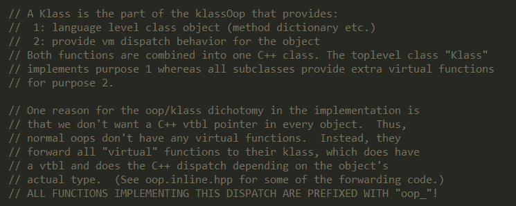

关于为何要设计oop/klass这种二分模型的实现，一个原因是不想让每个对象都包含vtbl(虚方法表)，其中oop中不含有任何虚函数，虚函数表保存于klass中，可以进行method dispatch。

oop

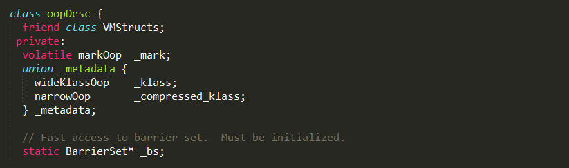

oopDesc对象包含两部分数据：_mark 和 _metadata；
1. _mark是markOop类型对象，用于存储对象自身的运行时数据，如哈希码（HashCode）、GC分代年龄、锁状态标志、线程持有的锁、偏向线程ID、偏向时间戳等等，占用内存大小与虚拟机位长一致，更具体的实现可以阅读 java对象头的HotSpot实现分析。

2. _metadata是一个结构体，wideKlassOop和narrowOop都指向InstanceKlass对象，其中narrowOop指向的是经过压缩的对象；

3. _klass字段建立了oop对象与klass对象之间的联系；


####HotSpot如何加载并解析class文件

class文件在虚拟机的整个生命周期包括加载、验证、准备、解析、初始化、使用和卸载7个阶段，通过ClassLoader.loadClass方法可以手动加载一个Java类到虚拟机中，并返回Class类型的引用。

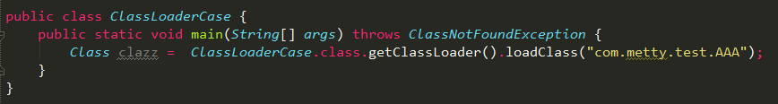

这里并没有自定义类加载器，而是利用ClassLoaderCase的类加载器进行加载类AAA。

####loadClass方法实现

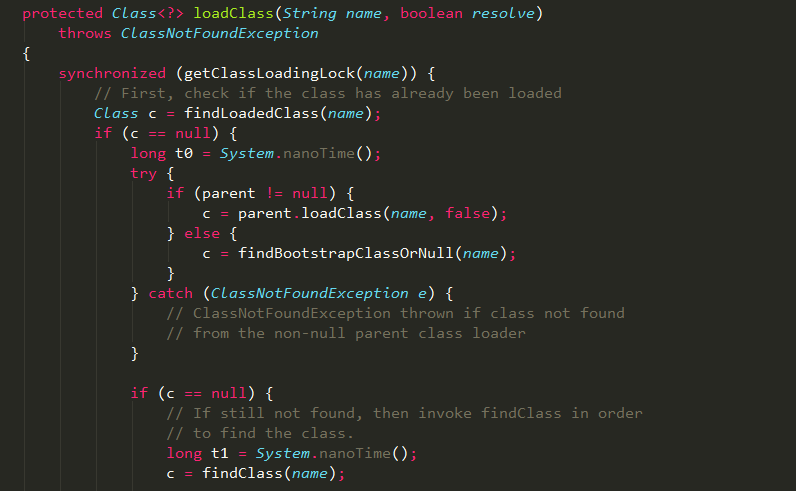

1. loadClass方法实现了双亲委派的类加载机制，如果需要自定义类加载器，建议重写内部的findClass方法，而非loadClass方法；

2. 通过debug，可以发现loadClass方法最终会执行native方法defineClass1进行类的加载，即读取对应class文件的二进制数据到虚拟机中进行解析；

####class文件的解析

Java中的defineClass1方法是个native方法，说明依赖于底层的实现，在HotSpot中，其实现位于ClassLoader.c文件中，最终调用jvm.cpp中的jvm_define_class_common方法实现，核心的实现逻辑如下：

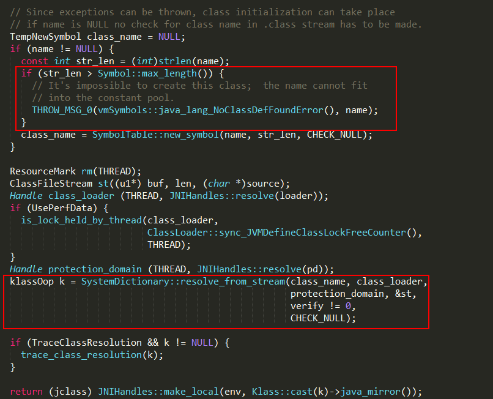

+ 验证全限定类名的长度，最大为(1 << 16) -1，如果长度超过 65535，就会抛出java/lang/NoClassDefFoundError异常，主要原因是constant pool不支持这么长的字符串；
+ SystemDictionary::resolve_from_stream处理stream数据流，并生成Klass对象。内部通过ClassFileParser.cpp的parseClassFile方法对class文件的数据流进行解析，代码实在实在实在实在太长，有兴趣的同学可以阅读完整的实现，大概的过程如下：

1. 验证当前magic为0xCAFEBABE;
2. 获取class文件的minor_version、major_version，并判断当前虚拟机是否支持该版本；
3. 通过parse_constant_pool方法解析当前class的常量池；
4. 解析当前class的access_flags；
5. 解析当前class的父类；
6. 解析当前class的接口；
7. ....

好吧，我得承认这块逻辑很复杂...


####parseClassFile方法
该函数主要功能就是根据JVM Spec解析class文件，它依次解析以下部分：

1. class文件的一些元信息，包括class文件的magic number以及它的minor/major版本号。

2. constant pool。

3. 类的访问标记以及类的属性（是否是class/interface,当前类的index,父类的index)。

4. interfaces的描述

5. fields的描述

6. methods的描述

5. attributes的描述

在Hotspot中，每个类在初始化时就会完成成员变量在对象布局的初始化。具体而言就是在class文件被解析的时候完成这个步骤的。

布局策略:

各字段的分配策略为longs/doubles、ints、shorts/chars、bytes/boolean、oops(ordinary object pointers)，相同宽度的字段总是被分配到一起，便于之后取数据。父类定义的变量会出现在子类定义的变量的前面。

该步骤实现如下（以不存在父类和静态字段为例）：

1、判断父类是否存在，如果存在，获取父类的非静态字段的大小；
```c++
	// Field size and offset computation
	//判断是否有父类，如果没有父类，非静态字段的大小为0，否则设为父类的非静态字段的大小
    int nonstatic_field_size = super_klass() == NULL ? 0 : super_klass->nonstatic_field_size();
```
2、求出首个非静态字段在对象的偏移；

```c++
instanceOopDesc::base_offset_in_bytes()方法返回的其实是Java对象头的大小。
```

假如父类不存在，即nonstatic_field_size为0，首个非静态字段在对象的偏移量即为Java对象头的大小。

heapOopSize指的是oop的大小，它依赖于是否打开UseCompressedOops(默认打开）。打开时为4-byte否则为8-byte。

因为nonstatic_field_size的单位是heapOopSize故要换算成offset需要乘上它。

>first_nonstatic_field_offset = instanceOopDesc::base_offset_in_bytes() + nonstatic_field_size * heapOopSize;
 
3、求出各种字段类型的个数，初始化next指针为first；

```c++
	next_nonstatic_field_offset变量相当于是一个pointer。

	first_nonstatic_field_offset = instanceOopDesc::base_offset_in_bytes() + nonstatic_field_size * heapOopSize;
    next_nonstatic_field_offset = first_nonstatic_field_offset; //初始化next指针为first
 
    unsigned int nonstatic_double_count = fac.count[NONSTATIC_DOUBLE];//double和long字段类型
    unsigned int nonstatic_word_count   = fac.count[NONSTATIC_WORD]; //int和float字段类型
    unsigned int nonstatic_short_count  = fac.count[NONSTATIC_SHORT]; //short字段类型
    unsigned int nonstatic_byte_count   = fac.count[NONSTATIC_BYTE]; //short字段类型
    unsigned int nonstatic_oop_count    = fac.count[NONSTATIC_OOP];  //oop字段类型
```

4、根据分配策略求出首个字段类型在对象的偏移；

如果是第一种分配策略：先求出oop类型字段和double类型字段的偏移；

如果是第二种分配策略：先求出double类型字段的偏移；

```c++
 if( allocation_style == 0 ) {  
      // Fields order: oops, longs/doubles, ints, shorts/chars, bytes
      next_nonstatic_oop_offset    = next_nonstatic_field_offset;
      next_nonstatic_double_offset = next_nonstatic_oop_offset +
                                      (nonstatic_oop_count * heapOopSize);
    } else if( allocation_style == 1 ) {
      // Fields order: longs/doubles, ints, shorts/chars, bytes, oops
      next_nonstatic_double_offset = next_nonstatic_field_offset;
    } else if( allocation_style == 2 ) {
    //第三种分配策略此处不讨论
}
```
5、求出各种字段类型在对象的偏移；

按照double >> word >> short >> btye的字段顺序：

word字段的偏移 =  double字段的偏移 + （double字段的个数 * 一个double字段的字节长度）

short字段的偏移 =  word字段的偏移 + （word字段的个数 * 一个word字段的字节长度）

btye字段的偏移 =  short字段的偏移 + （short字段的个数 * 一个short字段的字节长度）

```c++
next_nonstatic_word_offset  = next_nonstatic_double_offset + (nonstatic_double_count * BytesPerLong);
next_nonstatic_short_offset = next_nonstatic_word_offset + (nonstatic_word_count * BytesPerInt);
next_nonstatic_byte_offset  = next_nonstatic_short_offset + (nonstatic_short_count * BytesPerShort);
```


class数据流解析完成后，通过oopFactory::new_instanceKlass创建一个与之对应的instanceKlass对象，new_instanceKlass实现如下：

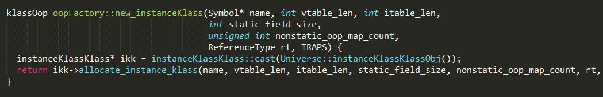

1. 其中instanceKlassKlass::allocate_instance_klass方法会初始化一个空instanceKlass对象，并由后续逻辑进行数据的填充；

2. 但是发现该方法的返回类型并非是instanceKlass，而是klassOop类型；

3. allocate_instance_klass方法的实现如下：

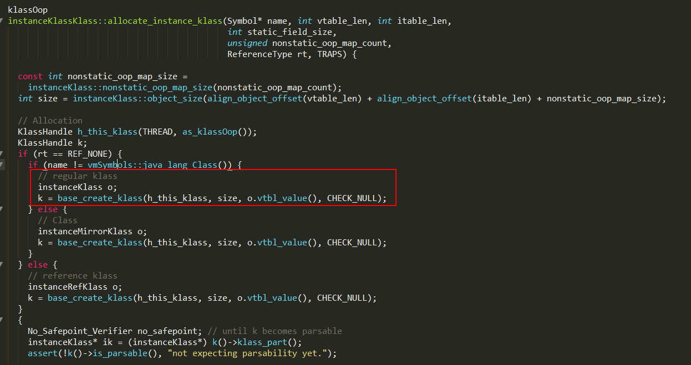

+ base_create_klass方法最终通过Klass::base_create_klass_oop方法创建Klass对象，这里是instanceKlass对象，并返回对应的klassOop；

+ k()->klass_part()获取对应的Klass对象，并强制转换成instanceKlass类型的对象；

+ 设置instanceKlass对象的默认值；

####Klass对象如何创建？

上述的instanceKlass对象由Klass::base_create_klass_oop方法进行创建，实现如下：

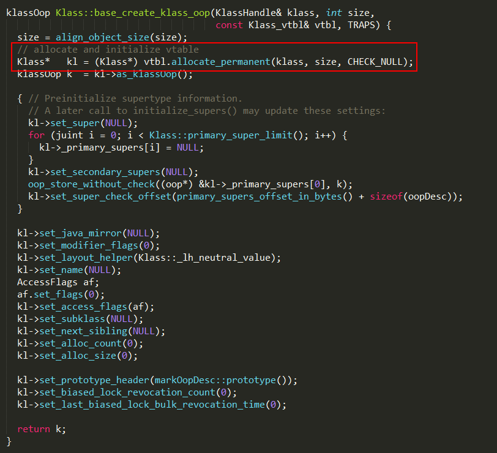

1. allocate_permanent方法默认在PermGen分配内存，instanceKlass对象保存在永久代区域；

2. Klass的as_klassOop方法可以获取对应的klassOop，那klassOop到底是什么？

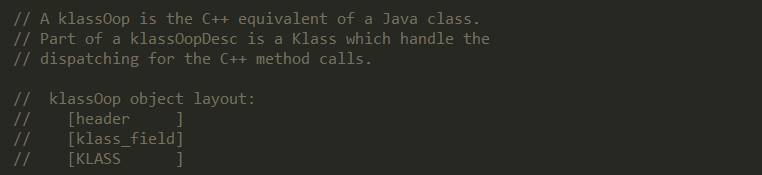

klassOop相当于Java中的class，一个klassOop对象包含header、klass_field和Klass。

####instanceKlass

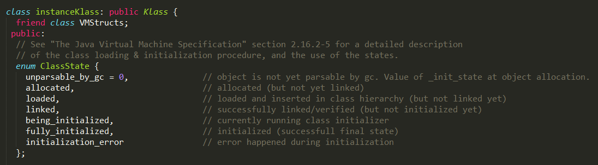

可以发现，每个instanceKlass对象都有一个ClassState状态，用来标识当前class的加载进度，另外instanceKlass对象中包含了如下字段，描述class文件的信息。

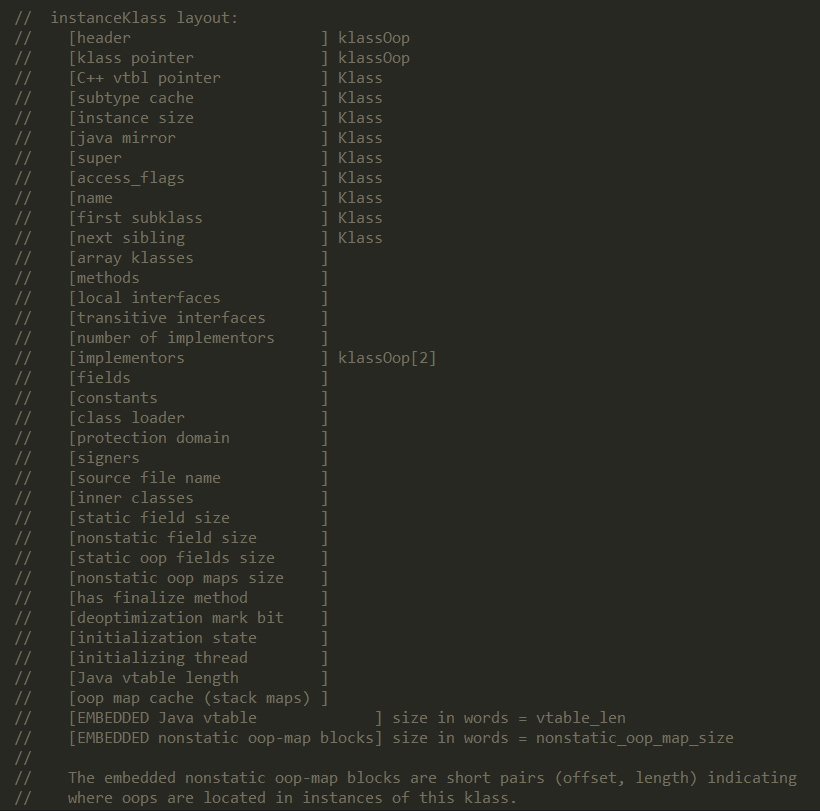


+ _layout_helper：描述对象整体布局
+ _name：表示类名
+ _java_mirror：表示Klass的Java层镜像类
+ _super：表示父类
+ _subklass：表示第一个子类
+ next_slibling：指向的是下一个兄弟节点，JVM通过_subklass->next_slibling可以找到下一个子类

HotSpot并不把instanceKlass暴露给Java，而会另外创建对应的java.lang.Class对象，并将后者称为前者的“Java镜像”，两者之间互相持有引用。
日志中的_java_mirror便是该instanceKlass对Class对象的引用。镜像机制被认为是良好的面向对象的反射与元编程设计的重要机制。参考Mirrors: Design Principles for Meta-level Facilities of Object-Oriented Programming Languages。
HotSpot并不把instanceKlass暴露给Java，而会另外创建对应的java.lang.Class对象，将instanceKlass包装了一层来暴露给Java层使用，并将后者称为前者的镜像，InstanceKlass和java_mirror互相持有，
obj.getClass()，在HotSpot VM里实际上经过了两层间接引用才能找到最终的Class对象，反射最终调用的jni方法也会通过as_klass函数将java_mirror转换为instanceKlass

>obj-\>\_klass-\>\_java_mirror  


在HotSpot中，为每一个已加载的Java类创建一个instanceKlass对象，用来标识Java内部类型的机制。instanceKlass对象的所有成员可以包含JVM内部运行一个Java类所需的所有信息，这些成员变量在类解析阶段完成赋值。

```c++
instanceKlass.hpp

class instanceKlass: public Klass {
  friend class VMStructs;
 public:
 
  enum ClassState {
    unparsable_by_gc = 0,               // object is not yet parsable by gc. Value of _init_state at object allocation.
    allocated,                          // allocated (but not yet linked)
    loaded,                             // loaded and inserted in class hierarchy (but not linked yet)
    linked,                             // successfully linked/verified (but not initialized yet)
    being_initialized,                  // currently running class initializer
    fully_initialized,                  // initialized (successfull final state)
    initialization_error                // error happened during initialization
  };
 
//部分内容省略
protected:
  // Method array.  方法数组
  objArrayOop     _methods; 
  // Interface (klassOops) this class declares locally to implement.
  objArrayOop     _local_interfaces;  //该类声明要实现的接口.
  // Instance and static variable information
  typeArrayOop    _fields; 
  // Constant pool for this class.
  constantPoolOop _constants;     //常量池
  // Class loader used to load this class, NULL if VM loader used.
  oop             _class_loader;  //类加载器
  typeArrayOop    _inner_classes;   //内部类
  Symbol*         _source_file_name;   //源文件名
 
}
```
其中，ClassState描述了类加载的状态：分配、加载、链接、初始化。

instanceKlass的布局包括：声明接口、字段、方法、常量池、源文件名等等

通过OOP-Klass模型，就可以分析出Java虚拟机是如何通过栈帧中的对象引用找到对应的对象实例。

####instanceKlassKlass

instanceKlassKlass在实现上继承了klassKlass类

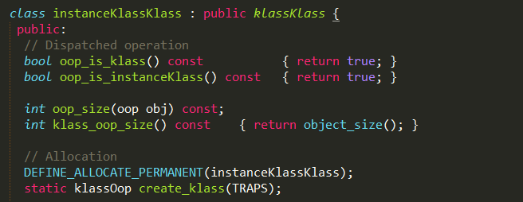

全局只存在一个instanceKlassKlass对象，虚拟机启动时，会在Universe::genesis方法中初始化。

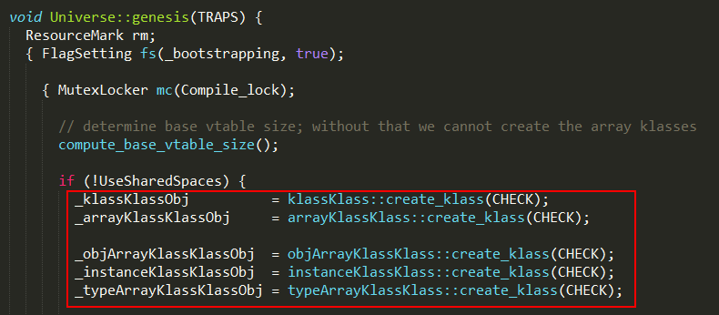

虚拟机中所有instanceKlass对象的_klass字段都指向该instanceKlassKlass对象，其初始化过程如下：

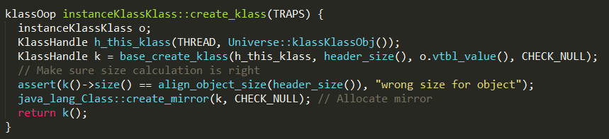


1. 方法Universe::klassKlassObj()获取klassKlass对象；

2. 方法base_create_klass负责创建instanceKlassKlass对象，并返回对应的klassOop；

3. 方法java_lang_Class::create_mirror分配mirror，类似于一个镜像，在java层面可以访问到；

####klassKlass

klassKlass在实现上继承了Klass类

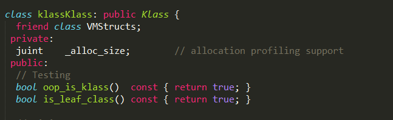

和instanceKlassKlass一样，klassKlass对象也是全局唯一的，虚拟机启动时，会在Universe::genesis方法中初始化，其初始化过程如下：

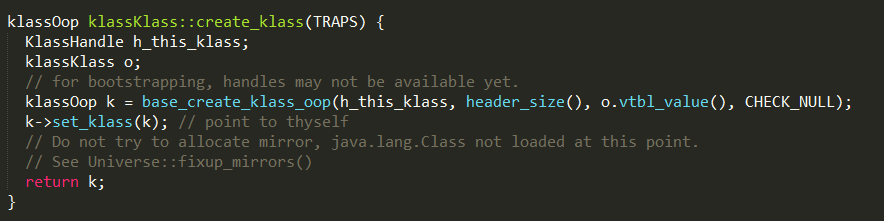

1. 通过base_create_klass创建klassKlass对象，并返回对应的klassOop；

2. set_klass方法把自身设置成_klass；


