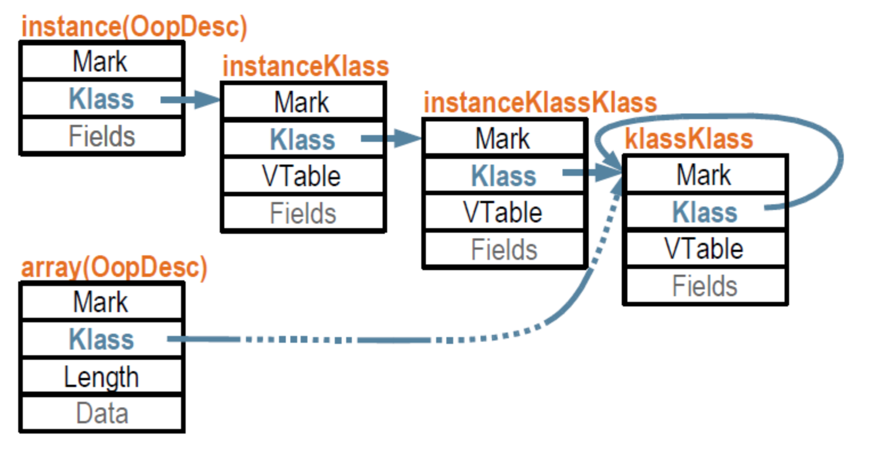

##HotSpotVM 对象机制实现浅析


因为HotSpot VM从JDK8开始移除了PermGen，本来存在PermGen里的元数据都被挪到不直接由GC管理的另一块空间里了，叫做Metaspace。HotSpot VM里，Klass其实是用于描
述能被GC的对象的类型信息的元数据对象。在JDK8之前的HotSpot VM里，类元数据存在由GC管理的PermGen区里。这些xxxKlass对象（例如instanceKlass的实例）自身也是被
GC管理的，所以也需要有Klass对象去描述它们，叫做xxxKlassKlass。然后它们又…所以就有了KlassKlass这个终极的描述xxxKlassKlass对象的东西。从JDK8开始，既然元数
据不由GC直接管理了，Klass这系对象就都不需要再被KlassKlass所描述，所以KlassKlass就全去除了。

###oop

JVM内部，一个Java对象在内存中的布局可以连续分成两部分： instanceOopDesc 和实例数据。 instanceOopDesc 和 arrayOopDesc 又称为对象头。

instanceOopDesc 对象头包含两部分信息： Mark Word 和 元数据指针 ( Klass* )：

那么HotSpot的对象机制应该从哪扯起呢？oop无疑。oop又是啥？

>An “oop”, or “ordinary object pointer” in HotSpot parlance is a managed pointer to an object. It is normally the same size as a native machine pointer. A managed pointer is carefully tracked by the Java application and GC subsystem, so that storage for unused objects can be reclaimed.

也就是说，我们平时经常提及的对象实例，在HotSpot的内部表示，实际上是一个oop。具体地，oop的定义是oopDesc结构体，其中很重要的两个字段，
```c++
  volatile markOop  _mark;
  union _metadata {
    wideKlassOop    _klass;
    narrowOop       _compressed_klass;
  } _metadata;
```


1. _mark:

_mark这一部分用于存储对象自身的运行时数据, 如哈希码、GC分代年龄、锁状态标志、线程持有的锁、偏向线程ID、偏向时间戳等, 这部分数据的长度在32位和64位的虚拟机(未开启压缩指针)中分别为32bit和64bit, 官方称它为 "Mark Word"。
对象需要存储的运行时数据很多, 其实已经超出了32位和64位Bitmap结构所能记录的限度, 但是对象头信息是与对象自身定义的数据无关的额外存储成本, 考虑到虚拟机的空间效率, Mark Word被设计成一个非固定的数据结构以便在极小的空间内存储尽量多的信息, 它会根据对象的状态复用自己的存储空间。  

2. _metadata(元数据指针):

_metadata这一部分是类型指针, 即对象指向它的类元数据的指针, 虚拟机通过这个指针来确定这个对象是哪个类的实例。并不是所有的虚拟机实现都必须在对象数据上保留类型指针, 换句话说查找对象的元数据信息并不一定要经过对象本身, 
其取决于虚拟机实现的对象访问方式。目前主流的访问方式有使用句柄和直接指针两种, 两者方式的不同这里先暂不做介绍。另外, 如果对象是一个Java数组, 那么在对象头中还必须有一块用于记录数组长度的数据, 因为虚拟机可以通过普通java对象的元数据信息确定java对象的大小, 但是从数组的元数据中却无法确定数组的大小。

3. _klass字段建立了oop对象与klass对象之间的联系；

oop有一个层次结构，

```c++
// OBJECT hierarchy
// This hierarchy is a representation hierarchy, i.e. if A is a superclass
// of B, A's representation is a prefix of B's representation.
typedef class oopDesc*                            oop;
typedef class   instanceOopDesc*            instanceOop;
typedef class   methodOopDesc*                    methodOop;
typedef class   constMethodOopDesc*            constMethodOop;
typedef class   methodDataOopDesc*            methodDataOop;
typedef class   arrayOopDesc*                    arrayOop;
typedef class     objArrayOopDesc*            objArrayOop;
typedef class     typeArrayOopDesc*            typeArrayOop;
typedef class   constantPoolOopDesc*            constantPoolOop;
typedef class   constantPoolCacheOopDesc*   constantPoolCacheOop;
typedef class   klassOopDesc*                    klassOop;
typedef class   markOopDesc*                    markOop;
typedef class   compiledICHolderOopDesc*    compiledICHolderOop;
```
这些类在SA里面会有镜像，所以我们很容易就可以通过SA来看看这些oop，klass到底是个啥。但是这里有一点要注意，在HotSpot中，oop与klass体系，注释中也说到了，是分开的，然后采用组合的方式，所以会有klassOop，而在SA中，则是采用了继承的方式，klass直接继承了oop。是SA的开发者偷懒了吗：）


###klass
一个Klass对象代表一个类的元数据（相当于 java.lang.Class 对象）。它提供：

language level class object (method dictionary etc.)
provide vm dispatch behavior for the object
所有的函数都被整合到一个C++类中。

Klass对象的继承关系： xxxKlass <:< Klass <:< Metadata <:< MetaspaceObj

klass对象的布局如下：

```c++
//  Klass layout:
//    [C++ vtbl ptr  ] (contained in Metadata)
//    [layout_helper ]
//    [super_check_offset   ] for fast subtype checks
//    [name          ]
//    [secondary_super_cache] for fast subtype checks
//    [secondary_supers     ] array of 2ndary supertypes
//    [primary_supers 0]
//    [primary_supers 1]
//    [primary_supers 2]
//    ...
//    [primary_supers 7]
//    [java_mirror   ]
//    [super         ]
//    [subklass      ] first subclass
//    [next_sibling  ] link to chain additional subklasses
//    [next_link     ]
//    [class_loader_data]
//    [modifier_flags]
//    [access_flags  ]
//    [last_biased_lock_bulk_revocation_time] (64 bits)
//    [prototype_header]
//    [biased_lock_revocation_count]
//    [_modified_oops]
//    [_accumulated_modified_oops]
//    [trace_id]
```

###instanceKlassKlass和klassKlass

引用R大的一段说明，
```java
HotSpot VM在JDK8之前的版本都是把Java对象和元数据对象以统一的方式由GC管理的。为了让GC能统一的处理这些对象，每个由GC管理的对象都继承自oopDesc，而每个oopDesc都有一个_klass字段指向描述它的Klass对象。
GC在找到一个对象之后，要知道对象大小、对象里什么位置有GC需要知道的指针之类的信息，就会通过从_klass字段找到Klass对象，从Klass对象获取。更准确说Klass对象是嵌在klassOopDesc对象，以便Klass对象也同样得
到GC的统一管理。所以其实是由于将instanceKlass这样的元数据也使用oop由GC来管理才会引入了instanceKlassKlass，到JDK8已经没有xxxKlassKlass了，因为instanceKlass这些元数据已经被移出GC堆，也不再需要
klassOopDesc来指向instanceKlass了，oopDesc的_metadata字段定义已经改成下面这样了，
```
```java
  union _metadata {
    /////// 之前都是oop，现在直接指向Klass了
    Klass*      _klass;
    narrowKlass _compressed_klass;
  } _metadata;
```

这里有一个问题需要考虑下，为什么要多出xxxKlassKlass这一层呢？直接使用klassKlass来描述instanceKlass不OK吗（python就是这样的设计，见下文）？很明显，因为各种xxxKlassKlass要描述的xxxKlass并不同（xxxKlass的创建也都是由xxxKlassKlass来完成，
例如instanceKlassKlass::allocate_instance_klass），具体的看代码吧：）

还有一点说明，instanceKlassKlass是个单例，
```java
// An InstanceKlassKlass is the klass of an InstanceKlass.
// There only exist one instance Universe::instanceKlassKlassObj()
```
在虚拟机启动的时候，会调用instanceKlassKlass::create_klass来创建这个universe::instanceKlassKlassObj。当然，klassKlass也会是单例。

###对象内存结构

在JVM中，对象在内存中的基本存在形式就是oop。那么，对象所属的类，在JVM中也是一种对象，因此它们实际上也会被组织成一种oop，即klassOop。同样的，对于klassOop，也有对应的一个klass来描述，它就是klassKlass，也是klass的一个子类。klassKlass作为oop的klass链的端点。




这是件非常自然的事：类用于描述对象，类自身也是对象，有用于描述自身的类；某个类的所谓“静态变量”就是该类对象的实例变量。很多对象系统都是这么设计的。HotSpot的这套oop体系（指“普通对象指针”，不是指“面向对象编程”）
继承自Strongtalk，实际上反而比暴露给Java的对象模型显得更加面向对象一些。

当时看这张图的时候，有一个巨大的疑问，instanceKlass的数据结构与图不符，没有对象头(Mark和Klass这两个属性)。

真是百思不得其解。于是，继续看源码。

1）对象头里的Klass这个属性，是一个klassOopDesc类型的指针，并不是一个指向Klass类的指针。

在JDK8之前，方法区内的描述类型的元数据对象，也是由GC管理的。所有由GC统一管理的对象，都要继承自oopDesc，所以才会诞生klassOopDesc这个类型。
从JDK8开始，类型元数据都移出了GC堆，所以Klass这个属性可以直接指向Klass类了。

2）klassOopDesc只有从父类继承过来的Mark和Klass这两个属性，并没有指向Klass类的指针，那oop是如何找到对应的Klass的呢？？？

>klassOopDesc内部有一个方法：klass_part()

```c++
// returns the Klass part containing dispatching behavior
  Klass* klass_part() const     { 
	  return (Klass*)((address)this + sizeof(klassOopDesc)); 
	}
```

这个方法果然返回一个指向Klass的指针，但是计算过程比较诡异，在当前klassOopDesc对象的首地址增加sizeof(klassOopDesc)这么多空间后的地址。
也就是说，一个klassOopDesc对象数据和对应的Klass对象数据，是从上到下紧密的排列着，有了klassOopDesc的指针，就能顺藤摸瓜找到对应的Klass数据。

在类加载的过程中，构造了一个空的Klass对象，然后调用了Klass类的as_klassOop方法返回klassOopDesc的指针。

```c++
  // returns the enclosing klassOop
  klassOop as_klassOop() const {
    // see klassOop.hpp for layout.
    return (klassOop) (((char*) this) - sizeof(klassOopDesc));
  }
```
klassOop是klassOopDesc指针的一个别名。构造的时候，首地址减去sizeof(klassOopDesc)这么多空间后的地址。这时候，内存空间是分配出来了，具体的数据，在后续过程中填充。


###new 过程详解

下面我们来分析一下，执行 new A() 的时候，JVM Native里发生了什么。首先，如果这个类没有被加载过，JVM就会进行类的加载，并在JVM内部创建一个 instanceKlass 对象表示这个类的运行时元数据（相当于Java层的 Class 对象。到初始化的时候（执行 invokespecial A::<init> ），JVM就会创建一个

instanceOopDesc对象表示这个对象的实例，然后进行Mark Word的填充，将元数据指针指向Klass对象，并填充实例变量。

根据对JVM的理解，我们可以想到，元数据—— instanceKlass 对象会存在元空间（方法区），而对象实例—— instanceOopDesc 会存在Java堆。Java虚拟机栈中会存有这个对象实例的引用。


##

下面直接上代码看下如何使用SA来帮助我们理解oop体系，

```java
public class Main {
    public static void main(String[] args) throws Throwable {
        new Foo(8888);
        System.in.read();
    }
}

public class Foo {
    public static int foo_static_i = 7777777;
    private int foo_instance_i;
    
    public Foo(int foo_instance_i) {
        this.foo_instance_i = foo_instance_i;
    }
    public int getFoo_instance_i() {
        return foo_instance_i;
    }
}

import sun.jvm.hotspot.oops.*;
import sun.jvm.hotspot.runtime.VM;
import sun.jvm.hotspot.tools.Tool;

public class KlassKicker extends Tool {
    public static void main(String[] args) throws Exception{
        KlassKicker kk = new KlassKicker();
        kk.start(args);
        kk.stop();
    }
    @Override
    public void run() {
        VM vm = VM.getVM();
        final ObjectHeap objectHeap = vm.getObjectHeap();
        objectHeap.iterate(new HeapVisitor() {
            @Override
            public void prologue(long l) {
            }

            @Override
            public boolean doObj(Oop oop) {
                System.out.println("////////////////////////////////////////");
                System.out.println("OOP#"+oop);
                oop.iterate(new OopPrinter(System.out), true);
                System.out.println("////////////////////////////////////////");
                System.out.println("OOP.KLASS#"+oop.getKlass());
                oop.getKlass().iterate(new OopPrinter(System.out), true);
                System.out.println("////////////////////////////////////////");
                System.out.println("OOP.KLASS.MIRROR#"+oop.getKlass().getJavaMirror());
                oop.getKlass().getJavaMirror().iterate(new OopPrinter(System.out), true);
                System.out.println("////////////////////////////////////////");
                System.out.println("OOP.KLASS.KLASS#" + oop.getKlass().getKlass());
                oop.getKlass().getKlass().iterate(new OopPrinter(System.out), true);
                System.out.println("////////////////////////////////////////");
                System.out.println("OOP.KLASS.KLASS.KLASS#" + oop.getKlass().getKlass().getKlass());
                oop.getKlass().getKlass().getKlass().iterate(new OopPrinter(System.out), true);
                System.out.println("////////////////////////////////////////");
                System.out.println("OOP.KLASS.KLASS.KLASS.KLASS#" + oop.getKlass().getKlass().getKlass().getKlass());
                oop.getKlass().getKlass().getKlass().getKlass().iterate(new OopPrinter(System.out), true);
                return false;
            }

            @Override
            public void epilogue() {
            }
        }, new ObjectHeap.ObjectFilter() {
            @Override
            public boolean canInclude(Oop oop) {
                Klass klass = oop.getKlass();
                return klass.getName() != null &&
                        "me/kisimple/just4fun/Foo".equals(klass.getName().asString());
            }
        });
    }
}
```
通过继承sun.jvm.hotspot.tools.Tool可以很方便地使用SA的API。栗子中我们直接遍历了虚拟机运行时的堆，并且通过Filter可以只处理我们new出来的Foo对象实例。

要运行SA Tool需要将目标进程pid传过去。输出结果如下:

```c++
Attaching to process ID 5508, please wait...
Debugger attached successfully.
Server compiler detected.
JVM version is 24.51-b03
////////////////////////////////////////
OOP#sun.jvm.hotspot.oops.Instance@d6157f10
Oop for me/kisimple/just4fun/Foo @ 0x00000007d6157f10 (object size = 16)
 - _mark:	 {0} :1
 - _metadata._compressed_klass:	 {8} :InstanceKlass for me/kisimple/just4fun/Foo @ 0x000000077d0c3010
 - foo_instance_i:	 {12} :8888

////////////////////////////////////////
OOP.KLASS#sun.jvm.hotspot.oops.InstanceKlass@7d0c3010
InstanceKlass for me/kisimple/just4fun/Foo @ 0x000000077d0c3010 (object size = 560)
 - _mark:	 {0} :1
 - _metadata._compressed_klass:	 {8} :InstanceKlassKlass @ 0x000000077ce00270
 - _java_mirror:	 {120} :Oop for java/lang/Class @ 0x00000007d6157e98
 - _super:	 {128} :InstanceKlass for java/lang/Object @ 0x000000077ce02bb0
 - _layout_helper:	 {24} :16
 - _access_flags:	 {156} :2097185
 - _subklass:	 {136} :null
 - _next_sibling:	 {144} :InstanceKlass for java/lang/reflect/TypeVariable @ 0x000000077d0c0fa8
 - _alloc_count:	 {160} :0
 - _array_klasses:	 {200} :null
 - _methods:	 {208} :ObjArray @ 0x000000077d0c2d38
 - _method_ordering:	 {216} :[I @ 0x000000077d0c2ff0
 - _local_interfaces:	 {224} :ObjArray @ 0x000000077ce01bf8
 - _transitive_interfaces:	 {232} :ObjArray @ 0x000000077ce01bf8
 - _fields:	 {240} :[S @ 0x000000077d0c2d10
 - _constants:	 {248} :ConstantPool for me/kisimple/just4fun/Foo @ 0x000000077d0c2bc0
 - _class_loader:	 {256} :Oop for sun/misc/Launcher$AppClassLoader @ 0x00000007d60a32f0
 - _protection_domain:	 {264} :Oop for java/security/ProtectionDomain @ 0x00000007d6152fa8
 - _signers:	 {272} :null
 - _inner_classes:	 {280} :[S @ 0x000000077ce01bd8
 - _nonstatic_field_size:	 {360} :1
 - _static_field_size:	 {364} :1
 - _static_oop_field_count:	 {368} :0
 - _nonstatic_oop_map_size:	 {372} :0
 - _is_marked_dependent:	 {376} :0
 - _init_state:	 {490} :5
 - _vtable_len:	 {392} :6
 - _itable_len:	 {396} :2

////////////////////////////////////////
OOP.KLASS.MIRROR#sun.jvm.hotspot.oops.Instance@d6157e98
Oop for java/lang/Class @ 0x00000007d6157e98 (object size = 120)
 - _mark:	 {0} :501373421313
 - _metadata._compressed_klass:	 {8} :InstanceKlass for java/lang/Class @ 0x000000077ce15e48
 - cachedConstructor:	 {12} :null
 - newInstanceCallerCache:	 {16} :null
 - name:	 {20} :null
 - declaredFields:	 {24} :null
 - publicFields:	 {28} :null
 - declaredMethods:	 {32} :null
 - publicMethods:	 {36} :null
 - declaredConstructors:	 {40} :null
 - publicConstructors:	 {44} :null
 - declaredPublicFields:	 {48} :null
 - declaredPublicMethods:	 {52} :null
 - classRedefinedCount:	 {96} :0
 - lastRedefinedCount:	 {100} :0
 - genericInfo:	 {56} :null
 - enumConstants:	 {60} :null
 - enumConstantDirectory:	 {64} :null
 - annotations:	 {68} :null
 - declaredAnnotations:	 {72} :null
 - annotationType:	 {76} :null
 - classValueMap:	 {80} :null
Oop for java/lang/Class @ 0x00000007d6157e98 (object size = 120)
 - foo_static_i:	 {112} :7777777


////////////////////////////////////////
OOP.KLASS.KLASS#sun.jvm.hotspot.oops.InstanceKlassKlass@7ce00270
InstanceKlassKlass @ 0x000000077ce00270 (object size = 208)
 - _mark:	 {0} :1
 - _metadata._compressed_klass:	 {8} :KlassKlass @ 0x000000077ce00000
 - _java_mirror:	 {120} :null
 - _super:	 {128} :null
 - _layout_helper:	 {24} :0
 - _access_flags:	 {156} :0
 - _subklass:	 {136} :null
 - _next_sibling:	 {144} :null
 - _alloc_count:	 {160} :0

////////////////////////////////////////
OOP.KLASS.KLASS.KLASS#sun.jvm.hotspot.oops.KlassKlass@7ce00000
KlassKlass @ 0x000000077ce00000 (object size = 208)
 - _mark:	 {0} :1
 - _metadata._compressed_klass:	 {8} :KlassKlass @ 0x000000077ce00000
 - _java_mirror:	 {120} :null
 - _super:	 {128} :null
 - _layout_helper:	 {24} :0
 - _access_flags:	 {156} :0
 - _subklass:	 {136} :null
 - _next_sibling:	 {144} :null
 - _alloc_count:	 {160} :0

////////////////////////////////////////
OOP.KLASS.KLASS.KLASS.KLASS#sun.jvm.hotspot.oops.KlassKlass@7ce00000
KlassKlass @ 0x000000077ce00000 (object size = 208)
 - _mark:	 {0} :1
 - _metadata._compressed_klass:	 {8} :KlassKlass @ 0x000000077ce00000
 - _java_mirror:	 {120} :null
 - _super:	 {128} :null
 - _layout_helper:	 {24} :0
 - _access_flags:	 {156} :0
 - _subklass:	 {136} :null
 - _next_sibling:	 {144} :null
 - _alloc_count:	 {160} :0
```
下面就来说说这些输出结果。

**instanceOop**
从上面的结果可以看到，对象实例，具体一点，是一个instanceOop，它的layout也很清晰，

 +-----------+
 |   _mark   |
 +-----------+
 | _metadata | 
 +-----------+
 | instance  |
 |  fields   |
 +-----------+


**instanceKlass**

instanceOop的metadata是一个instanceKlass，也就是用来描述类的数据结构，它的layout是这样的，

```c++
// An instanceKlass is the VM level representation of a Java class.
// It contains all information needed for a class at execution runtime.

//  instanceKlass layout:
//    [header                     ] klassOop
//    [klass pointer              ] klassOop
//    [C++ vtbl pointer           ] Klass
//    [subtype cache              ] Klass
//    [instance size              ] Klass
//    [java mirror                ] Klass
//    [super                      ] Klass
//    [access_flags               ] Klass
//    [name                       ] Klass
//    [first subklass             ] Klass
//    [next sibling               ] Klass
//    [array klasses              ]
//    [methods                    ]
//    [local interfaces           ]
//    [transitive interfaces      ]
//    [fields                     ]
//    [constants                  ]
//    [class loader               ]
//    [protection domain          ]
//    [signers                    ]
//    [source file name           ]
//    [inner classes              ]
//    [static field size          ]
//    [nonstatic field size       ]
//    [static oop fields size     ]
//    [nonstatic oop maps size    ]
//    [has finalize method        ]
//    [deoptimization mark bit    ]
//    [initialization state       ]
//    [initializing thread        ]
//    [Java vtable length         ]
//    [oop map cache (stack maps) ]
//    [EMBEDDED Java vtable             ] size in words = vtable_len
//    [EMBEDDED nonstatic oop-map blocks] size in words = nonstatic_oop_map_size
//      The embedded nonstatic oop-map blocks are short pairs (offset, length)
//      indicating where oops are located in instances of this klass.
//    [EMBEDDED implementor of the interface] only exist for interface
//    [EMBEDDED host klass        ] only exist for an anonymous class (JSR 292 enabled)
```

在我们的输出结果中，可以看到methods这个字段的值，_methods: {208} :ObjArray @ 0x000000077d0c2d38，这个ObjArray也是个oop，是数组对象，它的地址是0x000000077d0c2d38。
可以看到，是一个methodOop的数组对象。

**Java镜像**

接下来输出的实际是instanceKlass的_java_mirror字段，也是个oop。那么这个_java_mirror又是个啥？看下这篇官网文档中的描述，

>The instanceKlass refers to a java mirror, which is the instance of java.lang.Class mirroring this class.


###数组对象
下面依葫芦画瓢，看下数组对象在HotSpotVM中是怎么表示的。new了这么一个数组对象，Foo[] fooArray = new Foo[]{new Foo(1234), new Foo(5678)}，修改下Filter，
```c++
            @Override
            public boolean canInclude(Oop oop) {
                if(oop.isObjArray()) {
                    Klass klass = ((ObjArrayKlass)oop.getKlass()).getElementKlass();
                    return klass.getName() != null &&
                            "me/kisimple/just4fun/Foo".equals(klass.getName().asString());
                }
                return false;
            }

输出如下，

////////////////////////////////////////
OOP#sun.jvm.hotspot.oops.ObjArray@d6157fc8
ObjArray @ 0x00000007d6157fc8 (object size = 24)
 - _mark:	 {0} :1
 - _metadata._compressed_klass:	 {8} :ObjArrayKlass for InstanceKlass for me/kisimple/just4fun/Foo @ 0x000000077d0c3278
 - 0:	 {16} :Oop for me/kisimple/just4fun/Foo @ 0x00000007d6157fe0
 - 1:	 {20} :Oop for me/kisimple/just4fun/Foo @ 0x00000007d6157ff0

////////////////////////////////////////
OOP.KLASS#sun.jvm.hotspot.oops.ObjArrayKlass@7d0c3278
ObjArrayKlass for InstanceKlass for me/kisimple/just4fun/Foo @ 0x000000077d0c3278 (object size = 536)
 - _mark:	 {0} :1
 - _metadata._compressed_klass:	 {8} :ObjArrayKlassKlass @ 0x000000077ce001a0
 - _java_mirror:	 {120} :Oop for java/lang/Class @ 0x00000007d6157f58
 - _super:	 {128} :ObjArrayKlass for InstanceKlass for java/lang/Object @ 0x000000077cea4810
 - _layout_helper:	 {24} :-2146431998
 - _access_flags:	 {156} :-2147483648
 - _subklass:	 {136} :null
 - _next_sibling:	 {144} :null
 - _alloc_count:	 {160} :0
 - _dimension:	 {200} :1
 - _higher_dimension:	 {208} :null
 - _lower_dimension:	 {216} :null
 - _vtable_len:	 {224} :5
 - _alloc_size:	 {228} :0
 - _component_mirror:	 {232} :Oop for java/lang/Class @ 0x00000007d6157ee0
 - _element_klass:	 {240} :InstanceKlass for me/kisimple/just4fun/Foo @ 0x000000077d0c3048
 - _bottom_klass:	 {248} :InstanceKlass for me/kisimple/just4fun/Foo @ 0x000000077d0c3048

////////////////////////////////////////
OOP.KLASS.KLASS#sun.jvm.hotspot.oops.ObjArrayKlassKlass@7ce001a0
ObjArrayKlassKlass @ 0x000000077ce001a0 (object size = 208)
 - _mark:	 {0} :1
 - _metadata._compressed_klass:	 {8} :KlassKlass @ 0x000000077ce00000
 - _java_mirror:	 {120} :null
 - _super:	 {128} :null
 - _layout_helper:	 {24} :0
 - _access_flags:	 {156} :0
 - _subklass:	 {136} :null
 - _next_sibling:	 {144} :null
 - _alloc_count:	 {160} :0

////////////////////////////////////////
OOP.KLASS.KLASS.KLASS#sun.jvm.hotspot.oops.KlassKlass@7ce00000
KlassKlass @ 0x000000077ce00000 (object size = 208)
 - _mark:	 {0} :1
 - _metadata._compressed_klass:	 {8} :KlassKlass @ 0x000000077ce00000
 - _java_mirror:	 {120} :null
 - _super:	 {128} :null
 - _layout_helper:	 {24} :0
 - _access_flags:	 {156} :0
 - _subklass:	 {136} :null
 - _next_sibling:	 {144} :null
 - _alloc_count:	 {160} :0

上面的输出有个问题，本来arrayOop的layout应该是这样的，

// The layout of array Oops is:
//
//  markOop
//  klassOop  // 32 bits if compressed but declared 64 in LP64.
//  length    // shares klass memory or allocated after declared fields.

但是输出中并没有看到_length字段，不知道是SA的问题，还是下面这个原因？

  // The _length field is not declared in C++.  It is allocated after the
  // declared nonstatic fields in arrayOopDesc if not compressed, otherwise
  // it occupies the second half of the _klass field in oopDesc.
```
然后我们再来看下HotSpot的整数对象，还是使用上面SA的栗子，Integer integer = new Integer(7777777)，输出如下，

```c++
////////////////////////////////////////
OOP#sun.jvm.hotspot.oops.Instance@d6158058
Oop for java/lang/Integer @ 0x00000007d6158058 (object size = 16)
 - _mark:	 {0} :1
 - _metadata._compressed_klass:	 {8} :InstanceKlass for java/lang/Integer @ 0x000000077cea0e78
 - value:	 {12} :7777777

////////////////////////////////////////
OOP.KLASS#sun.jvm.hotspot.oops.InstanceKlass@7cea0e78
InstanceKlass for java/lang/Integer @ 0x000000077cea0e78 (object size = 624)
 - _mark:	 {0} :1
 - _metadata._compressed_klass:	 {8} :InstanceKlassKlass @ 0x000000077ce00270
 - _java_mirror:	 {120} :Oop for java/lang/Class @ 0x00000007d6003200
 - _super:	 {128} :InstanceKlass for java/lang/Number @ 0x000000077ce97230
 - _layout_helper:	 {24} :16
 - _access_flags:	 {156} :49
 - _subklass:	 {136} :null
 - _next_sibling:	 {144} :InstanceKlass for java/lang/Short @ 0x000000077ce9d238
 - _alloc_count:	 {160} :0
 - _array_klasses:	 {200} :ObjArrayKlass for InstanceKlass for java/lang/Integer @ 0x000000077d0bc920
 - _methods:	 {208} :ObjArray @ 0x000000077ce9dee0
 - _method_ordering:	 {216} :[I @ 0x000000077cea0dc0
 - _local_interfaces:	 {224} :ObjArray @ 0x000000077ce9de30
 - _transitive_interfaces:	 {232} :ObjArray @ 0x000000077cea0da8
 - _fields:	 {240} :[S @ 0x000000077ce9de48
 - _constants:	 {248} :ConstantPool for java/lang/Integer @ 0x000000077ce9d4a8
 - _class_loader:	 {256} :null
 - _protection_domain:	 {264} :null
 - _signers:	 {272} :null
 - _inner_classes:	 {280} :[S @ 0x000000077cea0d88
 - _nonstatic_field_size:	 {360} :1
 - _static_field_size:	 {364} :6
 - _static_oop_field_count:	 {368} :5
 - _nonstatic_oop_map_size:	 {372} :0
 - _is_marked_dependent:	 {376} :0
 - _init_state:	 {490} :5
 - _vtable_len:	 {392} :11
 - _itable_len:	 {396} :5
```
