###JVM源码分析之Java对象的创建过程

接着上篇《JVM源码分析之Java类加载过程》，本文将基于HotSpot实现对Java对象的创建过程进行深入分析。JDK1.7

定义两个简单的类AAA和BBB:

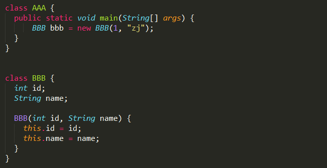

通过``javap -c AAA```查看编译之后的字节码，具体如下：

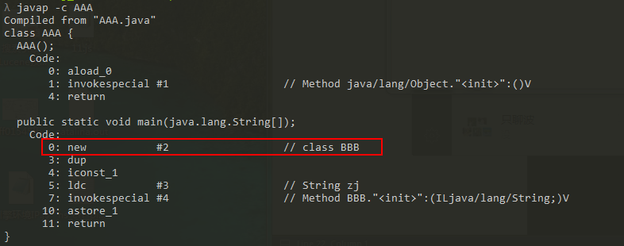

Java中的new关键字对应jvm中的new指令，定义在InterpreterRuntime类中，实现如下：

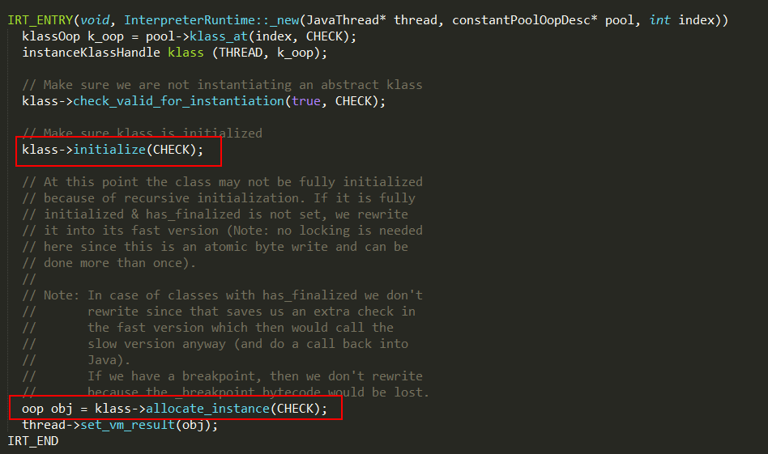

###new指令的实现过程：

1. 其中pool是AAA的constant pool，此时AAA的class已经加载到虚拟机中，new指令后面的#2表示BBB类全限定名的符号引用在constant pool的位置；

2. 方法pool->klass_at负责返回BBB对应的klassOop对象，实现如下：

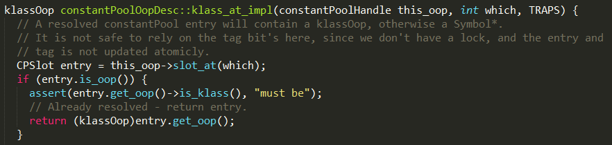

如果常量池中指定位置（#2）的数据已经是个oop类型，说明BBB的class已经被加载并解析过，则直接通过(klassOop)entry.get_oop()返回klassOop；
否则表示第一次使用BBB，需要解析BBB的符号引用，并加载BBB的class类，生成对应的instanceKlass对象，并更新constant pool中对应位置的符号引用；

3. klass->check_valid_for_instantiation可以防止抽象类被实例化；

4. klass->initialize实现如下：

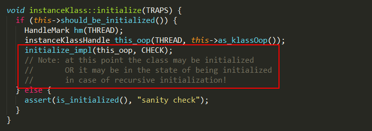

如果BBB的instanceKlass对象已经初始化完成，则直接返回；否则通过initialize_impl方法进行初始化，整个初始化算法分成11步，具体实现如下：

####step1

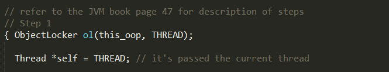

通过ObjectLocker在初始化之前进行加锁，防止多个线程并发初始化。

####step2

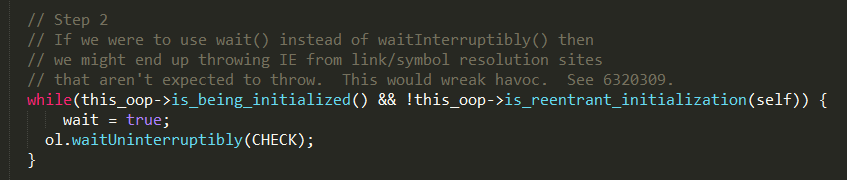

如果当前instanceKlass处于being_initialized状态，且正在被其它线程初始化，则执行ol.waitUninterruptibly等待其他线程完成后通知。

####step3

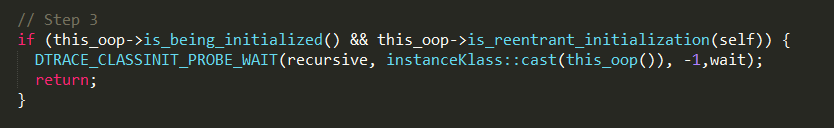

如果当前instanceKlass处于being_initialized状态，且被当前线程初始化，则直接返回。
其实对于这个step的处理我有疑问，什么情况会走到这一步？经过RednaxelaFX大大提点，如下情况会执行step3：
例如A类有静态变量指向一个new B类实例，B类里又有静态变量指向new A类实例，这样外部用A时要初始化A类，初始化过程中又要触发B类初始化，B类初始化又再次触发A类初始化。

####step4

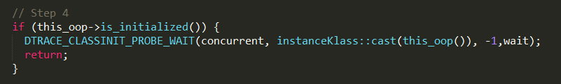

如果当前instanceKlass处于fully_initialized状态，说明已经初始化完成，则直接返回；

####step5

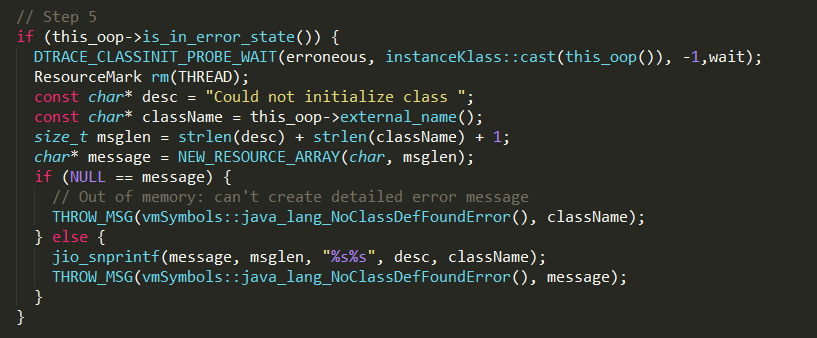

如果当前instanceKlass处于initialization_error状态，说明初始化失败了，抛出异常。

####step6


设置当前instanceKlass的状态为 being_initialized；设置初始化线程为当前线程。

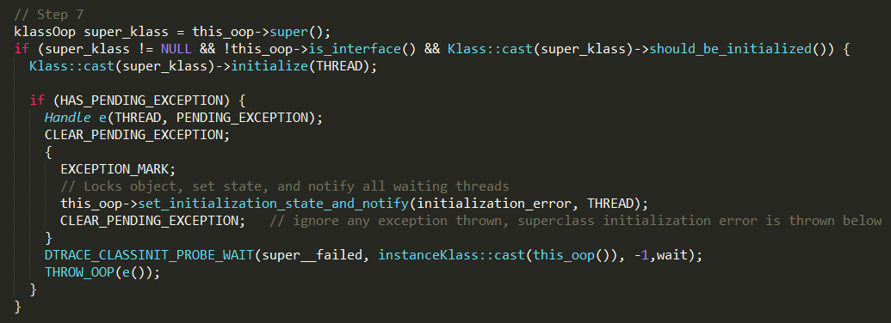

如果当前instanceKlass不是接口类型，并且父类不为空，且还未初始化，则执行父类的初始化。

####step8

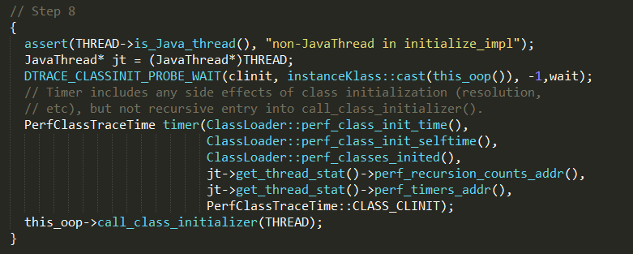

通过this_oop->call_class_initializer方法执行静态块代码，实现如下：

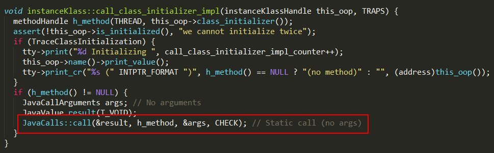

this_oop->class_initializer()可以获取静态代码块入口，最终通过JavaCalls::call执行代码块逻辑，再下一层就是具体操作系统的实现了。

####step9

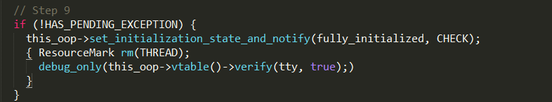

如果初始化过程没有异常，说明instanceKlass对象已经初始完成，则设置当前instanceKlass的状态为 fully_initialized，最后通知其它线程初始化已经完成；否则执行step10 and 11。

####step10 and 11

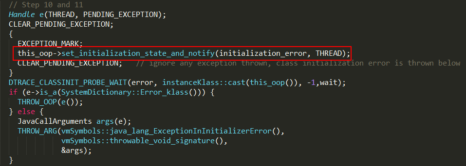

如果初始化发生异常，则设置当前instanceKlass的状态为 initialization_error，并通知其它线程初始化发生异常。

5. 如果instanceKlass初始化完成，klass->allocate_instance会在堆内存创建instanceOopDesc对象，即类的实例化；

#### instanceOopDesc

当在Java中new一个对象时，本质是在堆内存创建一个instanceOopDesc对象。

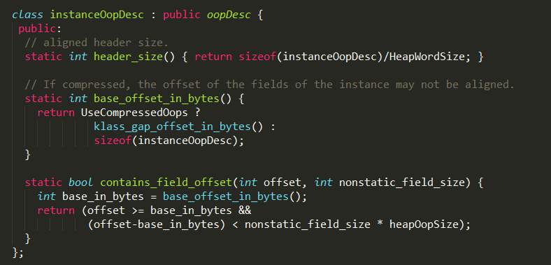


instanceOopDesc在实现上继承自oopDesc，其中oopDesc定义如下：

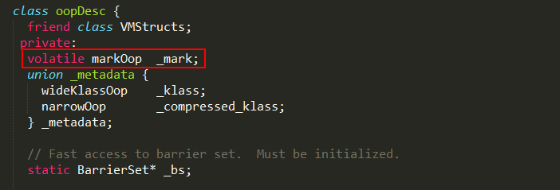

当然，这只是 oopDesc的部分实现，oopDesc包含两个数据成员：_mark 和 _metadata。

1、_mark是markOop类型对象，用于存储对象自身的运行时数据，如哈希码（HashCode）、GC分代年龄、锁状态标志、线程持有的锁、偏向线程ID、偏向时间戳等等，占用内存大小与虚拟机位长一致，更具体的实现可以阅读 《java对象头的HotSpot实现分析》

2、_metadata是一个联合体，其中wideKlassOop和narrowOop都是指向InstanceKlass对象的指针，wide版是普通指针，narrow版是压缩类指针（compressed Class pointer）

####instanceOopDesc对象的创建过程

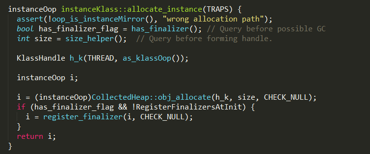

instanceOopDesc对象通过instanceKlass::allocate_instance进行创建，实现过程如下：

1. has_finalizer判断当前类是否包含不为空的finalize方法；

2. size_helper确定创建当前对象需要分配多大内存；

3. CollectedHeap::obj_allocate从堆中申请指定大小的内存，并创建instanceOopDesc对象，实现如下：

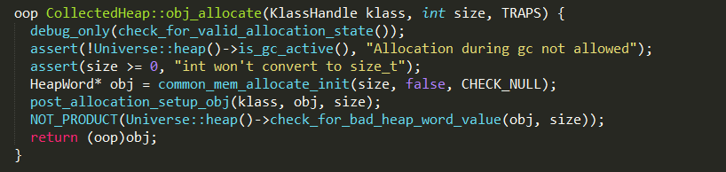

4、如果当前类重写了finalize方法，且非空，需要把生成的对象封装成Finalizer对象并添加到 Finalizer链表中，对象被GC时，如果是Finalizer对象，会将对象赋值到pending对象。Reference Handler线程会将pending对象push到queue中，Finalizer线程poll到对象，先删除掉Finalizer链表中对应的对象，然后再执行对象的finalize方法；


相关链接：[](https://www.cnblogs.com/iceAeterNa/p/4877741.html)