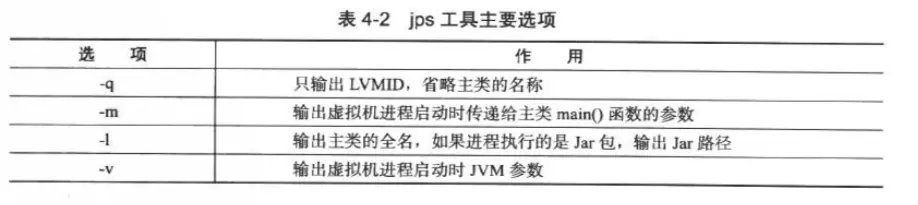
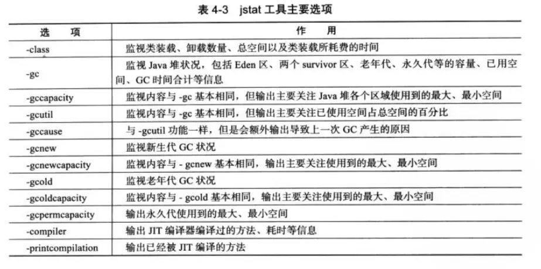
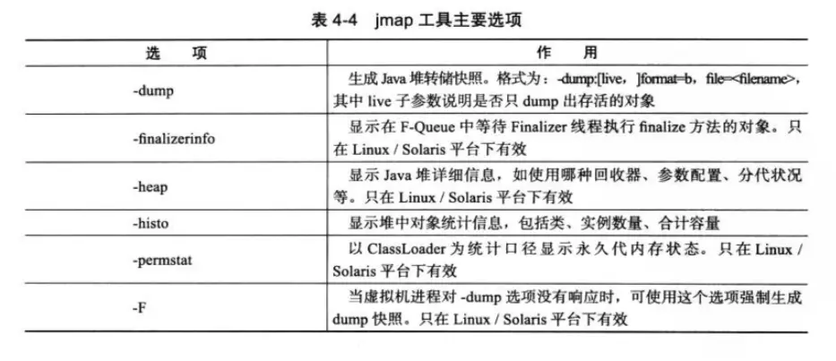
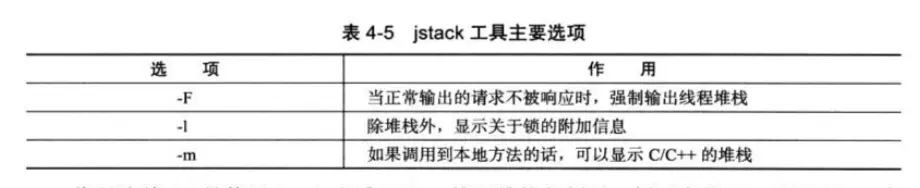
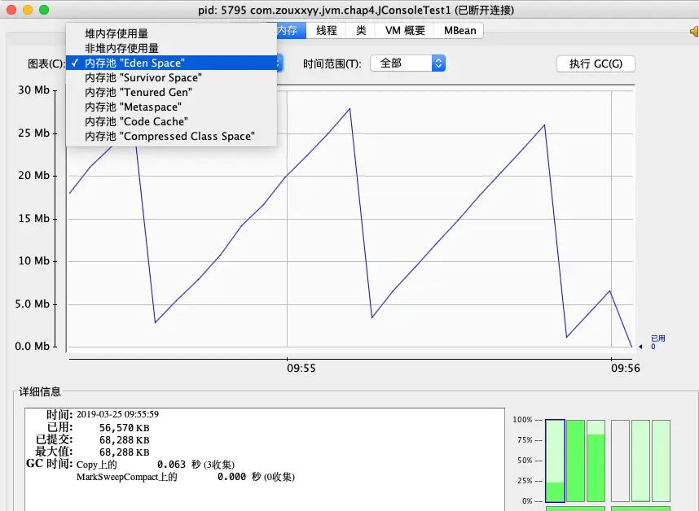
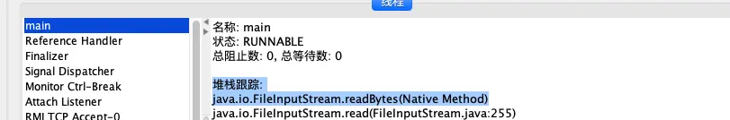
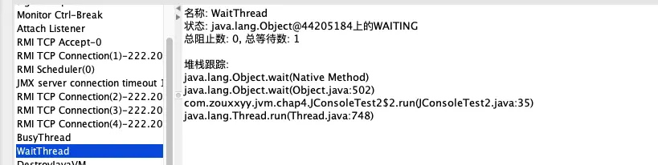
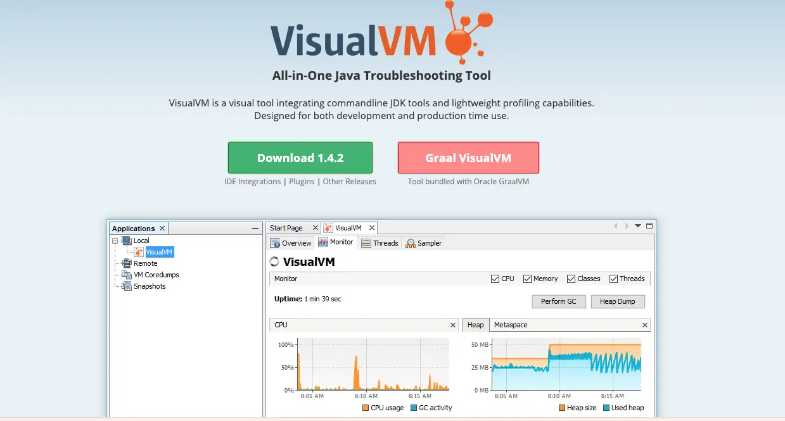

### 我的JDK工具地址
```bash
zxysMac:~ elwg$ cd /Library/Java/JavaVirtualMachines/jdk1.8.0_161.jdk/Contents/Home/bin
zxysMac:bin elwg$ ls
appletviewer    javah jjs jvisualvm schemagen
extcheck        javap jmap keytool serialver
idlj            javapackager jmc native2ascii servertool
jar             jcmd jps orbd tnameserv
jarsigner       jconsole jrunscript	pack200 unpack200
java            jdb jsadebugd policytool wsgen
javac           jdeps jstack rmic wsimport
javadoc         jhat jstat rmid xjc
javafxpackager  jinfo jstatd rmiregistry
```
### JDK的命令行工具

| 名称 | 全名 | 主要功能 |
| --- | --- | --- |
| jps | JVM Process Status | 显示指定系统的所有的虚拟机进程 |
| jstat | JVM Statistics Monitoring Tool | 用于收集虚拟机各方面的运行数据 |
| jinfo | Configuration Info for Java | 显示虚拟机配置信息 |
| jmap | Memory Map for Java | 生成虚拟机的内存转储快照（heapdump文件） |
| jhat | JVM Heap Dump Browser | 用于分析heapdump文件 |
| jstack | Stack Trace for Java | 显示虚拟机的线程快照 |
#### jps：虚拟机进程状况工具

* **功能**：可以列出运行的虚拟机进程、看到虚拟机执行的主类、本地虚拟机唯一ID
* **命令格式**： `jps [ option ] [ hostid ]`
* **主要选项**：



* **例子**：我在IDEA中运行列一个java文件，测试如下：

```bash
(base) zxysMac:~ elwg$ jps -l
16387 org.jetbrains.idea.maven.server.RemoteMavenServer
44422 sun.tools.jps.Jps
44392 com.zouxxyy.jvm.chap4.JpsTest
31368 org.jetbrains.kotlin.daemon.KotlinCompileDaemon
16217
44393 org.jetbrains.jps.cmdline.Launcher
```
#### jstat：虚拟机统计信息监视工具

* **功能**：可以显示本地或远程虚拟机进程中的类装载、内存、垃圾收集、JIT编译等运行数据
* **命令格式**：`jstat [ option vmid [interval[s|ms] [count]] ]`
* **主要选项**：


#### jinfo：Java配置信息工具

* **功能**：实时查看和调整虚拟机各项参数
* **命令格式**：`jinfo [ option ] pid`
* **例子**：看有没有用SerialGC

```bash
(base) zxysMac:~ elwg$ jinfo -flag UseSerialGC 46521
-XX:-UseSerialGC
```
#### jmap：Java内存映像工具

* **功能**：生成虚拟机堆存转储快照（heapdump文件）
* **命令格式**：`jmap [ option] vmid`
* **主要选项**：


#### jhat：虚拟机堆快照分析工具
与jmap配合使用，也就是分析堆存转储快照（heapdump文件）。
#### jstack：Java堆栈跟踪工具

* **功能**：用于生成虚拟机的线程快照
* **命令格式**：`jstack [ option ] vmid`
* **主要选项**：


### JDK的可视化工具
#### JConsole：Java监视与管理控制台
##### 内存监控，相当于可视化的`jstat`命令

##### 线程监控，相当于可视化的jstack命令，以下举几个简单的例子
监听用户键盘输入



监听wait()



监听死锁


#### VisualVM：多合一故障处理工具
它几乎集成里上面的所有功能


