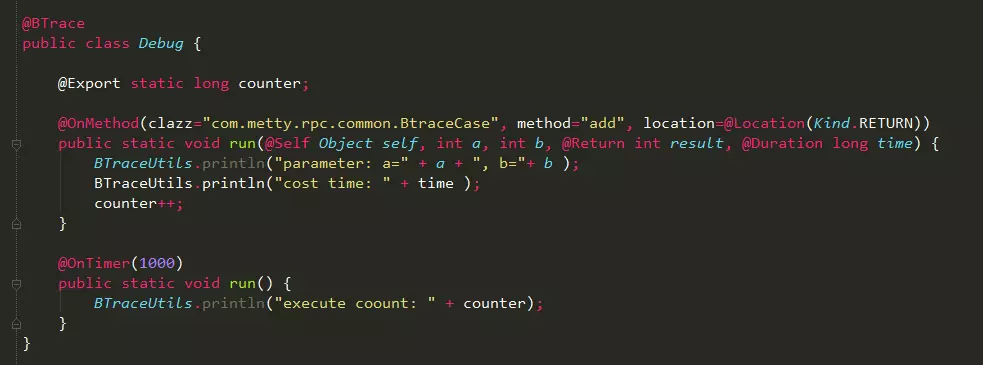
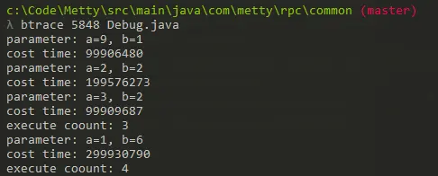
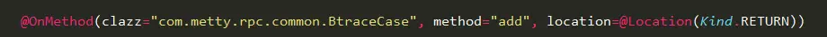
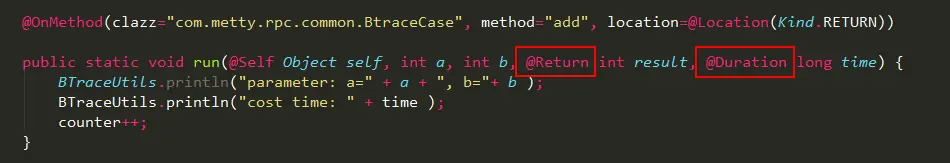
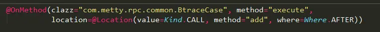
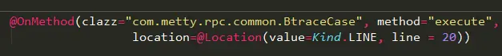
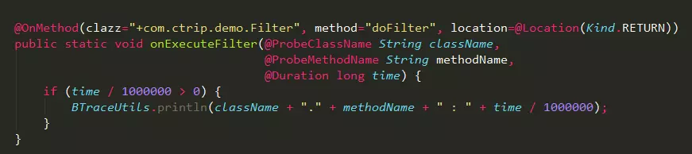
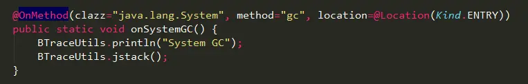
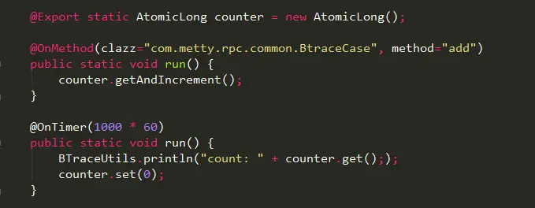
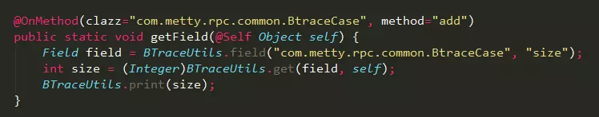

### Btrace
BTrace是sun公司推出的一款Java 动态、安全追踪（监控）工具，可以在不用重启的情况下监控系统运行情况，方便的获取程序运行时的数据信息，如方法参数、返回值、全局变量和堆栈信息等，并且做到最少的侵入，占用最少的系统资源。

由于Btrace会把脚本逻辑直接侵入到运行的代码中，所以在使用上做很多限制：

* 不能创建对象
* 不能使用数组
* 不能抛出或捕获异常
* 不能使用循环
* 不能使用synchronized关键字
* 属性和方法必须使用static修饰

根据官方声明，不恰当的使用BTrace可能导致JVM崩溃，如在BTrace脚本使用错误的class文件，所以在上生产环境之前，务必在本地充分的验证脚本的正确性。
### Btrace可以做什么？

* 接口性能变慢，分析每个方法的耗时情况；
* 当在Map中插入大量数据，分析其扩容情况；
* 分析哪个方法调用了System.gc()，调用栈如何；
* 执行某个方法抛出异常时，分析运行时参数；
* ....

### Btrace第一个例子
```java
package com.metty.rpc.common;import java.util.Random;

public class BtraceCase {
    public static Random random = new Random();
    public int size;

    public static void main(String[] args) throws Exception {
        new BtraceCase().run();
    }
    
    public void run() throws Exception {
        while (true) {
            add(random.nextInt(10), random.nextInt(10));
        }
    }

    public int add(int a, int b) throws Exception {
        Thread.sleep(random.nextInt(10) * 100);
        return a + b;
    }
}
```
执行add方法时，对传入参数、返回值以及执行耗时进行分析，btrace脚本：



通过jps命令获取pid为8454

执行`btrace 8454 Debug.java`实现对运行代码的监控，输出结果如下：



可以发现，Btrace可以获取每次执行add方法时的数据，当然Btrace能做的远远不止这些，比如获取当前jvm堆使用情况、当前线程的执行栈等等。
#### 参数说明
##### @OnMethod
Btrace使用@OnMethod注解定义需要分析的方法入口



在@OnMethod注解中，需要指定class、method以及location等，class表明需要监控的类，method表明需要监控的方法，指定方式如下：
> 1、使用全限定名：`clazz="com.metty.rpc.common.BtraceCase", method="add"`
> 
> 2、使用正则表达式：`clazz="/javax\\.swing\\..*/", method="/.*/"`
> 
> 3、使用接口：`clazz="+com.ctrip.demo.Filter", method="doFilter"`
> 
> 4、使用注解：`clazz="@javax.jws.WebService", method=""@javax.jws.WebMethod"`
> 
> 5、如果需要分析构造方法，需要指定`method="<init>"`

##### @Location
定义Btrace对方法的拦截位置，通过@Location注解指定，默认为Kind.ENTRY

1、**Kind.ENTRY**：在进入方法时，调用Btrace脚本

2、**Kind.RETURN**：方法执行完时，调用Btrace脚本，只有把拦截位置定义为Kind.RETURN，才能获取方法的返回结果@Return和执行时间@Duration



3、**Kind.CALL**：分析方法中调用其它方法的执行情况，比如在execute方法中，想获取add方法的执行耗时，必须把where设置成Where.AFTER



4、**Kind.LINE**：通过设置line，可以监控代码是否执行到指定的位置



5、**Kind.ERROR, Kind.THROW, Kind.CATCH**

用于对某些异常情况的跟踪，包括异常抛出，异常被捕获，异常未捕获被抛出方法之外
### 如何使用Btrace定位问题
1、找出所有耗时超过1ms的过滤器Filter



由于@Dutation返回的时间是纳秒级别，需要进行转换，如果定位一个Filter性能变慢，接着使用@Location(Kind.CALL)进行更细粒度的分析。

2、分析哪个方法调用了System.gc()，调用栈如何？



通过查看调用栈，可以很清楚的发现哪个类哪个方法调用了`System.gc()`

3、统计方法的调用次数，且每隔1分钟打印调用次数



Btrace的@OnTimer注解可以实现定时执行脚本中的一个方法

4、方法执行时，查看对象的实例属性值



通过反射机制，可以很方法的得到当前实例的属性值
### 总结
Btrace能做的事情太多，但使用之前切记检查脚本的可行性，一旦Btrace脚本侵入到系统中，只有通过重启才能恢复。
