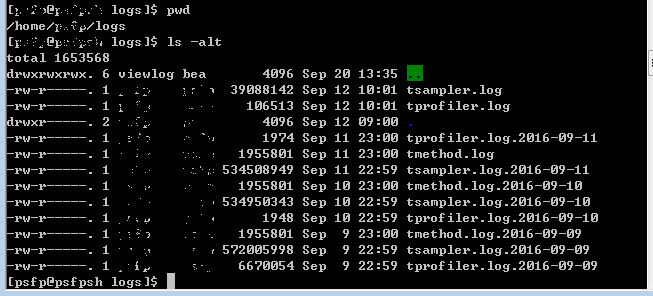
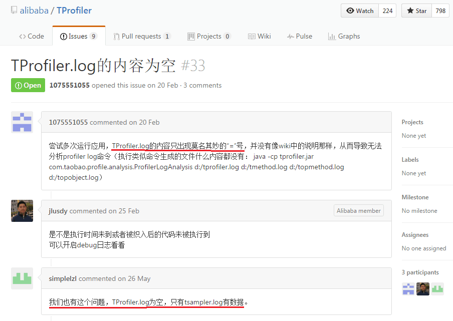

### 1. TProfiler 的下载安装
#### 1.1. 下载
访问 TProfiler 的 GitHub 主页，点击 Clone or download 按钮的打开下载选项，点击该选项下的 Download ZIP 按钮将 TProfiler-master.zip 下载到本地。
#### 1.2. 安装
SSH 登录需要监控的远程服务器主机，为 TProfiler 新建安装路径：

`$ mkdir /opt/tprofiler`

本地将下载后的 TProfiler-master.zip 解压缩，将 dist 目录下的 profile.properties 以及 dist/lib 目录下的 tprofiler-1.0.1.jar ftp 上传到远程服务器 /opt/tprofiler 目录下。

最后将远程服务器 /opt/tprofiler 目录及其下所有文件的所有者改为启动 Weblogic 进程的用户及其所在用户组。
### 2. TProfiler 的配置部署
#### 2.1. TProfiler 配置
编辑服务器 /opt/tprofiler/profile.properties 文件内容如下：
```properties
#log file name
logFileName = tprofiler.log
methodFileName = tmethod.log
samplerFileName = tsampler.log

#basic configuration items
startProfTime = 9:00:00
endProfTime = 23:00:00
eachProfUseTime = 5
eachProfIntervalTime = 50
samplerIntervalTime = 20
port = 30000
debugMode = false
needNanoTime = false
ignoreGetSetMethod = true

#file paths
logFilePath = ${user.home}/logs/${logFileName}
methodFilePath = ${user.home}/logs/${methodFileName}
samplerFilePath = ${user.home}/logs/${samplerFileName}

#include & excludes items
excludeClassLoader = org.eclipse.osgi.internal.baseadaptor.DefaultClassLoader
includePackageStartsWith = com.caucho;com.defonds;com.fasterxml;com.sun.jersey;com.sun.jmx;org.apache;org.codehaus;org.jdbcdslog;org.mybatis;org.quartz;org.springframework
excludePackageStartsWith = com.taobao.sketch;org.apache.velocity;com.alibaba;com.taobao.forest.domain.dataobject
```
#### 2.2. Weblogic 启动参数配置
在 Weblogic JVM 启动参数里加入：

`-javaagent:/opt/tprofiler/tprofiler-1.0.1.jar -Dprofile.properties=/opt/tprofiler/profile.properties`

之后重启 Weblogic。
### 3. TProfiler 的远程操作
使用启动 Weblogic 进程的用户 SSH 远程登录正在进行压测的机器。
#### 3.1. 查看 TProfiler 当前状态
`$ java -cp /opt/tprofiler/tprofiler-1.0.1.jar com.taobao.profile.client.TProfilerClient 127.0.0.1 30000 status`

`running`

得到这个结果证明 TProfiler 正在进行采集工作。
#### 3.2. 将 TProfiler 停止，以释放其占用的系统资源
随时关闭 TProfiler：

`$ java -cp /opt/tprofiler/tprofiler-1.0.1.jar com.taobao.profile.client.TProfilerClient 127.0.0.1 30000 stop`

`$ java -cp /opt/tprofiler/tprofiler-1.0.1.jar com.taobao.profile.client.TProfilerClient 127.0.0.1 30000 status`

`stop`

随时启动以继续采集：

`$ java -cp /opt/tprofiler/tprofiler-1.0.1.jar com.taobao.profile.client.TProfilerClient 127.0.0.1 30000 start`

`$ java -cp /opt/tprofiler/tprofiler-1.0.1.jar com.taobao.profile.client.TProfilerClient 127.0.0.1 30000 status`

`running`

#### 3.3. 刷出数据
`$ java -cp /opt/tprofiler/tprofiler-1.0.1.jar com.taobao.profile.client.TProfilerClient 127.0.0.1 30000 flushmethod`

会将数据刷出到 ~/logs/ 目录下：


### 4. TProfiler 对性能方法的采集
#### 4.1. 普通方法、线程统计
`$ java -cp /opt/tprofiler/tprofiler-1.0.1.jar com.taobao.profile.analysis.SamplerLogAnalysis ~/logs/tsampler.log ~/logs/method.log ~/logs/thread.log`
#### 4.2. top 统计
`$ java -cp /opt/tprofiler/tprofiler-1.0.1.jar com.taobao.profile.analysis.ProfilerLogAnalysis ~/logs/tprofiler.log ~/logs/tmethod.log ~/logs/topmethod.log ~/logs/topobject.log`

方法执行时间统计：这个非常非常重要，这个是 TProfiler 最最重要的 feature，是其能够傲视所有其他性能测试类(包括 jvm 性能测试类)软件的关键所在，我们将会不止一次地在关键的时候受益于 TProfiler 的这一非常有用的特性。

上述命令刷出的 topmethod.log 部分结果如下：
```log
com/defonds/core/ppts/common/support/JsonUtils:object2jsonString:123 13519 154 2083584
com/caucho/hessian/client/HessianURLConnection:sendRequest:156 15894 130 2072565
com/defonds/rest/core/client/proxy/ResourceJsonInvocationHandler:invoke:39 8123 113 921340
com/defonds/core/ppts/cache/service/impl/MerBankCfgServiceImpl:selectMerBankCfgByParams:72 54213 15 799322
com/defonds/core/ppts/incomes/biz/sinopay/service/impl/SinoPayBankReturnServiceImpl4Json:updateOrderSuccess:792 2495 176 438542
com/defonds/core/ppts/common/support/framework/bean/Message:<init>:76 6219 26 163741
com/fasterxml/jackson/databind/ser/impl/IndexedListSerializer:serializeContents:107 51883 3 145556
com/defonds/core/ppts/cache/biz/cims/impl/AccountPrdAndBankCacheImpl:selectBasicProductCfg:144 16131 8 137029
```
格式说明：方法信息 执行次数 平均执行时间(单位：ms) 全部执行时间(单位：ms)
### 5. 性能方法的优化
根据 topmethod.log 统计结果，我们拿到了热点方法 top10：

| 方法名 | 被调用次数 | 平均执行时间(ms) | 采样内总执行时间(ms) |
| --- | --- | --- | --- |
| com/defonds/core/ppts/common/support/JsonUtils:object2jsonString:123 | 13519 | 154 | 2083584 |
| com/caucho/hessian/client/HessianURLConnection:sendRequest:156 | 15894 | 130 | 2072565 |
| com/defonds/rest/core/client/proxy/ResourceJsonInvocationHandler:invoke:39 | 8123 | 113 | 921340 |
| com/defonds/core/ppts/cache/service/impl/MerBankCfgServiceImpl:selectMerBankCfgByParams:72 | 54213 | 15 | 799322 |
| com/defonds/core/ppts/incomes/biz/sinopay/service/impl/SinoPayBankReturnServiceImpl4Json:updateOrderSuccess:792 | 2495 | 176 | 438542 |
| com/defonds/core/ppts/common/support/framework/bean/Message:<init>:76 | 6219 | 26 | 163741 |
| com/fasterxml/jackson/databind/ser/impl/IndexedListSerializer:serializeContents:107 | 51883 | 3 |  145556|
| com/defonds/core/ppts/cache/biz/cims/impl/AccountPrdAndBankCacheImpl:selectBasicProductCfg:144 | 16131 | 8 | 137029 |
| com/defonds/core/ppts/common/jms/retrieve/listener/DefaultMessageListener:handleMessage:64 | 2981 | 46 | 136180 |
| com/fasterxml/jackson/databind/ser/BeanPropertyWriter:serializeAsField:573 | 53892 | 2 |  112553|

这是压测时根据多次采样结果，拣选出的一次比较有代表性的一次。这些代码要么是导致平均响应时间低下的一些点，要么是导致大量临时对象产生的一些点。

这些代码的调优原则是：临时对象能改成静态对象进行复用就改成公用对象否则要想方设法缩短其生命周期；高频访问代码提高响应速度。根据 jvm gc 日志发现很多 young gc 之后堆内存已用空间不仅下降反而上升至最大使用量导致 full gc，临时对象如果可以和其它线程复用的话改成静态对象以减少大量线程 local 对象的产生。

以排名第一的热点方法 com/defonds/core/ppts/common/support/JsonUtils:object2jsonString:123 为例，看看如何来进行调优。
```java
import org.codehaus.jackson.map.ObjectMapper;
	public static <T> String object2jsonString(T t) {
		try {
			ObjectMapper objectMapper = instanceObjectMapper();
			return objectMapper.writeValueAsString(t);
		} catch (JsonParseException e) {
			log.error(e.getMessage(), e);
			throw new SysException(e);
		} catch (JsonMappingException e) {
			log.error(e.getMessage(), e);
			throw new SysException(e);
		} catch (IOException e) {
			log.error(e.getMessage(), e);
			throw new SysException(e);
		}
	}
	public static ObjectMapper instanceObjectMapper() {
		JsonFactory jf = new JsonFactory();
		jf.configure(Feature.WRITE_NUMBERS_AS_STRINGS, true);
		return new ObjectMapper(jf);
	}	
```
该热点方法的优化建议：

这个方法平均调用时间在 154ms，如果在低并发时可能比这要小得多。但是高并发时可能要等待 GC 的堆内存释放、GC 作业时对业务线程造成的暂停时间等因素影响，这个时间会被无限放大。 
#### 5.1. 临时对象改成静态对象
object2jsonString 方法的 objectMapper 对象，instanceObjectMapper 方法的 jf 对象；
#### 5.2. json 处理由 jackson 改为 fastjson
jackson 和 spring 整合的很好，提供的功能点很多很强大。但是其性能未必靠得住。
### 6. 需要注意的一些问题
#### 6.1. TProfiler 端口号是否已被占用
为 TProfiler 选取端口号之前要先检测一下该端口号是否已被占用：
`$ netstat -an | grep 30000`
#### 6.2. TProfiler 配置里 includePackageStartsWith 
一定要根据你自己的系统进行实际更改，不然就会遇到《TProfiler.log的内容为空 #33》的问题，截图如下：


#### 6.3. 采样时间是否在配置的统计时间之内
在确认 6.2 里注意的事情无误的情况下，得到的 tprofiler.log 仍然为空 (只有 = 号) 的话，请检测你的采样时间是否在 profile.properties 里定义的 startProfTime 和 endProfTime 时间段之内。
#### 6.4. 几个命令配合使用
在压测的时候，结合使用 start、stop、flushmethod、ProfilerLogAnalysis topmethod 等几个命令，以拿到关键性的结果。如果能再结合 Weblogic、LoadRunner 的启动、停止，效果最佳。不然的话，如果 JVM 已经跑了很多天，拿到的数据可能不是你想要的，反而会误导你南辕北辙。
### 7. 后记
总体来讲，TProfiler 配置部署、远程操作、日志阅读都不太复杂，操作还是很简单的。但是其却是能够起到一针见血、立竿见影的效果，帮我们解决了 GC 过于频繁的性能瓶颈。

TProfiler 最重要的特性就是能够统计出你指定时间段内 JVM 的 topmethod，这些 topmethod 极有可能就是造成你 JVM 性能瓶颈的元凶。这是其他大多数 JVM 调优工具所不具备的，包括 JRockit Mission Control。JRokit 首席开发者 Marcus Hirt 在其私人博客《Low Overhead Method Profiling with Java Mission Control》下的评论中曾明确指出 JRMC 并不支持 TOP 方法的统计：


