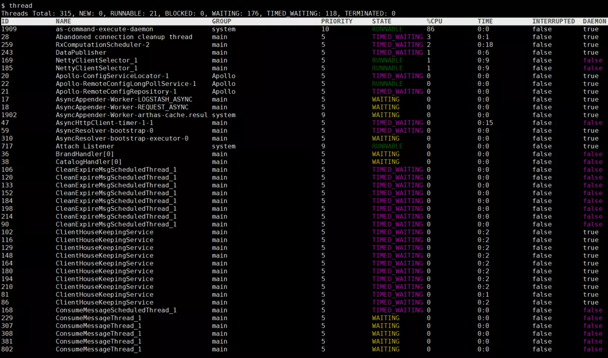
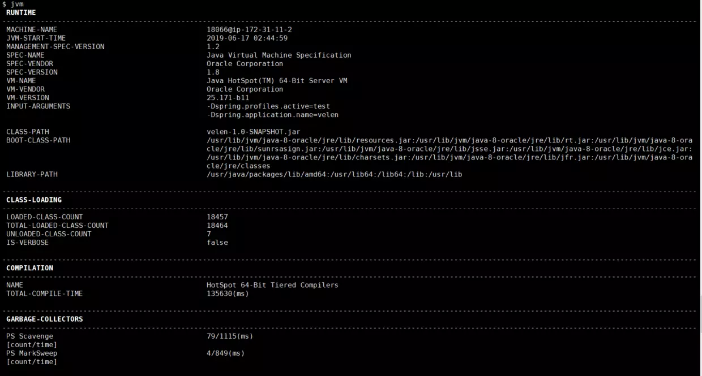
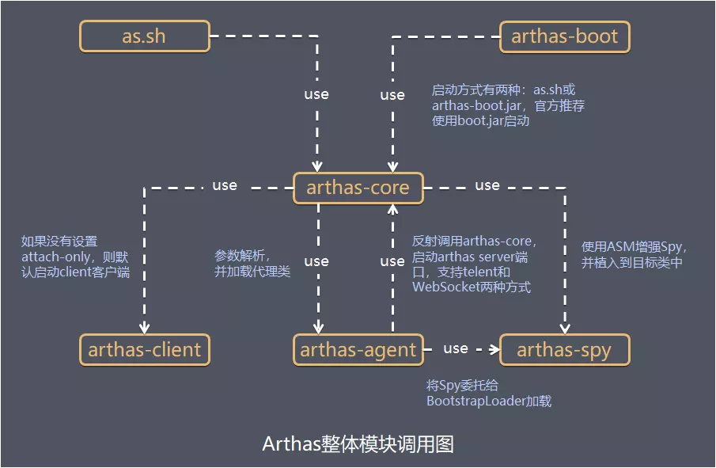

### 1 简介
Arthas 是Alibaba开源的Java诊断工具，深受开发者喜爱

当你遇到以下类似问题而束手无策时，Arthas可以帮助你解决：

* 这个类从哪个 jar 包加载的？为什么会报各种类相关的 Exception？
* 我改的代码为什么没有执行到？难道是我没 commit？分支搞错了？
* 遇到问题无法在线上 debug，难道只能通过加日志再重新发布吗？
* 线上遇到某个用户的数据处理有问题，但线上同样无法 debug，线下无法重现！
* 是否有一个全局视角来查看系统的运行状况？
* 有什么办法可以监控到JVM的实时运行状态？

Arthas支持JDK 6+，支持Linux/Mac/Winodws，采用命令行交互模式，同时提供丰富的 Tab 自动补全功能，进一步方便进行问题的定位和诊断
### 2 主要功能
Arthas提供的功能主要可以分为以下3个方面：
#### (1) 信息监控

* 进程运行基本信息：内存、CPU占用、线程信息、线程堆栈、线程数统计、环境变量信息
* 对象信息：类对象静态属性、 Mbean 的属性信息、已加载类信息、类加载器、类方法信息

#### (2) 方法调用

* 方法调用入参、返回值查看
* 方法被调用的调用路径、调用耗时、方法调用次数、成功次数、失败次数等统计
* 记录和重做方法调用

#### (3) 类文件处理

* dump已加载类的字节码、字节码反编译、类编译、类重新热加载

### 3 安装和使用
#### 3.1 安装
下载arthas-boot.jar，然后用java -jar的方式启动：
```bash
wget https://alibaba.github.io/arthas/arthas-boot.jar 
java -jar arthas-boot.jar
```

然后输入进程对应编号，进入Arthas的命令交互界面即可使用：


打印帮助信息：
```bash
java -jar arthas-boot.jar -h
```
#### 3.2 使用
下面介绍Arthas的一些常用的命令和用法和原理，看看是如何解决我们实际中的问题的，命令详情可以参考Arthas的官方文档
##### (1) 整体dashboard数据
在arthas的命令行界面，输入dashboard命令，会实时展示当前tomcat的多线程状态、JVM各区域、GC情况等信息


##### (2) 查看线程监控
输入thread命令，会显示所有线程的状态信息 输入thread -n 3会显示当前最忙的3个线程，可以用来排查线程CPU消耗 输入thread -b 会显示当前处于BLOCKED状态的线程，可以排查线程锁的问题


##### (3) JVM监控
输入jvm命令，查看jvm详细的性能数据


##### (4) 观察方法参数、返回值
有时排查问题中我们需要查看参数，返回值，通常的需要加日志打印，比较繁琐，基于watch命令我们可以很方便做到这一切
```bash
$ watch demo.MathGame primeFactors "{params,returnObj}" -x 2
Press Ctrl+C to abort.
Affect(class-cnt:1 , method-cnt:1) cost in 44 ms.
ts=2018-12-03 19:16:51; [cost=1.280502ms] result=@ArrayList[
    @Object[][
        @Integer[535629513],
    ],
    @ArrayList[
        @Integer[3],
        @Integer[19],
        @Integer[191],
        @Integer[49199],
    ],
]
```
##### (5) 观察方法调用路径，耗时详情
有时会遇到服务卡顿，想排查到底哪个步骤耗时比较久，通常做法是加日志，使用trace命令可以很方便解决这个问题：
```bash
$ trace demo.MathGame run
Press Ctrl+C to abort.
Affect(class-cnt:1 , method-cnt:1) cost in 42 ms.
`---ts=2018-12-04 00:44:17;thread_name=main;id=1;is_daemon=false;priority=5;TCCL=sun.misc.Launcher$AppClassLoader@3d4eac69
    `---[10.611029ms] demo.MathGame:run()
        +---[0.05638ms] java.util.Random:nextInt()
        +---[10.036885ms] demo.MathGame:primeFactors()
        `---[0.170316ms] demo.MathGame:print()
```
### 4 实现原理
整体宏观模块调用图如下：



篇幅原因，下面对其其中涉及的比较核心的2个原理进行简单介绍：
#### (1) 信息监控、类文件处理
JDK提供的JMX(Java Management Extensions Java管理扩展，是一个为应用程序植入管理功能的框架)，JMX管理管理了一系列MBean对象，Arthas正是基于这些MBean对象实现内存、GC、类加载信息、JVM信息监控
#### (2) 方法调用
从JDK5之后，引入了java.lang.Instrument，程序员通过修改方法的字节码实现动态修改类代码。在代理类的方法中的参数中，就有Instrumentation inst实例。通过该实例，我们可以调用Instrumentation提供的各种接口。比如调用inst.getAllLoadedClasses()得到所有已经加载过的类。调用inst.addTransformer(new SdlTransformer(), true)新增转换器。调用inst.retransformClasses(Class cls)，向JVM发起重转换请求

Arthas使用ASM生成增强后的类的字节码，增强的功能包括方法调用入参、返回值查看、方法调用统计、方法调用记录和重做，再基于JDK提供的Instrumentation接口对方法进行增加和转换
### 5 实战案例
Arthas官方文档提供了许多用户案例，下面介绍几个比较有意思的案例：
#### (1) 排查应用奇怪日志来源
服务应用运行中有时会出现一些奇怪日志，排查定位这些日志的来源比较麻烦 通过修改StringBuilder的实现代码打印出日志的调用堆栈信息，编译生成StringBuilder.clss，再基于Arthas提供的redefine命令修改应用中使用的StringBuilder的实际使用字节码
#### (2) 排查SpringBoot应用401/404问题
页面访问返回401/404，碰到这种问题时，通常很头痛，特别是在线上环境时 通过Arthas提供的trace命令，打印出页面访问时的完整请求树，定位出具体哪个Servlet返回404
```bash
$ trace javax.servlet.Servlet *
Press Ctrl+C to abort.
Affect(class-cnt:7 , method-cnt:185) cost in 1018 ms.
```

通过trace命令，trace对象是javax.servlet.Filter定位具体哪个Filter拦截请求定位返回401的问题来源
```bash
$ trace javax.servlet.Filter *
Press Ctrl+C to abort.
Affect(class-cnt:13 , method-cnt:75) cost in 278 ms.
```
#### (3) 线上代码热更新

有时为了快速验证线上问题的修复方案，或者为了快速测试，我们需要热更新代码 Arthas提供的解决步骤如下
> 步骤1 jad命令反编译代码
> 
> 步骤2 文本编辑器修改代码
> 
> 步骤3 sc命令查找代码所在类的ClassLoader
> 
> 步骤4 mc命令指定ClassLoader编译代码
> 
> 步骤5 redefine命令热更新代码
