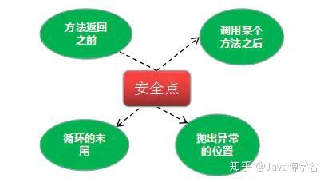
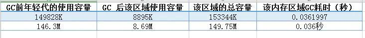
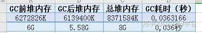
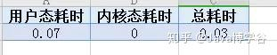
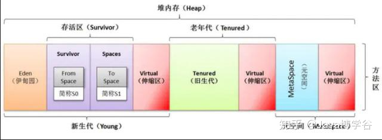
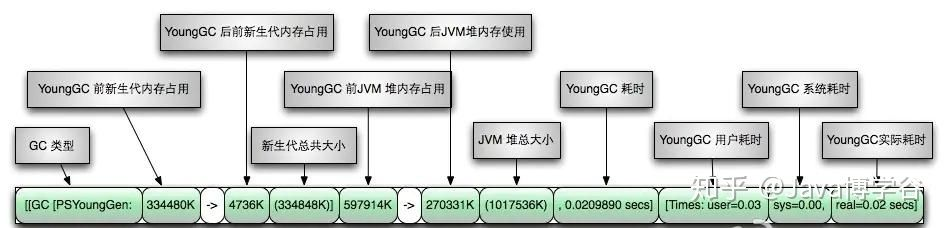
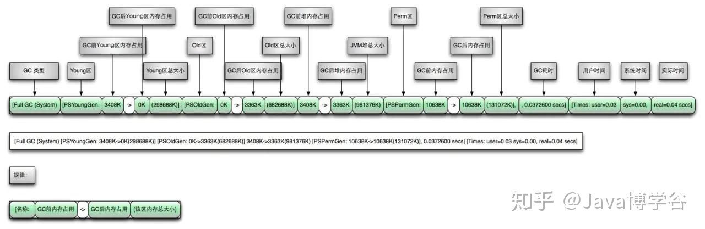

###GC 日志是什么

首先来说一说GC的概念， GC 就是垃圾回收 （Garbage Collection） 的缩写。

何为垃圾？没有任何引用指向的对象，被JVM视为垃圾。

当然，对应的判定算法有：引用计数算法、可达性分析算法。 对应的回收算法有：标记清除、复制、标记整理、分代收集算法。

那GC的日志是什么呢？

GC日志是java虚拟机产生的一种描述性的文本日志。就像我们开发java程序需要输出log日志一样。JAVA 虚拟机用GC日志来描述，垃圾回收的情况。

####minor GC 和 Major GC

Minor GC，表示新生代GC，指发生在新生代的垃圾收集动作，所有的Minor GC都会触发全世界的暂停（stop-the-world），停止应用程序的线程，不过这个过程非常短。

Major GC：老年代GC，指发生在老年代的 GC，也称之为 Full GC。

通过GC日志，我们能直观的看到内存清理的基本工作过程。了解垃圾回收的一些行为，何时在Young（年轻代）何时在回收Old（老年代），并且展示垃圾回收使用到多少资源。

###GC日志分析
我们按时间分割，可以知道，截图中一共有两行日志，先来看日志一：

>2020-03-17T19:03:19.701+0800: 6664.686: Total time for which application threads were stopped: 0.0313360 seconds, Stopping threads took: 0.0000925 seconds

毋庸置疑，首先映入眼帘的是带时区的日志时间。其次 Total time for which application threads were stopped 表示 所有应用线程暂停了 0.0313360 秒。

其中等待所有应用线程到达 【安全点】 用了0.0000925 秒。暂停的这段时间，其实就是花在了GC上面。后续第二行的 real=0.03 secs 和这里相对应。

刚才提到了 安全点 ，那简单提一提，我们知道在 Java 的线程有几个不同的状态。也知道线程如果被 “打断” 会出现什么样的问题。所以对于设计者来说，
需要让线程 “跑” 到安全点上，再停顿。当处于安全点时，线程的状态是确定的，这样JVM就可以安全的进行一些操作，比如执行垃圾回收。

安全点的位置包括：




如果有线程一直没有进入到安全点，就会导致GC时JVM停顿时间延长。

再来看日志二：

1） 2020-03-17T19:03:20.118+0800: 6665.102:
2）[GC (Allocation Failure) 2020-03-17T19:03:20.118+0800: 6665.102: 
3）[ParNew Desired survivor size 8716288 bytes, new threshold 6 (max 6)
4）- age   1:    6826872 bytes,    6826872 total
5）- age   2:    1060216 bytes,    7887088 total
6）149828K->8895K(153344K), 0.0361997 secs] 
7）6272826K->6139400K(8371584K),0.0363166 secs]
8）[Times: user=0.07 sys=0.00, real=0.03 secs]

第一行，为日志输出的时间。

第二行，表明了进行了一次 GC 回收，注意，由于这里没有 Full 关键字 ，表明是一次 Minor GC，并指明了 GC 的时间。 Allocation Failure则表示GC的原因是在年轻代中没有了足够的空间来存储数据了。

第三行，ParNew 同样指明了本次 GC 是发生在年轻代，并且使用的是ParNew垃圾收集器。该收集器采用复制算法回收内存，期间会停止其他工作线程，即Stop The World。

第三、四、五行，表示每次年轻代 GC 之后打印 survivor 区域内对象的年龄分布， threshold则表示设置的晋升老年代的年龄阈值为6。

第六行，分别表示GC前年轻代的使用容量，GC 后该区域使用容量，括号内是该区域的总容量。最后是该内存区域GC耗时，单位是秒。



第七行，分别表示堆内存在垃圾回收之间的大小、堆内存在垃圾回收之后的大小，堆区的总大小。



可以看到在 GC 后，回收对象占比很少。

第八行，显示三个耗时，分别是用户态耗时、内核态耗时、总耗时。



从以上信息我们可以分析得出以下结论：

本次 GC 新生代减少了： 149828 - 8895 = 140933K。

堆内存区域共减少了： 6272826 - 6139400 = 133426K。



再把两个等号后的结果相减： 140933 - 133426 = 7507K

说明该次共有7507K（7.3M）内存从年轻代移到了老年代，可以看出来数量并不多，说明都是生命周期短的对象，只是这种对象有很多。

我们需要的是尽量避免Full GC的发生，让对象尽可能的在年轻代就回收掉，所以这里可以稍微增加一点年轻代的大小，让那 7.3M 的数据也保存在年轻代中。

####Old GC
上面介绍了 年轻代的GC日志，下面我们来说一说 老年代的 GC 日志 ，其实和年轻代分析的方法一样。

还是先列出日志：

```java
[gc][238384] overhead, spent [2.2s] collecting in the last [2.3s]

[2020-03-18T01:01:29,020][INFO ][o.e.m.j.JvmGcMonitorService]
[eS] [gc][old][238385][160772] duration [5s], 

collections [1]/[5.1s], total [5s]/[4.4d], memory [945.4mb]->[958.5mb]/[1007.3mb],

all_pools {[young] [87.8mb]->[100.9mb]/[133.1mb]}{[survivor] [0b]->[0b]/[16.6mb]}{[old] [857.6mb]->[857.6mb]/[857.6mb]}
```
直接来解释一下吧。 第一行指明了这是第 238384次 GC 在最近 2.3 s 内花了 2.2s 用来做垃圾收集。

相信解读过年轻代的GC，理解第二行的含义并不复杂了。

[gc][本次是 old GC][这是第228385次 GC 检查][从 JVM 启动至今发生的第 160772次 GC] duration [本次检查到的 GC 总耗时 5 秒，可能是多次的加和],

collections [从上次检查至今总共发生1次 GC]/[从上次检查至今已过去 5.1 秒],

total [本次检查到的 GC 总耗时为 5 秒]/[从 JVM 启动至今发生的 GC 总耗时为 4.4 天]，

memory [ GC 前 Heap memory 空间]->[GC 后 Heap memory 空间]/[Heap memory 总空间],

all_pools(分代部分的详情)

{[young 区][GC 前 Memory ]->[GC后 Memory]/[young区 Memory 总大小] }

{[survivor 区][GC 前 Memory ]->[GC后 Memory]/[survivor区 Memory 总大小] }{[old 区][GC 前 Memory ]->[GC后 Memory]/[old区 Memory 总大小] }


####GC日志图示

如果前面的介绍还没有太明白，这里附上两张GC日志的图片，以后遇到需要阅读GC日志的时候，可以用作工具查阅。

年轻代：



老年代：

