### 什么是 ClassLoader ？
大家都知道，当我们写好一个 Java 程序之后，不是管是 C/S 还是 B/S 应用，都是由若干个 .class 文件组织而成的一个完整的 Java 应用程序，当程序在运行时，即会调用该程序的一个入口函数来调用系统的相关功能，而这些功能都被封装在不同的 class 文件当中，所以经常要从这个 class 文件中要调用另外一个 class 文件中的方法，如果另外一个文件不存在的，则会引发系统异常。而程序在启动的时候，并不会一次性加载程序所要用的所有class文件，而是根据程序的需要，通过Java的类加载机制（ClassLoader）来动态加载某个 class 文件到内存当中的，从而只有 class 文件被载入到了内存之后，才能被其它 class 所引用。所以 ClassLoader 就是用来动态加载 class 文件到内存当中用的。
### ClassLoader 作用：

* 负责将 Class 加载到 JVM 中
* 审查每个类由谁加载（父优先的等级加载机制）
* 将 Class 字节码重新解析成 JVM 统一要求的对象格式

### ClassLoader 类结构分析
为了更好的理解类的加载机制，我们来深入研究一下 ClassLoader 和他的方法。
`public abstract class ClassLoader`

ClassLoader类是一个抽象类，sun公司是这么解释这个类的：
```java
/**
 * A class loader is an object that is responsible for loading classes. The
 * class ClassLoader is an abstract class.  Given the binary name of a class, a class loader should attempt to
 * locate or generate data that constitutes a definition for the class.  A
 * typical strategy is to transform the name into a file name and then read a
 * "class file" of that name from a file system.
**/
```
大致意思如下：
> class loader 是一个负责加载 classes 的对象，ClassLoader 类是一个抽象类，需要给出类的二进制名称，class loader 尝试定位或者产生一个 class 的数据，一个典型的策略是把二进制名字转换成文件名然后到文件系统中找到该文件。

以下是 ClassLoader 常用到的几个方法及其重载方法：

* ClassLoader
* defineClass(byte[], int, int) 把字节数组 b中的内容转换成 Java 类，返回的结果是java.lang.Class类的实 
例。这个方法被声明为final的
* findClass(String name) 查找名称为 name的类，返回的结果是java.lang.Class类的实例
* loadClass(String name) 加载名称为 name的类，返回的结果是java.lang.Class类的实例
* resolveClass(Class<?>) 链接指定的 Java 类

其中 defineClass 方法用来将 byte 字节流解析成 JVM 能够识别的 Class 对象，有了这个方法意味着我们不仅仅可以通过 class 文件实例化对象，还可以通过其他方式实例化对象，如果我们通过网络接收到一个类的字节码，拿到这个字节码流直接创建类的 Class 对象形式实例化对象。如果直接调用这个方法生成类的 Class 对象，这个类的 Class 对象还没有 resolve ，这个 resolve 将会在这个对象真正实例化时才进行。

接下来我们看loadClass方法的实现方式：
```java
protected Class> loadClass(String name, boolean resolve) throws ClassNotFoundException
    {
        synchronized (getClassLoadingLock(name)) {
            // First, check if the class has already been loaded
            Class c = findLoadedClass(name);
            if (c == null) {
                long t0 = System.nanoTime();
                try {
                    if (parent != null) {
                        c = parent.loadClass(name, false);
                    } else {
                        c = findBootstrapClassOrNull(name);
                    }
                } catch (ClassNotFoundException e) {
                    // ClassNotFoundException thrown if class not found
                    // from the non-null parent class loader
                }

                if (c == null) {
                    // If still not found, then invoke findClass in order
                    // to find the class.
                    long t1 = System.nanoTime();
                    c = findClass(name);

                    // this is the defining class loader; record the stats
                    sun.misc.PerfCounter.getParentDelegationTime().addTime(t1 - t0);
                    sun.misc.PerfCounter.getFindClassTime().addElapsedTimeFrom(t1);
                    sun.misc.PerfCounter.getFindClasses().increment();
                }
            }
            if (resolve) {
                resolveClass(c);
            }
            return c;
        }
    }
```

该方法大概意思：
> 使用指定的二进制名称来加载类，这个方法的默认实现按照以下顺序查找类： 调用findLoadedClass(String) 方法检查这个类是否被加载过 使用父加载器调用 loadClass(String) 方法，如果父加载器为 Null，类加载器装载虚拟机内置的加载器调用 findClass(String) 方法装载类， 如果，按照以上的步骤成功的找到对应的类，并且该方法接收的 resolve 参数的值为 true,那么就调用resolveClass(Class) 方法来处理类。 ClassLoader 的子类最好覆盖 findClass(String) 而不是这个方法。 除非被重写，这个方法默认在整个装载过程中都是同步的（线程安全的）。

### ClassLoader 的等级加载机制
#### Java默认提供的三个ClassLoader
**BootStrap ClassLoader**：称为启动类加载器，是Java类加载层次中最顶层的类加载器，负责加载JDK中的核心类库，如：rt.jar、resources.jar、charsets.jar等，可通过如下程序获得该类加载器从哪些地方加载了相关的jar或class文件：
```java
public class BootStrapTest
{
  public static void main(String[] args)
  {
    URL[] urls = sun.misc.Launcher.getBootstrapClassPath().getURLs();
    for (int i = 0; i < urls.length; i++) {
        System.out.println(urls[i].toExternalForm());
     }
  }
}
```
以下内容是上述程序从本机JDK环境所获得的结果：

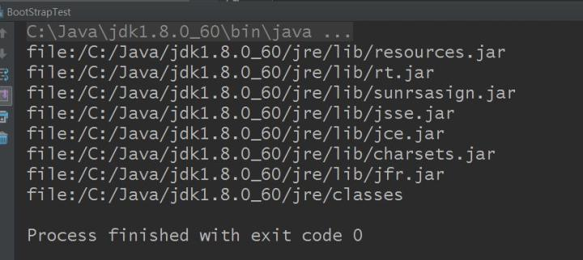

其实上述结果也是通过查找 sun.boot.class.path 这个系统属性所得知的。
```java
System.out.println(System.getProperty("sun.boot.class.path"));
```
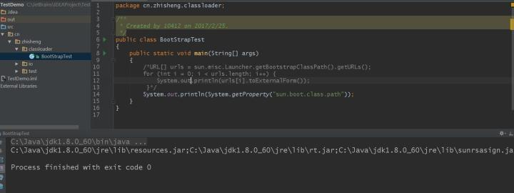

打印结果：
```bash
C:\Java\jdk1.8.0_60\jre\lib\resources.jar;C:\Java\jdk1.8.0_60\jre\lib\rt.jar;C:\Java\jdk1.8.0_60\jre\lib\sunrsasign.jar;C:\Java\jdk1.8.0_60\jre\lib\jsse.jar;C:\Java\jdk1.8.0_60\jre\lib\jce.jar;C:\Java\jdk1.8.0_60\jre\lib\charsets.jar;C:\Java\jdk1.8.0_60\jre\lib\jfr.jar;C:\Java\jdk1.8.0_60\jre\classes
```

**Extension ClassLoader**：称为扩展类加载器，负责加载Java的扩展类库，Java 虚拟机的实现会提供一个扩展库目录。该类加载器在此目录里面查找并加载 Java 类。默认加载JAVA_HOME/jre/lib/ext/目下的所有jar。

**App ClassLoader**：称为系统类加载器，负责加载应用程序classpath目录下的所有jar和class文件。一般来说，Java 应用的类都是由它来完成加载的。可以通过 ClassLoader.getSystemClassLoader()来获取它。

除了系统提供的类加载器以外，开发人员可以通过继承java.lang.ClassLoader类的方式实现自己的类加载器，以满足一些特殊的需求。

除了引导类加载器之外，所有的类加载器都有一个父类加载器。 给出的 getParent()方法可以得到。对于 系统提供的类加载器来说，系统类加载器的父类加载器是扩展类加载器，而扩展类加载器的父类加载器是引导类加载器；对于开发人员编写的类加载器来说，其父类加载器是加载此类加载器 Java 类的类加载器。因为类加载器 Java 类如同其它的 Java 类一样，也是要由类加载器来加载的。一般来说，开发人员编写的类加载器的父类加载器是系统类加载器。类加载器通过这种方式组织起来，形成树状结构。树的根节点就是引导类加载器。
#### ClassLoader加载类的原理
##### 原理介绍
ClassLoader使用的是双亲委托模型来搜索类的，每个ClassLoader实例都有一个父类加载器的引用（不是继承的关系，是一个包含的关系），虚拟机内置的类加载器（Bootstrap ClassLoader）本身没有父类加载器，但可以用作其它ClassLoader实例的的父类加载器。当一个ClassLoader实例需要加载某个类时，它会试图亲自搜索某个类之前，先把这个任务委托给它的父类加载器，这个过程是由上至下依次检查的，首先由最顶层的类加载器Bootstrap ClassLoader试图加载，如果没加载到，则把任务转交给Extension ClassLoader试图加载，如果也没加载到，则转交给App ClassLoader 进行加载，如果它也没有加载得到的话，则返回给委托的发起者，由它到指定的文件系统或网络等URL中加载该类。如果它们都没有加载到这个类时，则抛出ClassNotFoundException异常。否则将这个找到的类生成一个类的定义，并将它加载到内存当中，最后返回这个类在内存中的Class实例对象。
##### 为什么要使用双亲委托这种模型呢？
因为这样可以避免重复加载，当父亲已经加载了该类的时候，就没有必要 ClassLoader再加载一次。考虑到安全因素，我们试想一下，如果不使用这种委托模式，那我们就可以随时使用自定义的String来动态替代java核心api中定义的类型，这样会存在非常大的安全隐患，而双亲委托的方式，就可以避免这种情况，因为String已经在启动时就被引导类加载器（Bootstrcp ClassLoader）加载，所以用户自定义的ClassLoader永远也无法加载一个自己写的String，除非你改变JDK中ClassLoader搜索类的默认算法。
##### 但是JVM在搜索类的时候，又是如何判定两个class是相同的呢？
JVM在判定两个class是否相同时，不仅要判断两个类名是否相同，而且要判断是否由同一个类加载器实例加载的。只有两者同时满足的情况下，JVM才认为这两个class是相同的。就算两个class是同一份class字节码，如果被两个不同的ClassLoader实例所加载，JVM也会认为它们是两个不同class。比如网络上的一个Java类org.classloader.simple.NetClassLoaderSimple，javac编译之后生成字节码文件NetClassLoaderSimple.class，ClassLoaderA和ClassLoaderB这两个类加载器并读取了NetClassLoaderSimple.class文件，并分别定义出了java.lang.Class实例来表示这个类，对于JVM来说，它们是两个不同的实例对象，但它们确实是同一份字节码文件，如果试图将这个Class实例生成具体的对象进行转换时，就会抛运行时异常java.lang.ClassCaseException，提示这是两个不同的类型。现在通过实例来验证上述所描述的是否正确：
###### 1）、在web服务器上建一个org.classloader.simple.NetClassLoaderSimple.java类
```java
public class NetClassLoaderSimple
{
    private NetClassLoaderSimple instance;
    public void setNetClassLoaderSimple(Object object){
        this.instance = (NetClassLoaderSimple)object;
    }
}
```
org.classloader.simple.NetClassLoaderSimple类的setNetClassLoaderSimple方法接收一个Object类型参数，并将它强制转换成org.classloader.simple.NetClassLoaderSimple类型。
###### 2）、测试两个class是否相同 NetWorkClassLoader.java
```java
package classloader;  

public class NewworkClassLoaderTest {  

    public static void main(String[] args) {  
        try {  
            // 测试加载网络中的class文件  
            String rootUrl = "http://localhost:8080/httpweb/classes";  
            String className = "org.classloader.simple.NetClassLoaderSimple";  
            NetworkClassLoader ncl1 = new NetworkClassLoader(rootUrl);  
            NetworkClassLoader ncl2 = new NetworkClassLoader(rootUrl);  
            Class<?> clazz1 = ncl1.loadClass(className);  
            Class<?> clazz2 = ncl2.loadClass(className);  
            Object obj1 = clazz1.newInstance();  
            Object obj2 = clazz2.newInstance();  
            clazz1.getMethod("setNetClassLoaderSimple", Object.class).invoke(obj1, obj2);  
        } catch (Exception e) {  
            e.printStackTrace();  
        }  
    }  

} 
```
首先获得网络上一个class文件的二进制名称，然后通过自定义的类加载器NetworkClassLoader创建两个实例，并根据网络地址分别加载这份class，并得到这两个ClassLoader实例加载后生成的Class实例clazz1和clazz2，最后将这两个Class实例分别生成具体的实例对象obj1和obj2，再通过反射调用clazz1中的setNetClassLoaderSimple方法。
###### 3）、查看测试结果
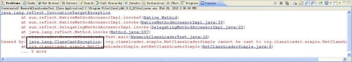

**结论**：从结果中可以看出，运行时抛出了java.lang.ClassCastException异常。虽然两个对象obj1和 obj2的类的名字相同，但是这两个类是由不同的类加载器实例来加载的，所以JVM认为它们就是两个不同的类。

了解了这一点之后，就可以理解代理模式的设计动机了。代理模式是为了保证 Java 核心库的类型安全。所有 Java 应用都至少需要引用 java.lang.Object类，也就是说在运行的时候，java.lang.Object这个类需要被加载到 Java 虚拟机中。如果这个加载过程由 Java 应用自己的类加载器来完成的话，很可能就存在多个版本的 java.lang.Object类，而且这些类之间是不兼容的。通过代理模式，对于 Java 核心库的类的加载工作由引导类加载器来统一完成，保证了Java 应用所使用的都是同一个版本的 Java 核心库的类，是互相兼容的。

不同的类加载器为相同名称的类创建了额外的名称空间。相同名称的类可以并存在 Java 虚拟机中，只需要用不同的类加载器来加载它们即可。不同类加载器加载的类之间是不兼容的，这就相当于在 Java 虚拟机内部创建了一个个相互隔离的 Java 类空间。
#### ClassLoader的体系架构
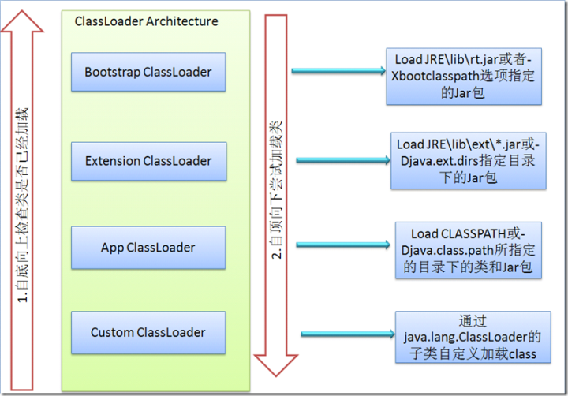
#### 类加载器的树状组织结构
##### 测试一：
```java
public class ClassLoaderTree
{
    public static void main(String[] args) {
        ClassLoader loader = ClassLoaderTree.class.getClassLoader();
        while (loader!=null){
            System.out.println(loader.toString());
            loader = loader.getParent();
        }
        System.out.println(loader);
    }
}
```
每个 Java 类都维护着一个指向定义它的类加载器的引用，通过 getClassLoader()方法就可以获取到此引用。代码中通过递归调用 getParent()方法来输出全部的父类加载器。

结果是：

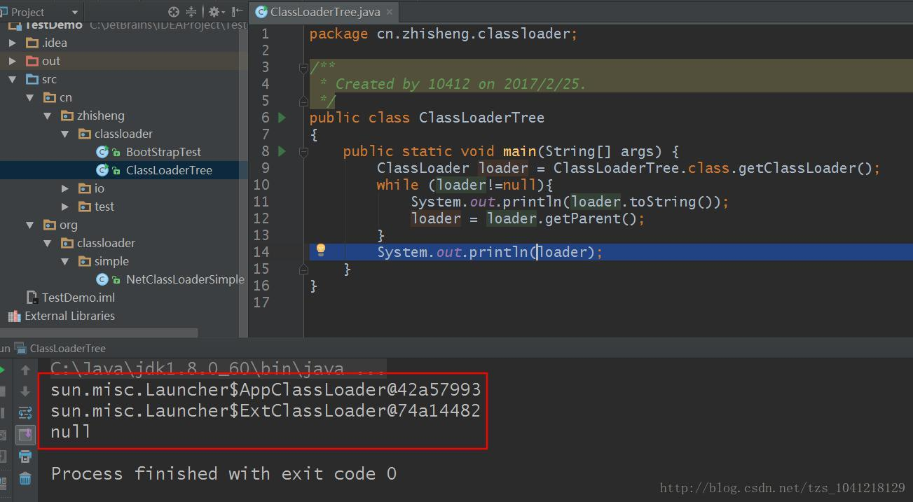

第一个输出的是 ClassLoaderTree类的类加载器，即系统类加载器。它是sun.misc.Launcher$AppClassLoader类的实例；第二个输出的是扩展类加载器，是sun.misc.Launcher$ExtClassLoader类的实例。需要注意的是这里并没有输出引导类加载器，这是由于有些 JDK 的实现对于父类加载器是引导类加载器的情况，getParent()方法返回 null。第三行结果说明：ExtClassLoader的类加器是Bootstrap ClassLoader，因为Bootstrap ClassLoader不是一个普通的Java类，所以ExtClassLoader的parent=null，所以第三行的打印结果为null就是这个原因。
##### 测试二：
将ClassLoaderTree.class打包成ClassLoaderTree.jar，放到Extension ClassLoader的加载目录下（JAVA_HOME/jre/lib/ext），然后重新运行这个程序，得到的结果会是什么样呢？

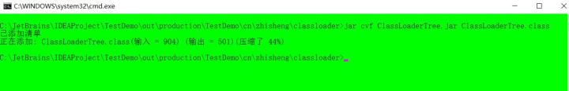

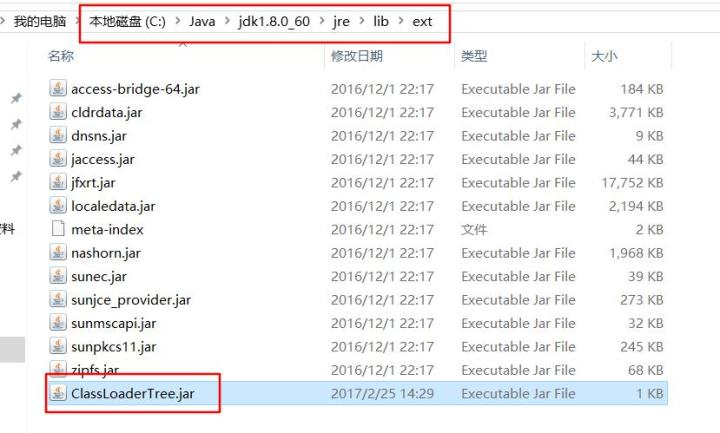

结果是：

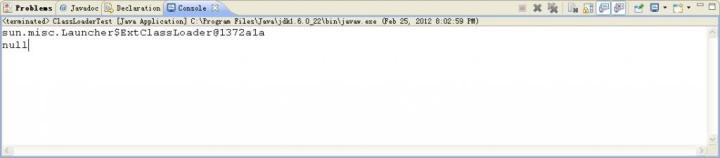

打印结果分析：为什么第一行的结果是ExtClassLoader呢？
> 因为 ClassLoader 的委托模型机制，当我们要用 ClassLoaderTest.class 这个类的时候，AppClassLoader 在试图加载之前，先委托给 Bootstrcp ClassLoader，Bootstracp ClassLoader 发现自己没找到，它就告诉 ExtClassLoader，兄弟，我这里没有这个类，你去加载看看，然后 Extension ClassLoader 拿着这个类去它指定的类路径（JAVA_HOME/jre/lib/ext）试图加载，唉，它发现在ClassLoaderTest.jar 这样一个文件中包含 ClassLoaderTest.class 这样的一个文件，然后它把找到的这个类加载到内存当中，并生成这个类的 Class 实例对象，最后把这个实例返回。所以 ClassLoaderTest.class 的类加载器是 ExtClassLoader。

第二行的结果为null，是因为ExtClassLoader的父类加载器是Bootstrap ClassLoader。
#### JVM加载class文件的两种方法
* 隐式加载， 程序在运行过程中当碰到通过new 等方式生成对象时，隐式调用类装载器加载对应的类到jvm中。
* 显式加载， 通过class.forname()、this.getClass.getClassLoader().loadClass()等方法显式加载需要的类，或者我们自己实现的 ClassLoader 的 findlass() 方法。

下面介绍下 class.forName的加载类方法：

Class.forName是一个静态方法，同样可以用来加载类。该方法有两种形式：

Class.forName(String name,boolean initialize, ClassLoader loader)和Class.forName(String className)。第一种形式的参数 name表示的是类的全名；initialize表示是否初始化类；loader表示加载时使用的类加载器。第二种形式则相当于设置了参数 initialize的值为 true，loader的值为当前类的类加载器。Class.forName的一个很常见的用法是在加载数据库驱动的时候。如Class.forName("org.apache.derby.jdbc.EmbeddedDriver")用来加载 Apache Derby 数据库的驱动。
#### 类加载的动态性体现
一个应用程序总是由n多个类组成，Java程序启动时，并不是一次把所有的类全部加载后再运行，它总是先把保证程序运行的基础类一次性加载到jvm中，其它类等到jvm用到的时候再加载，这样的好处是节省了内存的开销，因为java最早就是为嵌入式系统而设计的，内存宝贵，这是一种可以理解的机制，而用到时再加载这也是java动态性的一种体现。
### 如何加载 class 文件
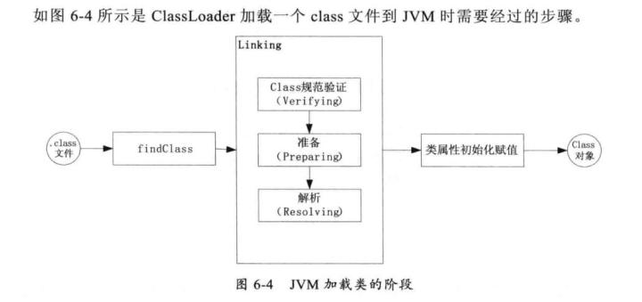

第一阶段找到 .class 文件并把这个文件包含的字节码加载到内存中。

第二阶段中分三步，字节码验证；class 类数据结构分析及相应的内存分配；最后的符号表的链接。

第三阶段是类中静态属性和初始化赋值，以及静态块的执行等。
#### 验证与分析
字节码验证，类装入器对于类的字节码要做很多检测，以确保格式正确，行为正确。

类装备，准备代表每个类中定义的字段、方法和实现接口所必须的数据结构。

解析，装入器装入类所引用的其他所有类。
### 常见加载类错误分析
#### ClassNotFoundExecption
ClassNotFoundExecption 异常是平常碰到的最多的。这个异常通常发生在显示加载类的时候。
```java
public class ClassNotFoundExceptionTest
{
    public static void main(String[] args) {
        try {
            Class.forName("NotFoundClass");
        }catch (ClassNotFoundException e){
            e.printStackTrace();
        }
    }
}
```
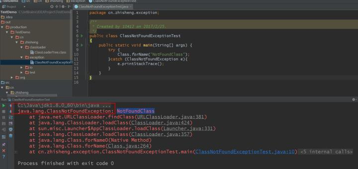

显示加载一个类通常有：

* 通过类 Class 中的 forName() 方法
* 通过类 ClassLoader 中的 loadClass() 方法
* 通过类 ClassLoader 中的 findSystemClass() 方法

出现这种错误其实就是当 JVM 要加载指定文件的字节码到内存时，并没有找到这个文件对应的字节码，也就是这个文件并不存在。解决方法就是检查在当前的 classpath 目录下有没有指定的文件。
#### NoClassDefFoundError
在JavaDoc中对NoClassDefFoundError的产生可能的情况就是使用new关键字、属性引用某个类、继承了某个接口或者类，以及方法的某个参数中引用了某个类，这时就会触发JVM或者类加载器实例尝试加载类型的定义，但是该定义却没有找到，影响了执行路径。换句话说，在编译时这个类是能够被找到的，但是在执行时却没有找到。

解决这个错误的方法就是确保每个类引用的类都在当前的classpath下面。
#### UnsatisfiedLinkError
该错误通常是在 JVM 启动的时候，如果 JVM 中的某个 lib 删除了，就有可能报这个错误。
```java
public class UnsatisfiedLinkErrorTest
{
    public native void nativeMethod();
    static {
        System.loadLibrary("NoLib");
    }
    public static void main(String[] args) {
        new UnsatisfiedLinkErrorTest().nativeMethod();  // 解析native标识的方法时JVM找不到对应的库文件
    }
}
```
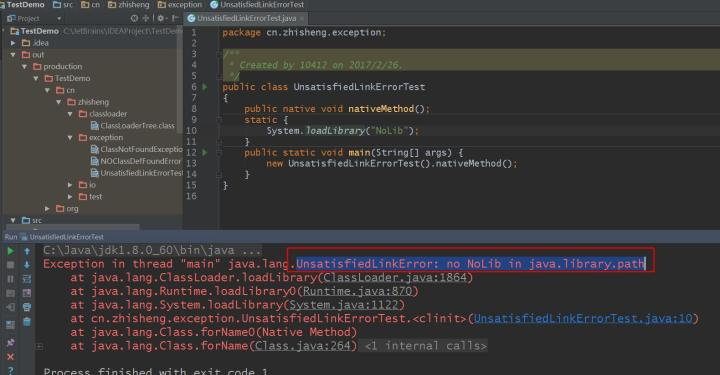
#### ClassCastException
该错误通常出现强制类型转换时出现这个错误。
```java
public class ClassCastExceptionTest
{
    public static Map m = new HashMap(){
        {
            put("a", "2");
        }
    };
    public static void main(String[] args) {
        Integer integer = (Integer) m.get("a"); // 将m强制转换成Integer类型
        System.out.println(integer);
    }
}
```
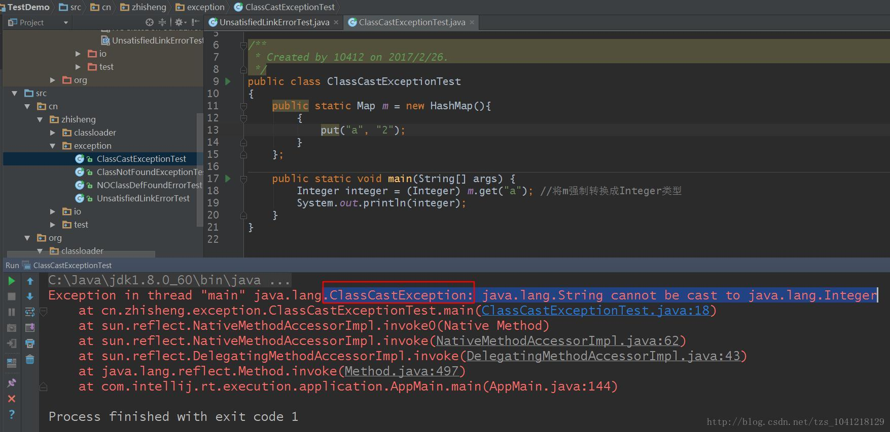

**注意**：JVM 在做类型转换时的规则：

* 对于普通对象，对象必须是目标类的实例或目标类的子类的实例。如果目标类是接口，那么会把它当作实现了该接口的一个子类。
* 对于数组类型，目标类必须是数组类型或 java.lang.Object、java.lang.Cloneable、java.io.Serializable。

如果不满足上面的规则，JVM 就会报错，有两种方式可避免错误：

* 在容器类型中显式的指明这个容器所包含的对象类型。
* 先通过 instanceof 检查是不是目标类型，然后再进行强制类型的转换。

上面代码中改成如下就可以避免错误了：

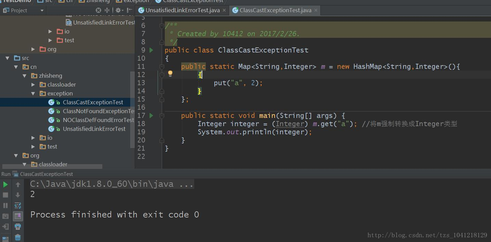
#### ExceptionInInitializerError
```java
public class ExceptionInInitializerErrorTest
{
    public static Map m = new HashMap(){{
        m.put("a", "2");
    }};
    public static void main(String[] args) {
        Integer integer = (Integer) m.get("a");
        System.out.println(integer);
    }
}
```
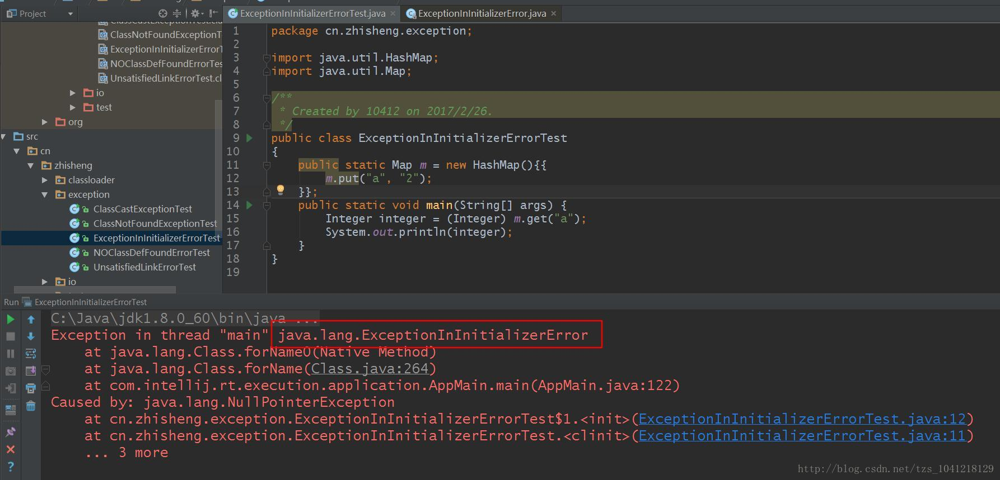

在初始化这个类时，给静态属性 m 赋值时出现了异常导致抛出错误 ExceptionInInitializerError。
#### NoSuchMethodError
NoSuchMethodError代表这个类型确实存在，但是一个不正确的版本被加载了。为了解决这个问题我们可以使用 `verbose:class` 来判断该JVM加载的到底是哪个版本。
#### LinkageError
有时候事情会变得更糟，和 ClassCastException 本质一样，加载自不同位置的相同类在同一段逻辑（比如：方法）中交互时，会出现 LinkageError 。

LinkageError 需要观察哪个类被不同的类加载器加载了，在哪个方法或者调用处发生（交汇）的，然后才能想解决方法，解决方法无外乎两种。第一，还是不同的类加载器加载，但是相互不再交汇影响，这里需要针对发生问题的地方做一些改动，比如更换实现方式，避免出现上述问题；第二，冲突的类需要由一个Parent类加载器进行加载。LinkageError 和ClassCastException 本质是一样的，加载自不同类加载器的类型，在同一个类的方法或者调用中出现，如果有转型操作那么就会抛 ClassCastException ，如果是直接的方法调用处的参数或者返回值解析，那么就会产生 LinkageError 。
### 如何实现自己的 ClassLoader
ClassLoader 能够完成的事情有以下情况：

* 在自定义路径下查找自定义的class类文件。
* 对我们自己要加载的类做特殊处理。
* 可以定义类的实现机制。

虽然在绝大多数情况下，系统默认提供的类加载器实现已经可以满足需求。但是在某些情况下，您还是需要为应用开发出自己的类加载器。比如您的应用通过网络来传输 Java 类的字节代码，为了保证安全性，这些字节代码经过了加密处理。这个时候您就需要自己的类加载器来从某个网络地址上读取加密后的字节代码，接着进行解密和验证，最后定义出要在 Java 虚拟机中运行的类来。

定义自已的类加载器分为两步：
> 1、继承java.lang.ClassLoader
> 
> 2、重写父类的findClass方法

#### 文件系统类加载器
加载存储在文件系统上的 Java 字节代码。
```java
public class FileSystemClassLoader extends ClassLoader
{
    private String rootDir;

    public FileSystemClassLoader(String rootDir){
        this.rootDir = rootDir;
    }

    protected Class<?> findClass(String name) throws ClassNotFoundException {
        byte[] classData = getClassData(name);
        if (classData == null){
            throw new ClassNotFoundException();
        }
        else {
            return defineClass(name, classData, 0, classData.length);
        }
    }

    private byte[] getClassData(String className) {
        String path = classNameToPath(className);
        try {
            InputStream ins = new FileInputStream(path);
            ByteArrayOutputStream baos = new ByteArrayOutputStream();
            int bufferSize = 4096;
            byte[] buffer = new byte[bufferSize];
            int bytesNumRead = 0;
            while ((bytesNumRead = ins.read(buffer)) != -1){
                baos.write(buffer, 0, bytesNumRead);
            }
            return baos.toByteArray();
        } catch (FileNotFoundException e) {
            e.printStackTrace();
        } catch (IOException e) {
            e.printStackTrace();
        }
        return null;
    }

    private String classNameToPath(String className) {
        return rootDir + File.separatorChar + className.replace('.', File.separatorChar) + ".class";
    }
}
```
类 FileSystemClassLoader继承自类java.lang.ClassLoader。java.lang.ClassLoader类的方法loadClass()封装了前面提到的代理模式的实现。该方法会首先调用 findLoadedClass()方法来检查该类是否已经被加载过；如果没有加载过的话，会调用父类加载器的loadClass()方法来尝试加载该类；如果父类加载器无法加载该类的话，就调用 findClass()方法来查找该类。因此，为了保证类加载器都正确实现代理模式，在开发自己的类加载器时，最好不要覆写 loadClass()方法，而是覆写findClass()方法。

类 FileSystemClassLoader的 findClass()方法首先根据类的全名在硬盘上查找类的字节代码文件（.class 文件），然后读取该文件内容，最后通过 defineClass()方法来把这些字节代码转换成 java.lang.Class类的实例。
#### 网络类加载器
一个网络类加载器来说明如何通过类加载器来实现组件的动态更新。即基本的场景是：Java 字节代码（.class）文件存放在服务器上，客户端通过网络的方式获取字节代码并执行。当有版本更新的时候，只需要替换掉服务器上保存的文件即可。通过类加载器可以比较简单的实现这种需求。

类 NetworkClassLoader 负责通过网络下载 Java 类字节代码并定义出 Java 类。它的实现与FileSystemClassLoader 类似。在通过 NetworkClassLoader 加载了某个版本的类之后，一般有两种做法来使用它。第一种做法是使用 Java 反射 API。另外一种做法是使用接口。需要注意的是，并不能直接在客户端代码中引用从服务器上下载的类，因为客户端代码的类加载器找不到这些类。使用 Java 反射 API 可以直接调用 Java 类的方法。而使用接口的做法则是把接口的类放在客户端中，从服务器上加载实现此接口的不同版本的类。在客户端通过相同的接口来使用这些实现类。
### 类加载器与Web容器
对于运行在 Java EE™容器中的 Web 应用来说，类加载器的实现方式与一般的 Java 应用有所不同。不同的 Web 容器的实现方式也会有所不同。以 Apache Tomcat 来说，每个Web 应用都有一个对应的类加载器实例。该类加载器也使用代理模式，所不同的是它是首先尝试去加载某个类，如果找不到再代理给父类加载器。这与一般类加载器的顺序是相反的。这是 Java Servlet 规范中的推荐做法，其目的是使得Web 应用自己的类的优先级高于 Web 容器提供的类。这种代理模式的一个例外是：Java 核心库的类是不在查找范围之内的。这也是为了保证 Java 核心库的类型安全。

绝大多数情况下，Web 应用的开发人员不需要考虑与类加载器相关的细节。下面给出几条简单的原则：

* 每个 Web 应用自己的 Java 类文件和使用的库的 jar 包，分别放在 WEB-INF/classes和 WEB-INF/lib目录下面。
* 多个应用共享的 Java 类文件和 jar 包，分别放在 Web 容器指定的由所有 Web 应用共享的目录下面。
* 当出现找不到类的错误时，检查当前类的类加载器和当前线程的上下文类加载器是否正确。
