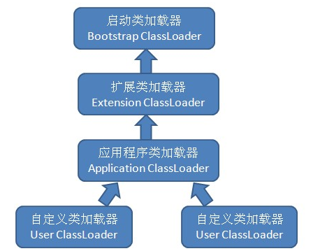
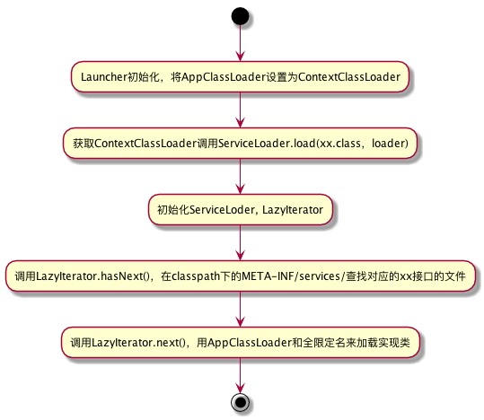

### 一、前言
以我们常见到的数据库驱动Driver为例，为什么要实现破坏双亲委派，下面一起来重温一下。
### 二、双亲委派
想要知道为什么要破坏双亲委派，就要先从什么是双亲委派说起，在此之前，我们先要了解一些概念：
> 对于任意一个类，都需要由加载它的类加载器和这个类本身来一同确立其在Java虚拟机中的唯一性。

什么意思呢？我们知道，判断一个类是否相同，通常用equals()方法，isInstance()方法和isAssignableFrom()方法。来判断，对于同一个类，如果没有采用相同的类加载器来加载，在调用的时候，会产生意想不到的结果：
```java
public class DifferentClassLoaderTest {

    public static void main(String[] args) throws Exception {
        ClassLoader classLoader = new ClassLoader() {
            @Override
            public Class<?> loadClass(String name) throws ClassNotFoundException {
                String fileName = name.substring(name.lastIndexOf(".") + 1) + ".class";
                InputStream stream = getClass().getResourceAsStream(fileName);
                if (stream == null) {
                    return super.loadClass(name);
                }
                try {
                    byte[] b = new byte[stream.available()];
                    // 将流写入字节数组b中
                    stream.read(b);
                    return defineClass(name, b, 0, b.length);
                } catch (IOException e) {
                    e.printStackTrace();
                }

                return super.loadClass(name);
            }
        };
        Object obj = classLoader.loadClass("jvm.DifferentClassLoaderTest").newInstance();
        System.out.println(obj.getClass());
        System.out.println(obj instanceof DifferentClassLoaderTest);

    }
}
```
输出结果：
```java
class jvm.DifferentClassLoaderTest
false
```
如果在通过classLoader实例化的使用，直接转化成DifferentClassLoaderTest对象：
```java
DifferentClassLoaderTest obj = (DifferentClassLoaderTest) classLoader.loadClass("jvm.DifferentClassLoaderTest").newInstance();
```
就会直接报`java.lang.ClassCastException:`，因为两者不属于同一类加载器加载，所以不能转化！
#### 2.1、为什么需要双亲委派
基于上述的问题：如果不是同一个类加载器加载，即时是相同的class文件，也会出现判断不想同的情况，从而引发一些意想不到的情况，为了保证相同的class文件，在使用的时候，是相同的对象，jvm设计的时候，采用了双亲委派的方式来加载类。
> 双亲委派：如果一个类加载器收到了加载某个类的请求,则该类加载器并不会去加载该类,而是把这个请求委派给父类加载器,每一个层次的类加载器都是如此,因此所有的类加载请求最终都会传送到顶端的启动类加载器;只有当父类加载器在其搜索范围内无法找到所需的类,并将该结果反馈给子类加载器,子类加载器会尝试去自己加载。

这里有几个流程要注意一下：

* 子类先委托父类加载
* 父类加载器有自己的加载范围，范围内没有找到，则不加载，并返回给子类
* 子类在收到父类无法加载的时候，才会自己去加载

jvm提供了三种系统加载器：

* 启动类加载器（Bootstrap ClassLoader）：C++实现，在java里无法获取，负责加载/lib下的类。
* 扩展类加载器（Extension ClassLoader）： Java实现，可以在java里获取，负责加载/lib/ext下的类。
* 系统类加载器/应用程序类加载器（Application ClassLoader）：是与我们接触对多的类加载器，我们写的代码默认就是由它来加载，ClassLoader.getSystemClassLoader返回的就是它。

附上三者的关系：


#### 2.2、双亲委派的实现
双亲委派的实现其实并不复杂，其实就是一个递归，我们一起来看一下`ClassLoader`里的代码：
```java
protected Class<?> loadClass(String name, boolean resolve)
    throws ClassNotFoundException
    {
        // 同步上锁
        synchronized (getClassLoadingLock(name)) {
            // 先查看这个类是不是已经加载过
            Class<?> c = findLoadedClass(name);
            if (c == null) {
                long t0 = System.nanoTime();
                try {
                    // 递归，双亲委派的实现，先获取父类加载器，不为空则交给父类加载器
                    if (parent != null) {
                        c = parent.loadClass(name, false);
                    // 前面提到，bootstrap classloader的类加载器为null，通过find方法来获得
                    } else {
                        c = findBootstrapClassOrNull(name);
                    }
                } catch (ClassNotFoundException e) {
                }

                if (c == null) {
                    // 如果还是没有获得该类，调用findClass找到类
                    long t1 = System.nanoTime();
                    c = findClass(name);

                    // jvm统计
                    sun.misc.PerfCounter.getParentDelegationTime().addTime(t1 - t0);
                    sun.misc.PerfCounter.getFindClassTime().addElapsedTimeFrom(t1);
                    sun.misc.PerfCounter.getFindClasses().increment();
                }
            }
            // 连接类
            if (resolve) {
                resolveClass(c);
            }
            return c;
        }
    }
```
### 三、破坏双亲委派
#### 3.1、为什么需要破坏双亲委派？
因为在某些情况下父类加载器需要委托子类加载器去加载class文件。受到加载范围的限制，父类加载器无法加载到需要的文件，以Driver接口为例，由于Driver接口定义在jdk当中的，而其实现由各个数据库的服务商来提供，比如mysql的就写了MySQL Connector，那么问题就来了，DriverManager（也由jdk提供）要加载各个实现了Driver接口的实现类，然后进行管理，但是DriverManager由启动类加载器加载，只能记载JAVA_HOME的lib下文件，而其实现是由服务商提供的，由系统类加载器加载，这个时候就需要启动类加载器来委托子类来加载Driver实现，从而破坏了双亲委派，这里仅仅是举了破坏双亲委派的其中一个情况。
#### 3.2、破坏双亲委派的实现
我们结合Driver来看一下在spi（Service Provider Inteface）中如何实现破坏双亲委派。

先从DriverManager开始看，平时我们通过DriverManager来获取数据库的Connection：
```java
String url = "jdbc:mysql://localhost:3306/testdb";
Connection conn = java.sql.DriverManager.getConnection(url, "root", "root"); 
```
在调用DriverManager的时候，会先初始化类，调用其中的静态块：
```java
static {
    loadInitialDrivers();
    println("JDBC DriverManager initialized");}

private static void loadInitialDrivers() {
    ...
        // 加载Driver的实现类
        AccessController.doPrivileged(new PrivilegedAction<Void>() {
            public Void run() {

                ServiceLoader<Driver> loadedDrivers = ServiceLoader.load(Driver.class);
                Iterator<Driver> driversIterator = loadedDrivers.iterator();
                try{
                    while(driversIterator.hasNext()) {
                        driversIterator.next();
                    }
                } catch(Throwable t) {
                }
                return null;
            }
        });
    ...
}
```
为了节约空间，笔者省略了一部分的代码，重点来看一下`ServiceLoader.load(Driver.class)`：
```java
public static <S> ServiceLoader<S> load(Class<S> service) {
    // 获取当前线程中的上下文类加载器
    ClassLoader cl = Thread.currentThread().getContextClassLoader();
    return ServiceLoader.load(service, cl);
}
```
可以看到，load方法调用获取了当前线程中的上下文类加载器，那么上下文类加载器放的是什么加载器呢？
```java
public Launcher() {
    ...
    try {
        this.loader = Launcher.AppClassLoader.getAppClassLoader(var1);
    } catch (IOException var9) {
        throw new InternalError("Could not create application class loader", var9);
    }
    Thread.currentThread().setContextClassLoader(this.loader);
    ...
}
```
在`sun.misc.Launcher`中，我们找到了答案，在Launcher初始化的时候，会获取AppClassLoader，然后将其设置为上下文类加载器，而这个AppClassLoader，就是之前上文提到的系统类加载器Application ClassLoader，所以上下文类加载器默认情况下就是系统加载器。

继续来看下`ServiceLoader.load(service, cl)`：
```java
public static <S> ServiceLoader<S> load(Class<S> service,
                                        ClassLoader loader){
    return new ServiceLoader<>(service, loader);}

private ServiceLoader(Class<S> svc, ClassLoader cl) {
    service = Objects.requireNonNull(svc, "Service interface cannot be null");
    // ClassLoader.getSystemClassLoader()返回的也是系统类加载器
    loader = (cl == null) ? ClassLoader.getSystemClassLoader() : cl;
    acc = (System.getSecurityManager() != null) ? AccessController.getContext() : null;
    reload();
}

public void reload() {
    providers.clear();
    lookupIterator = new LazyIterator(service, loader);
}
```
上面这段就不解释了，比较简单，然后就是看LazyIterator迭代器：
```java
private class LazyIterator implements Iterator<S>{
    // ServiceLoader的iterator()方法最后调用的是这个迭代器里的next
    public S next() {
        if (acc == null) {
            return nextService();
        } else {
            PrivilegedAction<S> action = new PrivilegedAction<S>() {
                public S run() { return nextService(); }
            };
            return AccessController.doPrivileged(action, acc);
        }
    }
    
    private S nextService() {
        if (!hasNextService())
            throw new NoSuchElementException();
        String cn = nextName;
        nextName = null;
        Class<?> c = null;
        // 根据名字来加载类
        try {
            c = Class.forName(cn, false, loader);
        } catch (ClassNotFoundException x) {
            fail(service,
                 "Provider " + cn + " not found");
        }
        if (!service.isAssignableFrom(c)) {
            fail(service,
                 "Provider " + cn  + " not a subtype");
        }
        try {
            S p = service.cast(c.newInstance());
            providers.put(cn, p);
            return p;
        } catch (Throwable x) {
            fail(service,
                 "Provider " + cn + " could not be instantiated",
                 x);
        }
        throw new Error();          // This cannot happen
    }
    
    public boolean hasNext() {
        if (acc == null) {
            return hasNextService();
        } else {
            PrivilegedAction<Boolean> action = new PrivilegedAction<Boolean>() {
                public Boolean run() { return hasNextService(); }
            };
            return AccessController.doPrivileged(action, acc);
        }
    }
    
    
    private boolean hasNextService() {
        if (nextName != null) {
            return true;
        }
        if (configs == null) {
            try {
                // 在classpath下查找META-INF/services/java.sql.Driver名字的文件夹
                // private static final String PREFIX = "META-INF/services/";
                String fullName = PREFIX + service.getName();
                if (loader == null)
                    configs = ClassLoader.getSystemResources(fullName);
                else
                    configs = loader.getResources(fullName);
            } catch (IOException x) {
                fail(service, "Error locating configuration files", x);
            }
        }
        while ((pending == null) || !pending.hasNext()) {
            if (!configs.hasMoreElements()) {
                return false;
            }
            pending = parse(service, configs.nextElement());
        }
        nextName = pending.next();
        return true;
    }

}
```
好了，这里基本就差不多完成整个流程了，一起走一遍：


