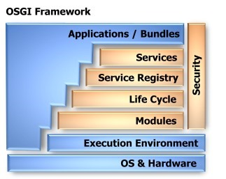
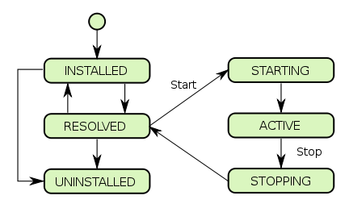
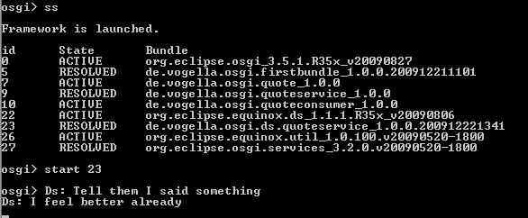
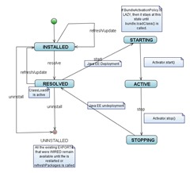
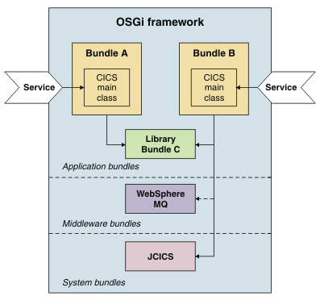
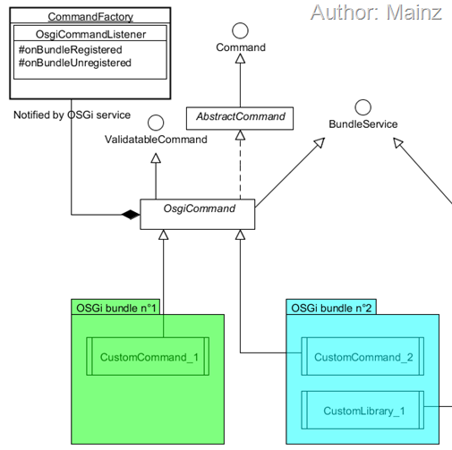
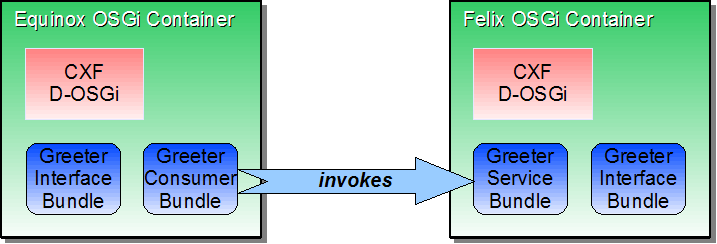
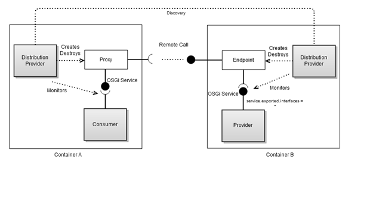
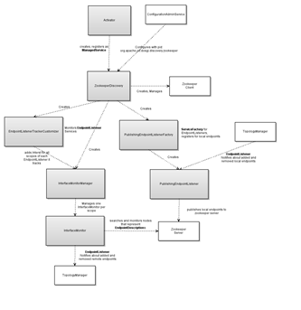

OSGi模块化框架是很早就出来的一个插件化框架，最早Eclipse用它而出名，但这些年也没有大热虽然OSGi已经发布了版本1到版本5。现在用的最多的，也是本文讲述基于的是Equinox的OSGi实现，同时也是Eclipse核心，Spring Dynamic Module也是基于Equinox。OSGi框架为java系统提供了一个通用的容器，该系统中的 bundle，无需停止系统，即可实现 bundle 的安装、卸载。OSGi是Java中目前唯一的一个模块化、动态化的规范。在模块化方面OSGi联盟已经研究了很多年了，因此OSGi规范对于模块的物理隔离、模块的交互、多版本这些方面都有了非常完善的机制，并且也得到了现在几乎所有的App Server厂商或开源社区的认可。OSGi的突出特点有：

* 可以动态加载、更新和卸载模块而不用停止服务
* 实现系统的模块化、版本化，允许多版本bundule同时服务
* Service model允许模块/插件相互依赖但松耦合，分享服务更简单

OSGi运行在JVM之上，其架构图如下图所示：


#### OSGi适用场景
很多人错误的使用了OSGi, 套用了OSGi架构把系统复杂化。在我看来，OSGi的用处在于“模块化”和“热插拔”。模块化包括模块化、版本化和面向服务的设计。热插拔也就是说模块/bundle的热插拔，它可以实现更新和升级模块/bundle（即系统的一部分）而无需重启整个系统。

如果你的系统套用了OSGi架构，bundle的相互依赖关系复杂，又没有bundle动态加载、动态更新、动态卸载和动态监听的机制，都是静态启动所有bundle，那就是为了OSGi架构而OSGi架构，把问题复杂化了。其代价也是很大的，因为原来你的jar包用maven来处理依赖关系和自动更新也很方便，而由于整个系统建立在OSGi规范上，你的应用所依赖的其他组件也“不得不”迁移到OSGI上来，再加上OSGI独特的ClassLoader设计，使bundle间的类互相访问受到一定的约束，一切都需要迁移到OSGi的约束上来。

举个例子来说，就像Eclipse提供了动态加载、更新和删除插件的机制，因为它里面有一个插件注册和反注册的接口和插件加载、更新和删除的监听线程，这样允许你动态加载、更新和删除Eclipse插件而无需重启Eclipse。当然，如果你当前进程调用了某插件，比如js语法高亮，而某插件更新了，那么当前的js实例还是需要重新打开的。但整个Eclispe无需重启。
#### Java模块化的难点
OSGi的一个重要特性就是模块化，OSGi提供了一套模块化的体系，这其中则会有明确的模块之间接口暴露以及依赖的定义，因此能够更好的实现高内聚和低耦合。那么，Java模块化难点在哪？模块的实现和传统的编程方法确实有一些差别，主要体现在模块之间类访问的隔离、版本选择这两个方面。如希望更好的设计模块化的系统，开发者需要掌握ClassLoader机制、模块之间类的交互方法（这包括了模块怎么样对外提供可访问的package、怎么样访问其他模块提供的package、如何选择适合版本的package等）。如果不懂以上这些，贸然套用OSGi框架会误入歧途。
#### 重要概念：Bundle
Bundle — A bundle is a JAR file with special OSGi entries in its manifest and containing classes, resources, and other JARs。Bundle，可以将其理解为自描述的 JAR 文件。Bundle在OSGi中是部署的最小单位，因此，可以把它理解为模块。在 bundle 的 manifest 文件中，会有对本 bundle 的标识、提供的功能 (Export-package) 及依赖性 (Import-Package/Require-Bundle) 的定义。每个 bundle 在运行时自己的类加载器 (Class Loader)，这样可以做到一方面把不同的 bundle 里面的类区别开来，当 bundle 被卸载时，只有这个 bundle 的类加载器中的信息会丢失；另一方面，可以在自己的 bundle 内部充分利用 Java 的成员访问控制机制。

Bundle通过MANIFEST.MF进行自描述，下面是一个例子：
```mf
Manifest-Version: 1.0
Bundle-ManifestVersion: 2
Bundle-Name: Popup Plug-in
Bundle-SymbolicName: com.example.myosgi; singleton:=true
Bundle-Version: 1.0.0
Bundle-Activator: com.example.myosgi.Activator
Require-Bundle: org.eclipse.ui,
 org.eclipse.core.runtime
Bundle-ActivationPolicy: lazy
Bundle-RequiredExecutionEnvironment: JavaSE-1.6
```
#### Bundle类隔离机制
每个Bundle均为独立的ClassLoader，是java动态化实现的基础。默认情况下有Boostrap classLoader (jre/lib/classes)、Extension classloader (jre/lib/ext)、 System classloader (classpath指定)，应用可以自行实现classloader及动态的加载类，或加载特定目录下的类。
#### Bundle的生命周期
Lifecycle — A lifecycle is the sequence of states a bundle goes through: uninstalled, installed, resolved, starting, stopping, active. 生命周期图如下所示：



要注意的是：bundle状态变为Resolved并不表示能提供服务，所以启动所有的bundle不表示类都已经加载到内存了。Resolve bundle做以下的几件事情：寻找bundle依赖的包是否存在以及被resolve，寻找匹配的import package，required bundle，如寻找则进入检查，检查没有冲突就形成绑定关系，以便加载类的时候能直接加载（但仅仅Resolved，不代表类被加载了）。如果你的BundleActivationPolicy是LAZY惰性加载，bundle.loadClass()调用才会到达Active状态。如果你的bundle的MANIFEST.MF中配置的Bundle-activator存在，那就调用其start方法，从starting进入active状态。
```bash
osgi> ss
  "Framework is launched."
  id      State       Bundle
  15      STARTING    com.example.serviceconsumer_1.0.0.X
  16      RESOLVED    com.example.serviceprovider_1.0.0.X
```


下面的图更详细的解释了这一点：


#### OSGi Service
Service — A service is an object instance exposed under the one or more interfaces that it implements and a map of properties. 简单来说，Service model允许每个bundle对外分享一组服务，其它的bundle都可以调用这些接口的服务。这也就是OSGi bundle之间调用的方式。Service可以用来：

* Export functionality from a bundle to other bundles
* Import functionality from other bundles
* Register listeners for events from other bundles
* Expose external devices, such as UPnP devices or even hardware, to other OSGi bundles. See the Device and UPnP APIs
* Expose java code running in OSGI to an external network, e.g. via the UPnP or SOAP protocols.
* Bundle configuration, using the Configuration Manager

实际做法来看，通常会把接口和实现分开。接口放到一个bundle里面。实现（service)放到另外一个bundle里面，类似下面的图示中，bundle A和B是Service，其interface放到Bundle C：



也可以是提供一个jar包，里面定义了扩展接口，然后规定新的扩展bundle必须实现该jar包里面定义的interface。实现示意图如下所示（OsgiCommand接口定义在扩展点jar包里面，新的bundle必须包含）：



Bundle的Service之间交换方式和注册方式：

* 通过bundleContext.registerService注册服务，然后通过bundleContext.getServiceReference获取服务（不推荐）
* 使用监听器 listeners ,ServiceListener 和ServiceTracker 提供bundle和service的动态监听，ServiceTracker可以动态监听未来的bundle和service（OSGi Release 2提供的ServiceTracker ，一般推荐）
* 通过Declarative Service (OSGi DS，或者Spring Dynamic Module (DM))的方式（OSGi Release 4开始，重点推荐！）

第二种通过ServiceTracker 来查询或侦听服务注册和注销的例子代码:
```java
package com.ibm.osg.example.mygetservice;
 
import org.osgi.framework.BundleActivator;
import org.osgi.framework.BundleContext;
import org.osgi.util.tracker.ServiceTracker;
import com.ibm.osg.example.mtservice.MyTestService;
 
public class MyBundleActivator
       implements BundleActivator, Runnable
{
      private boolean done=false;
      private ServiceTracker testServiceTracker;
 
      // Bundle Activator Start Method
      public void start(BundleContext context)
      {
         /* Here we initialize and open our ServiceTracker.
            It will track any service registering under
            the "com.ibm.osg.example.mtservice.MyTestService"
            interface.
         */
 
       testServiceTracker =
          new ServiceTracker(context,
                        "com.ibm.osg.example.mtservice.MyTestService",
                        null);
       testServiceTracker.open();
 
       // Here we start a thread that will continue
       // to use our service until
       // the bundle is stopped.
 
       Thread t = new Thread(this);
       t.setName("mygetservice thread");
       t.start();
 
     }
    /*Bundle Activator Stop Method -- here we stop
    the thread and close the
    ServiceTracker*/
 
    public void stop(BundleContext context)
    {
           done=true;
           testServiceTracker.close();
    }
    //Here is a method that uses the service
    //we are tracking.  First we get
    //the service
    //from the tracker, then we call its printMessage
    //method.
 
    public void useService(String message){
           MyTestService testService = (MyTestService)
                         testServiceTracker.getService();
 
       if( testService != null )
       {
             // If the service is available then use it.
                testService.printMessage(message);
       }
       else{
             // If the service is not available then perform an acceptable action.
             // Here we just print the message to standard out and indicate the service
             // was not available.
             System.out.println("No MyTestService available - " + message);
       }
    }
 
    // Simply continues to use the test service
    // every second until the done flag is set.
    public void run(){
       int i = 0;
       done = false;
       while (!done) {
          useService("message from test " + i++);
          try{
                     Thread.sleep(1000);
          }
                 catch( InterruptedException ie ){
          }
       }
     }
}
```
#### OSGi动态加载删除bundle

* 使用监听器 listeners 
ServiceListener 和ServiceTracker 提供bundle和service的动态监听，ServiceTracker可以动态监听未来的bundle和service（OSGi Release 2提供的ServiceTracker ，一般推荐）

* 通过Declarative Service (OSGi DS，或者Spring Dynamic Module (DM))的方式（OSGi Release 4开始，重点推荐！）

具体实现：
> 对于DS，<Define a declarative OSGi Service>, <IBM: Declaring your services to OSGi Declarative Services>，<java OSGI Declarative Services Component bundles Example>。
> 
> 对于Spring DM，<OSGI and Spring Dynamic Modules – Simple Hello World>, <Hello, OSGi, Part 2: Introduction to Spring Dynamic Modules>

#### 分布式OSGi（Distributed OSGi）
OSGi容器可以包含几千个bundlue没有问题，但如何应对几十万个的情况？如何像EJB3一样具有分布式部署和便携性呢？有一个OSGi的子项目:分布式OSGi（Distributed OSGi）。



上图是一个demo演示，两个分布式OSGi Container，都部署了Greeter接口bundle，都基于分布式OSGi实现，能实现分布式调用OSGi Service。分布式OSGi（Distributed OSGi）还可以与RESTful Service (JAX-RS / JSR-339)整合。分布式OSGi有几十万个bundle怎么管理，这是个麻烦，而且如何启动停止，启动顺序怎么样？可管理性是个麻烦，ACE项目试图解决这个事情。

DOSGi的原理（由Distribution provider来给OSGi Service创建Endpoint，使这些Service在OSGi Container外部可访问，另外一端则创建代理；此外，有监听器来侦听OSGi Service的创建和启停等）：


#### 分布式OSGi与ZooKeeper
ZooKeeper是Hadoop的一个子项目，它是一个针对大型分布式系统的可靠协调系统，提供的功能包括：配置维护、名字服务、分布式同步、组服务等。ZooKeeper的目标就是封装好复杂易出错的关键服务，将简单易用的接口和性能高效、功能稳定的系统提供给用户。

分布式OSGi（Distributed OSGi）在Discovery这一块使用了ZooKeeper。所谓Discovery模块就是用来发现和侦听分布式的远端的可用的Endpoints。Discovery Ditributed with Zookeeper的架构图：


