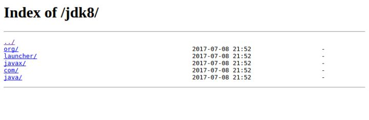
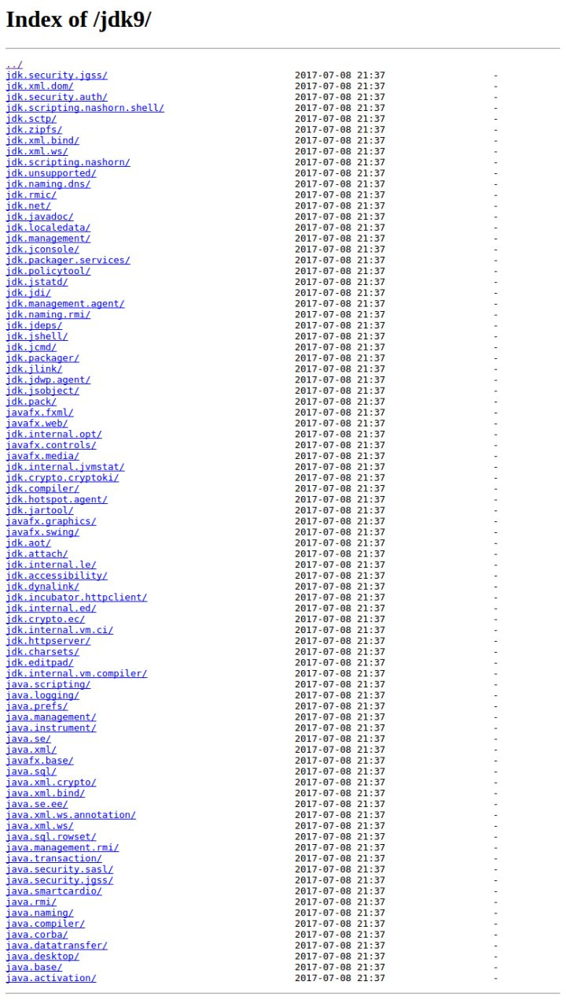
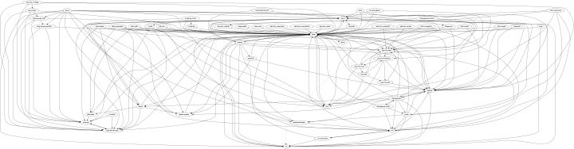
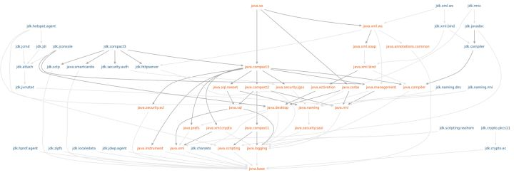
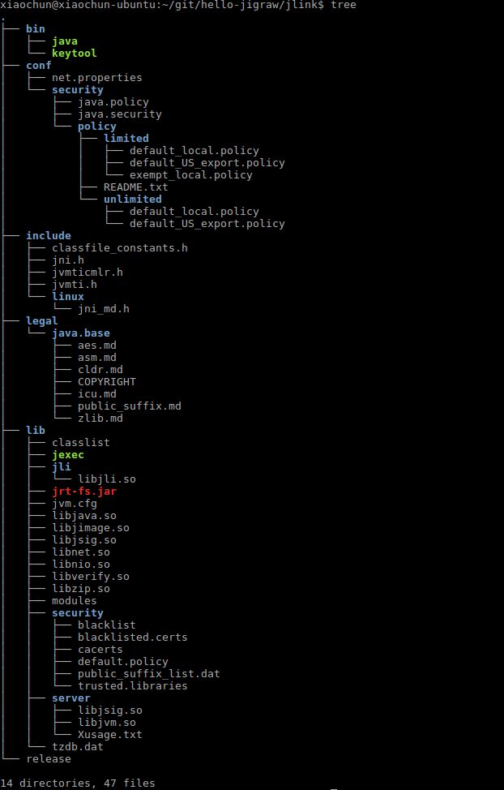

### Java9中的jigsaw




上面2个图分别对应的分别是JDK8/9的目录下的 src.zip 文件，从图片上看上 Java9 的目录都发生变化了，从以前的一个 java 里面就拆除了好几个模块，比如 java.logging, java.desktop, java.se 等，当然也把之前存放在 tool.jar 里面的合并到了 jdk.* 的模块里面。而替化 rt.jar,tools.jar ，是 JDK9/jmods 文件下 *.jmod 文件

这样带来的好处在于，开发 javafx 就不用关心 java.se.ee 里面的内容。同时也让代码内部的依赖变得更加清新

模块化之前，包与包之间的依赖：



模块与模块之间的依赖：



Java9由于提供了模块化，使得对 package 的控制更精细了，这与 maven 的通过依赖不同之处，在于 maven 使用了dependency 进行管理依赖，而 jigsaw 使用 requiure 进行管理依赖，通过 export，可以只暴露某个模块下指定的包给调用者。
### Quick Start
编写模块化的代码和没有模块化的代码区别并不大，java9 通过根目录下的 module-info.java 文件进行区分。
```bash
src
└── main
└── java
├── com
│ └── fzb
│ └── jigsaw
│ └── Hello.java
└── module-info.java
```
`cat src/main/java/com/fzb/jigsaw/Hello.java`
```java
package com.fzb.jigsaw;

public class Hello {

    public static void main(String[] args) {
         System.out.println("Cool, Java9 Jigsaw!");
    }
}
```
`cat cat src/main/java/module-info.java`
```java
module hello.jigsaw {
   exports com.fzb.jigsaw;
}
```
和没有模块化的代码一样的也是使用 javac 进行编译，java 执行
```bash
#!/usr/bin/env bash
rm -rf mods
mkdir mods
javac -d mods/hello.jigsaw src/main/java/module-info.java src/main/java/com/fzb/jigsaw/Hello.java
```
`java --module-path mods -m hello.jigsaw/com.fzb.jigsaw.Hello`

输出
```bash
Cool, Java9 Jigsaw!
```
其实到这里还是不太清楚又和之前的区别，java8 使用 --classpath，而模块化后使用的 --module-path，关键在于如果把这些文件打包成为独立的模块(.jmod文件)，便于其它模块调用。在 java9 以前库的单元是 jar 文件，但是 java9 后，jmod 可能会取代 jar 。
#### jmod

* 创建jmod jmod create --class-path=mods/hello.jigsaw/ hello.jigsaw.jmod
* 查看jmod jmod list hello.jigsaw.jmod
#### jlink
jlink 是一个比较强大的命令，可以将指定的 .jmod 文件解压到指定目录，这个文件夹包含了运行时需要的所有文件，比如以后下载一个 jmerer 可能教程里面第一步不再会写如何安装JDK/JRE了，而是下载对应平台的 .zip 文件，解压，运行对应的 .sh/.bat 文件了。
`jlink --module-path $JAVA_HOME/jmods/:mlib/ --add-modules hello.jigsaw --output jlink`



整个文件夹并不大，仅导入 java.base ，才45m，通过压缩后为zip文件后大小才16m。当然和C/C++这里直接编译为计算机码差别还是比较的大。但是 java.base 包里面的能做事，这一点体量还是可以接受的。
`bin/java com.fzb.jigsaw.Hello`

输出
`Cool, Java9 Jigsaw!`
