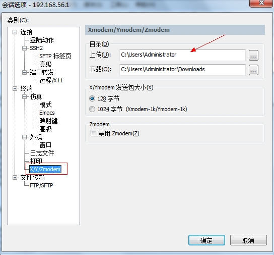
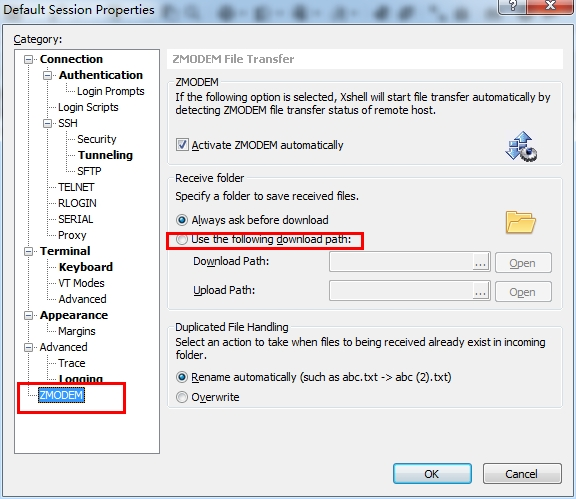
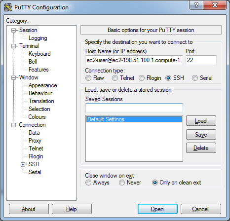

### SSH 远程登录
#### 什么是SSH
SSH(Secure Shell) 是一种加密的网络传输协议，可在不安全的网络中为网络服务提供安全的传输环境。SSH 通过在网络中创建安全隧道来实现 SSH 客户端与服务器之间的连接。其最常见的用途是远程登录系统，来传输命令行界面和远程执行命令。
#### 远程登录
```shell
# 只需要指定用户名和主机名参数即可. 主机名可以是 IP 地址或者域名 
ssh user@hostname 
# SSH 默认连接到目标主机的 22 端口上，但是由于各种原因你可能需要连接到其他端口 
ssh -p 10022 user@hostname
```
很多情况下我们需要登录到远程 Linux 服务器，并且会运行`cd`命令切到指定目录，而这些指令在登录时就可以进行远端操作:
```shell
# 登录并切换到 /data/www/h5 目录 
# -t 用于强制分配伪终端 
ssh -t user@hostname 'cd /data/www/h5 ; bash' 
# or 
ssh -t user@hostname 'cd /data/www/h5 && bash' 
# bash 是远端服务器默认的 shell，若不清楚是哪个的话 可以用 $SHELL 
ssh -t user@hostname 'cd /data/www/h5 ; exec $SHELL'
```
为了简便，我们也可以直接在远端服务器编辑 .bash_profile 文件，添加如下命令并执 ` source ~/.bash_profile`:
```shell
# ~/.bash_profile
cd /data/www/h5 >& /dev/null
```
之后通过 ssh 直接登录时，都会执行此处的命令并直接切换到对应的路径下。
#### 身份认证
ssh 以非对称加密实现身份验证。身份验证有以下两种途径:

* **密码登录** - 使用自动生成的公钥-私钥对来简单地加密网络连接，随后使用密码认证进行登录
* **公钥登录** - 人工生成一对公钥和私钥，通过生成的密钥进行认证，这样就可以在不输入密码的情况下登录。任何人都可以自行生成密钥。公钥需要放在待访问的计算机之中，而对应的私钥需要由用户自行保管。认证过程基于生成出来的私钥，但整个认证过程中私钥本身不会传输到网络中。

要使用公钥登录的话，先用 `ssh-keygen` 命令自动生成一个，运行结束以后，在 `$HOME/.ssh/ `目录下，会新生成两个文件：`id_rsa.pub(公钥)` 和 `id_rsa(私钥)`:
```shell
[~] ssh-keygen
Generating public/private rsa key pair.
Enter file in which to save the key (/Users/tate/.ssh/id_rsa):
Enter passphrase (empty for no passphrase):
Enter same passphrase again:
Your identification has been saved in /Users/tate/.ssh/id_rsa.
Your public key has been saved in /Users/tate/.ssh/id_rsa.pub.
The key fingerprint is:
SHA256:ncCmFR0oIZLn0FKJgK1TSOFhOoyIaWXgCqd93VdIMxw tate@Tate-de-MacBook-Pro-15.local
The key's randomart image is:
+---[RSA 2048]----+
|+X+Bo....+Eo     |
|%.@.+....oo+     |
|OB.=   .= . .    |
|*=  .. = o o     |
|o.. . o S +      |
|   .     .       |
|                 |
|                 |
|                 |
+----[SHA256]-----+
```
随后用 `ssh-copy-id` 命令将公钥传送到远端服务器，这里需要输入一次密码进行验证。完成之后，从此登录不再需要密码认证了:
```shell
ssh-copy-id user@host

# Number of key(s) added:        1
# Now try logging into the machine, with:   "ssh 'user@host'"
# and check to make sure that only the key(s) you wanted were added.
```
### 上传下载
利用 SSH 管理远程 Linux 服务器时，经常需要与本地交互文件。当然，我们可以利用 FTP 方式，比如通过 Filezilla 客户端软件，或者直接通过 mount 命令去挂载。不过直接使用 SSH 软件(SecureCRT、Xshell)自带的上传和下载功能无疑使最方便快捷的。通常 SSH 软件支持的文件传输协议主要有 ASCII、Xmodem、Zmodem 等。
#### rz / sz
rz(接收)、sz(发送) 是 Linux/Unix 同 Windows 进行 ZModem 文件传输的命令行工具。首先需要在服务器端安装 lszrz 包。其次，windows 端需要支持 ZModem 的 telnet/ssh 客户端，比如 SecureCRT、Xshell 等，PuTTY 暂时不支持。
> linux 间传递文件的命令可以用 scp

```shell
# For CentOS/RHEL
yum -y install lrzsz
# For Ubuntu
# sudo apt-get install lrzsz
```
运行命令 rz 即可，此时会弹出文件选择对话框，文件就会上传到服务器当前目录。运行命令 `sz filename` 则是将文件到 Windows 上，保存的目录可以在客户端配置。
```shell
# 上传
rz
# 下载
sz filename
```
### SSH客户端
SSH 客户端有很多，这里只介绍一些常用的
#### SecureCRT
SecureCRT 是一个基于图形用户界面的 Telnet 客户端和虚拟终端。这里只介绍下配置上传下载的路径


#### Xshell
Xshell 本身用的不多，这里同样贴一下配置上传下载的路径:


#### PuTTY
虽然 PuTTY[‘pʌti] 不支持 Zmodem 协议进行传输文件，但由于用的比较多， 这里还是介绍一下，毕竟免费且”短小精悍”。


