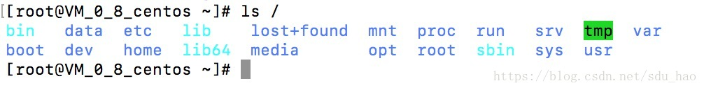
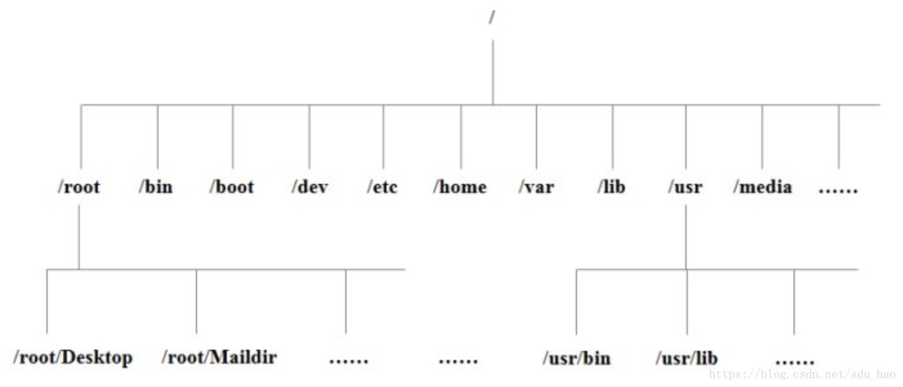

### 一、查看Linux下的目录
登录linux服务器，在终端输入 ls /命令,你会看到下图：

树状目录结构：

### 二、Linux目录的解释

| 目录 | 解释 |
| --- | --- |
| /bin | bin是Binary的缩写，这个目录存放着最经常使用的命令 |
| /boot | 存放启动Linux时使用的一些核心文件，包括一些连接文件以及镜像文件 |
| /dev | dev是Device(设备)的缩写，存放Linux的外部设备，在Linux中访问设备的方式和访问文件的方式是相同的 |
| /etc | 存放所有的系统管理所需要的配置文件和子目录 |
| /home | 用户主目录，在Linux中，每个用户都有一个自己的目录，一般该目录名是以用户的账号命名的 |
| /lib | 存放着系统最基本的动态连接共享库，其作用类似于Windows中的DLL文件。几乎所有的应用程序都需要用到这些共享库 |
| /lost-found | 一般情况下为空，当系统非法关机后，这里就存放了一些文件 |
| /media | Linux系统会自动识别一些设备，例如U盘、光驱等，识别后，Linux会把识别的设备挂载到这个目录下 |
| /mnt | 系统提供该目录是为了让用户临时挂载别的文件系统的，我们可以把光驱挂载到/mnt上，然后进入该目录就可以查看光驱中的内容了 |
| /opt | 主机额外安装的软件摆放的目录。比如你安装一个ORACLE数据库则就可以放在这个目录下。默认为空 |
| /proc | 该目录是一个虚拟的目录，他是系统内存的映射，我们可以通过直接访问这个目录来获取系统信息。这个目录的内容不在硬盘上而是在内存里，我们也可以直接修改里面的某些文件，比如可以通过下面的命令来屏蔽主机的ping命令，使别人无法ping你的机器：echo 1 > /proc/sys/net/ipv4/icmp_echo_ignore_all |
| /root | 该目录为系统管理员，也称为超级权限者的用户主目录 |
| /sbin | s是Super User的意思，这里存放的是系统管理员使用的系统管理程序 |
| /selinux | 该目录是Redhat/CentOS所特有的目录，Selinux是一个安全机制，类似于Windows的防火墙，但是这套机制不叫复杂，这个目录就是存放selinux相关的文件的 |
| /srv | 该目录存放一些服务启动之后需要提取的数据 |
| /sys | 这是linux2.6内核的一个很大的变化。该目录下安装了2.6内核中新出现的一个文件系统sysfs。sysfs文件系统集成了下面3种文件系统的信息：针对进程信息的proc文件系统、针对设备的devfs文件系统以及针对伪终端的devpts文件系统。该文件系统是内核设备树的一个直观反映，当一个内核对象被创建的时候，对应的文件和目录也在内核对象子系统中被创建 |
| /tmp | 该目录用来存放一些临时文件的 |
| /usr | 这是一个非常重要的目录，用户的很多应用程序和文件都放在该目录下，类似于windows下的program files目录 |
| /usr/bin | 系统用户使用的应用程序 |
| /usr/sbin | 超级用户使用的比较高级的管理程序和系统守护程序 |
| /usr/src | 内核源代码默认的放置目录 |
| /var | 该目录存放着在不断扩充着的东西，我们习惯将那些经常被修改的目录放在这个目录下。包括各种日志文件 |
| /run | 是一个临时文件系统，存储系统启动以来的信息。当系统重启时，该目录下的文件应该被删除。如果你的系统上有/var/run目录，应该让它指向run |

### 三、Linux中的重要目录
在Linux系统中，有几个目录比较重要，平时需要注意不要误删除或者随意更改内部文件。

* **/etc**：之前有提到，这个是系统中的配置文件，如果你更改了该目录下的某个文件可能会导致系统不能启动。
* **/bin，/sbin，/usr/bin，/usr/sbin**：这是系统预设的执行文件的放置目录，比如ls就是在/bin/ls目录下。值得提出的是，/bin，/usr/bin是给系统用户使用的指令(除root外的通用户),而/sbin，/usr/sbin则是给root使用的指令。
* **/var**：这是一个非常重要的目录，系统上跑了很多程序，那么每个程序都会有相应的日志产生，而这些日志就被记录到这个目录下，具体在/var/log目录下，另外mail的预设放置也是在这里。

### 四、总结
在Linux或Unix系统中，所有文件和目录都被组织成以一个根节点开始的倒置的树状结构。

文件系统的最顶层是由根目录开始的，系统使用/来表示根目录。在根目录之下的既可以是目录，也可以是文件，而每一个目录中又可以包含子目录或文件。如此重复就可以构成一个庞大的文件系统。

在Linux文件系统中有两个特殊的目录，一个是用户所在的工作目录也叫当前目录，可以使用一个.来表示；另一个是当前目录的上一级目录，也叫父目录，可以使用两个点..来表示。

* .代表当前目录，也可以用./来表示
* ..代表上一层目录，也可以用../来表示

如果一个目录或文件名以一个点.开始，表示这个目录或文件是一个隐藏目录或文件。如：.bashrc。即以默认方式查找时，不显示该目录或文件。
