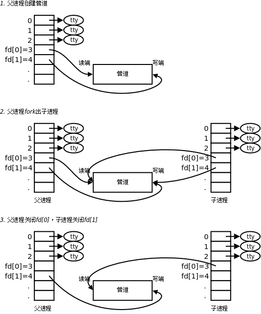

### 管道
#### 管道的概念：
管道是一种最基本的IPC机制，作用于有血缘关系的进程之间，完成数据传递。调用pipe系统函数即可创建一个管道。有如下特质：

1. 其本质是一个伪文件(实为内核缓冲区)

2. 由两个文件描述符引用，一个表示读端，一个表示写端。

3. 规定数据从管道的写端流入管道，从读端流出。

规定数据从管道的写端流入管道，从读端流出。

管道的局限性：

① 数据自己读不能自己写。

② 数据一旦被读走，便不在管道中存在，不可反复读取。

③ 由于管道采用半双工通信方式。因此，数据只能在一个方向上流动。

④ 只能在有公共祖先的进程间使用管道。

常见的通信方式有，单工通信、半双工通信、全双工通信。
#### pipe函数
创建管道
` int pipe(int pipefd[2]); 成功：0；失败：-1，设置errno`

函数调用成功返回r/w两个文件描述符。无需open，但需手动close。规定：fd[0] → r； fd[1] → w，就像0对应标准输入，1对应标准输出一样。向管道文件读写数据其实是在读写内核缓冲区。

管道创建成功以后，创建该管道的进程（父进程）同时掌握着管道的读端和写端。如何实现父子进程间通信呢？通常可以采用如下步骤：

1. 父进程调用pipe函数创建管道，得到两个文件描述符fd[0]、fd[1]指向管道的读端和写端。

2. 父进程调用fork创建子进程，那么子进程也有两个文件描述符指向同一管道。

3. 父进程关闭管道读端，子进程关闭管道写端。父进程可以向管道中写入数据，子进程将管道中的数据读出。由于管道是利用环形队列实现的，数据从写端流入管道，从读端流出，这样就实现了进程间通信。

### 管道的读写行为
使用管道需要注意以下4种特殊情况（假设都是阻塞I/O操作，没有设置O_NONBLOCK标志）：

1. 如果所有指向管道写端的文件描述符都关闭了（管道写端引用计数为0），而仍然有进程从管道的读端读数据，那么管道中剩余的数据都被读取后，再次read会返回0，就像读到文件末尾一样。

2. 如果有指向管道写端的文件描述符没关闭（管道写端引用计数大于0），而持有管道写端的进程也没有向管道中写数据，这时有进程从管道读端读数据，那么管道中剩余的数据都被读取后，再次read会阻塞，直到管道中有数据可读了才读取数据并返回。

3. 如果所有指向管道读端的文件描述符都关闭了（管道读端引用计数为0），这时有进程向管道的写端write，那么该进程会收到信号SIGPIPE，通常会导致进程异常终止。当然也可以对SIGPIPE信号实施捕捉，不终止进程。具体方法信号章节详细介绍。
 
4. 如果有指向管道读端的文件描述符没关闭（管道读端引用计数大于0），而持有管道读端的进程也没有从管道中读数据，这时有进程向管道写端写数据，那么在管道被写满时再次write会阻塞，直到管道中有空位置了才写入数据并返回。

#### 总结：
##### ① 读管道：
1. 管道中有数据，read返回实际读到的字节数。

2. 管道中无数据：

(1) 管道写端被全部关闭，read返回0 (好像读到文件结尾)

 (2) 写端没有全部被关闭，read阻塞等待(不久的将来可能有数据递达，此时会让出cpu)
 ##### ② 写管道： 1. 管道读端全部被关闭， 进程异常终止(也可使用捕捉SIGPIPE信号，使进程不终止)
2. 管道读端没有全部关闭：

(1) 管道已满，write阻塞。

(2) 管道未满，write将数据写入，并返回实际写入的字节数。
