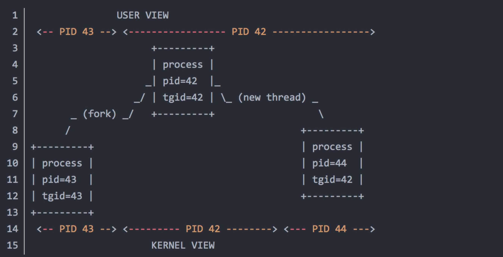

###一、概述
在Linux的top和ps命令中，默认看到最多的是pid (process ID)，也许你也能看到lwp (thread ID)和tgid (thread group ID for the thread group leader)等等
，而在Linux库函数和系统调用里也许你注意到了pthread id和tid等等。还有更多的ID，比如pgrp (process group ID), sid (session ID for the session 
leader)和 tpgid (tty process group ID for the process group leader)。概念太多可能很晕，但是只要对Linux的进程和线程的基本概念有准确的理解，
这些ID的含义都迎刃而解。下面将介绍进程和线程的核心概念，并以一个示例程序来验证这些ID之间的关系。

###二、Linux的进程和线程

Linux的进程和线程有很多异同点，可以Google下。但只要能清楚地理解一下几点，则足够理解Linux中各种ID的含义。

1. 进程是资源分配的基本单位，线程是调度的基本单位
2. 进程是资源的集合，这些资源包括内存地址空间，文件描述符等等，一个进程中的多个线程共享这些资源。
3. CPU对任务进行调度时，可调度的基本单位 (dispatchable entity)是线程。如果一个进程中没有其他线程，可以理解成这个进程中只有一个主线程，这个主线程独享进程中的所有资源。
4. 进程的个体间是完全独立的，而线程间是彼此依存，并且共享资源。多进程环境中，任何一个进程的终止，不会影响到其他非子进程。而多线程环境中，父线程终止，全部子线程被迫终止(没有了资源)。
上述第一点说明是最基础的，也是最重要的。

 
初步理解各种ID。基本上按照重要程度从高到低，在分割线下方的IDs不太重要。

pid: 进程ID。
lwp: 线程ID。在用户态的命令(比如ps)中常用的显示方式。
tid: 线程ID，等于lwp。tid在系统提供的接口函数中更常用，比如syscall(SYS_gettid)和syscall(__NR_gettid)。
tgid: 线程组ID，也就是线程组leader的进程ID，等于pid。

------分割线------
pgid: 进程组ID，也就是进程组leader的进程ID。
pthread id: pthread库提供的ID，生效范围不在系统级别，可以忽略。
sid: session ID for the session leader。
tpgid: tty process group ID for the process group leader。
从上面的列表看出，各种ID最后都归结到pid和lwp(tid)上。所以理解各种ID，最终归结为理解pid和lwp(tid)的联系和区别。
 
下面的图是一张描述父子进程，线程之间关系的图。
 
 
 
上图很好地描述了用户视角(user view)和内核视角(kernel view)看到线程的差别：
 
 + 从用户视角出发，在pid 42中产生的tid 44线程，属于tgid(线程组leader的进程ID) 42。甚至用ps和top的默认参数，你都无法看到tid 44线程。
 + 从内核视角出发，tid 42和tid 44是独立的调度单元，可以把他们视为"pid 42"和"pid 44"。
 
需要指出的是，有时候在Linux中进程和线程的区分也是不是十分严格的。即使线程和进程混用，pid和tid混用，根据上下文，还是
可以清楚地区分对方想要表达的意思。上图中，从内核视角出发看到了pid 44，是从调度单元的角度出发，但是在top或ps命令中，
你是绝对找不到一个pid为44的进程的，只能看到一个lwp(tid)为44的线程。

###三、理解pid和lwp(tid)的示例程序

下面利用一个示例程序来进一步理解pid和lwp(tid)，以及利用格式化的ps命令打印出各种ID。下面的程序在main
函数中创建了2个子线程，加上main函数这个主线程，一共有3个线程。在3个线程中分别打印pthread id, pid和
lwp(tid)，来验证pid和lwp(tid)的关系。

```shell
# ps -eo pid,tid,lwp,tgid,pgrp,sid,tpgid,args -L | awk '{if(NR==1) print $0; if($8~/threadTest/) print $0}'
  PID   TID   LWP  TGID  PGRP   SID TPGID COMMAND
20992 20992 20992 20992 20992 30481 20992 ./threadTest
20992 20993 20993 20992 20992 30481 20992 ./threadTest
20992 20994 20994 20992 20992 30481 20992 ./threadTest
```

从上述结果中可以看到：

+ PID=TGID: 20992
+ TID=LWP: 20993 or 20994
+ 至于SID，30481是bash shell的进程ID。

###四、Linux用户态命令查看线程

top

默认top显示的是task数量，即进程(PID)。

可以利用敲"H"，来切换成线程。也可以直接利用top -H命令来直接打印线程情况。

top -H -p pid：以线程的方式展示该进程（pid）的线程使用。

H:显示线程，显示某个进程所有活跃的线程消耗情况

p:通过指定监控进程ID来仅仅监控某个进程的状态。

ps：

ps的-L选项可以看到线程，通常能打印出LWP和NLWP相关信息。如下命令即可查看线程信息：

ps -eLf