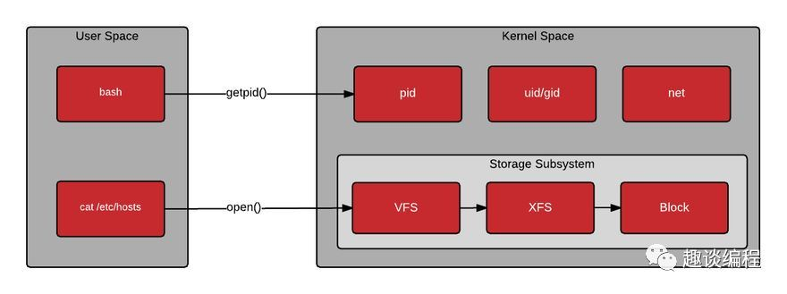
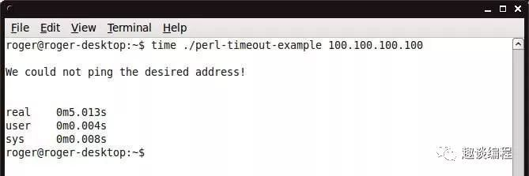

学习 Linux 时，经常可以看到两个词：User space（用户空间）和 Kernel space（内核空间）。

简单说，Kernel space 是 Linux 内核的运行空间，User space 是用户程序的运行空间。为了安全，它们是隔离的，即使用户的程序崩溃了，内核也不受影响。

注：虚拟内存被操作系统划分成两块：内核空间和用户空间，内核空间是内核代码运行的地方，用户空间是用户程序代码运行的地方。当进程运行在内核空间时就处于内核态，当进程运行在用户空间时就处于用户态。



Kernel space 可以执行任意命令，调用系统的一切资源；User space 只能执行简单的运算，不能直接调用系统资源，必须通过系统接口（又称 system call），才能向内核发出指令。

注：通过系统接口，进程可以从用户空间切换到内核空间。
```java
str = "my string" // 用户空间
x = x + 2
file.write(str) // 切换到内核空间
y = x + 4 // 切换回用户空间
```

上面代码中，第一行和第二行都是简单的赋值运算，在 User space 执行。第三行需要写入文件，就要切换到 Kernel space，因为用户不能直接写文件，必须通过内核安排。第四行又是赋值运算，就切换回 User space。

查看 CPU 时间在 User space 与 Kernel Space 之间的分配情况，可以使用top命令。它的第三行输出就是 CPU 时间分配统计。

这一行有 8 项统计指标。

其中，第一项24.8 us（user 的缩写）就是 CPU 消耗在 User space 的时间百分比，第二项0.5 sy（system 的缩写）是消耗在 Kernel space 的时间百分比。

随便也说一下其他 6 个指标的含义。

ni：niceness 的缩写，CPU 消耗在 nice 进程（低优先级）的时间百分比

id：idle 的缩写，CPU 消耗在闲置进程的时间百分比，这个值越低，表示 CPU 越忙

wa：wait 的缩写，CPU 等待外部 I/O 的时间百分比，这段时间 CPU 不能干其他事，但是也没有执行运算，这个值太高就说明外部设备有问题

hi：hardware interrupt 的缩写，CPU 响应硬件中断请求的时间百分比

si：software interrupt 的缩写，CPU 响应软件中断请求的时间百分比

st：stole time 的缩写，该项指标只对虚拟机有效，表示分配给当前虚拟机的 CPU 时间之中，被同一台物理机上的其他虚拟机偷走的时间百分比

如果想查看单个程序的耗时，一般使用time命令。



程序名之前加上time命令，会在程序执行完毕以后，默认显示三行统计。

real：程序从开始运行到结束的全部时间，这是用户能感知到的时间，包括 CPU 切换去执行其他任务的时间。

user：程序在 User space 执行的时间

sys：程序在 Kernel space 执行的时间

user和sys之和，一般情况下，应该小于real。但如果是多核 CPU，这两个指标反映的是所有 CPU 的总耗时，所以它们之和可能大于real。
