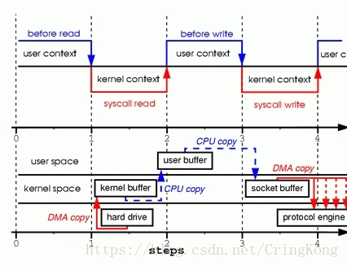
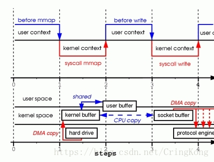
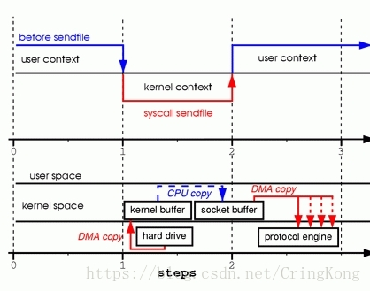
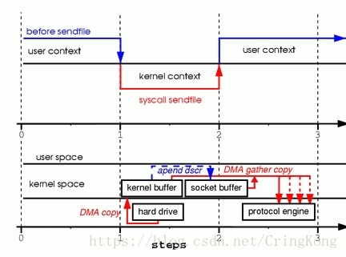
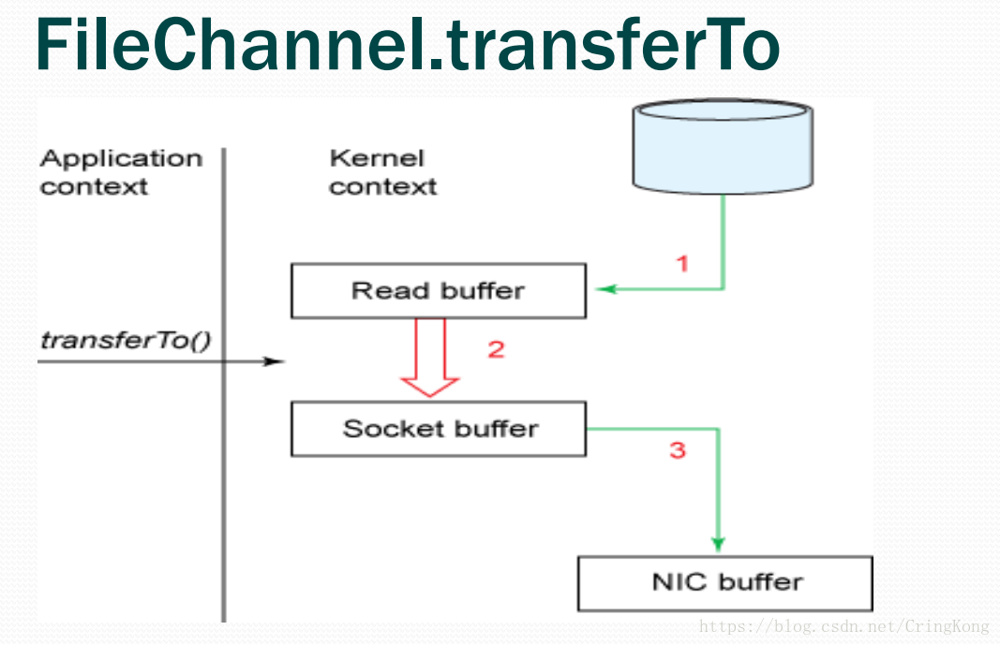

### 一. Linux操作系统中的零拷贝
#### 1.1 先从Linux的普通I/O过程说起


这是一个从磁盘文件中读取并且通过Socket写出的过程，对应的系统调用如下。
```java
read(file, tmp_buf, len);
write(socket, tmp_buf, len);
```
1. 程序使用read()系统调用，系统由用户态转换为内核态，磁盘中的数据由DMA（Direct memory access）的方式读取到内核读缓冲区（kernel buffer）。DMA过程中CPU不需要参与数据的读写，而是DMA处理器直接将硬盘数据通过总线传输到内存中。

2. 系统由内核态转为用户态，当程序要读的数据已经完全存入内核读缓冲区以后，程序会将数据由内核读缓冲区，写入到用户缓冲区，这个过程需要CPU参与数据的读写。

3. 程序使用write()系统调用，系统由用户态切换到内核态，数据从用户缓冲区写入到网络缓冲区（Socket Buffer），这个过程需要CPU参与数据的读写。

4. 系统由内核态切换到用户态，网络缓冲区的数据通过DMA的方式传输到网卡的驱动（存储缓冲区）中（protocol engine）

可以看到，普通的拷贝过程经历了四次内核态和用户态的切换（上下文切换），两次CPU从内存中进行数据的读写过程，这种拷贝过程相对来说比较消耗系统资源。
#### 1.2 内存映射方式I/O

```java
tmp_buf = mmap(file, len);
write(socket, tmp_buf, len);
```
这是使用的系统调用方法，这种方式的I/O原理就是将用户缓冲区(user buffer)的内存地址和内核缓冲区(kernel buffer) 的内存地址做一个映射，也就是说系统在用户态可以直接读取并操作内核空间的数据。

1. mmap()系统调用首先会使用DMA的方式将磁盘数据读取到内核缓冲区，然后通过内存映射的方式，使用户缓冲区和内核读缓冲区的内存地址为同一内存地址，也就是说不需要CPU再讲数据从内核读缓冲区复制到用户缓冲区。

2. 当使用write()系统调用的时候，cpu将内核缓冲区（等同于用户缓冲区）的数据直接写入到网络发送缓冲区（socket buffer），然后通过DMA的方式将数据传入到网卡驱动程序中准备发送。

可以看到这种内存映射的方式减少了CPU的读写次数，但是用户态到内核态的切换（上下文切换）依旧有四次，这种方式可以让应用程序对数据进行相应的读写操作。
#### 1.3 内核空间内部传输I/O

```java
sendfile(socket, file, len);
```
通过sendfile()系统调用，可以做到内核空间内部直接进行I/O传输。

1. sendfile()系统调用也会引起用户态到内核态的切换，与内存映射方式不同的是，用户空间此时是无法看到或修改数据内容，也就是说这是一次完全意义上的数据传输过程。

2. 从磁盘读取到内存是DMA的方式，从内核读缓冲区读取到网络发送缓冲区，依旧需要CPU参与拷贝，而从网络发送缓冲区到网卡中的缓冲区依旧是DMA方式。

依旧有一次CPU进行数据拷贝，两次用户态和内核态的切换操作，相比较于内存映射的方式有了很大的进步，但问题是程序不能对数据进行修改，而只是单纯地进行了一次数据的传输过程。
#### 1.4 升级版-内核空间内部传输I/O


依旧是系统调用sendfile()
```java
sendfile(socket, file, len);
```
> 在 Linux 内核 2.4 及后期版本中，针对套接字缓冲区描述符做了相应调整，支持了DMA自带了收集功能，对于用户方面，用法还是一样的，但是内部操作已经发生了改变。

可以看到，这是真正意义上的零拷贝，因为其间CPU已经不参与数据的拷贝过程，当然这样的过程需要硬件的支持才能实现。
> 借助于硬件上的帮助，我们是可以办到的。之前我们是把页缓存的数据拷贝到socket缓存中，实际上，我们仅仅需要把缓冲区描述符传到socket缓冲区，再把数据长度传过去，这样DMA控制器直接将页缓存中的数据打包发送到网络中就可以了。

系统调用sendfile()发起后，磁盘数据通过DMA方式读取到内核缓冲区，内核缓冲区中的数据通过DMA聚合网络缓冲区，然后一齐发送到网卡中。

可以看到在这种模式下，是没有一次CPU进行数据拷贝的，所以就做到了真正意义上的零拷贝
#### 1.5 后续优化-splice()系统调用
> splice() 系统调用和 sendfile() 非常类似，用户应用程序必须拥有两个已经打开的文件描述符，一个用于表示输入设备，一个用于表示输出设备。与 sendfile() 不同的是，splice() 允许任意两个文件之间互相连接，而并不只是文件到 socket 进行数据传输。对于从一个文件描述符发送数据到 socket 这种特例来说，一直都是使用 sendfile() 这个系统调用，而 splice 一直以来就只是一种机制，它并不仅限于 sendfile() 的功能。也就是说，sendfile() 只是 splice() 的一个子集，在 Linux 2.6.23 中，sendfile() 这种机制的实现已经没有了，但是这个 API 以及相应的功能还存在，只不过 API 以及相应的功能是利用了 splice() 这种机制来实现的。

总体来讲splice()是Linux 2.6.23 内核版本中替换sendfile()系统调用的一个方法，它不仅支持文件到Socket的直接传输，也支持文件到文件的直接传输I/O，但是其底层的传输过程和sendfile()并无区别，也就是上面那两张图。
### 二. JavaNIO中的零拷贝
真是没想到对于操作系统中的零拷贝技术要占这么多内容，但是不说又不行，因为Java中的零拷贝也是通过操作系统的系统调用来实现的。
#### 2.1 NIO中内存映射方式I/O
操作系统的读写缓冲区和JavaNIO没有关系任何关系，操作系统的读写缓冲区（Linux中就是PageCache）是内核中直接和IO设备驱动交互的内存区域，程序员平时是接触不到的
```java
File file = new File("test.zip");
RandomAccessFile raf = new RandomAccessFile(file, "rw");
FileChannel fileChannel = raf.getChannel();
MappedByteBuffer buffer = fileChannel.map(FileChannel.MapMode.READ_ONLY, 0, fileChannel.size());
```
内存地址映射其实是操作系统将内存地址和磁盘文件做一个映射，读写这块内存，相当于直接对磁盘文件进行读写，但是实际上的读还是要经过OS读取到内存PageCache中，写过程也需要OS自动进行脏页置换到磁盘中。

这种方式适合读取大文件，同时也能对文件内容进行更改，但是如果其后要通过SocketChannel发送，还是需要CPU进行数据的拷贝。
```java
processData();
// 数据处理完成以后，打卡一个SocketChannel
SocketChannel socketChannel = SocketChannel.open(new InetSocketAddress("", 1234));
// 这时依旧需要CPU将内核缓冲区的内容拷贝到网络缓冲区
socketChannel.write(buffer);
```
#### 2.2 NIO中的零拷贝
```java
File file = new File("test.zip");
RandomAccessFile raf = new RandomAccessFile(file, "rw");
FileChannel fileChannel = raf.getChannel();
SocketChannel socketChannel = SocketChannel.open(new InetSocketAddress("", 1234));
// 直接使用了transferTo()进行通道间的数据传输
fileChannel.transferTo(0, fileChannel.size(), socketChannel);
```


这种方式就是NIO中的零拷贝，我们来分析一下其中原理：

1. NIO中的Buffer都在用户空间中，包括DirectBuffer，也是C语言malloc出来的一块内存。

2. transferTo()的实现方式就是通过系统调用sendfile()（当然这是Linux中的系统调用，Windows中系统调用有所不同），根据我们上面所写说这个过程是效率远高于从内核缓冲区到用户缓冲区的读写的。

同理transferFrom()也是这种实现方式。
