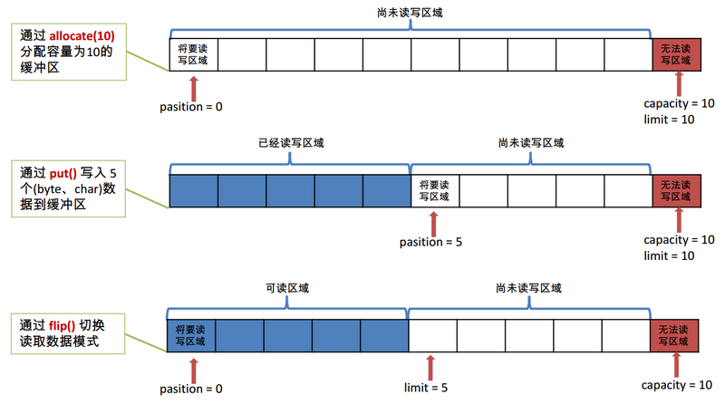
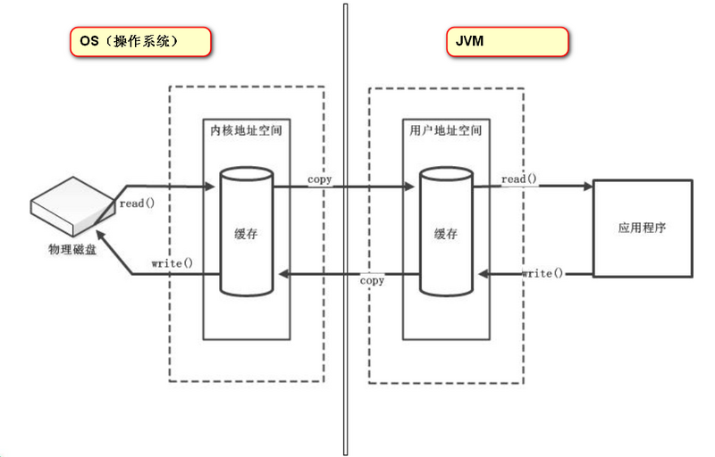
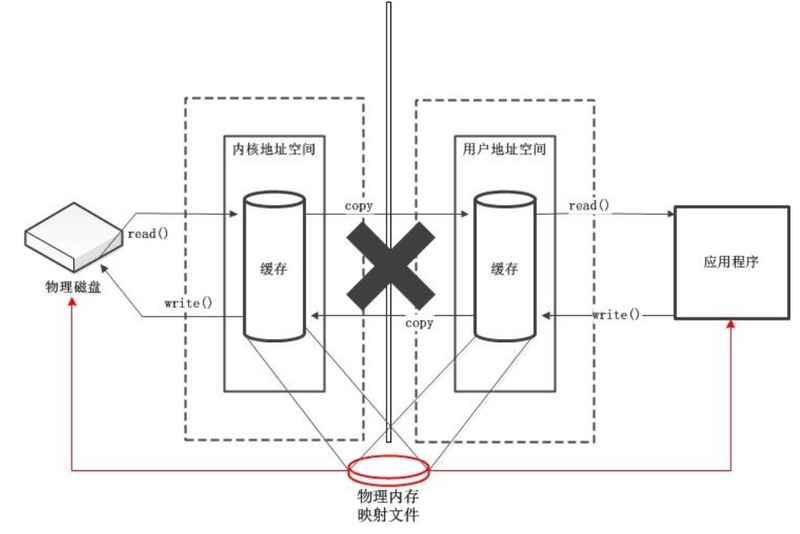

Java NIO系统的两个基本概念：通道(Channel)和缓冲区(Buffer)。通道表示打开到 IO 设备的连接。若需要使用 NIO 系统，需要获取用于连接 IO 设备的通道以及用于容纳数据的缓冲区。然后操作缓冲区，对数据进行处理。可以类比铁路和火车，铁路就类似通道，火车就类似缓冲区。
### 一. 缓冲区的简介
**缓冲区（Buffer）**：一个用于特定基本数据类型的容器。由 java.nio 包定义的，所有缓冲区都是 Buffer 抽象类的子类。

Java NIO 中的 Buffer 主要用于与 NIO 通道进行交互，数据是从通道读入缓冲区，从缓冲区写入通道中的，以此完成数据的存取。

Buffer 就像一个数组，可以保存多个相同类型的数据。根据数据类型不同(boolean 除外) ，有以下 Buffer 常用子类：

* ByteBuffer（最常用）
* CharBuffer
* ShortBuffer
* IntBuffer
* LongBuffer
* FloatBuffer
* DoubleBuffer

上述 Buffer 类 他们都采用相似的方法进行管理数据，只是各自管理的数据类型不同而已。都是通过如下方法获取一个 Buffer对象：
> static XxxBuffer allocate(int capacity): 创建一个容量为 capacity 的 XxxBuffer 对象

### 二. Buffer中的基本属性

* **容量 (capacity)**： 表示 Buffer 最大存储数据容量，该值不能为负，一旦声明后不能更改。
* **界限 (limit)**： 第一个不应该读取或写入的数据的索引，即位于 limit 后的数据不可读写。缓冲区的限制不能为负，并且不能大于其容量。
* **位置 (position)**： 下一个要读取或写入的数据的索引。缓冲区的位置不能为负，并且不能大于其限制
* **标记 (mark)与重置 (reset)**： 标记是一个索引，通过 Buffer 中的 mark() 方法指定 Buffer 中一个特定的 position，之后可以通过调用 reset() 方法恢复到这个 position。

标记、 位置、 限制、 容量遵守以下不变式： 0 <= mark <= position <= limit <= capacity图示如下：


### 三. Buffer的常用方法

| 方法 | 描述 |
| --- | --- |
| Buffer clear() | 清空缓冲区并返回该缓冲区的引用 |
| Buffer flip() | 将缓冲区的limit设置为当前位置，并将当前position设置为0 |
| int capacity() | 返回Buffer的capacity大小 |
| boolean hasRemaining() | 判断缓冲区中是否还有元素 |
| int limit() | 返回Buffer的界限（limit）的位置 |
| Buffer limit(int n) | 将缓冲区界限设置为n，并返回一个具有新limit的缓冲区对象 |
| Buffer mark() | 对缓冲区设置标记 |
| int position() | 返回缓冲区的当前位置（position） |
| Buffer position(int n) | 设置缓冲区的position为n，并返回修改后的Buffer对象 |
| int remaining() | 返回position和limit之间的元素个数 |
| Buffer reset() | 将位置（position）修改成之前设置的mark所在的位置 |
| Buffer rewind() | 将位置（position）设置为0，取消已设置的mark |

### 四. 缓冲区的数据操作
Buffer 所有子类提供了两个用于数据操作的方法： get()与 put() 方法

* 获取 Buffer 中的数据
    * get() ：读取单个字节
    * get(byte[] dst)：批量读取多个字节到 dst 中
    * get(int index)：读取指定索引位置的字节(不会移动 position)

* 放入数据到 Buffer 中
    * put(byte b)：将给定单个字节写入缓冲区的当前位置
    * put(byte[] src)：将 src 中的字节写入缓冲区的当前位置
    * put(int index, byte b)：将指定字节写入缓冲区的索引位置(不会移动 position)

### 五. 代码演示
```java
package com.lzumetal.nio.buffer;

import org.junit.Test;
import java.nio.ByteBuffer;

public class BufferTest {

    @Test
    public void test1() {

        String str = "abcde";

        // 1.分配一个指定大小的缓冲区
        ByteBuffer byteBuffer = ByteBuffer.allocate(1024);
        System.out.println("---------allocate---------");
        System.out.println(byteBuffer.capacity());  // 1024
        System.out.println(byteBuffer.limit()); // 1024
        System.out.println(byteBuffer.position());  // 0

        // 2.使用put()方法存入数据到缓冲区
        byteBuffer.put(str.getBytes());
        System.out.println("---------put---------");
        System.out.println(byteBuffer.capacity());  // 1024
        System.out.println(byteBuffer.limit()); // 1024
        System.out.println(byteBuffer.position());  // 5

        // 3.flip()方法切换读取数据模式
        byteBuffer.flip();
        System.out.println("---------flip---------");
        System.out.println(byteBuffer.capacity());  // 1024
        System.out.println(byteBuffer.limit()); // 5
        System.out.println(byteBuffer.position());  // 0

        // 4.利用get()方法读取缓冲区中的数据
        byte[] bytes = new byte[byteBuffer.limit()];
        byteBuffer.get(bytes);
        System.out.println("---------get---------");
        System.out.println(new String(bytes));  // abcde
        System.out.println(byteBuffer.capacity());  // 1025
        System.out.println(byteBuffer.limit()); // 5
        System.out.println(byteBuffer.position());  // 5

        // 5.利用rewind()方法可以再次重新读取
        byteBuffer.rewind();
        System.out.println("---------rewind---------");
        System.out.println(byteBuffer.capacity());  // 1024
        System.out.println(byteBuffer.limit()); // 5
        System.out.println(byteBuffer.position());  // 0

        // 6.clear()方法，清空缓冲区，但是缓冲区中的数据依然存在，处于一个“被遗忘”的状态
        byteBuffer.clear();
        System.out.println("---------clear---------");
        System.out.println(byteBuffer.capacity());  // 1024
        System.out.println(byteBuffer.limit()); // 1024
        System.out.println(byteBuffer.position());  // 0
        System.out.println((char) byteBuffer.get());    // a
    }

    @Test
    public void test2() {
        String str = "abcde";

        ByteBuffer byteBuffer = ByteBuffer.allocate(1024);
        byteBuffer.put(str.getBytes());
        byteBuffer.flip();
        byte[] bytes = new byte[byteBuffer.limit()];

        /*
        get(byte[] dst, int offset, int length)方法：
            从缓冲区读取length个元素，写入到byte数组索引为offset的位置。
            如果缓冲区中的元素数量不够（读取时会超过limit值），或者byte数组的容量不够，都会报错。
         */

        byteBuffer.get(bytes, 0, 2);
        System.out.println(new String(bytes));  // ab
        System.out.println(byteBuffer.position());  // 2

        // mark()方法：标记
        byteBuffer.mark();
        byteBuffer.get(bytes, 1, 3);
        System.out.println(new String(bytes));  // acde
        System.out.println(byteBuffer.position());  // 5

        // reset()方法：恢复到mark的位置
        byteBuffer.reset();
        System.out.println(byteBuffer.position());  // 2
    }

    @Test
    public void test3() {
        // 创建直接缓冲区
        ByteBuffer byteBuffer = ByteBuffer.allocateDirect(1024);

        // isDrect()方法可以判断是否是直接缓冲区
        System.out.println(byteBuffer.isDirect());  // true

    }
}
```
### 六. 直接缓冲区和非直接缓冲区
非直接缓冲区



直接缓冲区



直接缓冲区和非直接缓冲区的说明：

* 字节缓冲区要么是直接的，要么是非直接的。如果为直接字节缓冲区，则 Java 虚拟机会尽最大努力直接在此缓冲区上执行本机 I/O 操作。也就是说，在每次调用基础操作系统的一个本机 I/O 操作之前（或之后），虚拟机都会尽量避免将缓冲区的内容复制到中间缓冲区中（或从中间缓冲区中复制内容）。
* 直接字节缓冲区可以通过调用此类的 allocateDirect() 工厂方法来创建。此方法返回的缓冲区进行分配和取消分配所需成本通常高于非直接缓冲区。直接缓冲区的内容可以驻留在常规的垃圾回收堆之外，因此，它们对应用程序的内存需求量造成的影响可能并不明显。所以，建议将直接缓冲区主要分配给那些易受基础系统的本机 I/O 操作影响的大型、持久的缓冲区。一般情况下，最好仅在直接缓冲区能在程序性能方面带来明显好处时分配它们。
* 直接字节缓冲区还可以通过 FileChannel 的 map() 方法 将文件区域直接映射到内存中来创建。该方法返回MappedByteBuffer 。 Java 平台的实现有助于通过 JNI 从本机代码创建直接字节缓冲区。如果以上这些缓冲区中的某个缓冲区实例指的是不可访问的内存区域，则试图访问该区域不会更改该缓冲区的内容，并且将会在访问期间或稍后的某个时间导致抛出不确定的异常。
* 字节缓冲区是直接缓冲区还是非直接缓冲区可通过调用其 isDirect() 方法来确定。提供此方法是为了能够在性能关键型代码中执行显式缓冲区管理
