为了应对高并发的服务器端开发，微软在2009年提出了一种更优雅地实现异步编程的方式Reactive Programming即反应式编程。随后其他技术紧随其后，比如ES6通过引入类似的异步编程方式等。为了应对高并发的服务器端开发，微软在2009年提出了一种更优雅地实现异步编程的方式Reactive Programming即反应式编程。随后其他技术紧随其后，比如ES6通过引入类似的异步编程方式等。

在高性能的I/O设计中，有两个比较著名的模式Reactor和Proactor模式，其中Reactor模式用于同步I/O，Proactor用于异步I/O操作。

Reactor模式称之为响应器模式，通常用于NIO非阻塞IO的网络通信框架中。

在这之前，需要弄明白几个概念：

* 什么是阻塞和非阻塞？

阻塞和非阻塞是针对于进程在访问数据时，根据IO操作的就绪状态而采取的不同方式，简单来说是一种读取或写入操作函数的实现方式，阻塞方式下读取或写入函数将一直等待。非阻塞方式下，读取和写入函数会立即返回一个状态值。

* 什么是同步和异步？

同步和异步是针对应用程序和内核的交互而言的，同步是指用户进程触发IO操作并等待或轮询的查看IO操作是否就绪，异步是指用户进程触发IO操作以后便开始做自己的事情，当IO操作完成时会得到通知，换句话说异步的特点就是通知。

* 什么是IO模型？

一般而言，IO模型可以分为四种：同步阻塞、同步非阻塞、异步阻塞、异步非阻塞

1. 同步阻塞IO是指用户进程在发起一个IO操作后必须等待IO操作完成，只有当真正完成了IO操作后用户进程才能运行。

2. 同步非阻塞IO是指用户进程发起一个IO操作后立即返回，程序也就可以做其他事情。但是用户进程需要不时的询问IO操作是否就绪，这就要求用户进程不停的去询问，从而引入不必要的CPU资源浪费。

3. 异步阻塞IO是指应用发起一个IO操作后不必等待内核IO操作的完成，内核完成IO操作后会通知应用程序。这其实是同步和异步最关键的区别，同步必须等待或主动询问IO操作是否完成，那么为什么说是阻塞呢？因为此时是通过select系统调用来完成的，而select函数本身的实现方式是阻塞的，采用select函数的好处在于可以同时监听多个文件句柄，从而提高系统的并发性。

4. 异步非阻塞IO是指用户进程只需要发起一个IO操作后立即返回，等IO操作真正完成后，应用系统会得到IO操作完成的通知，此时用户进程只需要对数据进行处理即可，不需要进行实际的IO读写操作，因为真正的IO读写操作已经由内核完成。
#### NIO非阻塞IO处理流程
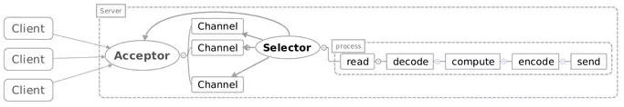

1. Acceptor注册Selector并监听accept事件

2. 当客户端连接后会触发accept事件

3. 服务器构建对应的Channel并在其上注册Selector，用于监听读写事件。

4. 当发生读写事件后进行相应的读写处理

NIO非阻塞IO的优点在于性能瓶颈高，缺点在于模型复杂、编码复杂、需要处理半包问题。简单来说非阻塞IO不需要一个连接建立一个线程，它可以在一个线程中处理所有的连接。但是由于是非阻塞的，所以应用无法知道什么时候消息读完了，也就会存在半包的问题。
#### 什么是半包问题呢？
TCP/IP在发送消息时可能会拆包，拆包会导致接收端无法得知什么时候接收到的数据是一个完整的数据。在BIO阻塞性IO模型中，当读取步到数据后会阻塞，而在NIO非阻塞IO中则不会，所以需要自行进行处理。比如以换行符作为判断依据，或者是定长消息发送，或者是自定义协议等。
#### 什么是Reactor模式？
Reactor模式是处理并发I/O常见的一种模式，用于同步I/O，其中心思想是将所有要处理的I/O事件注册到一个中心I/O多路复用器上，同时主线程阻塞在多路复用器上，一旦有I/O事件到来或是准备就绪，多路复用器将返回并将相应I/O事件分发到对应的处理器中。

Reactor是一种事件驱动机制，和普通函数调用不同的是应用程序不是主动的调用某个API来完成处理，恰恰相反的是Reactor逆置了事件处理流程，应用程序需提供相应的接口并注册到Reactor上，如果有相应的事件发生，Reactor将主动调用应用程序注册的接口（回调函数）。
> The reactor design pattern is an event handling pattern for handling service requests delivered concurrently by one or more inputs. The service handler then demultiplexes the incoming requests and dispatches them synchronously to associated request handlers.

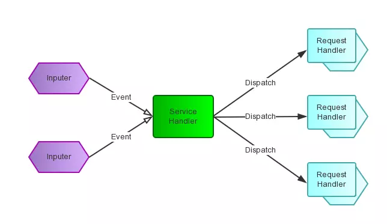

Reactor模式称为反应器模式或应答者模式，是基于事件驱动的设计模式，拥有一个或多个并发输入源，有一个服务处理器和多个请求处理器，服务处理器会同步的将输入的请求事件以多路复用的方式分发给相应的请求处理器。

Reactor设计模式是一种为处理并发服务请求，并将请求提交到一个或多个服务处理程序的事件设计模式。当客户端请求抵达后，服务处理程序使用多路分配策略，由一个非阻塞的线程来接收所有请求，然后将请求派发到相关的工作线程并进行处理的过程。

在事件驱动的应用中，将一个或多个客户端的请求分离和调度给应用程序，同步有序地接收并处理多个服务请求。对于高并发系统经常会使用到Reactor模式，用来替代常用的多线程处理方式以节省系统资源并提高系统的吞吐量。
### 基础
#### 什么是C/S架构？
* C表示Client客户端
* S表示Server服务器，服务器管理着某种资源Resource，通过操作这种资源为客户端提供服务。

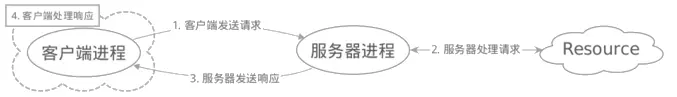
#### C/S架构的工作流程
1. 客户端进程向服务器进程发送请求

2. 服务器进程接收并处理请求

3. 服务器进程向客户端进程发送响应

4. 客户端进程处理响应

#### 什么是套接字Socket？

* Socket原意为插口，所表达的意思是插口与插槽之间的关系。
* Socket是对TCP/IP编程的抽象，简单来说，是send socket插入到receive socket中以建立连接进行通信。

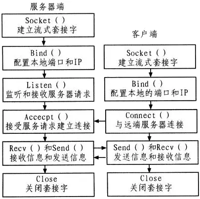
#### C/S架构中Socket之间是如何建立连接并通信的呢？
1. 服务端Socket绑定bind到指定的端口上后监听listen客户端的插入

2. 客户端Socket连接到connect到服务端

3. 当服务端accept到客户端连接后

4. 客户端与服务端之间收发信息开发通信

5. 通信完成后客户端与服务器关闭close掉Socket

### 演化
当前分布式计算Web服务盛行天下，网络服务的底层都离不开对Socket的操作，而它们都具有一个共同的结构。

不同于传统IO的串行调度方式，NIO非阻塞IO操作会将整个服务请求划分为五个阶段。

在网络服务和分布式中对于网络中请求的处理，处理流程大致可划分为五个阶段。
1. read 接收请求读取数据

2. decode 数据解码

3. compute 业务逻辑处理（计算处理）

4. encode 编码回复

5. send 发送回复

在这五个阶段中，以read和send阶段IO操作最为频繁。

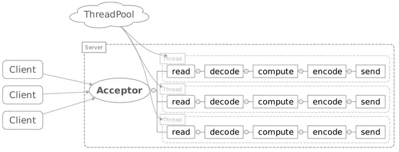

在处理网络请求时，通常具有两种体系结构。

* 基于线程 thread-based architecture

基于线程的体系结构会使用多线程来处理客户端的请求，每当接收一个请求便开启一个独立的线程来处理。这种方式虽然简单直观，但仅适用于并发访问不大的场景。因为线程是需要占用一定的内存资源，而且操作系统在线程之间的切换也需要一定的开销。当线程过多时显然会降低网络服务器的性能。另外，当线程在处理IO操作时，在等待输出的这段时间内线程是处于空闲状态，造成CPU资源浪费。

* 事件驱动 event-driver architecture

事件驱动体系结构是目前广泛使用的一种方式，这种方式定义了一系列的事件处理程序来响应事件的发生，而且将服务端接收连接和事件处理分离，事件本身只是一种状态的改变。在事件驱动的应用中，会将一个或多个客户端的服务请求分离demultiplex和调度dispatch给应用程序。

Reactor设计模式是event-driven architecture的一种实现方式，用于处理多个客户端并发的向服务器请求服务的场景。每种服务在服务器上可能由多个方法组成。Reactor会解耦并发请求的服务并分发给对应的时间处理器来处理。

从结构上看，Reactor类似于生产消费模式，也就是一个或多个生产者会将事件放入一个队列中，一个或多个消费者主动从队列中poll拉取事件进行处理。Reactor并没有使用队列来做缓冲，每当一个事件输入到服务处理程序之后，服务处理程序会主动根据不同的事件类型将其分发给对应的请求处理程序进行处理。

Reactor模式和生产者和消费者之间最大的区别在于

* 生产者消费者模式是基于队列queue的实现，能够解决生产端和消费端处理速度不同步的问题，队列可以采用先有的MQ产品来实现。
* Reactor模式是基于事件驱动模型，当接收到请求后会将请求封装成事件，并将事件分发给相应处理事件的handler，handler处理完成后将时间状态修改为下一个状态，再由Reactor将事件分发给能够处理下一个状态的handle进行处理。

Reactor模式与Observer观察者模式在某些方面极为相似，当一个主体发生改变时，所有依属体都将得到通知。不过观察者模式与单个事件源关联，而反应器模式则于多个事件源关联。

Reactor模式的优点很明显：解耦、提升复用性、模块化、可移植性、事件驱动、细粒度的开发控制等。Reactor模式的缺点也很明显：模型复杂，涉及到内部回调、多线程处理、不容易调试、需要操作系统底层支持，因此导致不同操作系统可能会产生不一样的结果。总来而言，如果并发要求不是很高，可使用传统的阻塞线程池足够了。如果使用场景是产生瞬间大并发可使用Reactor模式来实现。
### 传统服务模型
最原始的网络编程思路是服务器使用一个while循环并不断监听端口是否有新的socket套接字连接，如果有就会去调用一个处理函数。
```java
while(true)
{
  socket = accept();
  handle(socket);
}
```
这种方式最大的问题是无法并发且效率太低，如果当前请求没有处理完毕后续请求只能被阻塞，因此服务器的吞吐量太低。

导致服务器阻塞的原因是什么呢？

* 服务器socket的accept方法将阻塞等待客户端连接，直到客户端连接成功。
* 线程从socket inputstream套接字输入流读取数据并进入阻塞状态，直到全部数据读取完毕
* 线程向socket outputstream套接字输出流写入数据并进入阻塞状态，直到全部数据写入完毕。

由于IO在阻塞时会处于等待状态，因此在用户负载增加时，性能下降的非常快。
### 多线程
改进的方式是使用多线程，也就是经典的connection per thread，每一个连接拥有一个线程处理。
```java
while(true)
{
  socket = accept();
  new thread(socket);
}
```
对于传统的服务设计，每个抵达的请求系统会分配一个线程去处理，Tomcat服务器早期版本是这样实现的。

当系统请求量瞬间暴增时（高并发情况下），会直接把系统拖垮，因为系统能够创建线程的数量是有限的。

多线程并发模式采用一个连接一个线程的方式，优点是确实一定程度上提高了服务器的吞吐量，因为之前的请求在read读阻塞后不会影响到后续的请求，由于它们在不同的线程中，而且一个线程只能对应一个套接字socket，每一个套接字socket都是阻塞的，所以一个线程中只能处理一个套接字。就算accept多个socket，如果前一个socket被阻塞其后的socket是无法被执行到的。

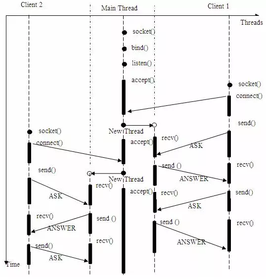

多线程并发模式的缺点在于资源要求太高，系统中创建线程是需要消耗系统资源的，如果连接数过高系统将无法承受。另外，线程反复被创建和销毁也是需要代价的。
### 线程池
虽然利用线程池可以缓解线程创建和销毁的代价，不过还是存在一些问题，线程的粒度太大。每一个线程会将一次交互操作全部处理完成，包括读取和返回甚至是连接。表面上似乎连接不在线程里面，但是如果线程不够，新连接将无法得到处理。所以线程的任务可以简化为做三件事：连接、读取、写入。

显然传统一对一的线程处理无法满足需求的变化，对此考虑使用线程池使得线程可以被复用，大大降低创建线程和销毁线程的时间。然而，线程池并不能很好满足高并发线程的需求。当海量请求抵达时线程池中的工作线程达到饱和状态，此时可能就导致请求被抛弃，无法完成客户端的请求。对此，考虑到将一次完整的请求切分为几个小的任务，每个小任务都是非阻塞的，对于读写操作使用NIO非阻塞IO对其进行读写，不同的任务将被分配到与之关联的处理程序上进行处理，每个处理器通过异步回调机制来实现。这样可以大大提高系统吞吐量，减少响应时间。

由于线程同步的粒度太大限制了吞吐量，所以应该将一次连接操作拆分为更细的粒度或过程，这些更细的粒度则是更小的线程。这样做之后，整个线程池中线程的数量将会翻倍增加，但线程更加简单且任务更为单一。这也是Reactor出现的原因。
### Reactor
在Reactor中这些被拆分的小线程或子过程对应的处理程序，每一种处理程序会去处理一种事件。Reactor中存在一个全局管理者Selector，开发者需要将Channel注册到感兴趣的事件上，Selector会不断在Channel上检测是否有该类型的事件发生，如果没有主线程会被阻塞，否则会调用相应的事件处理函数来处理。

由于典型的事件包括连接、读取、写入，因此需要为这些事件分别提供对应的处理程序，每个处理程序可以采用线程的方式实现。一旦连接来了，而且显示被读取线程或处理程序处理了，则会再执行写入。那么之前的读取就可以被后面的请求复用，因此吞吐量就提高了。

传统的thread per connection中线程在真正处理请求之间是需要从socket中读取网络请求，由于读取完成之前线程本身是被阻塞的不能做任何事情，这就导致线程资源被占用，而线程资源本身很珍贵的，尤其是在处理高并发请求时。Rector模式指出在等待IO时，线程可以先退出，这样就会因为有线程等待IO而占用资源。但是这样原先的执行流程就没法还原了。因此可以利用事件驱动的方式，要求线程在退出之前向event loop事件循环中注册回调函数，这样IO完成时event loop事件循环就可以调用回调函数完成剩下的操作。所以Reactor模式通过减少服务器的资源消耗提供并发能力。

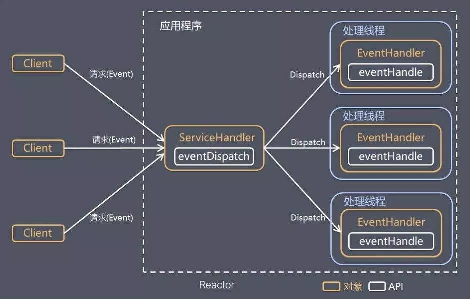
### 细分
Reactor从线程池和Reactor的选择上可细分为：Reactor单线程模型、Reactor多线程模型，Reactor主从模型
#### 单线程Reactor模型
单线程的Reactor模式对于客户端的所有请求使用一个专门的线程去处理，这个线程无限循环地监听是否有客户端的请求抵达，一旦收到客户端的请求，就将其分发给响应处理程序进行处理。

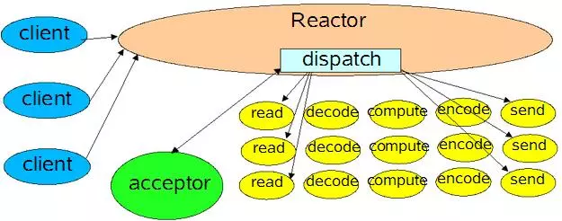

采用基于事件驱动的设计，当有事件触发时才会调用处理器进行数据处理。使用Reactor模式可以对线程的数量进行控制，可以使用一个线程去处理大量的事件。

* Reactor 负责响应IO事件，当检测到一个新的事件会将其发送给相应的处理程序去处理。
* Handler 负责处理非阻塞的行为，标识系统管理的资源，同时将处理程序与事件绑定。

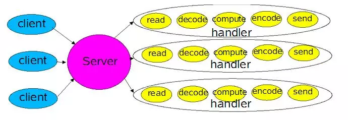

Reactor是单个线程，需要处理accept连接，同时发送请求到处理器中。由于只是单个线程，所以处理器中的业务需要能够快速处理完毕。

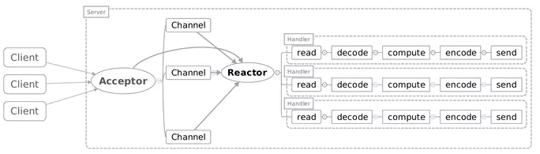

单线程的Reactor与NIO流程类似，只是将消息相关处理独立到Handler中。虽然NIO中一个线程可以支持所有的IO处理，但瓶颈也是显而易见的。如果某个客户端多次进行请求时在Handler中的处理速度较慢，那么后续的客户端请求都会被积压，导致响应变慢。所以需要引入Reactor多线程模型。

单线程的Reactor的特点是只有一个Reactor线程，也就是说只有一个Selector事件通知器，因此字节的读取I/O和后续的业务处理process()均由Reactor线程来做，很显然业务的处理影响后续事件的分发，所以引出多线程版本进行优化。

从性能角度来看，单线程的Reactor没有过多的提升空间，因为IO和CPU的速度严重不匹配。

单线程的Reactor模式并没有解决IO和CPU处理速度不匹配问题，所以多线程的Reactor模式引入了线程池的概念，将耗时的IO操作交由线程池处理，处理完毕后再同步到selectionkey中。
#### 多线程Reactor模型
考虑到工作线程的复用，可以将工作线程设计线程池。将处理器的执行放入线程池，并使用多线程处理业务逻辑，Reactor仍然是单个线程。

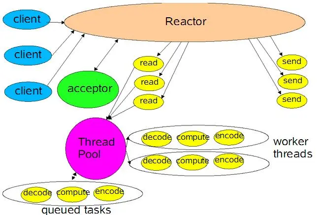

Reactor读线程模型是将Handler中的IO操作和非IO操作分开，操作IO的线程称为IO线程，非IO操作的线程称为工作线程。客户端的请求会被直接丢到线程池中，因此不会发生堵塞。

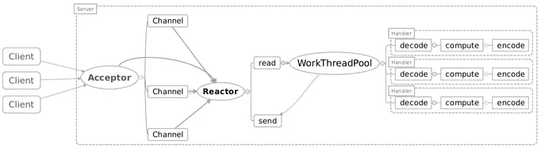

多线程的Reactor的特点是一个Reactor线程和多个处理线程，将业务处理即process交给线程池进行了分离，Reactor线程只关注事件分发和字节的发送和读取。需要注意的是，实际的发送和读取还是由Reactor来处理。当在高并发环境下，有可能会出现连接来不及接收。

当用户进一步增加时Reactor也会出现瓶颈，因为Reactor既要处理IO操作请求也要响应连接请求。为了分担Reactor的负担，可以引入主从Reactor模型。
#### 主从Reactor模型
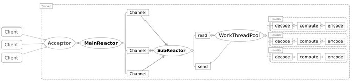

对于多个CPU的机器，为了充分利用系统资源会将Reactor拆分为两部分。

* Main Reactor 负责监听连接，将accept连接交给Sub Reactor处理，主Reactor用于响应连接请求。
* Sub Reactor 处理accept连接，从Reactor用于处理IO操作请求。

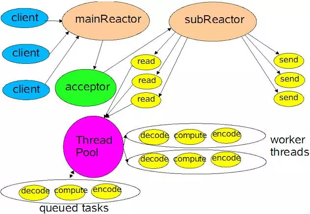

主从Reactor的特点是使用 一个Selector池，通常有一个主Reactor用于处理接收连接事件，多个从Reactor处理实际的IO。整体来看，分工合作，分而治之，非常高效。

为什么需要单独拆分一个Reactor来处理监听呢？

因为像TCP这样需要经过3次握手才能建立连接，这个建立的过程也是需要消耗时间和资源的，单独拆分一个Reactor来处理，可以提高性能。
#### 优缺点
Reactor模式的核心是解决多请求问题，如果有特别多的请求同时发生，不会因为线程池被短时间占满而拒绝服务。一般实现多请求的模块，会采用线程池的实现方案，这种方案对于并发量不是特别大的场景是足够用的，比如单机TPS 1000以下都是够用的。

线程池方案的最大缺点是：如果瞬间有大并发，则会一下子耗满线程，整个服务将会陷入阻塞中，后续请求无法介入。基于Reactor模式实现的方案，会有一个Dispatcher先接收事件event，然后快速分发给相应的耗时eventHandler处理器去处理，这样就不会阻塞请求的接收。

##### Reactor模式的优点是什么呢？

* 响应快，不为单个同步时间所阻塞，虽然Reactor自身依然是同步的。
* 编程相对简单，可以最大程度的避免复杂的多线程以及同步问题和多线程以及多进程的切换开销。
* 可扩展性，可以方便的通过增加Reactor实例个数来充分利用CPU资源。
* 可复用性， Reactor框架本身与具体事件处理逻辑无关，具有很高的复用性。

##### Reactor模式的缺点是什么呢？

* 相比传统的模型，Reactor增加了一定的复杂性，因而具有一定的门槛，并且不易于调试。
* Reactor模式需要底层的Synchronous Event Demultiplexer支持，比如Java中的Selector支持，操作系统的select系统调用支持。
* Reactor模式在IO读写数据时会在同一线程中实现，即使使用多个Reactor机制的情况下，那些共享一个Reactor的Channel如果出现一个长时间的数据读写，会影响这个Reactor中其他Channel的相应时间。例如在大文件传输时，IO操作会影响其他客户端的时间，因而对于这种操作，使用传统的Thread-Per-Connection或许是一个更好的选择，或者采用Proactor模式。
### 结构
Reactor中的核心组件有哪些呢？

* Reactor

IO事件的派发者，相当于有分发功能的Selector。

* Acceptor

接收客户端连接并建立对应客户端的Handler，向Reactor注册此Handler。相当于NIO中建立连接的那个判断分支。

* Handler

和一个客户端通讯的实体，一般在基础的Handler上会有更进一步的层次划分，用来抽象诸如decode、process、encode这些过程。相当于消息读写处理等操作类。

在Reactor模式中有五个关键的参与者：描述符handle、同步事件分离器demultiplexer、事件处理器接口event handler、具体的事件处理器、Reactor管理器

Reactor的结构

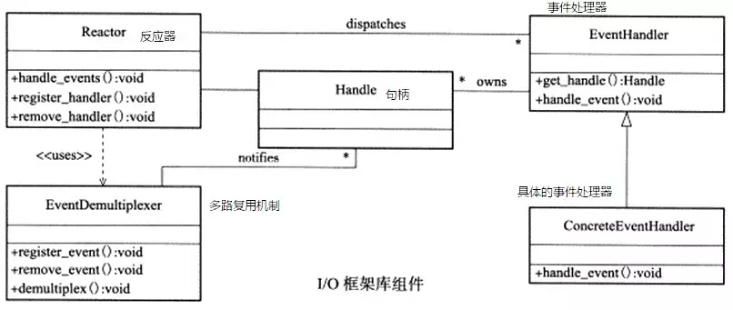

Reactor模式要求主线程（I/O处理单元）只负责监听文件描述符上是否有事件发生，如果有的话立即将该事件通知给工作线程（逻辑单元）。除此之外，主线程不做任何其它实质性的工作。读写数据、接收新连接、处理客户端请求均在工作线程中完成。

* Handle 文件描述符

Handle在Linux中一般称为文件描述符，在Windows中称为句柄，两者含义一样。Handle是事件的发源地。比如网络socket、磁盘文件等。发生在Handle上的事件可以有connection、ready for read、ready for write等。

Handle是操作系统的句柄，是对资源在操作系统上的一种抽象，它可以是打开的文件、一个Socket连接、Timer定时器等。由于Rector模式一般使用在网络编程中，因而这里一般指的是Socket Handle，也就是一个网络连接（connection/channel）。这个channel注册到同步事件分离器中，以监听Handle中发生的事件，对ServerSocketChannel可以是CONNECT事件，对SocketChannel可以是read、write、close事件等。

* Synchronous Event Demultiplexer 同步（多路）事件分离器

同步事件分离器本质上是系统调用，比如Linux中的select、poll、epoll等。比如select()方法会一致阻塞直到文件描述符handle上有事件发生时才会返回。

无限循环等待新请求的到来，一旦发现有新的事件到来就会通知初始事件分发器去调取特定的时间处理器。

* Event Handler 事件处理器

事件处理器，定义一些回调方法或称为钩子函数，当handle文件描述符上有事件发生时，回调方法便会执行。供初始事件分发器回调使用。

* Concrete Event Handler 具体的事件处理器

具体的事件处理器，实现了Event Handler，在回调方法中实现具体的业务逻辑。

* Initiation Dispatcher 初始事件分发器

初始事件分发器，提供了注册、删除、转发Event Handler的方法。当Synchronous Event Demultiplexer检测到handler上有事件发生时，便会通知initiation dispatcher调用特定的event handler的回调方法。

初始事件分发器用于管理Event Handler，定义注册、移除EventHandler等。它还作为Rector模式的入口调用Synchronous Event Demultiplexer同步多路事件分离器的select方法以阻塞等待事件返回，当阻塞等待返回时，根据事件发生的Handle将其分发给对应的Event Handle事件处理器进行处理，也就是回调EventHandler中的handle_event方法。

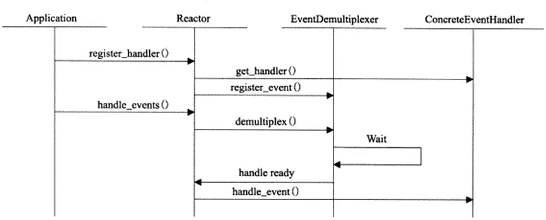
#### 事件多路分解器
现代操作系统大多提供了一种本机机制，该机制通过一种有效的方式处理并发和非阻塞资源，这种机制称为同步事件多路分解器或事件通知接口。
#### Reactor启动流程
1. 创建Reactor

2. 注册事件处理器

3. 调用事件多路分发器进入无限事件循环

4. 当操作系统通知某描述符状态就绪时，事件分发器找出并调用此描述注册的事件处理器。

使用同步IO模型（以epoll_wait为例）实现的Reactor模式的工作流程

1. 主线程向epoll内核事件表中注册socket上的读就绪事件

2. 主线程调用epoll_wait等待socket上有数据可读

3. 当socket上有数据可读时，epoll_wait通知主线程，主线程将socket可读事件放入请求队列。

4. 休眠在请求队列上的某个工作线程被唤醒，从socket中读取数据并处理客户端请求，然后向epoll内核事件表中注册该socket上的写就绪事件。

5. 主线程调用epoll_wait等待socket可写

6. 当socket可写时epoll_wait通知主线程，主线程将socket可写事件放入请求队列。

7. 休眠在请求队列上的某个工作线程被唤醒，向socket上写入服务器处理客户请求的结果。

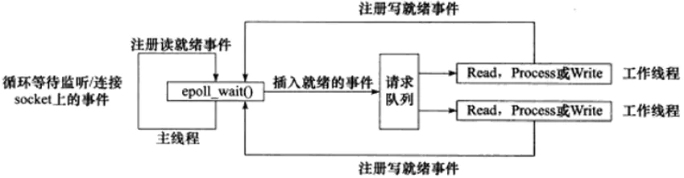
### 案例
例如：使用Reactor实现的日志服务器

日志服务器中的Reactor模式实现分为两部分

* 客户端连接到日志服务器

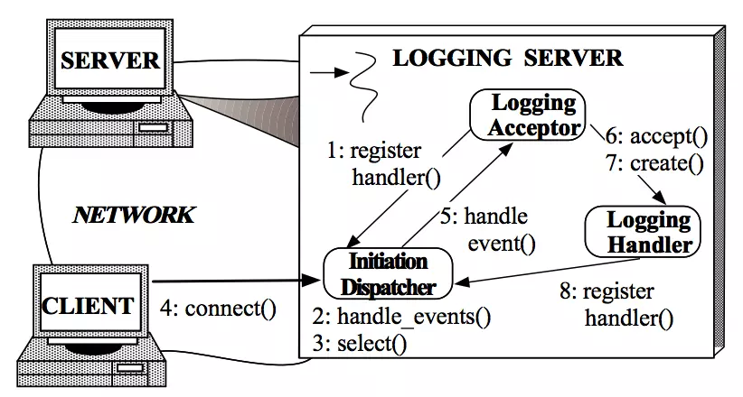

* 客户端向日志服务器写入日志

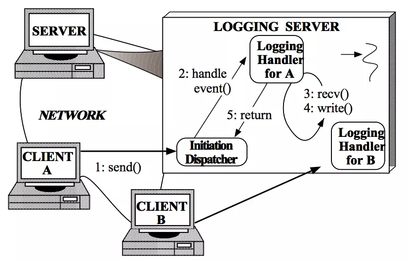

例如：需要建立一个提供分布式日志服务的事件驱动服务器，客户端向服务器发送请求记录自己的状态信息，信息包括错误通知、调试信息、表现诊断等。日志服务器对于收到的信息进行分类和分发，具体包括显示屏显示、打印机打印、数据库存储等。

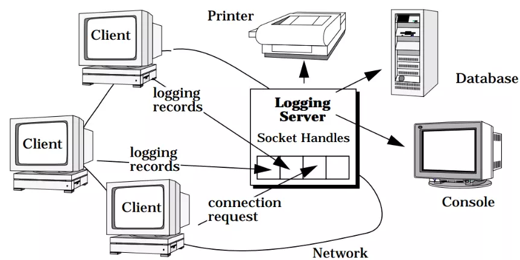

为了保证数据可靠性，客户端和服务器之间的通信协议通常选用TCP等面向连接的协议，通过IP和端口的四元组来确认客户端和服务器。日志服务器被多个客户端同时使用，为此日志服务器需要保证多用户连接请求和日志记录的并发性。

为了保证并发性，可采用多线程的方式去实现该服务器，即每个线程专门针对一个连接。然而使用多线程的方式实现服务器存在着以下问题：

* 效率

多线程导致的上下文切换、同步、数据移动等可能带来效率的下降。

* 编程简单性

多线程需要考虑复杂的并发设计，包括线程安全等诸多因素。

* 可移植性

多线程在不同的操作系统下是不同的，因此会影响到可移植性。

由于以上问题，多线程设计往往既不是最高效也不是最易于实现的方案，因此需要其他方案来实现可以并行请求的服务器。
