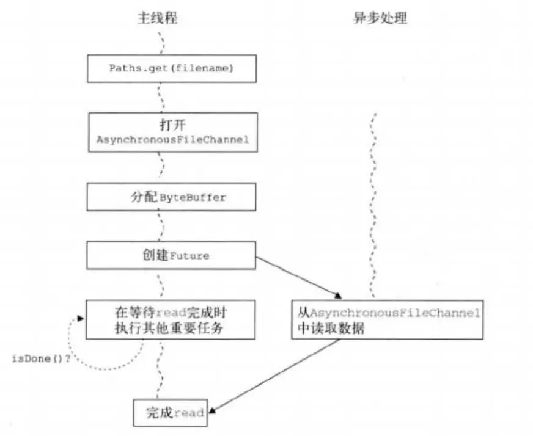
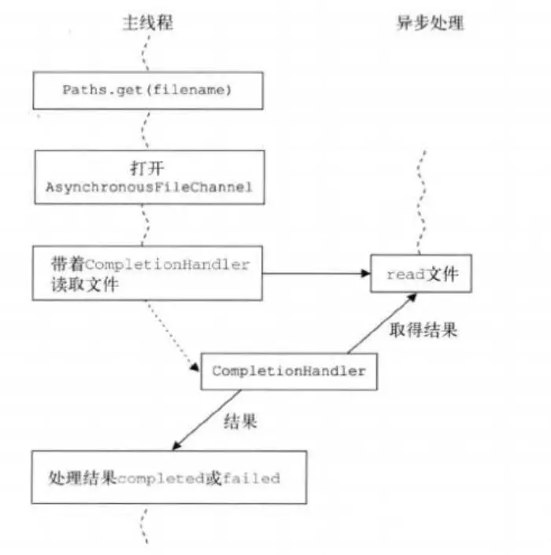

### 简介
jdk7中新增了一些与文件(网络)I/O相关的一些api。这些API被称为NIO.2，或称为AIO(Asynchronous I/O)。AIO最大的一个特性就是异步能力，这种能力对socket与文件I/O都起作用。AIO其实是一种在读写操作结束之前允许进行其他操作的I/O处理。AIO是对JDK1.4中提出的同步非阻塞I/O(NIO)的进一步增强。

dk7主要增加了三个新的异步通道:

* AsynchronousFileChannel: 用于文件异步读写；
* AsynchronousSocketChannel: 客户端异步socket；
* AsynchronousServerSocketChannel: 服务器异步socket。

因为AIO的实施需充分调用OS参与，IO需要操作系统支持、并发也同样需要操作系统的支持，所以性能方面不同操作系统差异会比较明显。
### 前提概念
在具体看AIO之前，我们需要知道一些必要的前提概念。
#### Unix中的I/O模型
Unix定义了五种I/O模型

* 阻塞I/O
* 非阻塞I/O
* I/O复用（select、poll、linux 2.6种改进的epoll）
* 信号驱动IO（SIGIO）
* 异步I/O（POSIX的aio_系列函数）

一个戏谑的例子：
> 如果你想吃一份宫保鸡丁盖饭：
> 
> - 同步阻塞：你到饭馆点餐，然后在那等着，还要一边喊：好了没啊！
> 
> - 同步非阻塞：在饭馆点完餐，就去遛狗了。不过溜一会儿，就回饭馆喊一声：好了没啊！
> 
> - 异步阻塞：遛狗的时候，接到饭馆电话，说饭做好了，让您亲自去拿。
> 
> - 异步非阻塞：饭馆打电话说，我们知道您的位置，一会给你送过来，安心遛狗就可以了。

#### Reactor与Proactor

* 两种IO多路复用方案:Reactor and Proactor。
* Reactor模式是基于同步I/O的，而Proactor模式是和异步I/O相关的。
* reactor：能收了你跟俺说一声。proactor: 你给我收十个字节，收好了跟俺说一声。

### 异步的处理
异步无非是通知系统做一件事情。然后忘掉它，自己做其他事情去了。很多时候系统做完某一件事情后需要一些后续的操作。怎么办？这时候就是告诉异步调用如何做后续处理。通常有两种方式：

* 将来式: 当你希望主线程发起异步调用，并轮询等待结果的时候使用将来式;
* 回调式: 常说的异步回调就是它。

以文件读取为例
#### 将来式


将来式用现有的Java.util.concurrent技术声明一个Future,用来保存异步操作的处理结果。通常用Future get()方法（带或不带超时参数）在异步IO操作完成时获取其结果。

AsynchronousFileChannel会关联线程池，它的任务是接收IO处理事件，并分发给负责处理通道中IO操作结果的结果处理器。跟通道中发起的IO操作关联的结果处理器确保是由线程池中的某个线程产生。
##### 将来式例子：
```java
Path path = Paths.get("/data/code/github/java_practice/src/main/resources/1log4j.properties");
AsynchronousFileChannel channel = AsynchronousFileChannel.open(path);
ByteBuffer buffer = ByteBuffer.allocate(1024);
Future<Integer> future = channel.read(buffer,0);
//        while (!future.isDone()){
//            System.out.println("I'm idle");
//        }
Integer readNumber = future.get();

buffer.flip();
CharBuffer charBuffer = CharBuffer.allocate(1024);
CharsetDecoder decoder = Charset.defaultCharset().newDecoder();
decoder.decode(buffer,charBuffer,false);
charBuffer.flip();
String data = new String(charBuffer.array(),0, charBuffer.limit());
System.out.println("read number:" + readNumber);
System.out.println(data);
```
#### 回调式


回调式所采用的事件处理技术类似于Swing UI编程采用的机制。基本思想是主线程会派一个侦查员CompletionHandler到独立的线程中执行IO操作。这个侦查员将带着IO的操作的结果返回到主线程中，这个结果会触发它自己的completed或failed方法（要重写这两个方法）。在异步IO活动结束后，接口java.nio.channels.CompletionHandler会被调用，其中V是结果类型，A是提供结果的附着对象。此时必须已经有了该接口completed（V,A）和failed(V,A)方法的实现，你的程序才能知道异步IO操作成功或失败时该如何处理。
##### 回调式例子：
```java
Path path = Paths.get("/data/code/github/java_practice/src/main/resources/1log4j.properties");
AsynchronousFileChannel channel = AsynchronousFileChannel.open(path);
ByteBuffer buffer = ByteBuffer.allocate(1024);
channel.read(buffer, 0, buffer, new CompletionHandler<Integer, ByteBuffer>() {
    @Override
    public void completed(Integer result, ByteBuffer attachment) {
        System.out.println(Thread.currentThread().getName() + " read success!");
    }

    @Override
    public void failed(Throwable exc, ByteBuffer attachment) {
        System.out.println("read error");
    }
});

while (true){
    System.out.println(Thread.currentThread().getName() + " sleep");
    Thread.sleep(1000);
}
```
### 异步socket client操作
```java
AsynchronousSocketChannel channel = AsynchronousSocketChannel.open();
channel.connect(new InetSocketAddress("127.0.0.1",8888)).get();
ByteBuffer buffer = ByteBuffer.wrap("中文,你好".getBytes());
Future<Integer> future = channel.write(buffer);

future.get();
System.out.println("send ok");
```
### 异步socket server操作
```java
final AsynchronousServerSocketChannel channel = AsynchronousServerSocketChannel
        .open()
        .bind(new InetSocketAddress("0.0.0.0",8888));
channel.accept(null, new CompletionHandler<AsynchronousSocketChannel, Void>() {
    @Override
    public void completed(final AsynchronousSocketChannel client, Void attachment) {
        channel.accept(null, this);

        ByteBuffer buffer = ByteBuffer.allocate(1024);
        client.read(buffer, buffer, new CompletionHandler<Integer, ByteBuffer>() {
            @Override
            public void completed(Integer result_num, ByteBuffer attachment) {
                attachment.flip();
                CharBuffer charBuffer = CharBuffer.allocate(1024);
                CharsetDecoder decoder = Charset.defaultCharset().newDecoder();
                decoder.decode(attachment,charBuffer,false);
                charBuffer.flip();
                String data = new String(charBuffer.array(),0, charBuffer.limit());
                System.out.println("read data:" + data);
                try{
                    client.close();
                }catch (Exception e){}
            }

            @Override
            public void failed(Throwable exc, ByteBuffer attachment) {
                System.out.println("read error");
            }
        });
    }

    @Override
    public void failed(Throwable exc, Void attachment) {
        System.out.println("accept error");
    }
});

while (true){
    Thread.sleep(1000);
}
```
