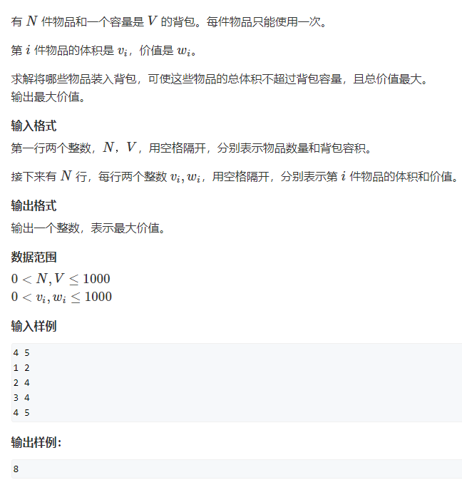
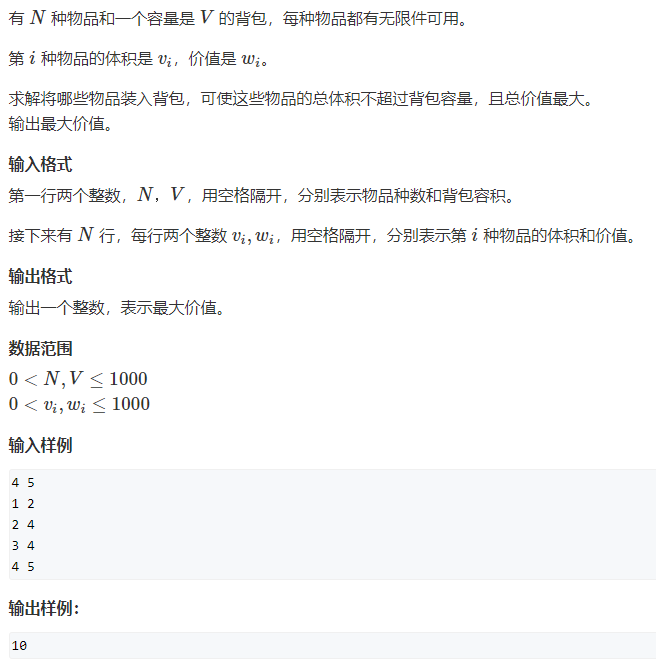
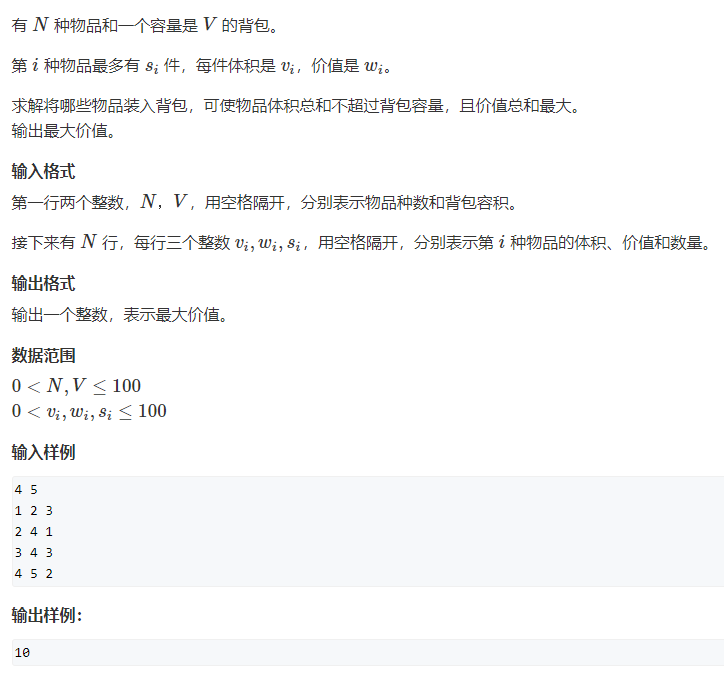
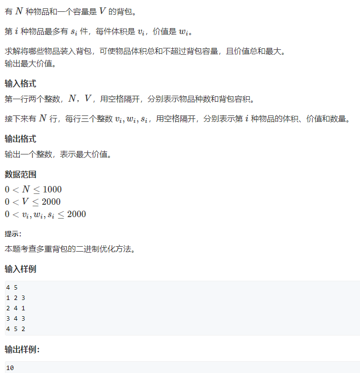
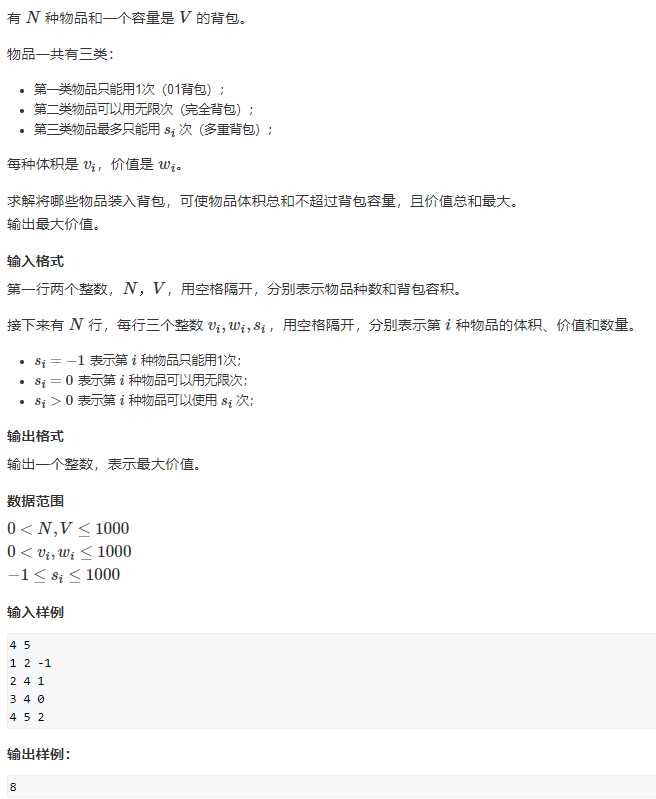
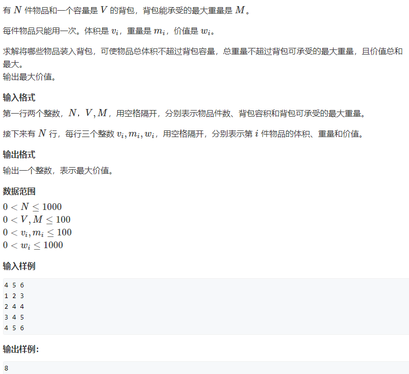
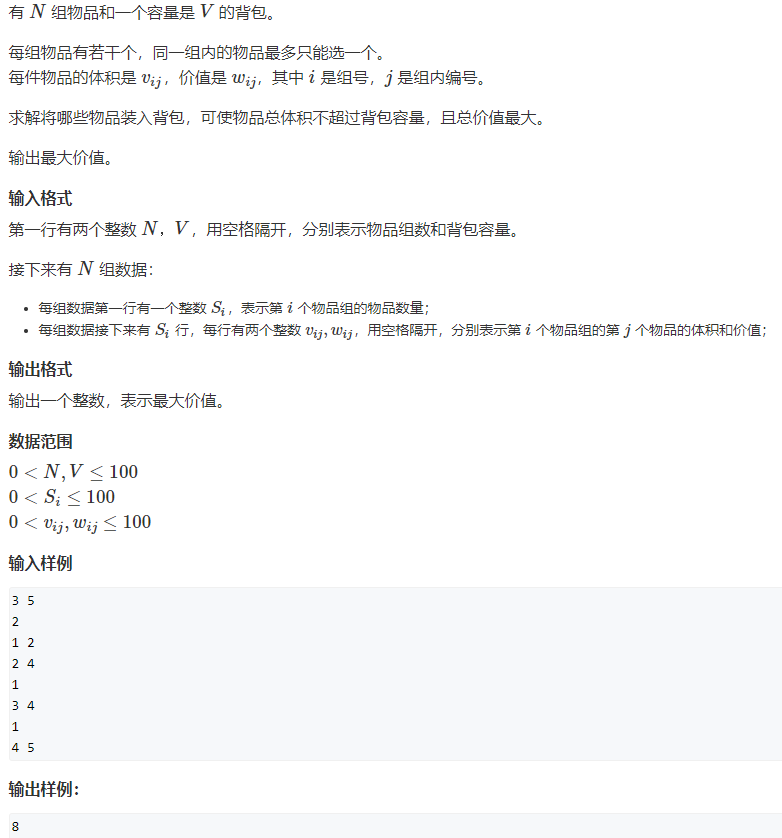
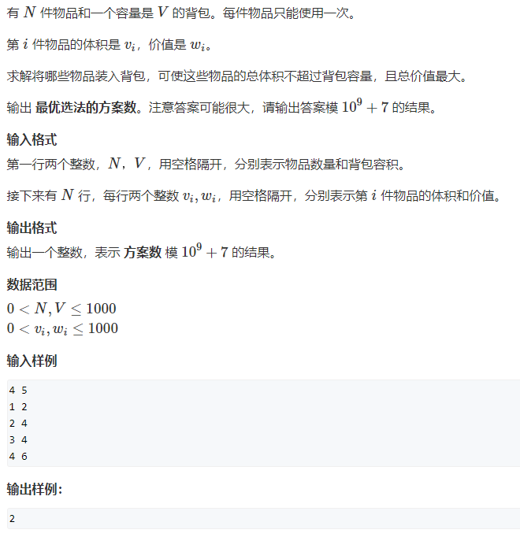

### 01背包问题
**每个物品只有选和不选两种状态**



```java
import java.util.*;
public class Main{
    public static void main(String[] args){
        Scanner sc=new Scanner(System.in);
        int N=sc.nextInt();
        int V=sc.nextInt();
        int[] v=new int[N];
        int[] w=new int[N];
        for(int i=0;i<N;i++){
            v[i]=sc.nextInt();
            w[i]=sc.nextInt();
        }
        // int[][] dp=new int[N+1][V+1];
        // for(int i=1;i<=N;i++){
        //     for(int j=0;j<=V;j++){
        //         dp[i][j]=dp[i-1][j];
        //         if(j-v[i-1]>=0){
        //             dp[i][j]=Math.max(dp[i-1][j],dp[i-1][j-v[i-1]]+w[i-1]);
        //         }
        //     }
        // }
        //  System.out.println(dp[N][V]);
        int[] dp=new int[V+1];
        for(int i=1;i<=N;i++){
            // 从大到小遍历
            for(int j=V;j>=0;j--){
                if(j>=v[i-1]){
                    dp[j]=Math.max(dp[j],dp[j-v[i-1]]+w[i-1]);
                }
            }
        }
        System.out.println(dp[V]);
    }
}
```
### 完全背包问题
**每个物品可以无限次选**



```java
import java.util.*;
public class Main{
    public static void main(String[] args){
        Scanner sc=new Scanner(System.in);
        int N=sc.nextInt();
        int V=sc.nextInt();
        int[] v=new int[N];
        int[] w=new int[N];
        for(int i=0;i<N;i++){
            v[i]=sc.nextInt();
            w[i]=sc.nextInt();
        }
        int[] dp=new int[V+1];
        for(int i=0;i<N;i++){
            // 代码与01背包的区别，从小到大遍历
            for(int j=0;j<=V;j++){
                if(j>=v[i]){
                    dp[j]=Math.max(dp[j],dp[j-v[i]]+w[i]);
                }
            }
        }
        System.out.println(dp[V]);
    }
}
```
### 多重背包问题 I
**物品个数有数量限制**



```java
import java.util.*;
public class Main{
    public static void main(String[] args){
        Scanner sc=new Scanner(System.in);
        int N=sc.nextInt();
        int V=sc.nextInt();
        int[] v=new int[N];
        int[] w=new int[N];
        int[] s=new int[N];
        for(int i=0;i<N;i++){
            v[i]=sc.nextInt();
            w[i]=sc.nextInt();
            s[i]=sc.nextInt();
        }
        // int[][] dp=new int[N+1][V+1];
        // for(int i=1;i<=N;i++){
        //     for(int j=0;j<=V;j++){
        //         for(int k=0;k<=s[i-1];k++){
        //             if(j>=k*v[i-1]){
        //                 dp[i][j]=Math.max(dp[i][j],dp[i-1][j-k*v[i-1]]+k*w[i-1]);
        //             }
        //         }
        //     }
        // }
        // System.out.println(dp[N][V]);
        int[] dp=new int[V+1];
        for(int i=1;i<=N;i++){
            // 01背包扩展，体积从大到小遍历
            for(int j=V;j>=0;j--){
                // 对物品数量进行遍历
                for(int k=0;k<=s[i-1];k++){
                    if(j>=k*v[i-1]){
                        dp[j]=Math.max(dp[j],dp[j-k*v[i-1]]+k*w[i-1]);
                    }
                }
            }
        }
        System.out.println(dp[V]);
    }
}
```
### 多重背包问题 II
**数据范围变大，需要使用二进制优化方法**



```java
import java.util.*;
public class Main{
    public static void main(String[] args){
        Scanner sc=new Scanner(System.in);
        int N=sc.nextInt();
        int V=sc.nextInt();
        int[] v=new int[N];
        int[] w=new int[N];
        int[] s=new int[N];
        for(int i=0;i<N;i++){
            v[i]=sc.nextInt();
            w[i]=sc.nextInt();
            s[i]=sc.nextInt();
        }
        List<good> goods=new ArrayList<>();
        // 转化为01背包问题，把物品数量拆成二进制组合，组合数能取到0~s中任意一个数
        for(int i=0;i<N;i++){
            for(int k=1;k<=s[i];k=k*2){
                s[i]=s[i]-k;
                goods.add(new good(k*v[i],k*w[i]));
            }
            if(s[i]>0){
                goods.add(new good(s[i]*v[i],s[i]*w[i]));
            }
        }
        int[] dp=new int[V+1];
        for(int i=1;i<=goods.size();i++){
            for(int j=V;j>=0;j--){
                if(j>=goods.get(i-1).v){
                    dp[j]=Math.max(dp[j],dp[j-goods.get(i-1).v]+goods.get(i-1).w);
                }
            }
        }
        System.out.println(dp[V]);
    }
}
class good{
    int v;
    int w;
    public good(int v,int w){
        this.v=v;
        this.w=w;
    }
}
```
### 混合背包问题
**01背包与完全背包混合，多重背包转化为01背包**



```java
import java.util.*;
public class Main{
    public static void main(String[] args){
        Scanner sc=new Scanner(System.in);
        int N=sc.nextInt();
        int V=sc.nextInt();
        List<Thing> things=new ArrayList<>();
        for(int i=0;i<N;i++){
            int v=sc.nextInt();
            int w=sc.nextInt();
            int s=sc.nextInt();
            if(s<0){
                things.add(new Thing(-1,v,w));
            }else if(s==0){
                things.add(new Thing(0,v,w));
            // 多重背包转化为01背包
            }else{
                for(int k=1;k<=s;k=k*2){
                    s=s-k;
                    things.add(new Thing(-1,k*v,k*w));
                }
                if(s>0){
                    things.add(new Thing(-1,s*v,s*w));
                }
            }
        }
        int[] dp=new int[V+1];
        for(int i=1;i<=things.size();i++){
            int kind=things.get(i-1).kind;
            if(kind<0){
                // 01背包，体积从大到小遍历
                for(int j=V;j>=things.get(i-1).v;j--){
                    dp[j]=Math.max(dp[j],dp[j-things.get(i-1).v]+things.get(i-1).w);
                }
            }else{
                // 完全背包，体积从小到大遍历
                for(int j=things.get(i-1).v;j<=V;j++){
                    dp[j]=Math.max(dp[j],dp[j-things.get(i-1).v]+things.get(i-1).w);
                }
            }
        }
        System.out.println(dp[V]);
    }
}
class Thing{
    int kind;
    int v;
    int w;
    public Thing(int kind,int v,int w){
        this.kind=kind;
        this.v=v;
        this.w=w;
    }
}
```
### 二维费用的背包问题
**多了一维重量限制，多一层循环**



```java
import java.util.*;
public class Main{
    public static void main(String[] args){
        Scanner sc=new Scanner(System.in);
        int N=sc.nextInt();
        int V=sc.nextInt();
        int M=sc.nextInt();
        int[] v=new int[N];
        int[] m=new int[N];
        int[] w=new int[N];
        for(int i=0;i<N;i++){
            v[i]=sc.nextInt();
            m[i]=sc.nextInt();
            w[i]=sc.nextInt();
        }
        int[][] dp=new int[V+1][M+1];
        for(int i=0;i<N;i++){
            for(int j=V;j>=v[i];j--){
                // 重量同样从大到小遍历
                for(int k=M;k>=m[i];k--){
                    dp[j][k]=Math.max(dp[j][k],dp[j-v[i]][k-m[i]]+w[i]);
                }
            }
        }
        System.out.println(dp[V][M]);
    }
}
```
### 分组背包问题
**每个物品组中最多只能选择一个物品**



```java
import java.util.*;
public class Main{
    public static void main(String[] args){
        Scanner sc=new Scanner(System.in);
        int N=sc.nextInt();
        int V=sc.nextInt();
        int[] dp=new int[V+1];
        for(int i=0;i<N;i++){
            int S=sc.nextInt();
            int[] v=new int[S];
            int[] w=new int[S];
            for(int t=0;t<S;t++){
                v[t]=sc.nextInt();
                w[t]=sc.nextInt();
            }
            // 每组之间是01背包问题
            for(int j=V;j>=0;j--){
                // 组内遍历
                for(int k=0;k<S;k++){
                    if(j>=v[k]){
                        dp[j]=Math.max(dp[j],dp[j-v[k]]+w[k]);
                    }
                }
            }
        }
        System.out.println(dp[V]);
    }
}
```
### 背包问题求方案数
**求取得最大值的方案数**



```java
import java.util.*;
public class Main{
    public static void main(String[] args){
        Scanner sc=new Scanner(System.in);
        int mod=1000000007;
        int N=sc.nextInt();
        int V=sc.nextInt();
        int[] v=new int[N];
        int[] w=new int[N];
        for(int i=0;i<N;i++){
            v[i]=sc.nextInt();
            w[i]=sc.nextInt();
        }
        int[] dp=new int[V+1];
        int[] count=new int[V+1];
        for(int i=0;i<=V;i++){
            count[i]=1;
        }
        for(int i=0;i<N;i++){
            for(int j=V;j>=v[i];j--){
                int value=dp[j-v[i]]+w[i];
                if(value>dp[j]){
                    dp[j]=value;
                    count[j]=count[j-v[i]];
                }else if(value==dp[j]){
                    // 有两条路径
                    count[j]=(count[j-v[i]]+count[j])%mod;
                }
            }
        }
        System.out.println(count[V]);
    }
}
```
