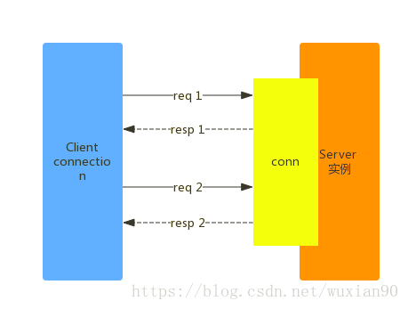

## 一、连接的建立

redis客户端和服务器之间通过socket套接字的方式建立连接，客户端每隔一段时间（1s或其他，单机和集群等不同）向redis服务器通过套接字连接发送ping命令，服务器返回pong响应，确保该套接字连接有效。密码的功能，是通过redis.conf这个配置文件来配置的，redis服务器启动的时候，会进行服务器状态等一系列的初始化，其中一项就是加载redis.conf的配置。如果在redis.conf的配置中开启了requiredpass 配置，则客户端连接需要进行密码验证。这里也可以不使用密码进行连接，但是客户端发送的命令，服务器会拒绝执行。这和服务器端的命令处理逻辑有关。


Redis 通过监听一个 TCP 端口或者 Unix socket 的方式来接收来自客户端的连接，当一个连接建立后，Redis 内部会进行以下一些操作：

+ 首先，客户端 socket 会被设置为非阻塞模式（客户端可以去做其他事情），因为 Redis 在网络事件处理上采用的是非阻塞多路复用模型。
+ 然后为这个socket 设置 TCP_NODELAY 属性，禁用 Nagle 算法（Nagle算法主要避免网络因为太多的小包（协议头的比例非常之大）而拥塞）
+ 然后创建一个 readable 的文件事件用于监听这个客户端 socket 的数据发送

当客户端连接被初始化后，Redis 会查看目前的连接数，然后对比配置好的 maxclients 值，如果目前连接数已经达到最大连接数 maxclients 了，那么说明这个连接不能再接收，Redis 会直接返回客户端一个连接错误，并马上关闭掉这个连接。

## 二、服务端处理顺序

如果有多个客户端连接上 Redis，并且都向 Redis 发送命令，那么 Redis 服务端会先处理哪个客户端的请求呢？答案其实并不确定，主要与两个因素有关，一是客户端对应的 socket 对应的数字的大小，二是 kernal 报告各个客户端事件的先后顺序。

Redis 处理一个客户端传来数据的步骤如下：

+ 它对触发事件的 socket 调用一次 read()，只读一次（而不是把这个 socket 上的消息读完为止），是为了防止由于某个别客户端持续发送太多命令，导致其它客户端的请求长时间得不到处理的情况。
+ 当然，当这一次 read() 调用完成后，它里面无论包含多少个命令，都会被一次性顺序地执行。这样就保证了对各个客户端命令的公平对待。

## 三、关于最大连接数 maxclients

在 Redis2.4 中，最大连接数是被直接硬编码在代码里面的，而在2.6版本中这个值变成可配置的。maxclients 的默认值是 10000，你也可以在 redis.conf 中对这个值进行修改。

当然，这个值只是 Redis 一厢情愿的值，Redis 还会照顾到系统本身对进程使用的文件描述符数量的限制。在启动时 Redis 会检查系统的 soft limit，以查看打开文件描述符的个数上限。如果系统设置的数字，小于咱们希望的最大连接数加32，那么这个 maxclients 的设置将不起作用，Redis 会按系统要求的来设置这个值。（加32是因为 Redis 内部会使用最多32个文件描述符，所以连接能使用的相当于所有能用的描述符号减32）。

当上面说的这种情况发生时（maxclients 设置后不起作用的情况），Redis 的启动过程中将会有相应的日志记录。比如下面命令希望设置最大客户端数量为100000，所以 Redis 需要 100000+32 个文件描述符，而系统的最大文件描述符号设置为10144，所以 Redis 只能将 maxclients 设置为 10144 – 32 = 10112。

```java
$ ./redis-server --maxclients 100000
[41422] 23 Jan 11:28:33.179 # Unable to set the max number of files limit to 100032 (Invalid argument), setting the max clients configuration to 10112.
```
所以说当你想设置 maxclients 值时，最好顺便修改一下你的系统设置，当然，养成看日志的好习惯也能发现这个问题。

具体的设置方法就看你个人的需求了，你可以只修改此次会话的限制，也可以直接通过sysctl 修改系统的默认设置。如：

>ulimit -Sn 100000 # This will only work if hard limit is big enough.
>sysctl -w fs.file-max=100000

## 四、输出缓冲区大小限制

对于 Redis 的输出（也就是命令的返回值）来说，其大小经常是不可控的，可能是一个简单的命令，能够产生体积庞大的返回数据。另外也有可能因为执行命令太多，产生的返回数据的速率超过了往客户端发送的速率，这时也会产生消息堆积，从而造成输出缓冲区越来越大，占用过多内存，甚至导致系统崩溃。

所以 Redis 设置了一些保护机制来避免这种情况的出现，这些机制作用于不同种类的客户端，有不同的输出缓冲区大小限制，限制方式有两种：

+ 一种是大小限制，当某一个客户端的缓冲区超过某一大小时，直接关闭掉这个客户端连接
+ 另一种是当某一个客户端的缓冲区持续一段时间占用空间过大时，也直接关闭掉客户端连接

对于不同客户端的策略如下：

+ 对普通客户端来说，限制为0，也就是不限制，因为普通客户端通常采用阻塞式的消息应答模式，如：发送请求，等待返回，再发请求，再等待返回。这种模式通常不会导致输出缓冲区的堆积膨胀。
+ 对于 Pub/Sub 客户端来说，大小限制是32m，当输出缓冲区超过32m时，会关闭连接。持续性限制是，当客户端缓冲区大小持续60秒超过8m，也会导致连接关闭。
+ 而对于 Slave 客户端来说，大小限制是256m，持续性限制是当客户端缓冲区大小持续60秒超过64m时，关闭连接。
+ 
上面三种规则都是可配置的。可以通过 CONFIG SET 命令或者修改 redis.conf 文件来配置。

## 五、输入缓冲区大小限制

Redis 对输入缓冲区大小的限制比较暴力，当客户端传输的请求大小超过1G时，服务端会直接关闭连接。这种方式可以有效防止一些客户端或服务端 bug 导致的输入缓冲区过大的问题。

## 六、Client 超时

对当前的 Redis 版本来说，服务端默认是不会关闭长期空闲的客户端的。但是你可以修改默认配置来设置你希望的超时时间。比如客户端超过多长时间无交互，就直接关闭。同理，这也可以通过 CONFIG SET 命令或者修改 redis.conf 文件来配置。

值得注意的是，超时时间的设置，只对普通客户端起作用，对 Pub/Sub 客户端来说，长期空闲状态是正常的。

另外，实际的超时时间可能不会像设定的那样精确，这是因为 Redis 并不会采用计时器或者轮训遍历的方法来检测客户端超时，而是通过一种渐近式的方式来完成，每次检查一部分。所以导致的结果就是，可能你设置的超时时间是10s，但是真实执行的时间是超时12s后客户端才被关闭。

## 七、CLIENT 命令

Redis 的 CLIENT 命令能够实现三种功能：检查连接的状态，杀掉某个连接以及为连接设置名字。

CLIENT LIST 命令能够获取当前所有客户端的状态，使用方法如下：

```java
redis 127.0.0.1:6379> client list
addr=127.0.0.1:52555 fd=5 name= age=855 idle=0 flags=N db=0 sub=0 psub=0 multi=-1 qbuf=0 qbuf-free=32768 obl=0 oll=0 omem=0 events=r cmd=client
addr=127.0.0.1:52787 fd=6 name= age=6 idle=5 flags=N db=0 sub=0 psub=0 multi=-1 qbuf=0 qbuf-free=0 obl=0 oll=0 omem=0 events=r cmd=ping
```
如上面命令的输出可知，目前此 Redis 有两个客户端连接，每一行表示一个连接的各项信息：

addr: 客户端的TCP地址，包括IP和端口
fd: 客户端连接 socket 对应的文件描述符句柄号
name: 连接的名字，默认为空，可以通过 CLIENT SETNAME 设置
age: 客户端存活的秒数
idle: 客户端空闲的秒数
flags: 客户端的类型 (N 表示普通客户端，更多类型见 http://redis.io/commands/client-list)
omem: 输出缓冲区的大小
cmd: 最后执行的命令名称

你可以查看 CLIENT LIST 的文档来具体查看所有输出的含义。

当你通过上面命令获取到客户端列表后，就可以通过 CLIENT KILL 命令来杀死指定的连接了。CLIENT KILL 的参数就是上面的 addr 值。如上面提到的 CLIENT SETNAME 和 CLIENT GETNAME 可以用来为一个连接设置一个名字。

## 八、实现

### 8.1、 串行化实现
串行化的实现方式比较简单，同一个connection在前一个命令执行完成之后，再发送第二个请求。如下图所示：



单连接吞吐量 = 1 / (2*网络延迟 + 服务器处理时间 + 客户端处理时间)

Redis 对于单个请求的处理时间（10几微秒）通常比局域网的延迟小1个数量级。因此串行模式下，单连接的大部分时间都处于网络等待，没有充分利用服务器的处理能力。

### 8.2、pipeline实现

因为TCP是全双工的，请求响应穿插进行时，也不会引起混淆。此时批量的发送命令至服务器，在批量的获取响应数据，可以极大的提高单连接的吞吐量。如下所示：


上面就是pipeline 交互模式的穿插请求响应。pipeline 的实现取决于客户端，需要考虑一下几个方面：

+ 通过批量发送还是异步化请求实现。
+ 批量发送需要考虑每个批次的数据量，避免连接的buffer 满之后的死锁。
+ 对使用者如何封装接口，使得pipiline 使用简单。
+ pileline 能达到的单连接每秒最高吞吐量为：

>(n - 2*网络延迟) / n*(服务器处理时间 + 客户端处理时间)

当n 无限大时，可以得到：

>1 / (服务器处理时间 + 客户端处理时间)

此时可以看出，吞吐量上了一个数量级。


