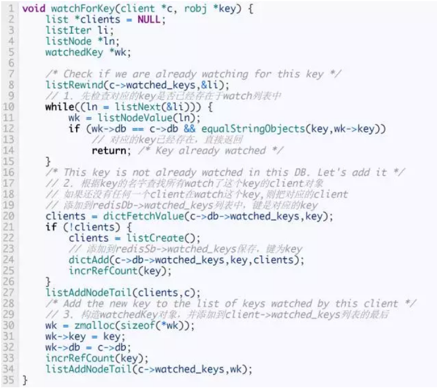
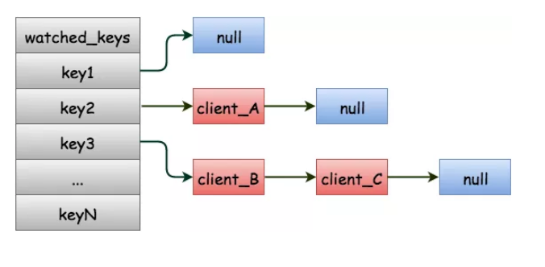
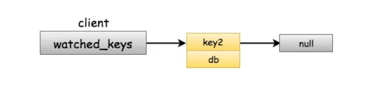
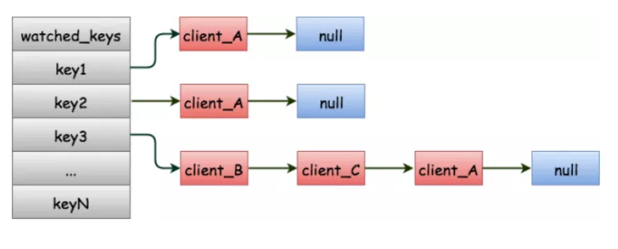
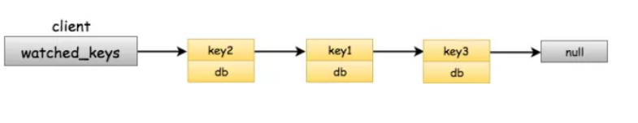
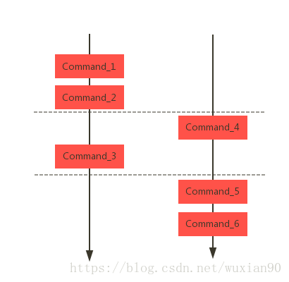
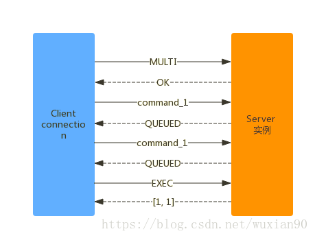

## Redis 事务

### 一、What

Redis事务提供了一种将多个命令请求打包，然后一次性、按照顺序地执行多个命令的机制，并且在事务执行的期间，服务器不会中断事务而去执行其他不在事务中的命令请求，它会把事务中所有的命令都执行完毕才会去执行其他的命令。

Redis 事务可以一次执行多个命令， 并且带有以下三个重要的保证：

+ 批量操作在发送 EXEC 命令前被放入队列缓存。
+ 收到 EXEC 命令后进入事务执行，事务中任意命令执行失败，其余的命令依然被执行。
+ 在事务执行过程，其他客户端提交的命令请求不会插入到事务执行命令序列中。

一个事务从开始到执行会经历以下三个阶段：
+ 开始事务。
+ 命令入队。
+ 执行事务。

### 二、How

Redis中提供了multi、discard、exec、watch、unwatch这几个命令来实现事务的功能。

+ EXEC：	执行所有事务块内的命令。														
+ MULTI：	标记一个事务块的开始。													
+ UNWATCH：	取消 WATCH 命令对所有 key 的监视。											
+ WATCH key [key ...]：	监视一个(或多个) key ，如果在事务执行之前这个(或这些) key 被其他命令所改动，那么事务将被打断。


它先以 MULTI 开始一个事务， 然后将多个命令入队到事务中， 最后由 EXEC 命令触发事务， 一并执行事务中的所有命令。单个 Redis 命令的执行是原子性的，但 Redis 没有在事务上增加任何维持原子性的机制，所以 Redis 事务的执行并不是原子性的。事务可以理解为一个打包的批量执行脚本，但批量指令并非原子化的操作，中间某条指令的失败不会导致前面已做指令的回滚，也不会造成后续的指令不做。


**multi、exec和discard**

multi命令告诉Redis客户端要开始一个事物,然后Redis会返回一个OK，接下来所有的命令Redis都不会立即执行，只会返回QUEUED结果，直到遇到了exec命令才会去执行之前的所有的命令，或者遇到了discard命令，会抛弃执行之前加入事务的命令。

```java
127.0.0.1:6379> get name

(nil)

127.0.0.1:6379> get gender

(nil)

127.0.0.1:6379> multi
OK
127.0.0.1:6379> set name Slogen
QUEUED
127.0.0.1:6379> set gender male
QUEUED
127.0.0.1:6379> exec
1) OK
2) OK
127.0.0.1:6379> mget name gender
1) "Slogen"
2) "male"

```

**watch**

watch命令是Redis提供的一个乐观锁，可以在exec执行之前，监视任意数量的数据库key，并在exec命令执行的时候，检测被监视的key是否至少有一个已经被修改，如果是的话，服务器将拒绝执行事务，并向客户端返回代表事务执行失败的空回复。

首先在client1执行下列命令:
```java
127.0.0.1:6379> get name
(nil)

127.0.0.1:6379> watch name
OK

127.0.0.1:6379> multi
OK

127.0.0.1:6379> set name slogen
QUEUED

127.0.0.1:6379> set gender male
QUEUED

127.0.0.1:6379> get name
QUEUED
```

这个时候client还没有执行exec命令，接下来在client2下执行下面命令修改name:
```java
127.0.0.1:6379> set name rio
OK

127.0.0.1:6379> get name
"rio"
```

接下来在client1下执行exec命令:

```java
127.0.0.1:6379> exec
(nil)
127.0.0.1:6379> get name
"rio"
```
从执行结果可以看到，在client1中执行exec命令的时候，Redis会检测到name字段已经被其他客户端修改了，所以拒绝执行事务中所有的命令，直接返回nil表示执行失败。这个时候获取到的name的值还是在client2中设置的rio。


### Why

**multi**

Redis的事务始于multi命令，那么就从multi命令的源代码开始分析。当Redis接收到客户端发送过来的命令之后会执行multiCommand()这个方法，这个方法在multi.c文件中。

```java
void multiCommand(client *c) {

    // 1. 如果检测到flags里面已经包含了CLIENT_MULTI
    // 表示对应client已经处于事务的上下文中，返回错误

    if (c->flags & CLIENT_MULTI) {
        addReplyError(c,"MULTI calls can not be nested");
        return;
    }

    // 2. 开启flags的CLIENT_MULTI标识

    c->flags |= CLIENT_MULTI;

    // 3. 返回ok,告诉客户端已经成功开启事务

    addReply(c,shared.ok);
}
```

从源代码中可以看到，multiCommand()主要完成下面三件事:

1. 检测发送multi命令的client是否已经处于事务中，如果是则直接返回错误。从这里可以看到，Redis不支持事务嵌套执行。
2. 给对应client的flags标志位中增加MULTI_CLIENT标志，表示已经进入事务中。
3. 返回OK告诉客户端已经成功开启事务。


Redis接收到所有的Client发送过来的命令后都会执行到processCommand()这个方法中，在processCommand()中有下面这部分代码:
```java
int processCommand(client *c){
	//其它省略代码
	
	//*Exec the command*/
	//事务在这里执行
	if (c->flag & CLIENT_MULTI && c->cmd->proc != execCommand && c->cmd->proc != discardCommand && c->cmd->proc != multiCommand && c->cmd->proc != watchCommand) {
		//把命令加入队列
		queueMultiCommand( C );
		addReply( c, shared.queued); //给客户端返回QUEUED
	}
	else{
		call(c,CMD_CALL_FULL);
		c->woff = server.master_repl_offset;
		if (listLength(server.ready_keys))
			handleClientsBlockedOnLists();
	}
	return C_OK;
}
```

在processCommand()执行实际的命令之前会先判断对应的client是否已经处于事务的上下文中，如果是的话，且需要执行的命令不是exec、discard、multi和watch这四个命令中的任何一个，则调用queueMultiCommand()方法把需要执行的命令加入队列中，否则的话调用call()直接执行命令。


**queueMultiCommand()**

Redis调用queueMultiCommand()方法把加入事务的命令加入Redis队列中，实现如下:


queueMultiCommand()方法主要是把要加入事务的命令封装在multiCmd结构的变量，然后放置到client->mstate.commands数组中去，multiCmd的定义如下:

```java
typedef struct multiCmd {
    robj **argv; // 命令的参数数组
    int argc; // 命令的参数个数
    struct redisCommand *cmd; // 要执行的命令
} multiCmd;
```

而mstate字段定义为:

```java
typedef struct client {
    // 其他省略代码
    multiState mstate;      /* MULTI/EXEC state */
} client;
```


multiState的结构为:

```java
typedef struct multiState {
    multiCmd *commands;     /* Array of MULTI commands */
    int count;              /* Total number of MULTI commands */
    int minreplicas;        /* MINREPLICAS for synchronous replication */
    time_t minreplicas_timeout; /* MINREPLICAS timeout as unixtime. */
} multiState;
```
commands:multiCmd类型的数组，存放着事务中所有的要执行的命令
count:当前事务中所有已经存放的命令的个数

另外两个字段当前版本中(3.2.28)没用上。

假设当前事务队列中已经存在set name slogen和lpush num 20这两个命令的时候，client中的mstate的数据如下:


这个时候再往事务中添加get name这个命令的时候结构图如下:


**错误命令:CLIENT_DIRTY_EXEC**

那么有个问题，比如我往事务中添加的命令是个不存在的命令，或者命令使用方式，比如命令参数不对，这个时候这个命令会被加入事务吗？

前面说了，Redis接收到的所有的命令都是执行到processCommand()这个方法，在实际执行对应的命令前，processCommand()方法都会对将要执行的命令进行一系列的检查。

processCommand()在对要执行的命令进行的一系列检查的时候如果有任何一项检测失败都会调用flagTransaction()函数然后返回对应的信息给客户端，flagTransaction()实现如下:

```java
void flagTransaction(client *c) {
    if (c->flags & CLIENT_MULTI)
        // 如果flags包含CLIENT_MULTI标志位，表示已经处于事务上下文中
        // 则给对应的client的flags开启CLIENT_DIRTY_EXEC标志位
        c->flags |= CLIENT_DIRTY_EXEC;
}
```

flagTransaction()方法会检测对应的client是否处于事务的上下文中，如果是的话就给对应的client的flags字段开启CLIENT_DIRTY_EXEC标志位。

也就是说，如果命令在加入事务的时候由于各种原因，比如命令不存在，或者对应的命令参数不正确，则对应的命令不会被添加到mstate.commands数组中，且同时给对应的client的flags字段开启CLIENT_DIRTY_EXEC标志位。

**watch命令**

当client处于事务的上下文中时，watch命令属于可以被立即执行的几个命令之一,watch命令对应的代码为watchCommand()函数，实现如下:

```java
void watchCommand(client *c) {
    int j;
    if (c->flags & CLIENT_MULTI) {
        // 如果执行watch命令的client处于事务的上下文中则直接返回
        addReplyError(c,"WATCH inside MULTI is not allowed");
        return;
    }
    for (j = 1; j < c->argc; j++)
        // 对传入的每个要watch的可以调用watchForKey()
        watchForKey(c,c->argv[j]);
    addReply(c,shared.ok);
}
```
watchCommand()方法会首先判断执行watch的命令是否已经处于事务的上下文中，如果是的话则直接报错返回，说明在Redis事务中不能调用watch命令。

接下来对于watch命令传入的所有的key，依次调用watchForKey()方法，定义如下:



watchForKey()方法会做下面几件事:

1. 判断对应的key是否已经存在于client->watched_keys列表中，如果已经存在则直接返回。client->watched_keys保存着对应的client对象所有的要监视的key。
2. 如果不存在，则去client->db->watched_keys中查找所有的已经监视了这个key的client对象。client->db->watched_keys以dict的结构保存了所有的监视这个key的client列表。
3. 如果第二步中的列表存在，则把执行watch命令的client添加到这个列表的尾部，如果不存在，表示还没有任何一个client监视这个key,则新建一个列表，添加到client->db->watched_keys中，然后把执行watch命令的client添加到新生成的列表的尾部。
4. 把传入的key封装成一个watchedKey结构的变量，添加到client->watched_key列表的最后面。

假设当前client->db->watched_keys的监测情况如下图所示:



而client->watched_keys的监测情况如下:



这个时候client_A执行watch key1 key2 key3这个命令，执行完命令之后client->db->watched_keys结果为



而client->watched_keys结果为



对于key1,目前还没有client对key1进行监视，所以这个时候client_A会新建一个列表，把自己添加到这个列表中然后把映射关系添加到client->db->watched_keys中去，之后会把key1添加到client->watched_keys列表的最后。


对于key2，由于已经存在于watched_keys列表中，所以会直接返回不做任何处理。


对于key3，由于client->db->watched_keys中已经有client_B和client_C在监视它，所以会直接把client_A添加到监视列表的末尾之后再把key3添加到client_A的监视列表中去。

**修改数据:CLIENT_DIRTY_CAS**

watch命令的作用就是用在事务中检测被监视的key是否被其他的client修改了，如果已经被修改，则阻止事务的执行，那么这个功能是怎么实现的呢？


这里以set命令为例进行分析。


假设client1执行了watch name这个命令然后执行multi命令开启了事务但是还没有执行exec命令，这个时候client2执行了set name slogen这个命令,整个过程如下:

| 时间 | client1 | client2 |
|----  |----     |-----    |
| T1   | watch  name |     |	
| T2   | multi |           |	
| T3   | get name |        |
| T4 |	 |  set name slogen |
| T5 | exec |	|


在T4的时候client_B执行了set命令修改了name,Redis收到set命令之后会执行setCommand方法，实现如下:

```java
void setCommand(client *c) {
    // 其他省略代码
    setGenericCommand(c,flags,c->argv[1],c->argv[2],expire,unit,NULL,NULL);
}
```


在setCommand()最后会调用setGenericCommand()方法，改方法实现如下:

```java
void setGenericCommand(client *c, int flags, robj *key, robj *val, robj *expire, int unit, robj *ok_reply, robj *abort_reply) {
    // 其他省略代码
    setKey(c->db,key,val);
    // 其他省略代码
}
```

在setGenericCommand()方法中会调用setKey()这个方法，接着看下setKey()这个方法:

```java
void setKey(redisDb *db, robj *key, robj *val) {
    if (lookupKeyWrite(db,key) == NULL) {
        dbAdd(db,key,val);
    } else {
        dbOverwrite(db,key,val);
    }
    incrRefCount(val);
    removeExpire(db,key);
    // 通知修改了key
    signalModifiedKey(db,key);
}
```


在setKey()方法最后会调用signaleModifiedKey()通知redis数据库中有数据被修改,signaleModifiedKey()方法实现如下:
```java
void signalModifiedKey(redisDb *db, robj *key) {
    touchWatchedKey(db,key);
}
```
可以看到signalModifiedKey()也仅仅是调用touchWatchedKey()方法，代码如下:
```java
void touchWatchedKey(redisDb *db, robj *key) {
    list *clients;
    listIter li;
    listNode *ln;
    if (dictSize(db->watched_keys) == 0) return;
    // 1. 从redisDb->watched_keys中找到对应的client列表
    clients = dictFetchValue(db->watched_keys, key);
    if (!clients) return;
    /* Mark all the clients watching this key as CLIENT_DIRTY_CAS */

    /* Check if we are already watching for this key */
    listRewind(clients,&li);
    while((ln = listNext(&li))) {
        // 2.依次遍历client列表，给每个client的flags字段
        // 开启CLIENT_DIRTY_CAS标识位
        client *c = listNodeValue(ln);
        c->flags |= CLIENT_DIRTY_CAS;
    }
}
```

touchWatchedKey()方法会做下面两件事:

1. 从redisDb->watched_keys中找到监视这个key的client列表。前面在分析watch命令的时候说过，如果有client执行了watch keys命令，那么redis会以键值对的形式把(key,client)的对应关系保存在redisDb->watched_key这个字段里面。
2. 对于第一步中找到的每个client对象，都会给这个client的flags 字段开启CLIENT_DIRTY_CAS标志位。

在Redis里面所有会修改数据库内容的命令最后都会调用signalModifiedKey()这个方法，而在signalModifiedKey()会给所有的监视这个key的client增加CLIENT_DIRTY_CAS标志位。

**exec命令**

exec命令用来执行事务，对应的代码为execCommand()这个方法，实现如下:
```java
void execCommand(client *c) {
    int j;
    robj **orig_argv;
    int orig_argc;
    struct redisCommand *orig_cmd;
    int must_propagate = 0; /* Need to propagate MULTI/EXEC to AOF / slaves? */
    // 1. 判断对应的client是否属于事务中
    if (!(c->flags & CLIENT_MULTI)) {
        addReplyError(c,"EXEC without MULTI");
        return;
    }
    /**
     * 2. 检查是否需要执行事务，在下面两种情况下不会执行事务
     * 1) 有被watch的key被其他的客户端修改了，对应于CLIENT_DIRTY_CAS标志位被开启
     * ,这个时候会返回一个nil，表示没有执行事务
     * 2) 有命令在加入事务队列的时候发生错误，对应于CLIENT_DIRTY_EXEC标志位被开启
     * ,这个时候会返回一个execaborterr错误
     */
    if (c->flags & (CLIENT_DIRTY_CAS|CLIENT_DIRTY_EXEC)) {
        addReply(c, c->flags & CLIENT_DIRTY_EXEC ? shared.execaborterr :  shared.nullmultibulk);
        // 取消所有的事务
        discardTransaction(c);
        goto handle_monitor;
    }
    /* Exec all the queued commands */
    // 3. unwatch所有被这个client watch的key
    unwatchAllKeys(c); /* Unwatch ASAP otherwise we'll waste CPU cycles */
    orig_argv = c->argv;
    orig_argc = c->argc;
    orig_cmd = c->cmd;
    addReplyMultiBulkLen(c,c->mstate.count);
    // 4. 依次执行事务队列中所有的命令
    for (j = 0; j < c->mstate.count; j++) {
        c->argc = c->mstate.commands[j].argc;
        c->argv = c->mstate.commands[j].argv;
        c->cmd = c->mstate.commands[j].cmd;
        /* Propagate a MULTI request once we encounter the first write op.
         * This way we'll deliver the MULTI/..../EXEC block as a whole and
         * both the AOF and the replication link will have the same consistency
         * and atomicity guarantees. */
        if (!must_propagate && !(c->cmd->flags & CMD_READONLY)) {
            execCommandPropagateMulti(c);
            must_propagate = 1;
        }
        call(c,CMD_CALL_FULL);
        /* Commands may alter argc/argv, restore mstate. */
        c->mstate.commands[j].argc = c->argc;
        c->mstate.commands[j].argv = c->argv;
        c->mstate.commands[j].cmd = c->cmd;
    }
    c->argv = orig_argv;
    c->argc = orig_argc;
    c->cmd = orig_cmd;
    // 5. 重置这个client对应的事务相关的所有的数据
    discardTransaction(c);
    /* Make sure the EXEC command will be propagated as well if MULTI was already propagated. */
    if (must_propagate) server.dirty++;
handle_monitor:
    if (listLength(server.monitors) && !server.loading)
        replicationFeedMonitors(c,server.monitors,c->db->id,c->argv,c->argc);
}
```

execCommand()方法会做下面几件事:
1. 判断对应的client是否已经处于事务中，如果不是，则直接返回错误。
2. 判断时候需要执行事务中的命令。在下面两种情况下不会执行事务而是返回错误。

+ 有被监视的key被其他的客户端修改了，对应于CLIENT_DIRTY_CAS标志位被开启，这个时候会返回一个nil，表示没有执行事务。
+ 有命令在加入事务队列的时候发生错误，对应于CLIENT_DIRTY_EXEC标志位被开启，这个时候会返回一个execaborterr错误。
3. unwatch所有被这个client监视的key。
4. 依次执行事务队列中所有的命令。
5. 重置这个client对应的事务相关的所有的数据。

**discard**
使用discard命令可以取消一个事务，对应的方法为discardCommand(),实现如下:
```java
void discardCommand(client *c) {
    // 1. 检查对应的client是否处于事务中
    if (!(c->flags & CLIENT_MULTI)) {
        addReplyError(c,"DISCARD without MULTI");
        return;
    }
    // 2. 取消事务
    discardTransaction(c);
    addReply(c,shared.ok);
}
```
discardCommand()方法首先判断对应的client是否处于事务中，如果不是则直接返回错误，否则的话会调用discardTransaction()方法取消事务，该方法实现如下:
```java
void discardTransaction(client *c) {
    // 1. 释放所有跟MULTI/EXEC状态相关的资源    
    freeClientMultiState(c);
    // 2. 初始化相应的状态
    initClientMultiState(c);
    // 3. 取消对应client的3个标志位
    c->flags &= ~(CLIENT_MULTI|CLIENT_DIRTY_CAS|CLIENT_DIRTY_EXEC);
    // 4.unwatch所有已经被watch的key
    unwatchAllKeys(c);
}
```
### 三、Other

**Atomic:原子性**

原子性是指一个事务（transaction）中的所有操作，要么全部完成，要么全部不完成，不会结束在中间某个环节。对于Redis的事务来说，事务队列中的命令要么全部执行完成，要么一个都不执行，因此Redis的事务是具有原子性的。注意Redis不提供事务回滚机制。

**Consistency:一致性**
事务的一致性是指事务的执行结果必须是使事务从一个一致性状态变到另一个一致性状态，无论事务是否执行成功。
1. 命令加入事务队列失败(参数个数不对？命令不存在?)，整个事务不会执行。所以事务的一致性不会被影响。
2. 使用了watch命令监视的key只事务期间被其他客户端修改，整个事务不会执行。也不会影响事务的一致性。
3. 命令执行错误。如果事务执行过程中有一个或多个命令错误执行失败，服务器也不会中断事务的执行，会继续执行事务中剩下的命令，并且已经执行的命令不会受任何影响。出错的命令将不会执行，也就不会对数据库做出修改，因此这种情况下事物的一致性也不会受到影响。
4. 服务器宕机。服务器宕机的情况下的一致性可以根据服务器使用的持久化方式来分析。

a. 无持久化模式下，事务是一致的。这种情况下重启之后的数据库没有任何数据，因此总是一致的。
b. RDB模式下，事务也是一致的。服务器宕机重启之后可以根据RDB文件来恢复数据，从而将数据库还原到一个一致的状态。如果找不到可以使用的RDB文件，那么重启之后数据库是空白的，那也是一致的。
c. AOF模式下，事务也是一致的。服务器宕机重启之后可以根据AOF文件来恢复数据，从而将数据库还原到一个一直的状态。如果找不到可以使用的AOF文件，那么重启之后数据库是空白的，那么也是一致的。


**Isolation:隔离性**

Redis 是单进程程序，并且它保证在执行事务时，不会对事务进行中断，事务可以运行直到执行完所有事务队列中的命令为止。因此，Redis 的事务是总是带有隔离性的。

**Durability:持久性**

Redis事务并没有提供任何的持久性功能，所以事务的持久性是由Redis本身所使用的持久化方式来决定的。

+ 在单纯的内存模式下，事务肯定是不持久的。
+ 在RDB模式下，服务器可能在事务执行之后RDB文件更新之前的这段时间失败，所以RDB模式下的Redis事务也是不持久的。
+ 在AOF的always模式下，事务的每条命令在执行成功之后，都会立即调用fsync或fdatasync将事务数据写入到AOF文件。但是，这种保存是由后台线程进行的，主线程不会阻塞直到保存成功，所以从命令执行成功到数据保存到硬盘之间，还是有一段非常小的间隔，所以这种模式下的事务也是不持久的。
+ 其他AOF模式也和always模式类似，所以它们都是不持久的。


## 四、事务模式

当多个客户端时，Server接到的交叉请求和pipeline 模式类似。如下图所示：



通常我们在开发时，需要将批量的命令原子化执行，Redis 中引入了事务模式，如下图所示：


### 4.1、入队/执行分离的事务原子性

客户端通过和Redis Server两阶段的交互做到了批量命令原子化的执行效果：

+ 入队阶段：客户端发送请求到服务器，这些命令会被存放在Server端的conn的请求队列中。
+ 执行阶段：发送完一个批次后，Redis 服务器一次执行队列中的所有请求。由于单实例使用单线程处理请求，因此不会存在并发的问题。

因为Redis执行器一次执行的粒度是“命令”，所以为了原子地执行批次命令，Redis引入了批量命令执行：EXEC。事务交互模式如下：



上图由MULTI命令开启事务，随后发送的请求都是暂存在Server conn的队列中，最后通过EXEC批量提交执行；并返回每一个命令执行的结果数组。

### 4.2、事务的一致性

当入队阶段出现语法错误时，不执行EXEC 也不会对数据产生影响；当EXEC 中有一条command 执行出错时，后续请求继续执行，执行结果会在响应数组中体现，并且由客户端决定如何恢复，Redis 本身不包含回滚机制。
Redis 事务没有回滚机制，使得事务的实现大大简化，但是严格的将，Redis 事务并不是一致的。

### 4.3、事务的只读操作

批量请求在服务器端一次性执行，应用程序需要在入队阶段确定操作值。也就是说，每个请求的参数不能依赖上一次请求的执行结果。由此看来，在事务操作中使用只读操作没有任何意义。

一个事务通常需要包含读操作，应用程序需要根据读取的结果决定后续的操作流程。但是在Redis中，事务中的读操作并无意义，如下所示：

```java
100 <== get a  // 获取a 的值=100
100 <== get b  // 获取b 的值=100

//如果此时修改


OK  <== multi
QUEUED  <== set b 110
QUEUED  <== set a 90
[1, 1] <== exec  // 执行上述操作，并返回2次执行的结果
```
由此可以看出，在multi 之前的步骤如果a / b 的值发生了改变，此时数据就错了。

### 4.4、乐观锁的可串行化事务隔离

Redis可以通过watch 机制用乐观锁解决上述问题。

1. 将本次事务涉及的所有key 注册为观察者模式，此时逻辑时间为tstart。
2. 执行读操作。
3. 根据读操作的结果，组装写操作并发送到服务端入队。
4. 发送exec 尝试执行队列中的命令，此时逻辑时间为tcommit。

执行的结果有以下2种情况：

+ 如果前面受观察的key，在tstart和tcommit 之间被修改过，那么exec 将直接失败，拒绝执行；
+ 否则顺序执行请求队列中的所有请求。

Demo如下所示：

```java
WATCH mykey

val = GET mykey
val = val + 1

MULTI
SET mykey $val
EXEC
```
上面需要注意一点的是，exec 无论执行成功与否，甚至是没执行，当conn断掉的时候，就会自动unwatch。上述流程执行失败后，客户端通常的处理逻辑是重试，这也类似于JDK中提供的无锁自旋操作。

### 4.5、事务实现

事务的状态保存在redisClient中，通过2 个属性控制：

```java
typedef struct redisClient {
  ...
  int flags;
  multiState mstate;
  ...
} redisClient;
```
其中flags 包含多个bit，其中有2 个bit分别标记了：当前连接处于multi 和 exec 之间、当前watch 之后到现在它所观察的key 是否被修改过。mstate 的结构如下：

```java
typedef struct multiState {
  multiCmd *commands;
  int count;
  ...
} multiState;
```

count 用来标记multi 到exec 之间总共有多少个待执行命令，同时commands 就是该连接的请求队列。

watch 机制通过维护redisDb 中的全局map 来实现：

```java
typedef struct redisDb {
  dict *dict;
  dict *expires;
  dict *blocking_keys;
  dict *ready_keys;
  dict *watched_keys;
  struct evictionPoolEntry * eviction_pool;
  int id;
  long long avg_ttl;
} redisDb;
```
map的键是被watch 的key，值是watch 这些key 的redisClient 指针的链表。

当redis 执行一个写命令时，它同时会对执行命令的key 在watched_keys 中找到对应的client，并将client 的flag 对应位置设为：REDIS_DIRTY_CAS，client 执行exec 之前看到flag 有REDIS_DIRTY_CAS 标记，则拒绝执行。

事务的结束或者显示的unwatch 都会重置redisClient 中的REDIS_DIRTY_CAS 标记，并从redisDb 对应watched_keys 中的链表中删除。

### 4.6、事务交互模式

综上，conn 中的事务交互如下：

客户端发送4 类请求：监听相关（watch、unwatch）、读请求、写请求的批量执行（EXEC）或者放弃执行请求（DISCARD）、写请求的入队（MULTI 和 EXEC之间的命令）。

交互时序为：开启对keys 的监听–>只读操作–>MULTI请求–>根据前面只读操作的结果编排/参数赋值/入队写操作–>批量执行队列中的命令。

### 4.7、脚本模式

对于前面介绍的事务模式，Redis 需要做到如下的约束：

+ 事务的读操作必须优先于写操作。
+ 所有写操作不依赖于其他写操作。
+ 使用乐观锁避免一致性问题，对相同key 并发访问频繁时，成功率较低。

然而Redis允许客户端向服务器提交一个脚本，脚本可以获取每次操作的结果，作为下次执行的入参。这使得服务器端的逻辑嵌入成为了可能，下面介绍一下脚本的交互。

**1、脚本交互模式**

客户端发送 eval lua_script_string 2 key1 key2 first second 给服务端。

服务端解析lua_script_string 并根据string 本身的内容通过sha1 计算出sha值，存放到redisServer对象的lua_scripts变量中。

服务端原子化的通过内置Lua环境执行 lua_script_string，脚本可能包含对Redis的方法调用如set 等。

执行完成之后将lua的结果转换成Redis类型返回给客户端。

**2、script 特性**

提交给服务端的脚本包含以下特性：

+ 每一个提交到服务器的lua_script_string 都会在服务器的lua_script_map 中常驻，除非显示通过flush 命令清除。

+ script 在示例的主备间可通过script 重放和cmd 重放2 种方式实现复制。

+ 前面执行过的script，后续可以通过直接通过sha指定，而不用再向服务器发送一遍script内容。

## 五、结论

Redis的事务满足原子性、一致性和隔离性，但是不满足持久性。

