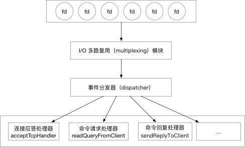
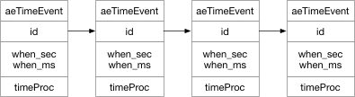

Redis 是一个事件驱动的内存数据库，服务器需要处理两种类型的事件。

+ 文件事件
+ 时间事件

下面就会介绍这两种事件的实现原理。

## 一、文件事件

Redis 服务器通过 socket 实现与客户端（或其他redis服务器）的交互,文件事件就是服务器对 socket 操作的抽象。 Redis 服务器，通过监听这些 socket 产生的文件事件并处理这些事件，实现对客户端调用的响应。文件事件是对套接字操作的抽象， 每当一个套接字准备好执行连接应答（accept）、写入、读取、关闭等操作时，就会产生一个文件事件。 因为一个服务器通常会连接多个套接字， 所以多个文件事件有可能会并发地出现。

I/O 多路复用程序负责监听多个套接字， 并向文件事件分派器传送那些产生了事件的套接字。

尽管多个文件事件可能会并发地出现，但 I/O 多路复用程序总是会将所有产生事件的套接字都入队到一个队列里面， 然后通过这个队列， 以有序（sequentially）、同步（synchronously）、每次一个套接字的方式向文件事件分派器传送套接字： 当上一个套接字产生的事件被处理完毕之后（该套接字为事件所关联的事件处理器执行完毕）， I/O 多路复用程序才会继续向文件事件分派器传送下一个套接字。文件事件分派器接收 I/O 多路复用程序传来的套接字， 并根据套接字产生的事件的类型， 调用相应的事件处理器。

服务器会为执行不同任务的套接字关联不同的事件处理器， 这些处理器是一个个函数， 它们定义了某个事件发生时， 服务器应该执行的动作。


### 1.1、Reactor

Redis 基于 Reactor 模式开发了自己的事件处理器。

这里就先展开讲一讲 Reactor 模式。看下图：



I/O 多路复用模块”会监听多个 FD（File Descriptor 以下简称 FD) ，当这些FD产生，accept，read，write 或 close 的文件事件。会向“文件事件分发器（dispatcher）”传送事件。文件事件分发器（dispatcher）在收到事件之后，会根据事件的类型将事件分发给对应的 handler。我们顺着图，从上到下的逐一讲解 Redis 是怎么实现这个 Reactor 模型的。

### 1.2、I/O 多路复用模块

Redis 的 I/O 多路复用模块，其实是封装了操作系统提供的 select，epoll，avport 和 kqueue 这些基础函数。向上层提供了一个统一的接口，屏蔽了底层实现的细节。

一般而言 Redis 都是部署到 Linux 系统上，所以我们就看看使用 Redis 是怎么利用 linux 提供的 epoll 实现I/O 多路复用。

首先看看 epoll 提供的三个方法：

```java
/*
 * 创建一个epoll的句柄，size用来告诉内核这个监听的数目一共有多大
 */
int epoll_create(int size)；

/*
 * 可以理解为，增删改 fd 需要监听的事件
 * epfd 是 epoll_create() 创建的句柄。
 * op 表示 增删改
 * epoll_event 表示需要监听的事件，Redis 只用到了可读，可写，错误，挂断 四个状态
 */
int epoll_ctl(int epfd, int op, int fd, struct epoll_event *event)；

/*
 * 可以理解为查询符合条件的事件
 * epfd 是 epoll_create() 创建的句柄。
 * epoll_event 用来存放从内核得到事件的集合
 * maxevents 获取的最大事件数
 * timeout 等待超时时间
 */
int epoll_wait(int epfd, struct epoll_event * events, int maxevents, int timeout);
```

再看 Redis 对文件事件，封装epoll向上提供的接口：

```java
/*
 * 事件状态
 */
typedef struct aeApiState {

    // epoll_event 实例描述符
    int epfd;
    // 事件槽
    struct epoll_event *events;

} aeApiState;

/*
 * 创建一个新的 epoll 
 */
static int  aeApiCreate(aeEventLoop *eventLoop)

/*
 * 调整事件槽的大小
 */
static int  aeApiResize(aeEventLoop *eventLoop, int setsize)

/*
 * 释放 epoll 实例和事件槽
 */
static void aeApiFree(aeEventLoop *eventLoop)

/*
 * 关联给定事件到 fd
 */
static int  aeApiAddEvent(aeEventLoop *eventLoop, int fd, int mask)
/*
 * 从 fd 中删除给定事件
 */
static void aeApiDelEvent(aeEventLoop *eventLoop, int fd, int mask)
/*
 * 获取可执行事件
 */
static int  aeApiPoll(aeEventLoop *eventLoop, struct timeval *tvp)
```

所以看看这个ae_peoll.c 如何对 epoll 进行封装的：

+ aeApiCreate() 是对 epoll.epoll_create() 的封装。
+ aeApiAddEvent()和aeApiDelEvent() 是对 epoll.epoll_ctl()的封装。
+ aeApiPoll() 是对 epoll_wait()的封装。

这样 Redis 的利用 epoll 实现的 I/O 复用器就比较清晰了。再往上一层次我们需要看看 ea.c 是怎么封装的？
首先需要关注的是事件处理器的数据结构：

```java
typedef struct aeFileEvent {

    // 监听事件类型掩码，
    // 值可以是 AE_READABLE 或 AE_WRITABLE ，
    // 或者 AE_READABLE | AE_WRITABLE
    int mask; /* one of AE_(READABLE|WRITABLE) */

    // 读事件处理器
    aeFileProc *rfileProc;

    // 写事件处理器
    aeFileProc *wfileProc;

    // 多路复用库的私有数据
    void *clientData;

} aeFileEvent;
```
mask 就是可以理解为事件的类型。

除了使用 ae_peoll.c 提供的方法外,ae.c 还增加 “增删查” 的几个 API。

+ 增:aeCreateFileEvent
+ 删:aeDeleteFileEvent
+ 查: 查包括两个维度 aeGetFileEvents 获取某个 fd 的监听类型和aeWait等待某个fd 直到超时或者达到某个状态。

### 1.3、事件分发器（dispatcher）

Redis 的事件分发器 ae.c/aeProcessEvents 不但处理文件事件还处理时间事件，所以这里只贴与文件分发相关的出部分代码，dispather 根据 mask 调用不同的事件处理器。

```java
//从 epoll 中获关注的事件
numevents = aeApiPoll(eventLoop, tvp);
for (j = 0; j < numevents; j++) {
    // 从已就绪数组中获取事件
    aeFileEvent *fe = &eventLoop->events[eventLoop->fired[j].fd];

    int mask = eventLoop->fired[j].mask;
    int fd = eventLoop->fired[j].fd;
    int rfired = 0;

    // 读事件
    if (fe->mask & mask & AE_READABLE) {
        // rfired 确保读/写事件只能执行其中一个
        rfired = 1;
        fe->rfileProc(eventLoop,fd,fe->clientData,mask);
    }
    // 写事件
    if (fe->mask & mask & AE_WRITABLE) {
        if (!rfired || fe->wfileProc != fe->rfileProc)
            fe->wfileProc(eventLoop,fd,fe->clientData,mask);
    }

    processed++;
}
```
可以看到这个分发器，根据 mask 的不同将事件分别分发给了读事件和写事件。


### 1.4、事件的类型

I/O 多路复用程序可以监听多个套接字的 ae.h/AE_READABLE 事件和 ae.h/AE_WRITABLE 事件， 这两类事件和套接字操作之间的对应关系如下：

+ 当套接字变得可读时（客户端对套接字执行 write 操作，或者执行 close 操作）， 或者有新的可应答（acceptable）套接字出现时（客户端对服务器的监听套接字执行 connect 操作）， 套接字产生 AE_READABLE 事件。
+ 当套接字变得可写时（客户端对套接字执行 read 操作）， 套接字产生 AE_WRITABLE 事件。

I/O 多路复用程序允许服务器同时监听套接字的 AE_READABLE 事件和 AE_WRITABLE 事件， 如果一个套接字同时产生了这两种事件， 那么文件事件分派器会优先处理 AE_READABLE 事件， 等到 AE_READABLE 事件处理完之后， 才处理 AE_WRITABLE 事件。

这也就是说， 如果一个套接字又可读又可写的话， 那么服务器将先读套接字， 后写套接字。

### 1.5、API

ae.c/aeCreateFileEvent 函数接受一个套接字描述符、 一个事件类型、 以及一个事件处理器作为参数， 将给定套接字的给定事件加入到 I/O 多路复用程序的监听范围之内， 并对事件和事件处理器进行关联。

ae.c/aeDeleteFileEvent 函数接受一个套接字描述符和一个监听事件类型作为参数， 让 I/O 多路复用程序取消对给定套接字的给定事件的监听， 并取消事件和事件处理器之间的关联。

ae.c/aeGetFileEvents 函数接受一个套接字描述符， 返回该套接字正在被监听的事件类型：

+ 如果套接字没有任何事件被监听， 那么函数返回 AE_NONE 。
+ 如果套接字的读事件正在被监听， 那么函数返回 AE_READABLE 。
+ 如果套接字的写事件正在被监听， 那么函数返回 AE_WRITABLE 。
+ 如果套接字的读事件和写事件正在被监听， 那么函数返回 AE_READABLE | AE_WRITABLE 。

ae.c/aeWait 函数接受一个套接字描述符、一个事件类型和一个毫秒数为参数， 在给定的时间内阻塞并等待套接字的给定类型事件产生， 当事件成功产生， 或者等待超时之后， 函数返回。

ae.c/aeApiPoll 函数接受一个 sys/time.h/struct timeval 结构为参数， 并在指定的时间內， 阻塞并等待所有被 aeCreateFileEvent 函数设置为监听状态的套接字产生文件事件， 当有至少一个事件产生， 或者等待超时后， 函数返回。

ae.c/aeProcessEvents 函数是文件事件分派器， 它先调用 aeApiPoll 函数来等待事件产生， 然后遍历所有已产生的事件， 并调用相应的事件处理器来处理这些事件。

ae.c/aeGetApiName 函数返回 I/O 多路复用程序底层所使用的 I/O 多路复用函数库的名称： 返回 "epoll" 表示底层为 epoll 函数库， 返回 "select" 表示底层为 select 函数库， 诸如此类。


### 1.6、文件事件处理器的类型

Redis 为文件事件编写了多个处理器， 这些事件处理器分别用于实现不同的网络通讯需求， 比如说：

+ 为了对连接服务器的各个客户端进行应答， 服务器要为监听套接字关联连接应答处理器。
+ 为了接收客户端传来的命令请求， 服务器要为客户端套接字关联命令请求处理器。
+ 为了向客户端返回命令的执行结果， 服务器要为客户端套接字关联命令回复处理器。
+ 当主服务器和从服务器进行复制操作时， 主从服务器都需要关联特别为复制功能编写的复制处理器。
+ 等等。

在这些事件处理器里面，服务器最常用的要数与客户端进行通信的连接应答处理器、 命令请求处理器和命令回复处理器。


**连接应答处理器**

networking.c/acceptTcpHandler 函数是 Redis 的连接应答处理器， 这个处理器用于对连接服务器监听套接字的客户端进行应答， 具体实现为 sys/socket.h/accept 函数的包装。

当 Redis 服务器进行初始化的时候， 程序会将这个连接应答处理器和服务器监听套接字的 AE_READABLE 事件关联起来， 当有客户端用 sys/socket.h/connect 函数连接服务器监听套接字的时候， 套接字就会产生 AE_READABLE 事件， 引发连接应答处理器执行， 并执行相应的套接字应答操作。

**命令请求处理器**

networking.c/readQueryFromClient 函数是 Redis 的命令请求处理器， 这个处理器负责从套接字中读入客户端发送的命令请求内容，具体实现为 unistd.h/read 函数的包装。

当一个客户端通过连接应答处理器成功连接到服务器之后， 服务器会将客户端套接字的 AE_READABLE 事件和命令请求处理器关联起来， 当客户端向服务器发送命令请求的时候， 套接字就会产生 AE_READABLE 事件， 引发命令请求处理器执行， 并执行相应的套接字读入操作。在客户端连接服务器的整个过程中， 服务器都会一直为客户端套接字的 AE_READABLE 事件关联命令请求处理器。

**命令回复处理器**

networking.c/sendReplyToClient 函数是 Redis 的命令回复处理器， 这个处理器负责将服务器执行命令后得到的命令回复通过套接字返回给客户端， 具体实现为 unistd.h/write 函数的包装。

当服务器有命令回复需要传送给客户端的时候， 服务器会将客户端套接字的 AE_WRITABLE 事件和命令回复处理器关联起来， 当客户端准备好接收服务器传回的命令回复时， 就会产生 AE_WRITABLE 事件， 引发命令回复处理器执行， 并执行相应的套接字写入操作。

当命令回复发送完毕之后， 服务器就会解除命令回复处理器与客户端套接字的 AE_WRITABLE 事件之间的关联。

**一次完整的客户端与服务器连接事件示例**

让我们来追踪一次 Redis 客户端与服务器进行连接并发送命令的整个过程， 看看在过程中会产生什么事件， 而这些事件又是如何被处理的。

假设一个 Redis 服务器正在运作，那么这个服务器的监听套接字的 AE_READABLE 事件应该正处于监听状态之下， 而该事件所对应的处理器为连接应答处理器。

如果这时有一个 Redis 客户端向服务器发起连接， 那么监听套接字将产生 AE_READABLE 事件， 触发连接应答处理器执行： 处理器会对客户端的连接请求进行应答， 然后创建客户端套接字， 以及客户端状态， 并将客户端套接字的 AE_READABLE 事件与命令请求处理器进行关联，使得客户端可以向主服务器发送命令请求。

之后， 假设客户端向主服务器发送一个命令请求， 那么客户端套接字将产生 AE_READABLE 事件， 引发命令请求处理器执行， 处理器读取客户端的命令内容， 然后传给相关程序去执行。

执行命令将产生相应的命令回复， 为了将这些命令回复传送回客户端， 服务器会将客户端套接字的 AE_WRITABLE 事件与命令回复处理器进行关联： 当客户端尝试读取命令回复的时候， 客户端套接字将产生 AE_WRITABLE 事件， 触发命令回复处理器执行，当命令回复处理器将命令回复全部写入到套接字之后， 服务器就会解除客户端套接字的 AE_WRITABLE 事件与命令回复处理器之间的关联。


### 1.7、文件事件实现总结

我们按照开始给出的 Reactor 模型，从上到下讲解了文件事件处理器的实现，下面将会介绍时间时间的实现。

## 二、时间事件

Reids 有很多操作需要在给定的时间点进行处理，时间事件就是对这类定时任务的抽象。

先看时间事件的数据结构：

```java
/* Time event structure
 *
 * 时间事件结构
 */
typedef struct aeTimeEvent {

    // 时间事件的唯一标识符
    long long id; /* time event identifier. */

    // 事件的到达时间
    long when_sec; /* seconds */
    long when_ms; /* milliseconds */

    // 事件处理函数
    aeTimeProc *timeProc;

    // 事件释放函数
    aeEventFinalizerProc *finalizerProc;

    // 多路复用库的私有数据
    void *clientData;

    // 指向下个时间事件结构，形成链表
    struct aeTimeEvent *next;

} aeTimeEvent;
```
看见 next 我们就知道这个 aeTimeEvent 是一个链表结构。看图：



注意这是一个按照id倒序排列的链表，并没有按照事件顺序排序。

### 2.1、processTimeEvent

Redis 使用这个函数处理所有的时间事件，我们整理一下执行思路：

1. 记录最新一次执行这个函数的时间，用于处理系统时间被修改产生的问题。
2. 遍历链表找出所有 when_sec 和 when_ms 小于现在时间的事件。
3. 执行事件对应的处理函数。
4. 检查事件类型，如果是周期事件则刷新该事件下一次的执行事件。
5. 否则从列表中删除事件。

### 2.2、综合调度器（aeProcessEvents）


综合调度器是 Redis 统一处理所有事件的地方。我们梳理一下这个函数的简单逻辑：

```java
// 1. 获取离当前时间最近的时间事件
shortest = aeSearchNearestTimer(eventLoop);

// 2. 获取间隔时间
timeval = shortest - nowTime;

// 如果timeval 小于 0，说明已经有需要执行的时间事件了。
if(timeval < 0){
    timeval = 0
}

// 3. 在 timeval 时间内，取出文件事件。
numevents = aeApiPoll(eventLoop, timeval);

// 4.根据文件事件的类型指定不同的文件处理器
if (AE_READABLE) {
    // 读事件
    rfileProc(eventLoop,fd,fe->clientData,mask);
}
    // 写事件
if (AE_WRITABLE) {
    wfileProc(eventLoop,fd,fe->clientData,mask);
}
```
以上的伪代码就是整个 Redis 事件处理器的逻辑。

我们可以再看看谁执行了这个 aeProcessEvents:

```java
void aeMain(aeEventLoop *eventLoop) {

    eventLoop->stop = 0;

    while (!eventLoop->stop) {

        // 如果有需要在事件处理前执行的函数，那么运行它
        if (eventLoop->beforesleep != NULL)
            eventLoop->beforesleep(eventLoop);

        // 开始处理事件
        aeProcessEvents(eventLoop, AE_ALL_EVENTS);
    }
}
```
然后我们再看看是谁调用了 eaMain:

```java
int main(int argc, char **argv) {
    //一些配置和准备
    ...
    aeMain(server.el);
    
    //结束后的回收工作
    ...
}
```
我们在 Redis 的 main 方法中找个了它。

这个时候我们整理出的思路就是:

1. Redis 的 main() 方法执行了一些配置和准备以后就调用 eaMain() 方法。

2. eaMain() while(true) 的调用 aeProcessEvents()。

所以我们说 Redis 是一个事件驱动的程序，期间我们发现，Redis 没有 fork 过任何线程。所以也可以说 Redis 是一个基于事件驱动的单线程应用。

## 三、总结

在后端的面试中 Redis 总是一个或多或少会问到的问题。