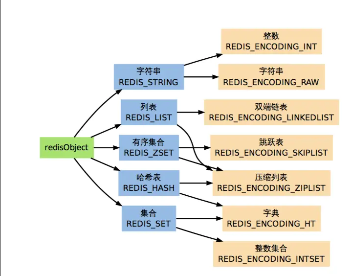

## redis 学习笔记

> 这篇 redis 学习笔记主要介绍 redis 的数据结构和数据类型，并讨论数据结构的选择以及应用场景的优化。

### redis 是什么?

> Redis是一种面向“键/值”对类型数据的分布式NoSQL数据库系统，特点是高性能，持久存储，适应高并发的应用场景。

### Redis 数据结构

*   动态字符串 (Sds)
*   双端列表 (LINKEDLIST)
*   字典
*   跳跃表 (SKIPLIST)
*   整数集合 (INTSET)
*   压缩列表 (ZIPLIST)


[动态字符串](https://link.juejin.im/?target=http%3A%2F%2Forigin.redisbook.com%2Finternal-datastruct%2Fsds.html)

Sds (Simple Dynamic String,简单动态字符串)是 Redis 底层所使用的字符串表示,它被用 在几乎所有的 Redis 模块中

Redis 是一个键值对数据库(key-value DB),数据库的值可以是字符串、集合、列表等多种类 型的对象,而数据库的键则总是字符串对象

在 Redis 中, 一个字符串对象除了可以保存字符串值之外,还可以保存 long 类型的值当字符串对象保存的是字符串时,它包含的才是 sds 值,否则的话,它就 是一个 long 类型的值

动态字符串主要有两个作用:

1.  实现字符串对象(StringObject)
2.  在 Redis 程序内部用作 char * 类型的替代品

[双端列表](https://link.juejin.im/?target=http%3A%2F%2Forigin.redisbook.com%2Finternal-datastruct%2Fadlist.html)

双端链表还是 Redis 列表类型的底层实现之一，当对列表类型的键进行操作——比如执行 RPUSH 、LPOP 或 LLEN 等命令时,程序在底层操作的可能就是双端链表

双端链表主要有两个作用:

*   作为 Redis 列表类型的底层实现之一;
*   作为通用数据结构,被其他功能模块所使用;

[字典](https://link.juejin.im/?target=http%3A%2F%2Forigin.redisbook.com%2Finternal-datastruct%2Fdict.html)

字典(dictionary),又名映射(map)或关联数组(associative array), 它是一种抽象数据结 构,由一集键值对(key-value pairs)组成,各个键值对的键各不相同,程序可以将新的键值对 添加到字典中,或者基于键进行查找、更新或删除等操作

字典的应用

1.  实现数据库键空间(key space);
2.  用作 Hash 类型键的其中一种底层实现;

> Redis 是一个键值对数据库,数据库中的键值对就由字典保存:每个数据库都有一个与之相对应的字典,这个字典被称之为键空间(key space)。

Redis 的 Hash 类型键使用**字典和压缩列表**两种数据结构作为底层实现

[跳跃表](https://link.juejin.im/?target=http%3A%2F%2Forigin.redisbook.com%2Finternal-datastruct%2Fskiplist.html)

跳跃表(skiplist)是一种随机化的数据,由 William Pugh 在论文《Skip lists: a probabilistic alternative to balanced trees》中提出,这种数据结构以有序的方式在层次化的链表中保存元素,它的效率可以和平衡树媲美——查找、删除、添加等操作都可以在对数期望时间下完成, 并且比起平衡树来说,跳跃表的实现要简单直观得多

和字典、链表或者字符串这几种在 Redis 中大量使用的数据结构不同,跳跃表在 Redis 的唯一作用,就是实现有序集数据类型
跳跃表将指向有序集的 score 值和 member 域的指针作为元素,并以 score 值为索引,对有序集元素进行排序。

[整数集合](https://link.juejin.im/?target=http%3A%2F%2Forigin.redisbook.com%2Fcompress-datastruct%2Fintset.html)

整数集合(intset)用于有序、无重复地保存多个整数值,它会根据元素的值,自动选择该用什么长度的整数类型来保存元素

Intset 是集合键的底层实现之一,如果一个集合:

1.  只保存着整数元素;
2.  元素的数量不多;
    那么 Redis 就会使用 intset 来保存集合元素。

[压缩列表](https://link.juejin.im/?target=http%3A%2F%2Forigin.redisbook.com%2Fcompress-datastruct%2Fziplist.html)

Ziplist 是由一系列特殊编码的内存块构成的列表,一个 ziplist 可以包含多个节点(entry),每个节点可以保存一个长度受限的字符数组(不以 \0 结尾的 char 数组)或者整数

### Redis 数据类型

[RedisObject](https://link.juejin.im/?target=http%3A%2F%2Forigin.redisbook.com%2Fdatatype%2Fobject.html%23redisobject-redis)

redisObject 是 Redis 类型系统的核心,数据库中的每个键、值,以及 Redis 本身处理的参数,都表示为这种数据类型

redisObject 的定义位于 redis.h :

```java
/** Redis 对象*/
typedef struct redisObject {    
	// 类型    
	unsigned type:4;    
	// 对齐位    
	unsigned notused:2;    
	// 编码方式    
	unsigned encoding:4;    
	// LRU 时间(相对于 server.lruclock)    
	unsigned lru:22;    
	// 引用计数    
	int refcount;    
	// 指向对象的值    
	void *ptr;
	} robj;
```

type 、encoding 和 ptr 是最重要的三个属性。

type 记录了对象所保存的值的类型,它的值可能是以下常量的其中一个

```java
/** 对象类型*/
#define REDIS_STRING 0 // 字符串
#define REDIS_LIST 1   // 列表
#define REDIS_SET 2    // 集合
#define REDIS_ZSET 3   // 有序集
#define REDIS_HASH 4   // 哈希表
```

encoding 记录了对象所保存的值的编码,它的值可能是以下常量的其中一个

```java
/** 对象编码*/
#define REDIS_ENCODING_RAW 0    // 编码为字符串
#define REDIS_ENCODING_INT 1    // 编码为整数
#define REDIS_ENCODING_HT 2     // 编码为哈希表
#define REDIS_ENCODING_ZIPMAP 3 // 编码为 zipmap(2.6 后不再使用)
#define REDIS_ENCODING_LINKEDLIST 4 // 编码为双端链表
#define REDIS_ENCODING_ZIPLIST 5    // 编码为压缩列表
#define REDIS_ENCODING_INTSET 6     // 编码为整数集合
#define REDIS_ENCODING_SKIPLIST 7    // 编码为跳跃表
```

ptr 是一个指针,指向实际保存值的数据结构,这个数据结构由 type 属性和 encoding 属性决定。

当执行一个处理数据类型的命令时,Redis 执行以下步骤:

1.  根据给定key,在数据库字典中查找和它像对应的redisObject,如果没找到,就返回 NULL 。
2.  检查redisObject的type属性和执行命令所需的类型是否相符,如果不相符,返回类 型错误。
3.  根据redisObject的encoding属性所指定的编码,选择合适的操作函数来处理底层的 数据结构。
4.  返回数据结构的操作结果作为命令的返回值。

[字符串](https://link.juejin.im/?target=http%3A%2F%2Fredisdoc.com%2Fstring%2Findex.html)

REDIS_STRING (字符串)是 Redis 使用得最为广泛的数据类型,它除了是 SET 、GET 等命令 的操作对象之外,数据库中的所有键,以及执行命令时提供给 Redis 的参数,都是用这种类型 保存的。

字符串类型分别使用 REDIS_ENCODING_INT 和 REDIS_ENCODING_RAW 两种编码

> 只有能表示为 long 类型的值,才会以整数的形式保存,其他类型 的整数、小数和字符串,都是用 sdshdr 结构来保存

[哈希表](https://link.juejin.im/?target=http%3A%2F%2Fredisdoc.com%2Fhash%2Findex.html)

REDIS_HASH (哈希表)是HSET 、HLEN 等命令的操作对象

它使用 REDIS_ENCODING_ZIPLIST和REDIS_ENCODING_HT 两种编码方式

Redis 中每个hash可以存储232-1键值对（40多亿）

[列表](https://link.juejin.im/?target=http%3A%2F%2Fredisdoc.com%2Flist%2Findex.html)

REDIS_LIST(列表)是LPUSH 、LRANGE等命令的操作对象

它使用 REDIS_ENCODING_ZIPLIST和REDIS_ENCODING_LINKEDLIST 这两种方式编码

一个列表最多可以包含232-1 个元素(4294967295, 每个列表超过40亿个元素)。

[集合](https://link.juejin.im/?target=http%3A%2F%2Fredisdoc.com%2Fset%2Findex.html)

REDIS_SET (集合) 是 SADD 、 SRANDMEMBER 等命令的操作对象

它使用 REDIS_ENCODING_INTSET 和 REDIS_ENCODING_HT 两种方式编码

Redis 中集合是通过哈希表实现的，所以添加，删除，查找的复杂度都是O(1)。

集合中最大的成员数为 232 - 1 (4294967295, 每个集合可存储40多亿个成员)

[有序集](https://link.juejin.im/?target=http%3A%2F%2Fredisdoc.com%2Fsorted_set%2Findex.html)

REDIS_ZSET (有序集)是ZADD 、ZCOUNT 等命令的操作对象

它使用 REDIS_ENCODING_ZIPLIST和REDIS_ENCODING_SKIPLIST 两种方式编码

不同的是每个元素都会关联一个double类型的分数。redis正是通过分数来为集合中的成员进行从小到大的排序。

有序集合的成员是唯一的,但分数(score)却可以重复。

集合是通过哈希表实现的，所以添加，删除，查找的复杂度都是O(1)。 集合中最大的成员数为 232 - 1 (4294967295, 每个集合可存储40多亿个成员)

Redis各种数据类型_以及它们的编码方式



### 过期时间

在数据库中,所有键的过期时间都被保存在 redisDb 结构的 expires 字典里:

```
typedef struct redisDb {    
	// ...    
	dict *expires;    
	// ...
	} redisDb;
```

expires 字典的键是一个指向 dict 字典(键空间)里某个键的指针,而字典的值则是键所指 向的数据库键的到期时间,这个值以 long long 类型表示

过期时间设置

Redis 有四个命令可以设置键的生存时间(可以存活多久)和过期时间(什么时候到期):

*   EXPIRE 以秒为单位设置键的生存时间;
*   PEXPIRE 以毫秒为单位设置键的生存时间;
*   EXPIREAT 以秒为单位,设置键的过期 UNIX 时间戳;
*   PEXPIREAT 以毫秒为单位,设置键的过期 UNIX 时间戳。

> 虽然有那么多种不同单位和不同形式的设置方式,但是 expires 字典的值只保存“以毫秒为单位的过期 UNIX 时间戳” ,这就是说,通过进行转换,所有命令的效果最后都和 PEXPIREAT 命令的效果一样。

**如果一个键是过期的,那它什么时候会被删除?**

下边是参考答案

1.  定时删除:在设置键的过期时间时,创建一个定时事件,当过期时间到达时,由事件处理 器自动执行键的删除操作。
2.  惰性删除:放任键过期不管,但是在每次从 dict 字典中取出键值时,要检查键是否过 期,如果过期的话,就删除它,并返回空;如果没过期,就返回键值。
3.  定期删除:每隔一段时间,对expires字典进行检查,删除里面的过期键

Redis 使用的过期键删除策略是惰性删除加上定期删除

### 应用场景

*   缓存
*   队列
*   需要精准设定过期时间的应用

> 比如你可以把上面说到的sorted set的score值设置成过期时间的时间戳，那么就可以简单地通过过期时间排序，定时清除过期数据了，不仅是清除Redis中的过期数据，你完全可以把Redis里这个过期时间当成是对数据库中数据的索引，用Redis来找出哪些数据需要过期删除，然后再精准地从数据库中删除相应的记录

*   排行榜应用，取TOP N操作

    > 这个需求与上面需求的不同之处在于，前面操作以时间为权重，这个是以某个条件为权重，比如按顶的次数排序，这时候就需要我们的sorted set出马了，将你要排序的值设置成sorted set的score，将具体的数据设置成相应的value，每次只需要执行一条ZADD命令即可

*   统计页面访问次数

> 使用 incr 命令 定时使用 getset 命令 读取数据 并设置新的值 0

*   使用set 设置标签

例如假设我们的话题D 1000被加了三个标签tag 1,2,5和77，就可以设置下面两个集合：

```
$ redis-cli sadd topics:1000:tags 1
(integer) 1
$ redis-cli sadd topics:1000:tags 2
(integer) 1
$ redis-cli sadd topics:1000:tags 5
(integer) 1
$ redis-cli sadd topics:1000:tags 77
(integer) 1
$ redis-cli sadd tag:1:objects 1000
(integer) 1
$ redis-cli sadd tag:2:objects 1000
(integer) 1
$ redis-cli sadd tag:5:objects 1000
(integer) 1$ redis-cli sadd tag:77:objects 1000
(integer) 1
```

要获取一个对象的所有标签：

```
$ redis-cli smembers topics:1000:tags
1. 52. 13. 774. 2
```

获得一份同时拥有标签1, 2,10和27的对象列表。
这可以用SINTER命令来做，他可以在不同集合之间取出交集

### 内存优化

`问题`: Instagram的照片数量已经达到3亿，而在Instagram里，我们需要知道每一张照片的作者是谁，下面就是Instagram团队如何使用Redis来解决这个问题并进行内存优化的。

具体方法，参考下边这篇文章：[节约内存：Instagram的Redis实践](https://link.juejin.im/?target=http%3A%2F%2Fblog.nosqlfan.com%2Fhtml%2F3379.html)。

