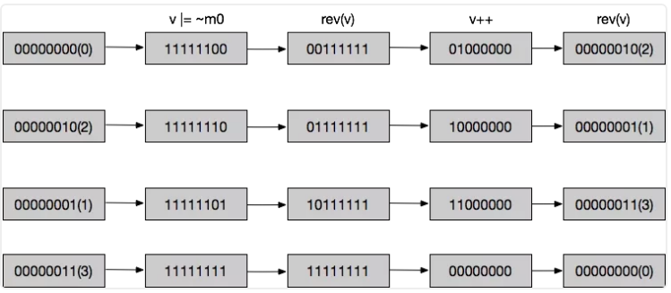
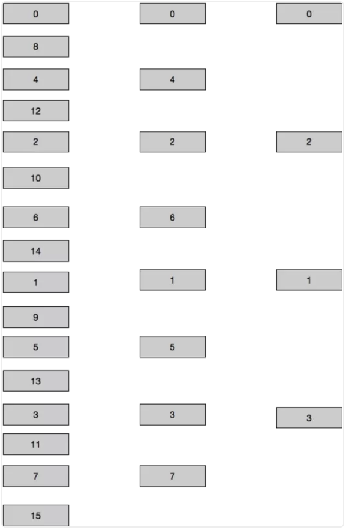

## 一、前言

有时候我们需要知道线上的Redis的使用情况，尤其需要知道一些前缀的key值，让我们怎么去查看呢？并且通常情况下Redis里的数据都是海量的，那么我们访问Redis中的海量数据？如何避免事故产生！今天就给大家分享一个小知识点，希望大家轻喷。

## 二、事故产生

因为我们的用户token缓存是采用了【user_token:userid】格式的key，保存用户的token的值。我们运维为了帮助开发小伙伴们查一下线上现在有多少登录用户。

直接用了keys user_token*方式进行查询，事故就此发生了。导致Redis不可用，假死。

keys pattern ：redis中允许模糊查询的有3个通配符，分别是：*，?，[]

其中：
1. *：通配任意多个字符
2. ?：通配单个字符
3. []：通配括号内的某一个字符

## 三、分析原因

我们线上的登录用户有几百万，数据量比较多；keys算法是遍历算法，复杂度是O(n)，也就是数据越多，时间越高。

数据量达到几百万，keys这个指令就会导致 Redis 服务卡顿，因为 Redis 是单线程程序，顺序执行所有指令，其它指令必须等到当前的 keys 指令执行完了才可以继续。

## 四、解决方案

那我们如何去遍历大数据量呢？这个也是面试经常问的。我们可以采用Redis的另一个命令scan。

我们看一下scan的特点：

1. 复杂度虽然也是 O(n)，但是它是通过游标分步进行的，不会阻塞线程

2. 提供 count 参数，不是结果数量，是Redis单次遍历字典槽位数量(约等于)

3. 同 keys 一样，它也提供模式匹配功能;

4. 服务器不需要为游标保存状态，游标的唯一状态就是 scan 返回给客户端的游标整数;

5. 返回的结果可能会有重复，需要客户端去重复，这点非常重要;

6. 单次返回的结果是空的并不意味着遍历结束，而要看返回的游标值是否为零

### 4.1、scan命令格式 

>scan cursor [MATCH pattern] [Count count]

1. SCAN命令是增量的循环，每次调用只会返回一小部分的元素。所以不会让Redis假死；SCAN命令是增量的循环，每次调用只会返回一小部分的元素。所以不会有KEYS命令的坑(key的数量比较多，一次KEYS查询会block其他操作)。  

2. SCAN命令返回的是一个游标，从0开始遍历，到0结束遍历；

3. count 每次迭代所返回的元素数量

### 4.2、举例

SCAN 命令返回一个包含两个元素的 multi-bulk 回复 

1. 回复的第一个元素是字符串表示的无符号 64 位整数（游标）

>SCAN 命令每次被调用之后， 都会向用户返回一个新的游标， 用户在下次迭代时需要使用这个新游标作为 SCAN 命令的游标参数， 以此来延续之前的迭代过程。

>当 SCAN 命令的游标参数被设置为 0 时， 服务器将开始一次新的迭代， 而当服务器向用户返回值为 0 的游标时， 表示迭代已结束。

2. 回复的第二个元素是另一个 multi-bulk 回复

>这个 multi-bulk 回复包含了本次被迭代的元素。

注意：SCAN命令不能保证每次返回的值都是有序的，另外同一个key有可能返回多次，不做区分，需要应用程序去处理。


从0开始遍历，返回了游标6，又返回了数据，继续scan遍历，就要从6开始


## 五、scan命令原理

### 5.1、优缺点

优点：

+ 提供键空间的遍历操作，支持游标，复杂度O(1), 整体遍历一遍只需要O(N)

+ 提供结果模式匹配

+ 支持一次返回的数据条数设置，但仅仅是个hints，有时候返回更多

+ 弱状态，所有状态只需要客户端需要维护一个游标

缺点：

+ 无法提供完整的快照遍历，也就是中间如果有数据修改，可能有些涉及改动的数据遍历不到

+ 每次返回的数据条数不一定，极度依赖内部实现

+ 返回的数据可能有重复，应用层需要能够处理重入逻辑


所以scan是一个能够满足需求,但也不是完美无瑕的命令。

### 5.2、实现原理

scan,hscan等命令主要都是借用了通用的scan操作函数：scanGenericCommand 。

scanGenericCommand 函数分为4步：

1. 解析count和match参数.如果没有指定count,默认返回10条数据

2. 开始迭代集合,如果是key保存为ziplist或者intset,则一次性返回所有数据,没有游标(游标值直接返回0)。由于Redis设计,只有数据量比较小的时候才会保存为ziplist或者intset,所以此处不会影响性能.游标在保存为hash的时候发挥作用,具体入口函数为dictScan,下文详细描述。

3. 根据match参数过滤返回值,并且如果这个键已经过期也会直接过滤掉(Redis中键过期之后并不会立即删除)

当迭代一个哈希表时（寻找hashkey）,存在三种情况：

1. 从迭代开始到结束,哈希表没有进行rehash

2. 从迭代开始到结束,哈希表进行了rehash,但是每次迭代时,哈希表要么没开始rehash,要么已经结束了rehash

3. 从迭代开始到结束,某次或某几次迭代时哈希表正在进行rehash

在这三种情况之下，sacn是如何实现的？

首先需要知道的前提是：Redis中进行rehash扩容时会存在两个哈希表，ht[0]与ht[1],rehash是渐进式的，即不会一次性完成。新的键值对会存放到ht[1]中,并且会逐步将ht[0]的数据转移到ht[1].全部rehash完毕后,ht[1]赋值给ht[0]然后清空ht[1]。

分布寻找hashkey。

### 5.3、模拟问题

0x00：迭代过程中，没有进行rehash

这个过程比较简单，一般来说只需要最简单粗暴的顺序迭代就可以了，这种情况下没什么好说的。

0x01：迭代过程中，进行过rehash

但是字典的大小是能够进行自动扩容的，我们不得不考虑以下两个问题：

第一，假如字典扩容了，变成2倍的长度，这种情况下，能够保证一定能遍历所有最初的key，但是却会出现大量重复。举个例子：

比如当前的key数组大小是4，后来变为8了。假如从下表0，1，2，3顺序扫描时，如果数组已经发生扩容，那么前面的0，1，2，3slot里面的数据会发生一部分迁移到对应的4，5，6，7slot里面去，当扫描到4，5，6，7的slot时，无疑会出现值重复的情况。

需要知道的是，Redis按如下方法计算一个当前key扩容后的slot：hash(key)&(size-1)。当从字典大小从4扩容到8时，原先在0 slot的数据会分散到0(000)与4(100)两个slot，看hash（key）的第三位。

第二， 如果字典缩小了，比如从16缩小到8， 原先scan已经遍历了0，1，2，3 ，如果数组已经缩小。这样后来迭代停止在7号slot，但是8，9，10，11这几个slot的数据会分别合并到0，1，2，3里面去，从而scan就没有扫描出这部分元素出来，无法保证可用性。

0x10：迭代过程中，正在进行rehash

上面考虑的情况是，在迭代过程的间隙中，rehash已经完成。那么会不会出现迭代进行中，切换游标时，rehash也正在进行？当然可能会发生。

如果查找过程中正在进行rehash，那么ht[0]（扩容之前的表）中的slot1中的部分数据可能已经rehash到 ht[1]（扩容之后的表）中的slot1或者slot4，此时必须将ht[0]和ht[1]中的相应slot全部遍历,否则可能会有遗漏数据，但是这么做好像也非常麻烦。


### 5.4、解决方法

为了解决以上两个问题，Redis使用了一种称为：reverse binary iteration的算法。

一起来理解下核心源码，第一个if，else主要通过dictIsRehashing这个函数来判断是否正在rehash；sizemask指的是字典空间长度，假如长度为16，那么sizemask的二进制为00001111。m0 代表当前字典的长度，v代表游标所在的索引值。接下来关注这个片段：
```
v |= ~m0;

v = rev(v);

v++;

v = rev(v);
```
这段代码初看好像有点摸不着头脑，怎么多次在多次rev？我们来看下在字典长度从4 rehash到8时，scan是如何迭代的。

当字典长度为4时，m0等于4，二进制表示为00000011，那么~m0为11111100，v初始值为0，那么 v |= ~m0为11111100。接下来看图：



可以看到，第一次dictScan后，游标从0变成了2，四次遍历分别为 0 -> 2 -> 1 -> 3，四个值都遍历到了。

再来看看字典长度为16时的遍历情况，以及三次顺序的对比：



让我们设想这么一个情况，字典的大小本身为4，开始迭代，当游标刚迭代完slot0时，返回的下一个游标时slot2，此时发现字典的大小已经从4rehash到8，那么不妨继续从size为8的hashtable中slot2处继续迭代。有人会说，不是把slot4遗漏掉了吗？

注意之前所说的扩容方式：hash(key)&(size-1)，slot0和slot4的内容是相同的，巧妙地避开了重复，当然，更不会遗漏。


字典扩大的情况没问题，那么缩小的情况呢？可以仿照着自己思考一下具体步骤。答案是可能会出现重复迭代，但是不会出现遗漏，也能够保证可用性。

迭代过程中，进行过rehash这种情况下的迭代已经比较完美地解决了，那么迭代过程中，正在进行rehash的情况是如何解决的呢？

我们继续看源码，之前提到过dictIsRehashing这个函数用来判断是否正在进行rehash，那么主要就是关注这段源码：
```java

	m0 = t0->sizemask;
	m1 = t1->sizemask;
	de = t0->table[v & m0];
	while(de) 
	{
				fn(privdata, de);
				de = de->next;
	}
	
	do
	{
		de = t1->table[v & m1];

		while(de) 
		{
		fn(privdata, de);
		de = de->next;
		}
		 v = (((v | m0) + 1)  & ~m0) | (v & m0);
	} 
	
while(v & (m0 ^ m1));
}
```

m0代表rehash前的字典长度，假设为4，即00000011，m1代表rehash后的字典长度，假设为8，即00000111。首先当前游标 &m0可以得到较小字典中需要迭代的slot的索引，然后开始循环迭代。然后开始较大字典的迭代，首先我们关注一下循环条件：
>v & (m0 ^ m1)

m0,m1二者经过异或操作后的值为00000100，可以看到只留下了最高位的值。游标v与之做 &操作，将其作为判断条件，即判断游标v在最高位是否还有值。当高位为0时，说明较大字典已经迭代完毕。（因为较大字典的大小是较小字典的两倍，较大字典大小的最高位一定是1）
