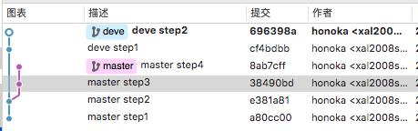
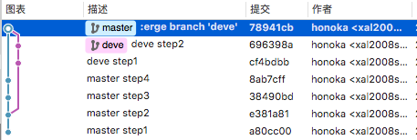
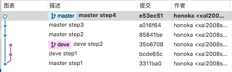
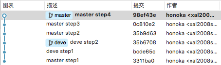

### merge 与 rebase 的区别

现在假设我们有一个主分支 master 及一个开发分支 deve，仓库历史就像这样：

现在如果在 master 分支上 git merge deve：Git 会自动根据两个分支的共同祖先即 e381a81 这个 commit 和两个分支的最新提交即 8ab7cff 和 696398a 进行一个三方合并，然后将合并中修改的内容生成一个新的 commit，即下图的 78941cb

#### rebase

rebase 是什么情况呢？还是一个初始的仓库历史图：

如果是在 master 分支上 git rebase deve：Git 会从两个分支的共同祖先 3311ba0 开始提取 master 分支（当前所在分支）上的修改，即 85841be、a016f64 与 e53ec51，
再将 master 分支指向 deve 的最新提交（目标分支）即 35b6708 处，然后将刚刚提取的修改依次应用到这个最新提交后面。操作会舍弃 master 分支上提取的 commit，同时不会像 merge 
一样生成一个合并修改内容的 commit，相当于把 master 分支（当前所在分支）上的修改在 deve 分支（目标分支）上原样复制了一遍,操作完成后的版本历史就像这样：

可以看见 master 分支从 deve 分支最新提交 35b6708 开始依次提交了自己的三个 commit（由于是提取修改后重新依次提交，故 commit 的 hash 码与上面的85841be、a016f64、e53ec51 不同）

### rebase -i

rebase 操作加上 -i 选项可以更直观的看见被提取的 commit 信息。
仍然在 master 分支上 rebase deve 分支，不过这次要加上 -i 选项，即 git rebase -i deve，然后我们可以得到这样一个文本信息框

1. A 区域内的信息说明了这次 rebase 操作提取了哪些 commit 记录（f9a7673 与 edb2ba2），会连接到目标分支的哪个 commit （9c86a5c）后面。可以根据 B 区域中的命令说明修改 pick 为其他命令，对该次提取出来的 commit 做额外的操作
2. B 区域内说明了本次 rebase 操作可以选用的命令
3. 通过 :wq 保存退出后，就会按照刚刚在 A 区域内设定的命令处理 commit 并 rebase。

###冲突处理策略的不同
+ merge 遇见冲突后会直接停止，等待手动解决冲突并重新提交 commit 后，才能再次 merge
+ rebase 遇见冲突后会暂停当前操作，开发者可以选择手动解决冲突，然后 git rebase --continue 继续，或者 --skip 跳过（注意此操作中当前分支的修改会直接覆盖目标分支的冲突部分），亦或者 --abort 直接停止该次 rebase 操作

###merge --no-ff 与 merge --ff-only 的区别

上面对 merge 的讲述都是基于其默认操作即 --no-ff（git merge xxx = git merge --no-ff xxx）的说明，但是 merge 还有一种常用的选项 --ff-only，那么这两种有什么区别呢？
--no-ff 是 merge 的默认操作，三方合并并提交修改；而 --ff-only 会判断当前分支可否根据目标分支快速合并，就像下面这样

此时 deve 分支就可与 master 分支快速合并。
在 deve 分支上 git merge --ff-only master，便得到合并完成后的版本历史图

可以发现 --ff-only 生成的历史记录和 rebase 十分相似，但是本质上 --ff-only 仍然是合并操作，但 rebase 并没有做合并，仅仅是提取修改到目标分支后面。

### 总结：选择 merge 还是 rebase？

+ merge 是一个合并操作，会将两个分支的修改合并在一起，默认操作的情况下会提交合并中修改的内容
+ merge 的提交历史忠实地记录了实际发生过什么，关注点在真实的提交历史上面
+ rebase 并没有进行合并操作，只是提取了当前分支的修改，将其复制在了目标分支的最新提交后面
+ rebase 的提交历史反映了项目过程中发生了什么，关注点在开发过程上面
+ merge 与 rebase 都是非常强大的分支整合命令，没有优劣之分，使用哪一个应由项目和团队的开发需求决定
+ merge 和 rebase 还有很多强大的选项，可以使用 git help <command> 查看

###最后：一些注意点

+ 使用 merge 时应考虑是采用 --no-ff 默认操作，生成一个对回顾提交历史并不友好的合并记录，还是采用 --ff-only 方式
+ rebase 操作会丢弃当前分支已提交的 commit，故不要在已经 push 到远程，和其他人正在协作开发的分支上执行 rebase 操作
+ 与远程仓库同步时，使用 pull 命令默认进行了 git fetch + git merge --no-ff 两个操作，可以通过加上 --rebase 命令将 fetch 后的 merge 操作改为 rebase 操作，或者仅仅 'git fetch remoteName',然后才思考采取哪种整合策略 git merge(or rebase) origin/master
+ 开发与 commit 时注意自己此时在哪个分支上
+ 当有修改未 commit 时，不能进行 rebase 操作，此时可以考虑先用 git stash 命令暂存

