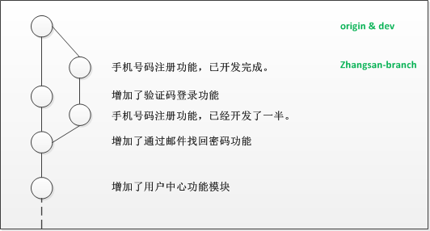
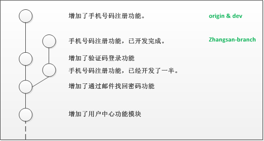
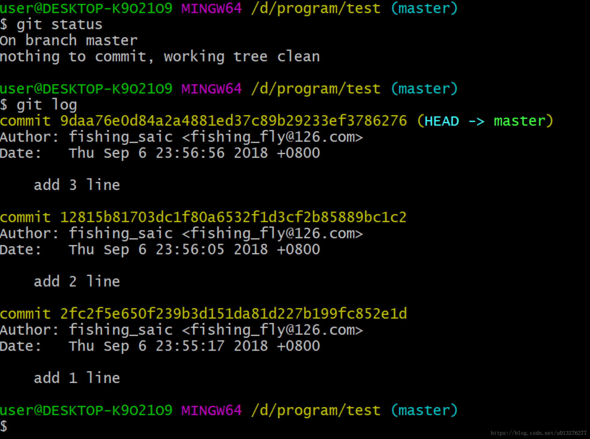
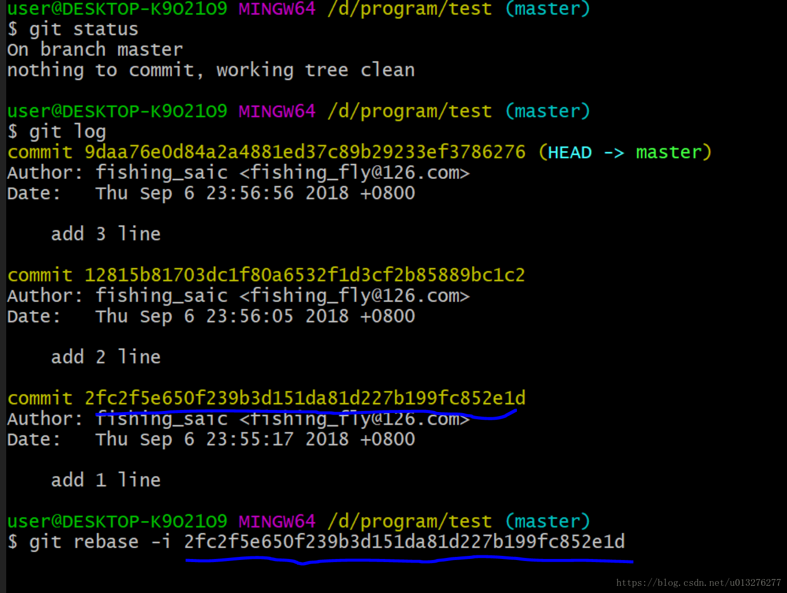
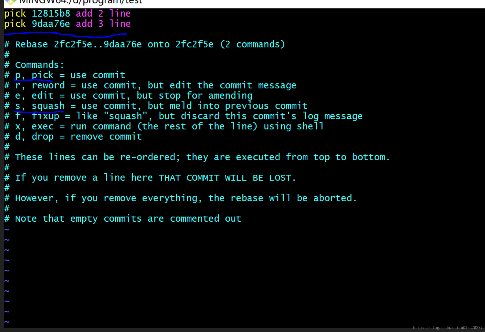
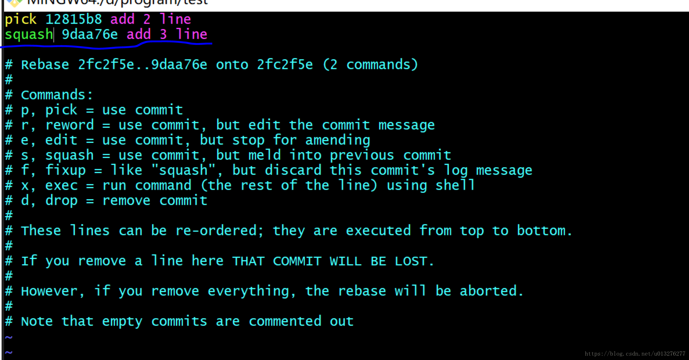
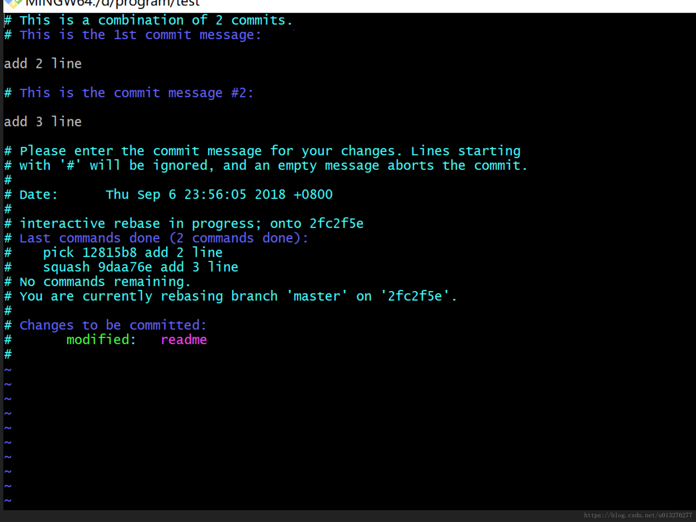
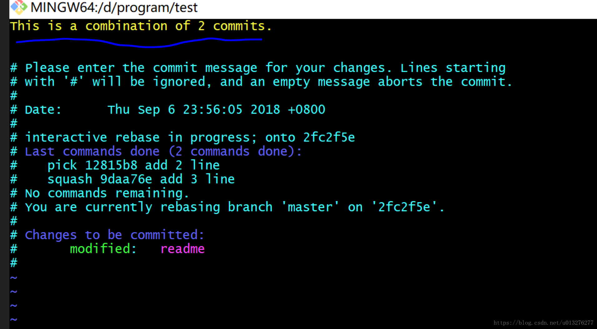
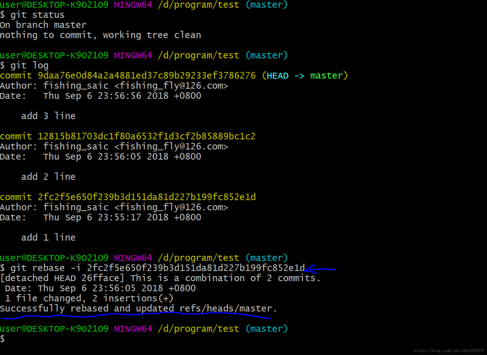
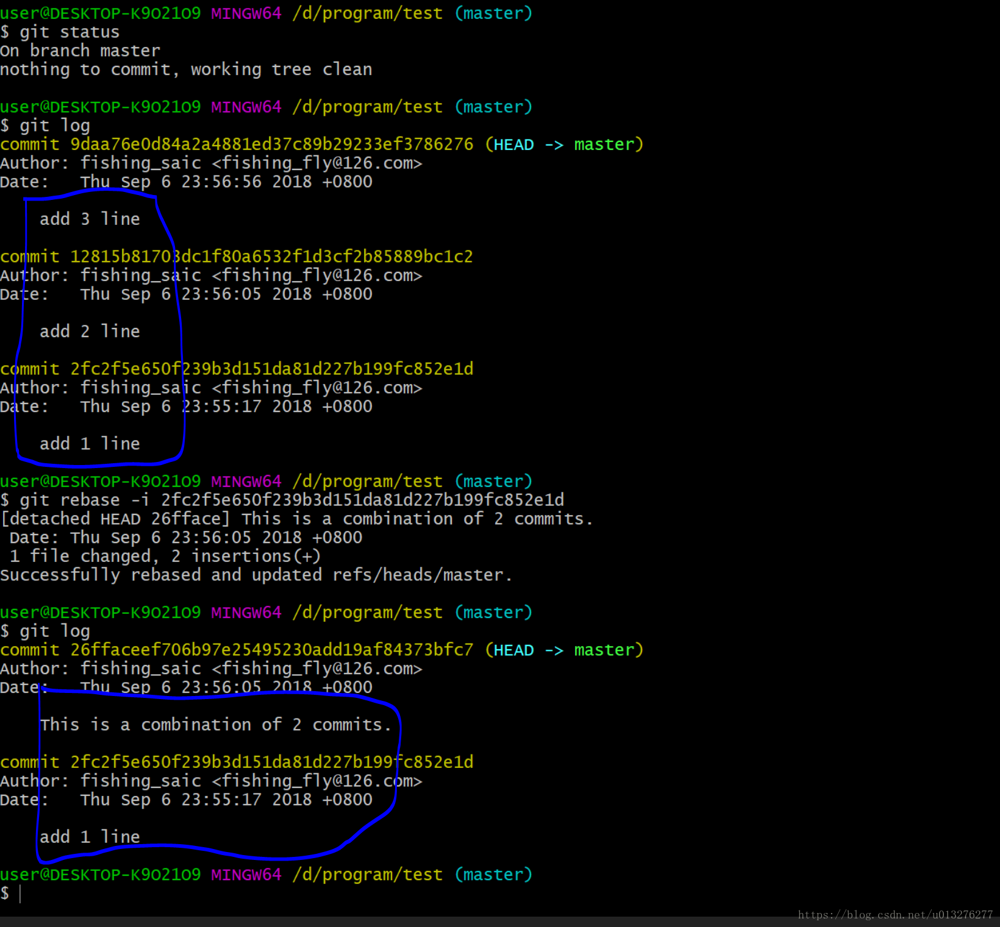

### git merge 将多个commit合并为一条之--squash 选项

>git merge --squash branchname

但是，操作方便并不意味着这样操作就是合理的，在某些情况下，我们应该优先选择使用--squash选项，如下：

$ git merge --squash another

$ git commit -m "message here"

--squash含义和原理如下:

--squash选项的含义是：本地文件内容与不使用该选项的合并结果相同，但是不提交、不移动HEAD，因此需要一条额外的commit命令。其效果相当于将another分支上的多个commit合并成一个，放在当前分支上，原来的commit历史则没有拿过来。

判断是否使用--squash选项最根本的标准是，待合并分支上的历史是否有意义。

如果在开发分支上提交非常随意，甚至写成微博体，那么一定要使用--squash选项。版本历史记录的应该是代码的发展，而不是开发者在编码时的活动。

只有在开发分支上每个commit都有其独自存在的意义，并且能够编译通过的情况下（能够通过测试就更完美了），才应该选择缺省的合并方式来保留commit历史。


###二、举例

张三开发完了 手机号码注册功能，并成功通过了测试，于是不假思索的用下面的git命令将自己的分支 zhangsan-branch 上的所有changeset（变更集合，即代码）合并到 了dev分支上：
```java
$ git checkout dev
$ git merge zhangsan-branch
$ git push origin master
```



dev 分支不再是一条直线，给人的感觉是涨了“疙瘩”，明显张三没有考虑 回滚定位bug、提交记录清晰、分支整洁 等因素，这不是我们想要的。

如果张三考虑了上述情况，使用下面的命令的话，就不会发生涨“疙瘩”的情况：

```java
$ git checkout dev
$ git merge --squash zhangsan-branch
$ git commit -m "增加了手机号码注册功能"
$ git push origin master
```
注：--squash 参数 的效果是将 zhangsan-branch 分支上的 2 次 commit “压缩” 后合并进 dev分支。

最终的效果是：



现在 zhangsan-branch 分支已经没有用了，可以删除了。

###三、git 几个commit点合并成一个commit点

（1）git log看一下当前分支的提交情况，下图中有三个commit点。从先到后是：add 1 line,add 2 line, add 3 line。需求是：把add 2 line, add 3 line这两个commit点合并成一个commit点。



（2）开始合并，敲下面这个命令：这里面的commitId是你要合并的两个commit后所形成的一个commitId需要跟着的commitId。在这边也就是add 1 line的commitId.



其中，-i 的参数是不需要合并的 commit 的 hash 值，这里指的是第一条 commit， 接着我们就进入到 vi 的编辑模式

进入vi模式后，在键盘上敲i键进入insert模式。这时候先看看这里面的东西是什么含义，



+ pick 的意思是要会执行这个 commit

+ squash 的意思是这个 commit 会被合并到前一个commit

我们这边需要将"add 3 line"这个commit合并前前一个commit，也就是合并到“add 2 line”的commit中，那就需要修改成如下的：



修改完成后，按esc键，冒号，输入wq进行保存。之后会继续跳转到commit message 的编辑界面：



注释中有写第一个commit信息和第二个commit信息，现在需要你合并这两个信息成一个commit信息。我这边合并成如下信息：



然后你就保存退出，跳回到最初的命令界面：



看到successfully的字样就说明成功了。再git log看一下commit情况：




从图中就看到已经将add 2 line和add 3 line的commit合并成了this is combination of 2 comm


###补充

>git 压缩  git rebase -i HEAD~4

该命令执行后，会弹出一个编辑窗口，4次提交的commit倒序排列，最上面的是最早的提交，最下面的是最近一次提交。

```java
pick 5e187c7dbe8	add center style indent
pick 6d577eb3440	add center style
pick f9b9508a3ab	add center style
pick 111ab9cc261	update templates
# Rebase 150a643..2fad1ae onto 150a643
#
# Commands:
#  p, pick = use commit
#  r, reword = use commit, but edit the commit message
#  e, edit = use commit, but stop for amending
#  s, squash = use commit, but meld into previous commit
#  f, fixup = like "squash", but discard this commit's log message
#  x, exec = run command (the rest of the line) using shell
#
# These lines can be re-ordered; they are executed from top to bottom.
#
# If you remove a line here THAT COMMIT WILL BE LOST.
#
# However, if you remove everything, the rebase will be aborted.
#
# Note that empty commits are commented out
pick 5e187c7dbe8	add center style indent
squash 6d577eb3440	add center style
squash f9b9508a3ab	add center style
squash 111ab9cc261	update templates
# Rebase 150a643..2fad1ae onto 150a643
#
# Commands:
#  p, pick = use commit
#  r, reword = use commit, but edit the commit message
#  e, edit = use commit, but stop for amending
#  s, squash = use commit, but meld into previous commit
#  f, fixup = like "squash", but discard this commit's log message
#  x, exec = run command (the rest of the line) using shell
#
# These lines can be re-ordered; they are executed from top to bottom.
#
# If you remove a line here THAT COMMIT WILL BE LOST.
#
# However, if you remove everything, the rebase will be aborted.
#
# Note that empty commits are commented out
```
修改第2-4行的第一个单词pick为squash，当然看一下里面的注释就理解含义了。

然后保存退出，git会压缩提交历史，如果有冲突，需要修改，修改的时候要注意，保留最新的历史，不然我们的修改就丢弃了。修改以后要记得敲下面的命令：

>git add .
>git rebase --continue

如果你想放弃这次压缩的话，执行以下命令：

>git rebase --abort

如果没有冲突，或者冲突已经解决，则会出现如下的编辑窗口：

```java
# This is a combination of 4 commits.
# The first commit’s message is:
add center style indent

# The 2nd commit’s message is:
add center style

# The 3rd commit’s message is:
add center style

# The 4th commit’s message is:
update templates

# Please enter the commit message for your changes. Lines starting
# with ‘#’ will be ignored, and an empty message aborts the commit.
```

>同步到远程git仓库:

不过此时远程的信息仍未改变，下面操作会把修改同步到远程git仓库:

>$ git push -f
