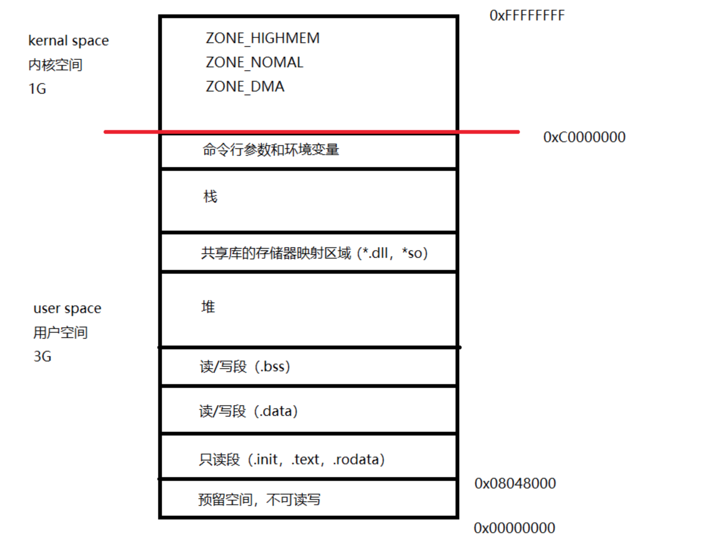

##一、空间分配

首先要知道一点，程序由磁盘加载到内存时是不可能直接加载到物理内存当中的，这里的原因以及物理内存和虚拟内存的区别与联系在本篇先不做讨论

Linux系统会给当前每一个进程分配一个2^32位大小(4G)的一块空间，这块空间就叫做进程的虚拟地址空间

这块空间的内容如下图所示：



##二、空间作用

接下来分别阐述每块空间的作用

+ 从0x00000000到0x08048000的这段空间是预留的，是不能访问的，例如对空指针进行访问程序就会崩溃

+ 程序运行时产生的指令就放在.text段（代码段）。这一段同时也保存了只读数据（read only data），例如char* p = "hello world"中的"hello world"，在这里，当想进行*p = 'a'操作时可以通过编译但运行会崩溃（在比较新的c++编译器中不允许用普通指针指向常量字符串），因为该段是只能读但不能写的。

+ .data存放了初始化了的且初始化的值不为0的数据

+ .bss存放未初始化及初始化为0的数据。打印未初始化的全局变量会看到值为0，因为存放于.bss段，操作系统会将.bss段的数据全部赋值为0

+ 堆（heap），在《深入理解计算机系统》中的名称是运行时堆（由malloc创建），也就是说这里的堆空间是暂时没有的，当程序运行，new或malloc之后才会分配堆内存，由低地址向高地址增长

+ 加载共享库，也就是动态链接库，Windows下是*.dll,Linux下是*so

+ stack 函数运行或产生线程时，每一个函数/线程独有的栈空间，由高地址向低地址增长的

+ 命令行参数和环境变量，命令行参数如main函数传参，环境变量如搜索头文件、库文件时默认的路径

##三、程序举例

通过分析具体代码的方式体会虚拟地址空间的划分:

```java
int g_data1 = 10;
int g_data2 = 0;
int g_data3;

static int g_data4 = 11;
static int g_data5 = 0;
static int g_data6;

int main(){
    int a = 12;
    int b = 0;
    int c;

    static int e = 13;
    static int f = 0;
    static int g;
    return 0;
}
```
在上面的程序中，所有的全局变量（g_data），不管是普通的还是静态（static）的，每一个在编译后的符号表中都会产生符号，他们叫做数据。

+ g_data1和g_data4都是初始化了的且初始化的值不为0的，所以它们放在.data段
+ g_data3和g_data6都是未初始化的，g_data2和g_data5虽然已经初始化但初始化值为0，所以它们都放在.bss段

而在main函数中，a、b、c三个局部变量并不会在符号表中产生符号，它们生成的是指令，例如int a = 12;在x86架构的汇编中产生的是mov dword ptr[a],0Ch指令，也就是将0Ch(12)移入a的内存，所以它们三个其实是放在指令段（.text）的

main函数中的e、f、g三个静态局部变量也是放在数据段的，但是程序启动时不会初始化，当程序运行到该条语句时才会初始化，它们的存储位置与全局变量相同

+ e是初始化且不为0的，放在.data段
+ f虽然初始化但初始化值为0，g未初始化，所以都放在.bss段

在这里，如果打印c，c的值不会为0，而打印g的值为0，原因就是g存放在.bss段，操作系统自动赋初值为0了

同时这里理解时可能会产生一个问题，通常我们说局部变量是在栈上，为什么这里说是指令保存在指令段呢？事实上，int a = 12这句代码在编译时产生的是一条指令，这个指令保存在.text段，而在运行时，系统会在当前进程的栈上给函数开辟一个栈帧，该指令运行时会在栈上开辟一段4个字节的空间存放“12”这个整数

同时对于这一部分也要注意，每一个进程的用户空间是私有的，但是内核空间是共享的。这也就是进程间通信比较困难的原因，而进程间通信方式的一种，匿名管道通信其实就是在内核空间中划分出一片内存，每个进程就都可以在这片空间写入数据给其他进程看，由此实现通信的目的
