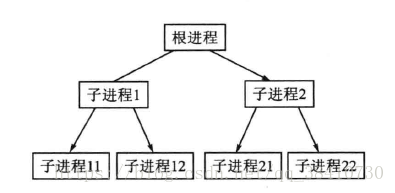
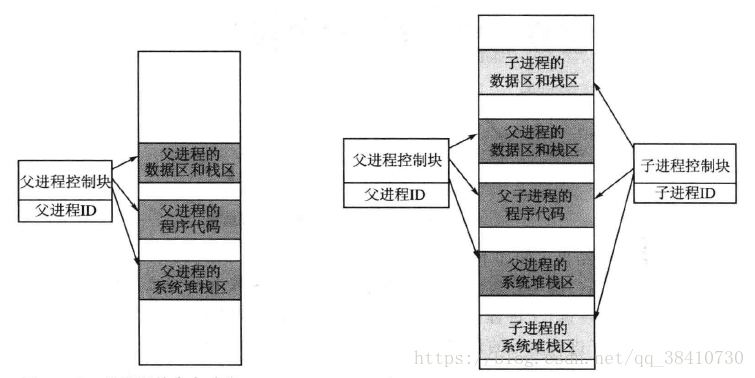
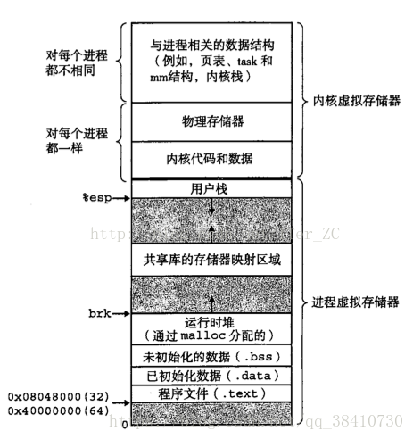
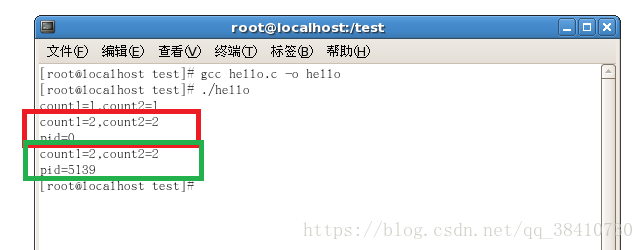
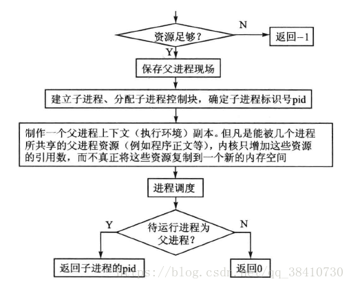
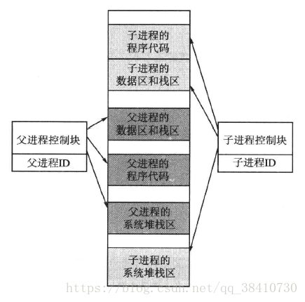
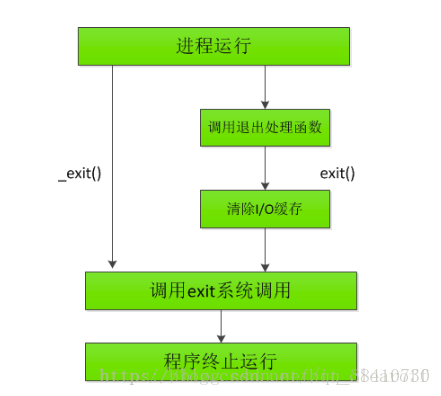
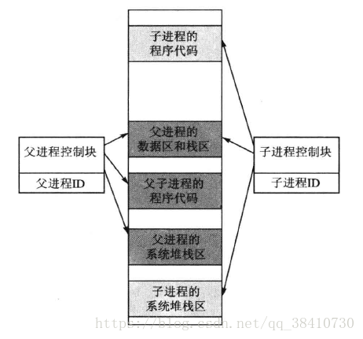

## Linux进程的创建与管理

在Linux系统中，除了系统启动之后的第一个进程由系统来创建，其余的进程都必须由已存在的进程来创建，新创建的进程叫做子进程，而创建子进程的进程叫做父进程。
那个在系统启动及完成初始化之后，Linux自动创建的进程叫做根进程。根进程是Linux中所有进程的祖宗，其余进程都是根进程的子孙。具有同一个父进程的进程叫做兄弟进程。

Linux进程创建的过程示意图如下所示：



##子进程的创建

在Linux中，父进程以分裂的方式来创建子进程，创建一个子进程的系统调用叫做fork()。

##系统调用fork()

为了在一个进程中分裂出子进程，Linux提供了一个系统调用fork()。这里所说的分裂，实际上是一种复制。
因为在系统中表示一个进程的实体是进程控制块，创建新进程的主要工作就是要创建一个新控制块，
而创建一个新控制块最简单的方法就是复制。

当然，这里的复制并不是完全复制，因为父进程控制块中某些项的内容必须按照子进程的特性来修改，
例如进程的标识、状态等。另外，子进程控制块还必须要有表示自己父进程的域和私有空间，例如数据空间、用户堆栈等。
下面的两张图就表示父进程和相对应的子进程的内存映射：




稍微介绍一下进程地址空间：

进程的数据区也就是未初始化的数据（.bss）、已初始化的数据（.data）；进程的栈区也就是进程的用户栈和堆；
进程程序代码就是进程的程序文件（.text）；除此之外还有进程的系统堆栈区。可见下面的这张更详细的介绍图：


例子：

```java
#include <stdio.h>
 
int count1=0;
int main(void)
{
    int pid;
    int count2=0;
    count1++;
    count2++;
    printf("count1=%d,count2=%d\n",count1,count2);
 
    pid=fork();
    count1++;
    count2++;
    printf("count1=%d,count2=%d\n",count1,count2);
    printf("pid=%d\n"pid);
 
    return 0;
}
```
程序运行结果为：



由此可知：

+ 函数fork()却是分裂出了两个进程：因为自函数fork()之后执行了两遍之后的代码（先子进程一次，后父进程一次）。同时，这也证明了父进程和子进程运行的是同一个程序，也正是这个理由，系统并未在内存中给子进程配置独立的程序运行空间，而只是简单地将程序指针指向父进程的代码；
+ 
+ 两个进程具有各自的数据区和用户堆栈，在函数fork()生成子进程时，将父进程数据区和用户堆栈的内容分别复制给了子进程。同时，接下来的内容，父进程和子进程都是对自己的数据区和堆栈中的内容进行修改运算了。

其实，在父进程中调用fork()之后会产生两种结果：一种为分裂子进程失败，另一种就是分裂子进程成功。如果fork()失败，则返回-1,；否则会出现父进程和子进程两个进程，在子进程中fork()返回0，在父进程中fork()返回子进程的ID。系统调用fork()工作流程示意图如下：



也就是说，在fork()函数之前需要确认内核中有足够的资源来完成。如果资源满足要求，则内核slab分配器在相应的缓冲区中构造子进程的进程控制块，并将父进程控制块中的全部成员都复制到子进程的控制块，然后再把子进程控制块必须的私有数据改成子进程的数据。当fork()返回到用户空间之前，向子进程的内核栈中压入返回值0，而向父进程内核堆栈压入子进程的pid。最后进行一次进程调度，决定是运行子进程还是父进程。

显然，为了能够使子程序和父程序执行不同的代码，在fork()之后应该根据fork()的返回值使用分支结构来组成程序代码。例如：

```java
#include <stdio.h>
#include <sys/types.h>
 
int main(void)
{
    pid_t pid;
 
    pid = fork();
    if(pid < 0){
        ...                //打印fork()失败信息
    }else if(pid == 0){
        ...                //子进程代码
    }else{
        ...                //父进程代码
    }
    return 0;
}
```
在代码中获得当前进程pid的函数为：getpid()；

在代码中获得当前进程父进程pid的函数为：getppid()。

这里需要注明一点：父子进程的调度的顺序是由调度器决定的，与进程的创建顺序无关。

##关于子进程的时间片

与UCOSIII不同，Linux在大多数情况下是按时间片来进行进程调度的。当某一个进程所拥有的时间片用完之后，内核会立即剥夺它的运行权，停止它的执行。
那么当子进程被创建出来之后，这个子进程的初始时间片应该是多大呢？

Linux规定，如果父进程只是如之前那样简单地创建了一个子进程，那么系统会将父进程剩余的时间片分成两份，一份留给父进程，另一份作为子进程的时间片。
因为之前的这种简单方式下，父子进程使用的是同一个代码，还没有成为两个真正的各自独立的进程，所以没有资格享用两份时间片。

##与进程相关的系统调用

###函数execv()

为了在程序运行中能够加载并运行一个可执行文件，Linux提供了系统调用execv()。其原型为：

>int execv(const char* path, char* const argv[]);

其中，参数path为可执行文件路径，argv[]为命令行参数。

如果一个进程调用了execv()，那么该函数便会把函数参数path所指定的可执行文件加载到进程的用户内存空间，并覆盖掉原文件，然后便运行这个新加载的可执行文件。

在实际应用中，通常调用execv()的都是子进程。人们之所以创建一个子进程，其目的就是执行一个与父进程代码不同的程序，而系统调用execv()就是子进程执行一个新程序的手段之一。子进程调用execv()之后，系统会立即为子进程加载可执行文件分配私有程序内存空间，从此子进程也成为一个真正的进程。

如果说子进程是父进程的“儿子”，那么子进程在调用execv()之前，它所具有的单独用户堆栈和数据区也仅相当于它的私有“房间”；但因它还没有自己的“住房”，因此也只能寄住在“父亲”家，而不能“自立门户”，尽管它有自己的“户口”（进程控制块）。

调用execv()后，父进程与子进程存储结构的示意图如下：



与上文刚fork()的内存映像图相比，刚调用fork()之后，父子共同使用同一块程序代码；而调用execv()之后，子程序拥有了自己的程序代码区。

调用fork之后，数据、堆栈有两份，代码仍然为一份，但是这个代码段成为两个进程的共享代码段都从fork函数中返回，箭头表示各自的执行处。当父子进程有一个想要修改数据或者堆栈时，两个进程真正分裂。

例子：
```java
#include <stdio.h>
#include <sys/types.h>
 
int main(void)
{
    pid_t pid;
 
    if(!(pid=fork())){
        execv("./hello.o",NULL);
    }else {
        printf("my pif is %d\n", getpid());
    }
 
    return 0;
}
```
而可执行文件./hello.o可以编写一个.c程序再进行编译获得。

函数execv()其实是Linux的exec函数族成员之一，该函数族一共有5个函数和1个系统调用，分别是：


>int execl(const char* path, const char* arg, ...);
>int execlp(const char* file, const char* arg, ...);
>int execle(const char* path, const char* arg, ..., char* const envp[]);
>int execv(const char* path, const char* argv[]);
>int execvp(const char* file, const char* argv[]);
>int execve(const char* path, const char* argv[], char* const envp[]);

其中，只有execv()是真正意义上的系统调用，其他的都是在此基础上经过包装的库函数。

execv函数族的作用是，根据指定的文件名找到可执行文件，并将其关联到调用exec族函数的进程，从而使进程执行该可执行文件。
简单地说，就是用execv族函数加载的程序文件代替该进程原来的程序文件。

与一般的函数不同，exec族函数执行成功后一般不会返回调用点，因为它运行了一个新的程序，进程的代码段、数据段和堆栈等都已经被新的数据所取代，
只留下进程ID等一些表面信息仍保持原样，虽然还是旧的躯壳，但是其实质内容已经全部变化了。只有调用失败了，它们才会返回一个-1，从原程序的调用点接着往下执行。

###系统调用wait()

虽然子进程调用函数execv()之后拥有自己的内存空间，称为一个真正的进程，但由于子进程毕竟由父进程所创建，所以按照计算机技术中谁创建谁负责销毁的惯例，父进程需要在子进程结束之后释放子进程所占用的系统资源。

为实现上述目标，当子进程运行结束后，系统会向该子进程的父进程发出一个信息，请求父进程释放子进程所占用的系统资源。但是，父进程并没有准确的把握一定结束于子进程结束之后，那么为了保证完成为子进程释放资源的任务，父进程应该调用系统调用wait()。

如果一个进程调用了系统调用wait()，那么进程就立即进入等待状态（也叫阻塞状态），一直等到系统为本进程发送一个消息。在处理父进程与子进程的关系上，那就是在等待某个子进程已经退出的信息；如果父进程得到了这个信息，父进程就会在处理子进程的“后事”之后才会继续运行。

也就是说，wait()函数功能是：父进程一旦调用了wait就立即阻塞自己，由wait自动分析是否当前进程的某个子进程已经退出，如果让它找到了这样一个已经变成僵尸的子进程，wait就会收集这个子进程的信息，并把它彻底销毁后返回；如果没有找到这样一个子进程，wait就会一直阻塞在这里，直到有一个出现为止。

如果父进程先于子进程结束进程，则子进程会因为失去父进程而成为“孤儿进程”。在Linux中，如果一个进程变成了“孤儿进程”，那么这个进程将以系统在初始化时创建的init进程为父进程。也就是说，Linux中的所有“孤儿进程”以init进程为“养父”，init进程负责将“孤儿进程”结束后的资源释放任务。

这里区分一下僵尸进程和孤儿进程：

+ 孤儿进程：一个父进程退出，而它的一个或多个子进程还在运行，那么那些子进程将成为孤儿进程。孤儿进程将被init进程（进程号为1）所收养，并由init进程对它们完成状态收集工作；
+ 僵尸进程：一个进程使用fork创建子进程，如果子进程退出，而父进程并没有调用wait或waitpid获取子进程的状态信息，那么子进程的进程描述符仍然保存在系统中。
+ 这种进程称之为僵死进程（也就是进程为中止状态，僵死状态）。
Linix提供了一种机制可以保证只要父进程想知道子进程结束时的状态信息， 就可以得到。这种机制就是: 在每个进程退出的时候,内核释放该进程所有的资源,包括打开的文件,占用的内存等。
 但是仍然为其保留一定的信息(包括进程号the process ID,退出状态the termination status of the process,运行时间the amount of CPU time taken by the process等)。
 直到父进程通过wait / waitpid来取时才释放。 但这样就导致了问题，如果进程不调用wait / waitpid的话， 那么保留的那段信息就不会释放，其进程号就会一直被占用，但是系统所能使用
 的进程号是有限的，如果大量的产生僵死进程，将因为没有可用的进程号而导致系统不能产生新的进程. 此即为僵尸进程的危害，应当避免。


###系统调用exit()

系统调用exit()用来终结一个进程，通常这个系统调用会在一些与进程控制有关的系统调用中被调用。

如果一个进程调用exit()，那么这个进程会立即退出运行，并负责释放被中止进程除了进程控制块之外的各种内核数据结构。这种只剩下“身份证”的进程叫做“僵尸进程”，
其进程控制块域state的值为TASK_ZOMBLE。

一个因调用exec函数族函数而执行新的可执行文件的子进程，当进程执行结束时，便会执行系统调用exit()而使自己成为一个“僵尸进程”，这也正是父进程要负责销毁子进程的进程控制块的原因。

另外，exit()执行到最后，将调用进程调度函数schedule()进行一次进程调度。

这里区分一下exit()和_exit()函数：

exit()定义在stdlib.h文件，_exit()定义在unistd.h文件中。同时两者的步骤也是不一样的：



具体体现在哪里呢？

在Linux标准库中，有一套称为高级I/O函数，例如我们所熟知的printf、fopen、fread、fwrite都在此列，它们也被称为缓冲I/O。其特征是对应每一个打开的文件，都存在一个缓冲区，在每次读文件时会多读若干条记录，这样下次读文件时就可以直接从内存的缓冲区去读。在每次写文件时也会先写入缓冲区，当缓冲区写满，或者我们fflush()手动的刷新缓冲区，或者遇到\n、EOF这样的结束符，才会把对应的数据从缓冲区写入到文件中。这样的好处是大大增加的文件的读写的速度，因为我们都知道磁盘上的读写速度是很慢的，但这也为我们编程带来了一点麻烦，例如有些数据，我们认为已经写入了文件，但实际上它们很可能存在在缓冲区中。

也就是说，_exit()函数的作用是：直接使进程停止运行，清除其使用的内存空间，并清除其在内核的各种数据结构；exit()函数则在这些基础上做了一些小动作，在执行退出之前还加了若干道工序。exit()函数与_exit()函数的最大区别在于exit()函数在调用exit  系统调用前要检查文件的打开情况，把文件缓冲区中的内容写回文件。也就是图中的“清理I/O缓冲”。

###系统调用exec

系统调用exec是以新的进程去代替原来的进程，但进程的PID保持不变。因此，可以这样认为，exec系统调用并没有创建新的进程，只是替换了原来进程上下文的内容。
原进程的代码段，数据段，堆栈段被新的进程所代替。

一个进程主要包括以下几个方面的内容:

(1)一个可以执行的程序

(2) 与进程相关联的全部数据(包括变量，内存，缓冲区)

(3)程序上下文(程序计数器PC,保存程序执行的位置)

###系统调用vfork()

vfork()是Linux提供的另一个用来生成一个子进程的系统调用。

与fork()不同，vfork()并不把父进程全部复制到子进程中，而只是用用赋值指针的方法使子进程与父进程的资源实现共享。由于函数vfork()生成的子进程与父进程共享同一块内存空间，因此实质上vfork()创建的是一个线程，但习惯上人们还是叫它子进程。

用vfork()创建子进程且调用execve()之后，子进程的内存映像如下所示：



这里区分一下fork()与vfork()：

+ fork()：子进程拷贝父进程的数据段，代码段 。vfork()：子进程与父进程共享数据段 ；

+ fork()：父子进程的执行次序不确定 。vfork()：保证子进程先运行，在调用execve()或exit()之前，与父进程数据是共享的，在它调用execve()或exit()之后，父进程才可能被调度运行。

注意：由于vfork()保证子进程先运行，在它调用execve()或exit()之后，父进程才可能被调度运行。如果在调用这两个函数之前，子进程依赖于父进程的进一步动作，则会导致死锁。 

个人理解:

fork和vfork都可以用来创建子进程。fork创建子进程后,父子进程的数据段和堆栈段分离,会产生复制消耗资源.而在实际的应用中,有时是不需要的。比如子进程创建后就执行exec调用了，
这样就产生了vfork,其产生的子进程和父进程共享数据段。同时fork创建的子进程和父进程的运行的先后顺序是没有保证的,即可能父进程先运行,也可能子进程先运行。而vfork的特点是保证子进程先运行，
只有子进程通过通过exec或者exit退出后,父进程才能运行.但这个特定也决定了,如果子进程依赖父进程的操作的话,就会产生死锁(即其需要父进程执行，而父进程必须在其完成后才能执行，互相等待)。


###程序示例

第一：子进程拷贝父进程的代码段的例子

```java
#include<sys/types.h>
#include<unistd.h>
#include<stdio.h>
 
int main()
{
    pid_t pid;
    pid = fork();
    if(pid<0)
        printf("error in fork!\n");
    else if(pid == 0)
        printf("I am the child process,ID is %d\n",getpid());
    else 
        printf("I am the parent process,ID is %d\n",getpid());
    return 0;
 
}
```
运行结果

I am the child process,ID is 4711
I am the parent process,ID is 4710

为什么这两条语句都会打印呢？
这是因为fork()函数用于从已存在的进程中创建一个新的进程，新的进程称为子进程，而原进程称为父进程，fork()的返回值有两个，子进程返回0，父进程返回子进程的进程号，进程号都是非零的正整数，所以父进程返回的值一定大于零，
在pid=fork();语句之前只有父进程在运行，而在pid=fork();之后，父进程和新创建的子进程都在运行，所以如果pid==0，那么肯定是子进程，若pid ！=0 （事实上肯定大于0），那么是父进程在运行。而我们知道fork()函数子进程是拷贝父进程的代码段的，所以子进程中同样有

```java
if(pid<0)
     printf("error in fork!");
else if(pid==0)
         printf("I am the child process,ID is %d\n",getpid());
else
         printf("I am the parent process,ID is %d\n",getpid());
}
```
这么一段代码，所以上面这段代码会被父进程和子进程各执行一次，最终由于子进程的pid= =0,而打印出第一句话，父进程的pid>0，而打印出第二句话。于是得到了上面的运行结果。

第二：frok函数拷贝数据段的例子

```java
#include<sys/types.h>
#include<unistd.h>
#include<stdio.h>
 
int main()
{
    pid_t pid;
    int cnt = 0;
    pid = fork();
    if(pid<0)
        printf("error in fork!\n");
    else if(pid == 0)
    {
        cnt++;
        printf("cnt=%d\n",cnt);
        printf("I am the child process,ID is %d\n",getpid());
    }
    else
    {
        cnt++;
        printf("cnt=%d\n",cnt);
        printf("I am the parent process,ID is %d\n",getpid());
    }
    return 0;
}
```
有的读者可能会觉得第二次打印出来的结果是2。
运行结果：

cnt=1
I am the child process,ID is 5077
cnt=1
I am the parent process,ID is 5076

为什么不是2 呢？因为我们一次强调fork()函数子进程拷贝父进程的数据段代码段，所以

cnt++;
printf("cnt= %d\n",cnt);
return 0
将被父子进程各执行一次，但是子进程执行时使自己的数据段里面的（这个数据段是从父进程那copy 过来的一模一样）count+1，同样父进程执行时使自己的数据段里面的count+1，他们互不影响，与是便出现了如上的结果。

第三：vfrok函数拷贝数据段的例子

将上述的代码中的fork函数改成vfork查看运行结果：

```java
#include<sys/types.h>
#include<unistd.h>
#include<stdio.h>

int main()
{
    pid_t pid;
    int cnt = 0;
    pid = vfork();
    if(pid<0)
        printf("error in fork!\n");
    else if(pid == 0)
    {
        cnt++;
        printf("cnt=%d\n",cnt);
        printf("I am the child process,ID is %d\n",getpid());
        _exit(0);
    }
    else if(pid > 0)
    {
        cnt++;
        printf("cnt=%d\n",cnt);
        printf("I am the parent process,ID is %d\n",getpid());
    }
    return 0;
}
```
运行结果

cnt=1
I am the child process,ID is 4711
cnt=1
I am the parent process,ID is 4710
段错误

本来vfork（）是共享数据段的，结果应该是2，为什么不是预想的2 呢？先看一个知识点：vfork 和fork 之间的另一个区别是：vfork 保证子进程先运行，在她调用exec 或exit 之后父进程才可能被调度运行。如果在调用这两个函数之前子进程依赖于父进程的进一步动作，则会导致死锁。这样上面程序中的fork()改成vfork()后，vfork()创建子进程并没有调用exec 或exit，所以最终出现死锁。
对程序进行修改：

```java
#include<sys/types.h>
#include<unistd.h>
#include<stdio.h>
 
int main()
{
    pid_t pid;
    int cnt = 0;
    pid = vfork();
    if(pid<0)
        printf("error in fork!\n");
    else if(pid == 0)
    {
        cnt++;
        printf("cnt=%d\n",cnt);
        printf("I am the child process,ID is %d\n",getpid());
       _exit(0);
    }
    else
    {
        cnt++;
        printf("cnt=%d\n",cnt);
        printf("I am the parent process,ID is %d\n",getpid());
    }
    return 0;
 
}
```
如果没有_exit（0）的话，子进程没有调用exec 或exit，所以父进程是不可能执行的，在子进程调用exec 或exit 之后父进程才可能被调度运行。所以我们加上_exit(0);使得子进程退出，父进程执行，这样else 后的语句就会被父进程执行，又因在子进程调用exec 或exit之前与父进程数据是共享的,所以子进程退出后把父进程的数据段count改成1 了，子进程退出后，父进程又执行，最终就将count变成了2，看下实际运行结果：

cnt=1
I am the child process,ID is 4711
cnt=2
I am the parent process,ID is 4710


网上抄的一段，可以再理解理解：

为什么会有vfork，因为以前的fork 很傻， 它创建一个子进程时，将会创建一个新的地址空间，并且拷贝父进程的资源，而往往在子进程中会执行exec 调用，这样，前面的拷贝工作就是白费力气了，这种情况下，聪明的人就想出了vfork，它产生的子进程刚开始暂时与父进程共享地址空间（其实就是线程的概念了），
因为这时候子进程在父进程的地址空间中运行，所以子进程不能进行写操作，并且在儿子 霸占”着老子的房子时候，要委屈老子一下了，让他在外面歇着（阻塞），一旦儿子执行了exec 或者exit 后，相 于儿子买了自己的房子了，这时候就相当于分家了。


###内核中的进程和线程

操作系统是一个先于其他程序运行的程序，那么当系统中除了操作系统之外没有其他的进程时怎么办？同时，系统中的所有用户进程必须由父进程来创建，那么“祖宗进程”是什么呢？

前一个问题由Linux的进程0来解决，后一个问题由Linux的进程1来解决。其实，前者是一个内核进程，而后者先是一个内核进程，后来又变为用户进程。

###内核线程及其创建
Linux实现线程的机制非常独特，它没有另外定义线程的数据结构和调度算法，只不过在创建时不为其分配单独的内存空间。如果线程运行在用户空间，
那么它就是用户线程；如果运行在内核空间，那么它就是内核线程。并且，无论是线程还是进程，Linux都用同一个调度器对它们进行调度。

但是Linux却单独提供了一个用于创建内核线程的函数kernel_thread()。该函数的原型如下：

>int kernel_thread(int (* fn)(void *), void* arg, unsigned long flags);

其中，fn指向线程代码；arg为线程代码所需的入口参数。

内核线程周期性执行，通常用来完成一些需要对内核幕后完成的任务，例如磁盘高速缓存的刷新、网络连接的维护和页面的交换等，所以它们也叫做内核任务。

###进程0

计算机启动之后，首先进行Linux的引导和加载，在Linux内核加载之后，初始化函数start_kernel()会立即创建一个内核线程。因为Linux对线程和进程没有太严格的区分，所以就把这个由初始化函数创建的线程叫做进程0。

进程0的执行代码时内核函数cpu_idel()，该函数中只有一条hlt（暂停）指令；也就是说，这个进程什么工作也没做，所以也叫做空闲进程。该空闲进程的PCB叫做init_task()，当系统没有可运行的其它进程时，调度器才会选择进程0来运行。

###进程1

进程1也叫做init进程，它是内核初始化时创建的第2个内核线程，其运行代码为内核函数init()。

该函数首先创建kswapd()等4个与内存管理有关的内核线程。接下来，在内核的init()中调用execve()系统调用装入另一个需要在用户空间运行的init函数代码，于是进程1就变成一个普通的进程。它是用户空间的第一个进程，所以它就成了其他用户进程的根进程。

只要系统，init进程就永不中止，它负责创建和监控操作系统外层所有进程的活动。

###守护进程

守护进程是不受终端控制并在后台运行的进程。Linux使用了很多守护进程，在后台做一些经常性的注入定期进行页交换之类的例行工作。

守护进程一般可以通过以下方式启动：

+ 在系统启动时由启动脚本启动，这些启动脚本通常放在/etc/rc.d目录下；
+ 利用inetd超级服务器启动，大部分网络服务都是这样启动的，如ftp、telnet等；
+ 由cron定时启动以及在终端用nohup启动的进程也是守护进程。
