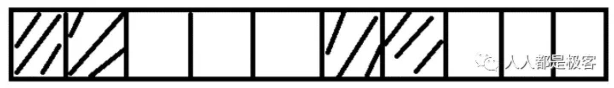
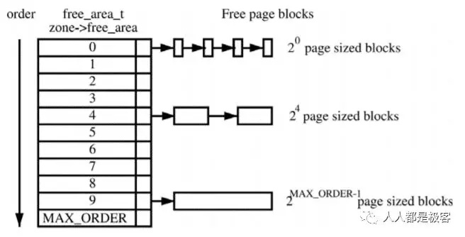
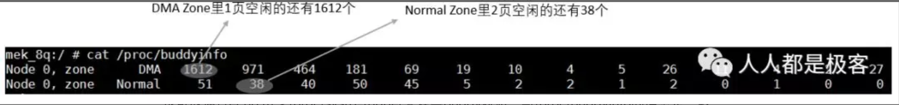
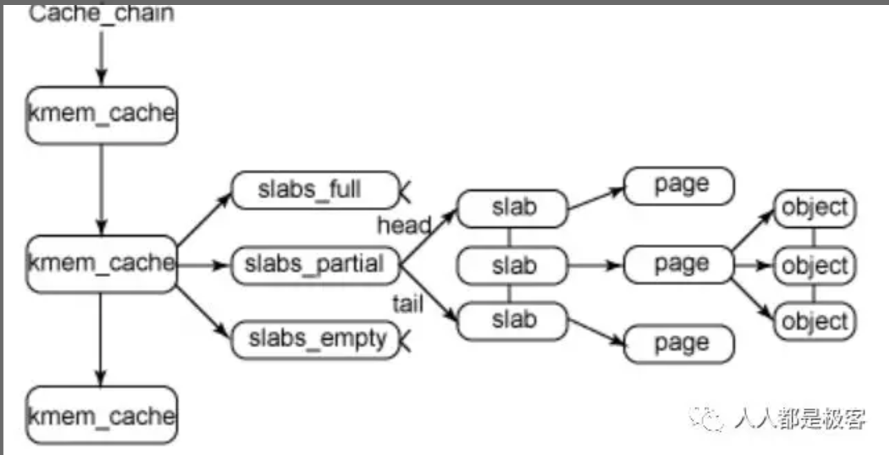
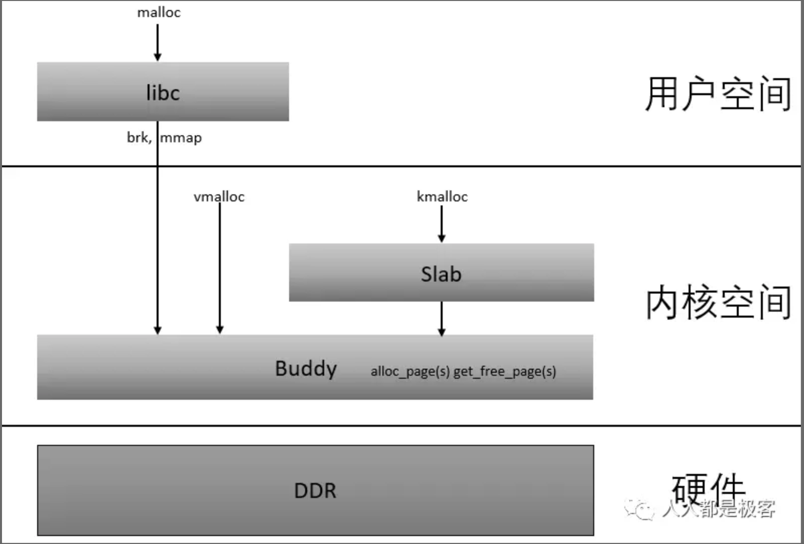

##内存page管理

有了前两节的学习相信读者已经知道CPU所有的操作都是建立在虚拟地址上处理(这里的虚拟地址分为内核态虚拟地址和用户态虚拟地址)，CPU看到的内存管理都是对page的管理，
接下来我们看一下用来管理page的经典算法--Buddy。

##Buddy分配算法

假设这是一段连续的页框，阴影部分表示已经被使用的页框，现在需要申请一个连续的5个页框。这个时候，在这段内存上不能找到连续的5个空闲的页框，就会去另一段内存上去寻找5个连续的页框，这样子，久而久之就形成了页框的浪费。
为了避免出现这种情况，Linux内核中引入了伙伴系统算法(Buddy system)。把所有的空闲页框分组为11个块链表，每个块链表分别包含大小为1，2，4，8，16，32，64，128，256，512和1024个连续页框的页框块。最大可以申请1024个连续页框，对应4MB大小的连续内存。每个页框块的第一个页框的物理地址是该块大小的整数倍，如图：

假设要申请一个256个页框的块，先从256个页框的链表中查找空闲块，如果没有，就去512个页框的链表中找，找到了则将页框块分为2个256个页框的块，一个分配给应用，另外一个移到256个页框的链表中。如果512个页框的链表中仍没有空闲块，继续向1024个页框的链表查找，如果仍然没有，则返回错误。页框块在释放时，会主动将两个连续的页框块合并为一个较大的页框块。

从上面可以知道Buddy算法一直在对页框做拆开合并拆开合并的动作。Buddy算法牛逼就牛逼在运用了世界上任何正整数都可以由2^n的和组成。这也是Buddy算法管理空闲页表的本质。 空闲内存的信息我们可以通过以下命令获取：

也可以通过echo m > /proc/sysrq-trigger来观察buddy状态，与/proc/buddyinfo的信息是一致的：

##CMA

细心的读者或许会发现当Buddy算法对内存拆拆合合的过程中会造成碎片化的现象，以至于内存后来没有了大块的连续内存，全是小块内存。当然这对应用程序是不影响的(前面我们讲过用页表可以把不连续的物理地址在虚拟地址上连续起来)，
但是内核态就没有办法获取大块连续的内存（比如DMA, Camera, GPU都需要大块物理地址连续的内存）。

在嵌入式设备中一般用CMA来解决上述的问题。CMA的全称是contiguous memory allocator， 其工作原理是：预留一段的内存给驱动使用，但当驱动不用的时候，CMA区域可以分配给用户进程用作匿名内存或者页缓存。而当驱动需要使用时，
就将进程占用的内存通过回收或者迁移的方式将之前占用的预留内存腾出来，供驱动使用。

##Slab

在Linux中，伙伴系统（buddy system）是以页为单位管理和分配内存。但是现实的需求却以字节为单位，假如我们需要申请20Bytes，总不能分配一页吧！那岂不是严重浪费内存。那么该如何分配呢？slab分配器就应运而生了，专为小内存分配而生。
slab分配器分配内存以Byte为单位。但是slab分配器并没有脱离伙伴系统，而是基于伙伴系统分配的大内存进一步细分成小内存分配。我们先来看一张图：

kmem_cache是一个cache_chain的链表，描述了一个高速缓存，每个高速缓存包含了一个slabs的列表，这通常是一段连续的内存块。存在3种slab：

+ slabs_full(完全分配的slab)
+ slabs_partial(部分分配的slab)
+ slabs_empty(空slab,或者没有对象被分配)。

slab是slab分配器的最小单位，在实现上一个slab有一个或多个连续的物理页组成（通常只有一页）。单个slab可以在slab链表之间移动，例如如果一个半满slab被分配了对象后变满了，就要从slabs_partial中被删除，同时插入到slabs_full中去。

为了进一步解释，这里举个例子来说明，用struct kmem_cache结构描述的一段内存就称作一个slab缓存池。一个slab缓存池就像是一箱牛奶，一箱牛奶中有很多瓶牛奶，每瓶牛奶就是一个object。分配内存的时候，就相当于从牛奶箱中拿一瓶。总有拿完的一天。当箱子空的时候，你就需要去超市再买一箱回来。超市就相当于partial链表，超市存储着很多箱牛奶。如果超市也卖完了，自然就要从厂家进货，然后出售给你。厂家就相当于伙伴系统。

##总结
从内存DDR分为不同的ZONE，到CPU访问的Page通过页表来映射ZONE，再到通过Buddy算法和Slab算法对这些Page进行管理，我们应该可以从感官的角度理解了下图：

