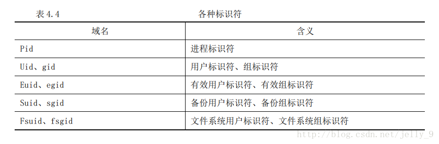
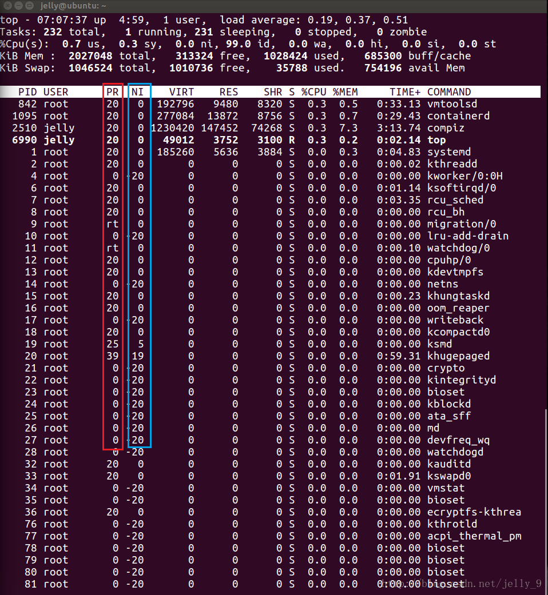
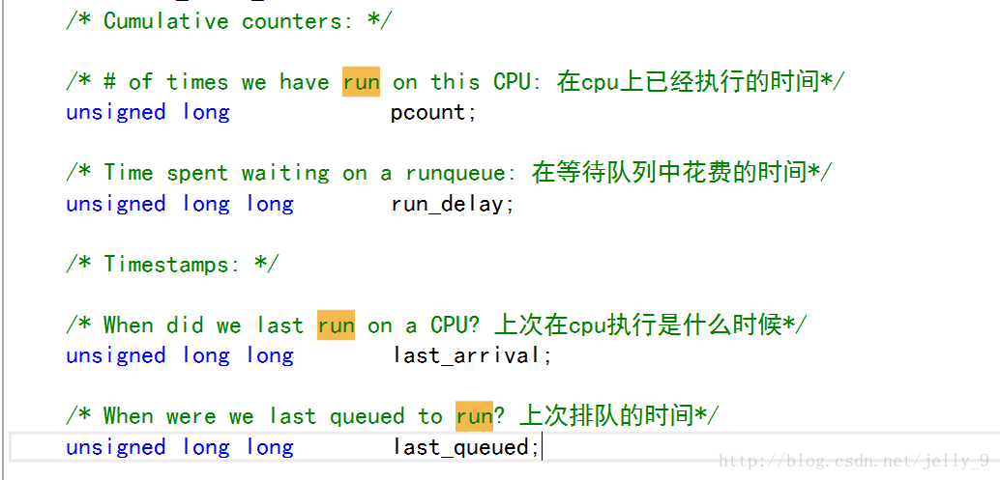
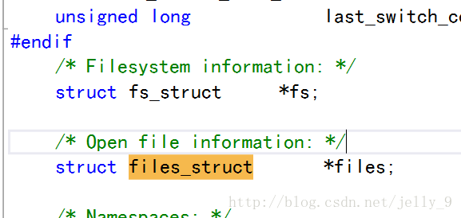
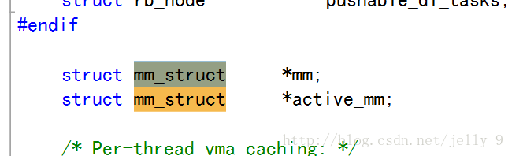
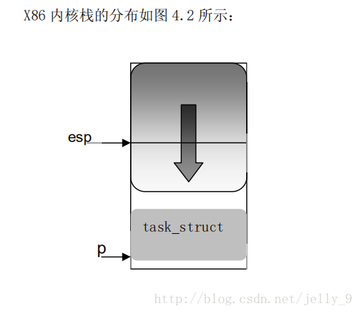

PCB通常记载进程之相关信息，包括：
+ 程序计数器：接着要运行的指令地址。
+ 进程状态：可以是new、ready、running、waiting或 blocked等。
+ CPU暂存器：如累加器、索引暂存器（Index register）、堆栈指针以及一般用途暂存器、状况代码等，主要用途在于中断时暂时存储数据，以便稍后继续利用；其数量及类因电脑架构有所差异。
+ CPU排班法：优先级、排班队列等指针以及其他参数。
+ 存储器管理：如标签页表等。
+ 会计信息：如CPU与实际时间之使用数量、时限、账号、工作或进程号码。
+ 输入输出状态：配置进程使用I/O设备，如磁带机。


##进程控制块(PCB) —— task_struct

我们把正在执行的程序称为进程，这是一种广义的定义。更具体一点来说，进程是由正文端 (text) 、用户数据段 (usr segment) 以及系统数据段 (system segment)共同组成的一个程序执行环境。

##进程和程序

**程序**
程序是一个包含及其代码指令和数据的可执行文件，这个文件一般储存在磁盘上（储存设备）上，所以，程序是一个静态的实体。比如，我们用 C 语言写了一个C源程序，这个程序要经过 “预处理-编译-汇编-链接”这一过程才能生成可执行文件，这个可执行文件在 Windows 下一般为 xxx.exe，该可执行文件才是我们所说的程序。

**进程**
我们可以认为上述所说的程序是：你期望完成某项任务的方法和步骤，它只浮现在纸面上，等待去实现。而这个实现过程就是由进程来完成的，进程可以认为是运行中的程序。它除了包含程序中的所有数据之外，还包含一些额外数据。
当程序被装入内存中并且获取到所需资源后就可运行了：在程序计数器 (PC) 和其它一些寄存器的控制下，机器指令被取至 cpu 运行。

进程在运行过程中，还需要一些系统资源。其中最重要的就是 cpu 资源了，除此之外还包括但不限于物理内存（以容纳进程本身和其有关数据）、打印机、键盘等等。
由上可见进程是一个动态的实体，它每时每刻都在发生着变化。那么如何管理和描述这个动态的进程呢？请看下面详情。

##进程控制块
进程控制块（Processing Control Block），是操作系统核心中一种数据结构，主要表示进程状态。其作用是使一个在多道程序环境下不能独立运行的程序（含数据），成为一个能独立运行的基本单位或与其它进程并发执行的进程。或者说，OS是根据PCB来对并发执行的进程进行控制和管理的。 PCB通常是系统内存占用区中的一个连续存区，它存放着操作系统用于描述进程情况及控制进程运行所需的全部信息，它使一个在多道程序环境下不能独立运行的程序成为一个能独立运行的基本单位或一个能与其他进程并发执行的进程。

进程控制块(PCB)是系统为了管理进程设置的一个专门的数据结构。系统用它来记录进程的外部特征，描述进程的运动变化过程。同时，系统可以利用PCB来控制和管理进程，所以说，PCB（进程控制块）是系统感知进程存在的唯一标志。

在 Linux 中每个进程由一个 task_struct 结构体来描述，该结构体也被称为进程控制块（PCB）。它被定义于 include/linux/sched.h （Linux源码github地址)。

task_struct 容纳了一个进程的所有信息，它是系统对进程进行控制的唯一手段，也是最有效的手段。

每当系统创建一个进程，就会给该进程动态的分配一个 task_struct 结构体对象。一个系统内所允许的最大进程个数一般由机器硬件 (物理内存) 决定。在一台 IA32 体系结构中，内存为 512M 的机器上所允许的最大进程数是 32k 。

总之包含进程所有信息的 task_struct 内容是比较庞大复杂的，我们将其部分内容罗列如下：

```java
struct task_struct{
  ...
  // 进程标识符
  ...
  // 上下文信息
  ...
  // 进程状态
  ...
  // 进程优先级
  ...
  // 进程通信有关信息 
  ...
  // 时间和定时器有关信息
  ...
  // 文件系统信息
  ...
  // 虚拟内存信息
  ...
  // 其它
  ...
};
```

###进程标识符

操作系统中有很多进程，不管对于用户还是对于内核，如何用一种简单的方式以区分不同进程呢？这就引入了进程标识符 (PID：process identifier)，每个进程都拥有一个唯一的进程标识符，内核以此来区分不同进程，同时，用户也可以通过此标识符来给具体进程发号施令。Linux 中我们可以通过以下几种方式获取 PID：

shell中：通过ps aux列出所有进程详细信息，在其中我们可以看到进程的 PID， 也可以通过 ps aux | grep '进程名' 查看指定进程信息，除此之外还有 top 命令也可以查看进程信息。

C程序中相关系统调用函数
```java
#include <unistd.h>
pid_t getpid();     //调用进程的进程id
pid_t getppid();    //调用进程的父进程id
uid_t getuid();     //调用进程的实际用户的id
uid_t geteuid();    //调用进程的有效用户id
gid_t getgid();     //调用进程的实际组id
gid_t getegid();    //调用进程的有效组id
```

也可以通过文件 /proc/ 文件来查看进程信息。除此之外的其它 id:



###上下文信息
上下文信息一般和处理器密切相关。进程作为一个程序执行环境的综合，当处理器调度执行某个程序时，需要将相关指令和数据加载到对应的寄存器和堆栈中，当进程暂停或者等时，必须将其对应的寄存器和堆栈信息暂存起来，以便稍后重新调度该进程时，将其回复到暂停之前的状态，那么这一部分信息就是进程的上下文信息。

###进程状态
进程在执行时，会根据环境改变其状态，进程状态是进程调度的依据。在 Linux 中进程更主要有这些状态：

```java
/* Used in tsk->state: */
#define TASK_RUNNING            0x0000  //可运行
#define TASK_INTERRUPTIBLE      0x0001  //可中断的等待
#define TASK_UNINTERRUPTIBLE    0x0002  //不可中断的等待
#define __TASK_STOPPED          0x0004  //暂停
/* Used in tsk->exit_state: 退出状态*/
#define EXIT_DEAD           0x0010  //死亡
#define EXIT_ZOMBIE         0x0020  //僵死

#define TASK_STATE_MAX      0x1000  //进程最大个数:8k
```
可运行状态：处于该状态的进程，要么正在运行，要么准备运行（在等待cpu资源）。系统通过一个运行队列 (run_queue) 来管理处于此状态的进程。
等待状态：处于该状态的进程在等待某个事件或某个资源（磁盘、打印机），这些进程位于系统中的等待队列中(wait_queue)，对于等待不同资源设置有不同等待队列，比如，需要打印机的进程被置于打印机的等待队列中，需要磁盘的进程被置于磁盘等待队列中。可中断的等待可以被信号唤醒，如果被唤醒，该进程就被加入到运行队列中，等待被调度，不可中断的等待是由于没有所需的硬件而等待，需要的磁盘资源暂时被其它进程占用，这一类进程不可以被信号唤醒，直到它获取到需要的硬件资源。
暂停状态：此时进程停止运行等待接收某种处理通常进程接收到 SIGSTOP、SIGTSTP、SIGTTIN 或 SIGTTOU信号后就处于这种状态。正在调试的进程就处于这种状态，如下图所示：

僵死状态：当子进程退出，而父进程没有退出，也没有读取(wait()) 子进程退出状态时，此时子进程就进入僵尸状态 (僵尸进程详情)。

###进程优先级
调度程序依靠这一部分信心决定进程的执行顺序，并结合进程的状态信息保证系统运转的公平和高效。

Linux通过以下几种方式查看进程优先级：
+ top: 动态列出系统的整体运行情况；
+ ps -l：采用详细格式显示进程情况。
下面是用top 查看的详情：



如上图，有两列和进程优先级有关：

PR (priority)：进程优先级，越小代表优先级越高；
NI (nice)：优先级修正参数。
如何设置优先级？

修改优先级的第一种方法是：在程序开始执行前，通过如下命令修改：

>nice +n +5 -p fileName//在原来优先级基础上+5, shell 文件

可以看到当降低 (PR越大，优先级越小) 进程优先级后，其占用 cpu 资源降低了很多。

修改优先的第二中方法：在程序执行时修改，其命令如下：

>renice +5 -p pid//需要知道进程id


###进程通信有关信息

为了可以使进程相互协作完成任务，不同进程间必须进行通信，即交流数据。Linux 支持多种不同的通信机制。支持电信的 Unix 通信机制(IPC) ，比如管道、信号，也支持 System V 通信机制：共享内存、信号量和消息队列。


###时间和定时器



一个进程从创建到终止叫做该进程的生存期。一个进程在其生存期内使用 cpu 的时间系统都要进程记录，以便进程统计、“计费”等操作。“时间”对于操作系统是及其重要的，比如在进程调度的时间片轮转中，操作系统要根据当前进程在 cpu 上执行时间的长短以确定是否要将 cpu 分配给其它进程，这个关乎到系统对进程调度是否公平和高效。


###文件系统信息



进程可以打开和关闭文件，文件属于系统资源，Linux 内核需要记录进程对文件的使用情况。task_struct 进程控制块中有两个结构体用于记录文件相关信息。其中 fs_struct 中描述了两个 VFS节点，分别是 root 和 pwd，一个指向根目录，一个指向当前目录。还有 files_struct 记录进程打开的文件描述符。

在文件系统中，每个 VFS 索引节点唯一描述一个文件或目录，同时该节点也是向更低，层的文件系统提供的统一的接口。

###虚拟内存信息




除了内核线程（kernel thread），每个进程都拥有自己的地址空间（也叫虚拟空间），
用 mm_struct 来描述。另外 Linux2.4 还引入了另外一个域 active_mm,这是为内核线程而引入。因为内核线程没有自己的地址空间，为了让内核线程与普通进程具有统一的上下文切换
方式，当内核线程进行上下文切换时，让切换进来的线程的 active_mm 指向刚被调度出去的进程的 active_mm（如果进程的 mm 域不为空，则其 active_mm 域与 mm 域相同）。

//关于进程的地址空间，指向进程的地址空间。（链表和红黑树）
>struct mm_struct *mm, *active_mm;

task_struct和mm_strcut通过这两个成员进行和mm_struct联系，每一个进程都会有唯一的mm_struct结构体。
```java
struct mm_struct {
    //指向线性区对象的链表头
    struct vm_area_struct * mmap;       /* list of VMAs */
    //指向线性区对象的红黑树
    struct rb_root mm_rb;
    //指向最近找到的虚拟区间
    struct vm_area_struct * mmap_cache; /* last find_vma result */
	//内核进程搜索进程地址空间中线性地址的空间空间
	unsigned long free_area_cache;      /* first hole of size cached_hole_size or larger */
	
	//指向页表的目录
	pgd_t * pgd;
	
	//共享进程时的个数
	atomic_t mm_users;          /* How many users with user space? */

```

每个进程都有自己独立的mm_struct，使得每个进程都有一个抽象的平坦的独立的32或64位地址空间，各个进程都在各自的地址空间中相同的地址内存存放不同的数据而且互不干扰。如果进程之间共享相同的地址空间，则被称为线程。
其中
+ [start_code,end_code)表示代码段的地址空间范围。
+ [start_data,end_start)表示数据段的地址空间范围。
+ [start_brk,brk)分别表示heap段的起始空间和当前的heap指针。
+ [start_stack,end_stack)表示stack段的地址空间范围。
+ mmap_base表示memory mapping段的起始地址。


对Linux来说，用户进程和内核线程（kernel thread)都是task_struct的实例，唯一的区别是kernel thread是没有进程地址空间的，内核线程也没有mm描述符的，
所以内核线程的tsk->mm域是空（NULL）。内核scheduler在进程context switching的时候，会根据tsk->mm判断即将调度的进程是用户进程还是内核线程。
但是虽然thread thread不用访问用户进程地址空间，但是仍然需要page table来访问kernel自己的空间。但是幸运的是，对于任何用户进程来说，他们的内核空间
都是100%相同的，所以内核可以’borrow'上一个被调用的用户进程的mm中的页表来访问内核地址，这个mm就记录在active_mm。

简而言之就是，对于kernel thread,tsk->mm == NULL表示自己内核线程的身份，而tsk->active_mm是借用上一个用户进程的mm，用mm的page table来访问内核空间。对于用户进程，tsk->mm == tsk->active_mm。

### 进程用户空间创建

进程的用户空间是在执行系统调用的fork时创建的，基于写时复制的原理，子进程创建的时候继承了父进程的用户空间，仅仅是mm_struc结构的建立、vm_area_struct结构的建立
以及页目录和页表的建立，并没有真正地复制一个物理页面，这也是为什么Linux内核能迅速地创建进程的原因之一。

一个进程的线性地址空间被分成两部分：

①0x00000000到0xc0000000-1，用户态进程和内核态进程都能寻址；

②0xc0000000到0xffffffff的线性地址只有内核态的进程才能寻址。

所以线性地址的第四个GB留给内核，前3GB供内核和用户程序同时访问。

###上下文切换

操作系统内核使用一种称为上下文切换的较高层形式的控制流来实现多任务。内核为每一个进程维持一个上下文。
上下文就是内核重新启动一个被抢占的进程所需的状态。他有一些对象的值组成，这些对象包括：　　

+ 通用目的寄存器
+ 浮点寄存器
+ 程序计数器
+ 用户栈
+ 状态寄存器
+ 内核栈
+ 各种内核数据结构:比如描绘地址空间的页表，包含有关当前进程信息的进程表，以及包含进程已打开文件的信息的文件表。
　　

当内核代表用户执行系统调用时，可能会发生上下文切换，如果系统调用因为等待某个时间发生而阻塞，那么内核可以让当前进程休眠，切换到另一个进程。
比如：如果一个read系统调用请求一个磁盘访问，内核可以选择执行上下文切换，运行另外一个进程，而不是等待数据从磁盘到达。
另一个例子是sleep系统调用，它显式的请求让调用进程休眠，一般而言，即使系统调用没有阻塞，内核也可以决定执行上下文切换，而不是将控制返回给调用进程。
中断也可能引发上下文切换。

比如，所有的系统都有某种产生周期性定时器中断的机制，典型的为每一毫秒或每十毫秒，每次发生定时器中断时，内核就能判定当前进程已经运行了足够长时间了，并切换到一个新的进程。
上下文简单说来就是一个环境，相对于进程而言，就是进程执行时的环境。具体来说就是各个变量和数据，包括所有的寄存器变量、进程打开的文件、内存信息等。

一个进程的上下文可以分为三个部分:用户级上下文、寄存器上下文以及系统级上下文。

用户级上下文： 正文、数据、用户堆栈以及共享存储区；
寄存器上下文： 通用寄存器、程序寄存器(IP)、处理器状态寄存器(EFLAGS)、栈指针(ESP)；
系统级上下文: 进程控制块task_struct、内存管理信息(mm_struct、vm_area_struct、pgd、pte)、内核栈

当发生进程调度时，进行进程切换就是上下文切换(context switch).操作系统必须对上面提到的全部信息进行切换，新调度的进程才能运行。


###当前进程

当一个进程在某个 CPU 上正在执行时，内核如何获得指向它的 task_struct 的指针？current 指针指向当前 cpu 上运行的进程。


##进程内核栈、用户栈




1.进程的堆栈

内核在创建进程的时候，在创建task_struct的同时，会为进程创建相应的堆栈。每个进程会有两个栈，一个用户栈，存在于用户空间，一个内核栈，存在于内核空间。
当进程在用户空间运行时，cpu堆栈指针寄存器里面的内容是用户堆栈地址，使用用户栈；当进程在内核空间时，cpu堆栈指针寄存器里面的内容是内核栈空间地址，使用内核栈。

每个进程都有自己的内核栈。当进程从用户态进入内核态时，CPU 就自动地设置该进程的内核栈，也就是说，CPU 从任务状态段中装入内核栈指针 esp。

2.进程用户栈和内核栈的切换

当进程因为中断或者系统调用而陷入内核态之行时，进程所使用的堆栈也要从用户栈转到内核栈。

进程陷入内核态后，先把用户态堆栈的地址保存在内核栈之中，然后设置堆栈指针寄存器的内容为内核栈的地址，这样就完成了用户栈向内核栈的转换；当进程从内核态恢复到用户态之行时，在内核态之行的最后将保存在内核栈里面的用户栈的地址恢复到堆栈指针寄存器即可。这样就实现了内核栈和用户栈的互转。

那么，我们知道从内核转到用户态时用户栈的地址是在陷入内核的时候保存在内核栈里面的，但是在陷入内核的时候，我们是如何知道内核栈的地址的呢？

关键在进程从用户态转到内核态的时候，进程的内核栈总是空的。这是因为，当进程在用户态运行时，使用的是用户栈，当进程陷入到内核态时，内核栈保存进程在内核态运行的相关信心，
但是一旦进程返回到用户态后，内核栈中保存的信息无效，会全部恢复，因此每次进程从用户态陷入内核的时候得到的内核栈都是空的。所以在进程陷入内核的时候，直接把内核栈的栈顶地址给堆栈指针寄存器就可以了。

##进程控制块PCB的组织方式：

1. 线性表方式：不论进程的状态如何，将所有的PCB连续地存放在内存的系统区。这种方式适用于系统中进程数目不多的情况。

2. 索引表方式：该方式是线性表方式的改进，系统按照进程的状态分别建立就绪索引表、阻塞索引表等。

3. 链接表方式：系统按照进程的状态将进程的PCB组成队列，从而形成就绪队列、阻塞队列、运行队列等。

哈希表是一种查找效率极高的数据结构，Linux 中以哈希表来组织进程。

