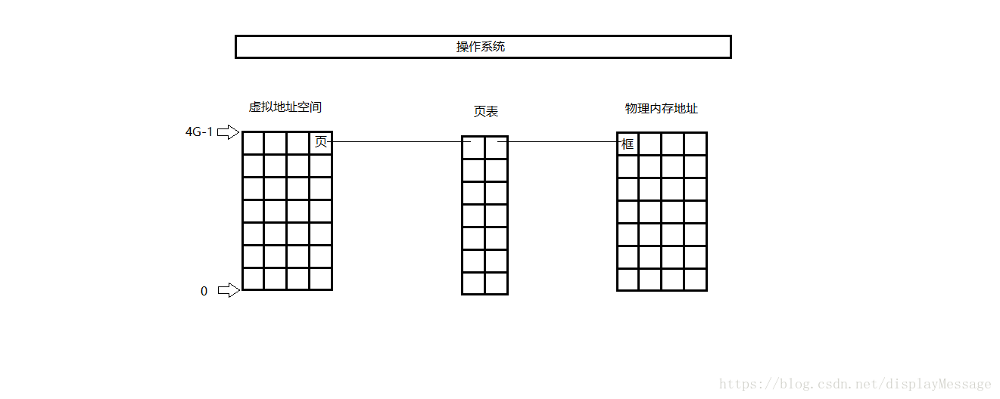
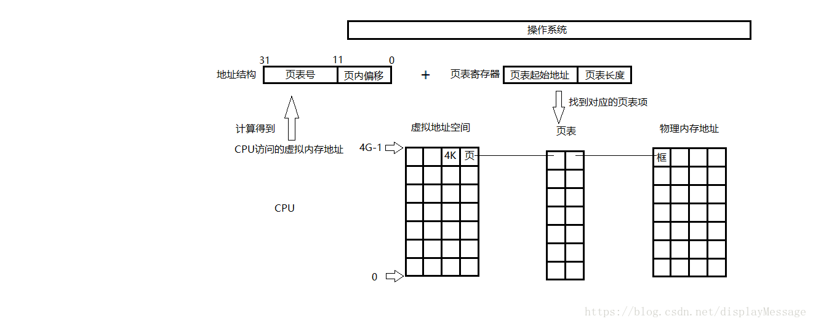
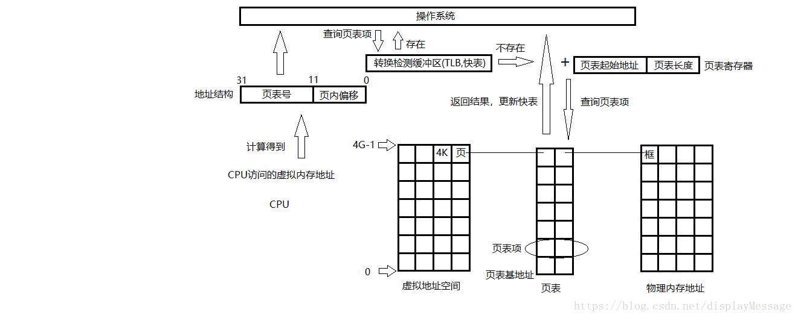
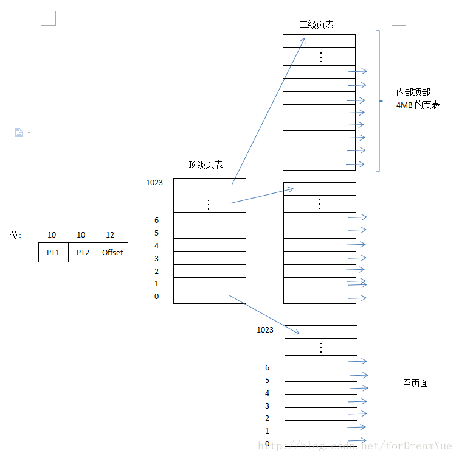

## 页表

我们知道，在linux操作系统中，CPU在执行一个进程的时候，都会访问内存。但CPU并不是直接访问物理内存地址，而是通过虚拟地址空间来间接的访问物理内存地址。所谓的虚拟地址空间，是操作系统为每一个正在执行的进程分配的一个逻辑地址，在32位机上，其范围从0 ~ 4G-1。
操作系统通过将虚拟地址空间和物理内存地址之间建立映射关系，让CPU间接的访问物理内存地址。通常将虚拟地址空间以512Byte ~ 8K，作为一个单位，称为页，并从0开始依次对每一个页编号。这个大小通常被称为页面。

将物理地址按照同样的大小，作为一个单位，称为框或者块，也从0开始依次对每一个框编号。

操作系统通过维护一张表，这张表上记录了每一对页和框的映射关系。如图：



这张表，称为页表。

##内核页表和进程页表

最近在看vmalloc()分配代码，我们知道当通过alloc_page()分配出来page后，需要将这些分散的物理页框page映射到vmalloc区，这里我们就要修改内核页表，以前我学页表是把内核空间与用户空间割裂学习的，导致二者无法很好地衔接，这里我会把两个概念重新解释清楚。
下面代码映射到vmalloc区的关键就是map_vm_area()函数，
```java
for (i = 0; i < area->nr_pages; i++) {
        struct page *page;
 
        if (node == NUMA_NO_NODE)
            page = alloc_page(alloc_mask);
        else
            page = alloc_pages_node(node, alloc_mask, order);
    }
 
    if (map_vm_area(area, prot, pages))
        goto fail;
    return area->addr;
```
拿IA32架构的虚拟地址来说，0~3GB属于用户空间，用户空间是由每个进程的task_struct.mm_struct.pgd的成员变量，这个指向的就是进程页表。
而3G~4GB属于内核空间，这个页表是由内核页目录表管理，存放在主内核页全局目录init_mm.pgd(swapper_pg_dir)中

```java
struct mm_struct init_mm = {
         .mm_rb          = RB_ROOT,
         .pgd            = swapper_pg_dir,
         .mm_users       = ATOMIC_INIT(2),
         .mm_count       = ATOMIC_INIT(1),
         .mmap_sem       = __RWSEM_INITIALIZER(init_mm.mmap_sem),
         .page_table_lock =  __SPIN_LOCK_UNLOCKED(init_mm.page_table_lock),
         .mmlist         = LIST_HEAD_INIT(init_mm.mmlist),
         INIT_MM_CONTEXT(init_mm)
};
```
进程切换切换的是进程页表：即将新进程的pgd(页目录)加载到CR3寄存器中。而内核页表是所有进程共享的，每个进程的“进程页表”中内核态地址相关的页表项都是“内核页表”的一个拷贝。
在vmalloc区发生page fault时，将“内核页表”同步到“进程页表”中。这部分区域对应的线性地址在内核使用vmalloc分配内存时，其实就已经分配了相应的物理内存，并做了相应的映射，
建立了相应的页表项，但相关页表项仅写入了“内核页表”，并没有实时更新到“进程页表中”，内核在这里使用了“延迟更新”的策略，将“进程页表”真正更新推迟到第一次访问相关线性地址，
发生page fault时，此时在page fault的处理流程中进行“进程页表”的更新。

所以linux中，只有进程的页表是时刻在更换的，而内核页表全局只有一份，所有进程共享内核页表！

##页表示例

在windows系统下，页面为4k，这里我们以4k为例。虚拟地址空间以页面为单位划分。在物理内存中对应的单位称为页帧。页面和页帧的大小总是一样的。假设页面的大小为4KB，下面是一个页表给出虚拟地址与物理内存地址之间的映射关系


在上图为例的16个4KB页面情况下MMU的内部操作如下图


这样的页表，有两个很主要的问题

1）页表有可能非常大

2）地址映射必须非常快

一个4G虚拟地址空间，将会产生(2^10 * 2^10 * 2^10 * 4 )1024*1024个页，页表的每一项存储一个页和一个框的映射，所以，至少需要1M个页表项。如果一个页表项大小为1Byte，则至少需要1M的空间，所以页表被放在物理内存中，由操作系统维护。
当CPU要访问一个虚拟地址空间对应的物理内存地址时，先将具体的虚拟地址A/页面大小4K，结果的商作为页表号，结果的余作为业内地址偏移。

高位页表号，低位偏移量

例如：

CPU访问的虚拟地址：A

页面：L

页表号：(A/L)

页内偏移：(A%L)

CPU中有一个页表寄存器，里面存放着当前进程页表的起始地址和页表长度。将上述计算的页表号和页表长度进行对比，确认在页表范围内，然后将页表号和页表项长度相乘，得到目标页相对于页表基地址的偏移量，最后加上页表基地址偏移量就可以访问到相对应的框了，CPU拿到框的起始地址之后，再把页内偏移地址加上，访问到最终的目标地址。如图：

注意，每个进程都有页表，页表起始地址和页表长度的信息在进程不被CPU执行的时候，存放在其PCB内。

按照上述的过程，可以发现，CPU对内存的一次访问动作需要访问两次物理内存才能达到目的，第一次，拿到框的起始地址，第二次，访问最终物理地址。CPU的效率变成了50%。为了提高CPU对内存的访问效率，在CPU第一次访问内存之前，加了一个快速缓冲区寄存器，它里面存放了近期访问过的页表项。
当CPU发起一次访问时，先到TLB中查询是否存在对应的页表项，如果有就直接返回了。整个过程只需要访问一次内存。如图：



这种方式极大的提高了CPU对内存的访问效率。将近90%。


## 单级页表的缺点

前面说了为了提高内存的利用率，内存是分页管理的，并且有一个页表用来存储页号与页框的对应关系。这个思想理论上是没有问题的，但是实际使用的时候就不行了，为什么？

为了更好的提高内存的利用率，每一页就应该做得足够小，但是每一页都要在页表里面有一项与页框对应，也就是说页数越多页表也就会越大，页表如果很大的话就会对内存造成浪费，因为存放页表的这部分你内存是不能给程序使用的，并且一直存放在该进程的PCB里面。那么究竟会造成多大的浪费？假设页面尺寸为4K，地址是32位，那么就有220个页面，页表里面就有220个页表项，如果每个页表项是4个字节，2^20个就是4M；系统并发十个进程，需要40M内存。如果并发一百个就是400M内存，这无疑是一个很大的开销。

但是实际上大部分的逻辑地址根本不会用到。为什么？如果你跑一个小程序，可能只需要几M或者几十M，也就是说页表里面用到的项只占2^20的很小一部分，那么能不能把不需要的那些项给屏蔽掉呢，也就是不存储那些项。

**多级页表的提出**

单级页表问题的产生是由于现代计算机使用的虚拟地址至少是32位的。比如，当页面大小为4KB时，32位的地址空间将有100万个页面，64位的地址空间则更多。虚拟地址空间中的100万个页面需要有100万个表项的页表。并且请记住，每个进程都需要有自己的页表（因为每个进程有自己的虚拟地址空间）。
显然不可能每个进程都将自己的页表保存在内存中。避免把全部页表一直保存在内存中是多级页表的关键所在。特别是那些不需要的页表就不应该保留。

什么意思呢？对于一个进程而言，它的虚拟地址空间是相对于地址线而言的。假如有一台可以生成32位地址的计算机，地址范围就从0到4GB，且这些地址是虚拟地址。假设一个页面大小为4KB，那么就有100万个页面。假设存储一个页面需要1个byte去存储，那么一个进程就需要占用内存100万个byte，也就是1MB。
每个进程都占用内存1MB去存储页表是件很浪费的事情，特别是当运行的总进程数多的时候，而且，这只是在32位地址的计算机的情况下，如果是在64位地址的计算机的情况下，如果按照相同的计算方法，一个进程的页表占用的空间一个普通内存根本放不下。
关键是，一个进程，真的会需要一整个虚拟地址空间去存放吗？

绝大多数都不需要，比如，一个需要12MB的进程，底端是4MB程序正文，后面是4MB数据，顶端是4MB堆栈，在数据顶端上方和堆栈之间是大量根本没有使用的空闲区。

通过一个顶级页表为真正有用的页表提供索引，这是我所理解的二级页表的本质。多级页表的原理类似。上述的12MB的进程的二级页表如下图



虽然在图中的地址空间超过100万个页（1024个二级页表，每个二级页表有1024个页），实际上只需要四个页表：顶级页表以及0~4M、4M~8M和顶端4M的二级页表。顶级页表中1021(1024-3)个表项的“在/不在”位都被设为0，当访问它们时强制产生一个页面失效。
图中的顶级页表项的PT1有10位，代表顶级页表有2^10=1024个页表项（但大多的“在/不在”位都被设为0，因为没有用到），PT2有10位，代表二级页表有2^10=1024个页表项，一个页表项对应一个页面，也就是该页表项存储了虚拟地址的页帧号，用该页帧号加上Offset，就构成了物理地址。

举个例子，考虑32位虚拟地址0x00403004（十进制4206596），它位于数据部分12292字节处。它的虚拟地址对应PT1=1，PT2=3，Offset=4。MMU首先用PT1作为索引访问顶级页表得到表项1，它的地址范围是在它的4M块内的12288~16383（即绝对地址4206592~4210687）。
这个表项含有虚拟地址0x00403004所在页面的页帧号。如果该页面不再内存中，页表表项中的“在/不在”位将是0，引发一次页面失效。如果该页面在内存中，从二级页表中得到的页帧号将与偏移量，也就是4结合构成物理地址。该地址被放到总线上并送到内存中。


**多级页表的缺点**

但是这种方式也存在一个问题，每一次访问的时候都要根据章目录找到页目录再找到具体的页。也就是需要访问三次内存；cpu每一条指令执行的时间其实大部分都是浪费在访问内存上，cpu的执行速度是非常快的，比如访问内存的时间几乎可以忽略了；换言之，两级页表的形式虽然提高了控件效率，但是在时间上其实是变成了原来的3倍的；这还只是两级页表，如果是4级或者5级的，因为电脑不是32位的啊，现在基本上都是64位的了。

**相连快速存储TLB（快表）**

在CPU与内存访问之间加一层TLB，TLB是一组寄存器，用来存放最近使用过的页对应的页框号；这样如果CPU需要访问某一页首先在TLB里面找，如果TLB里面有就不用访问内存了，
因为TLB是寄存器，cpu访问寄存器的速度远大于对内存的访问速度。这样就可以提升时间性能了。可以看到提升时间性能最主要的因素就是可以在TLB里面直接找到该页对应的页框号。那么如何提升命中率的，首先TLB肯定是越大越好，但是TLB材料很贵，不会做得很大。TLB的大小大概是[64,1024]。为什么TLB里面存放这么少的项就能实现“近似访存1次”？因为程序的局部性原理。程序的局部性原理在用户程序里面对应的就是循环。TLB也被称为快表。


**多级页表的缺点**

但是这种方式也存在一个问题，每一次访问的时候都要根据章目录找到页目录再找到具体的页。也就是需要访问三次内存；cpu每一条指令执行的时间其实大部分都是浪费在访问内存上，cpu的执行速度是非常快的，比如访问内存的时间几乎可以忽略了；换言之，两级页表的形式虽然提高了控件效率，但是在时间上其实是变成了原来的3倍的；这还只是两级页表，如果是4级或者5级的，因为电脑不是32位的啊，现在基本上都是64位的了。

**相连快速存储TLB（快表）**

在CPU与内存访问之间加一层TLB，TLB是一组寄存器，用来存放最近使用过的页对应的页框号；这样如果CPU需要访问某一页首先在TLB里面找，如果TLB里面有就不用访问内存了，
因为TLB是寄存器，cpu访问寄存器的速度远大于对内存的访问速度。这样就可以提升时间性能了。可以看到提升时间性能最主要的因素就是可以在TLB里面直接找到该页对应的页框号。那么如何提升命中率的，首先TLB肯定是越大越好，但是TLB材料很贵，不会做得很大。TLB的大小大概是[64,1024]。为什么TLB里面存放这么少的项就能实现“近似访存1次”？因为程序的局部性原理。程序的局部性原理在用户程序里面对应的就是循环。TLB也被称为快表。
