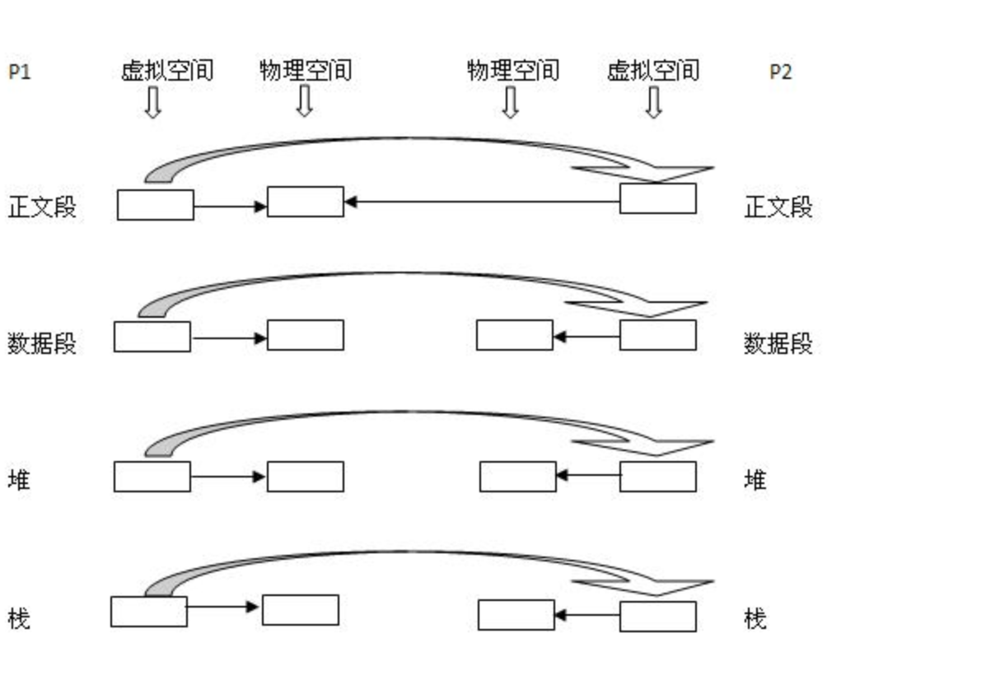
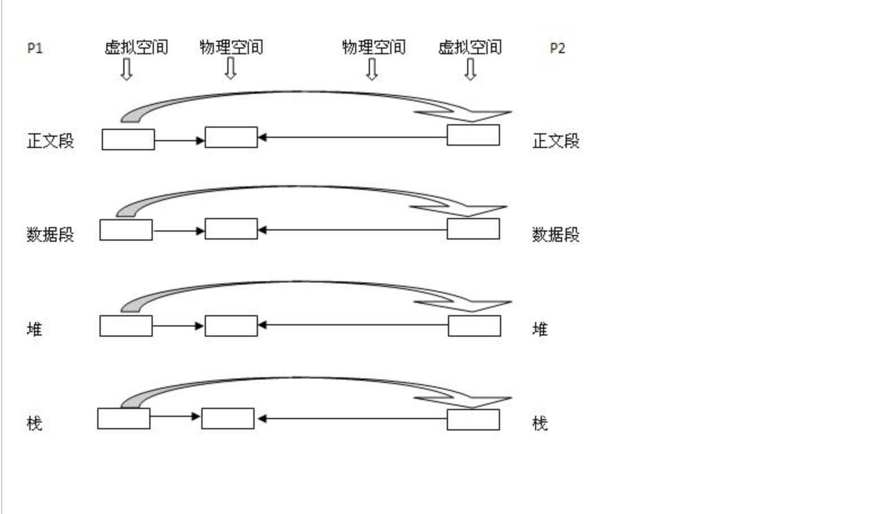
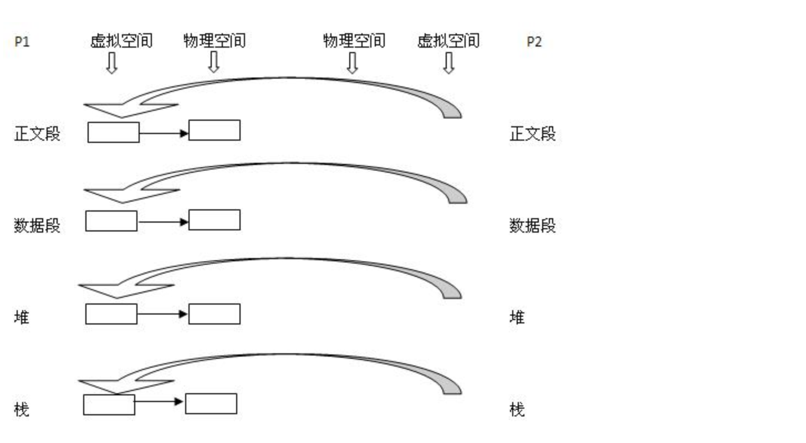

##Linux写时拷贝技术(copy-on-write)

##COW技术初窥：

在Linux程序中，fork（）会产生一个和父进程完全相同的子进程，但子进程在此后多会exec系统调用，出于效率考虑，linux中引入了“写时复制“技术，也就是只有进程空间的各段的内容要发生变化时，才会将父进程的内容复制一份给子进程。

那么子进程的物理空间没有代码，怎么去取指令执行exec系统调用呢？

在fork之后exec之前两个进程用的是相同的物理空间（内存区），子进程的代码段、数据段、堆栈都是指向父进程的物理空间，也就是说，两者的虚拟空间不同，但其对应的物理空间是同一个。
当父子进程中有更改相应段的行为发生时，再为子进程相应的段分配物理空间，如果不是因为exec，内核会给子进程的数据段、堆栈段分配相应的物理空间（至此两者有各自的进程空间，互不影响），而代码段继续共享父进程的物理空间（两者的代码完全相同）。
而如果是因为exec，由于两者执行的代码不同，子进程的代码段也会分配单独的物理空间。      

在网上看到还有个细节问题就是，fork之后内核会通过将子进程放在队列的前面，以让子进程先执行，以免父进程执行导致写时复制，而后子进程执行exec系统调用，因无意义的复制而造成效率的下降。

 

##COW详述：

现在有一个父进程P1，这是一个主体，那么它是有灵魂也就身体的。现在在其虚拟地址空间（有相应的数据结构表示）上有：正文段，数据段，堆，栈这四个部分，相应的，内核要为这四个部分分配各自的物理块。即：正文段块，数据段块，堆块，栈块。至于如何分配，这是内核去做的事，在此不详述。

1. 现在P1用fork()函数为进程创建一个子进程P2，

内核：

1. 复制P1的正文段，数据段，堆，栈这四个部分，注意是其内容相同。

2. 为这四个部分分配物理块，P2的：正文段－＞PI的正文段的物理块，其实就是不为P2分配正文段块，让P2的正文段指向P1的正文段块，数据段－＞P2自己的数据段块（为其分配对应的块），堆－＞P2自己的堆块，栈－＞P2自己的栈块。如下图所示：同左到右大的方向箭头表示复制内容。

2. 写时复制技术：内核只为新生成的子进程创建虚拟空间结构，它们来复制于父进程的虚拟究竟结构，但是不为这些段分配物理内存，它们共享父进程的物理空间，当父子进程中有更改相应段的行为发生时，再为子进程相应的段分配物理空间。

3. vfork()：这个做法更加火爆，内核连子进程的虚拟地址空间结构也不创建了，直接共享了父进程的虚拟空间，当然了，这种做法就顺水推舟的共享了父进程的物理空间

通过以上的分析，相信大家对进程有个深入的认识，它是怎么一层层体现出自己来的，进程是一个主体，那么它就有灵魂与身体，系统必须为实现它创建相应的实体， 灵魂实体与物理实体。
这两者在系统中都有相应的数据结构表示，物理实体更是体现了它的物理意义。

传统的fork()系统调用直接把所有的资源复制给新创建的进程。这种实现过于简单并且效率低下，因为它拷贝的数据也许并不共享，更糟的情况是，如果新进程打算立即执行一个新的映像，
那么所有的拷贝都将前功尽弃。Linux的fork()使用写时拷贝（copy-on-write）页实现。写时拷贝是一种可以推迟甚至免除拷贝数据的技术。内核此时并不复制整个进程地址空间，而是
让父进程和子进程共享同一个拷贝。只有在需要写入的时候，数据才会被复制，从而使各个进程拥有各自的拷贝。也就是说，资源的复制只有在需要写入的时候才进行，在此之前，只是以只读方式共享。
这种技术使地址空间上的页的拷贝被推迟到实际发生写入的时候。

在页根本不会被写入的情况下—举例来说，fork()后立即调用exec()—它们就无需复制了。fork()的实际开销就是复制父进程的页表以及给子进程创建惟一的进程描述符。
在一般情况下，进程创建后都会马上运行一个可执行的文件，这种优化可以避免拷贝大量根本就不会被使用的数据（地址空间里常常包含数十兆的数据）。
由于Unix强调进程快速执行的能力，所以这个优化是很重要的。这里补充一点：Linux COW与exec没有必然联系。
 