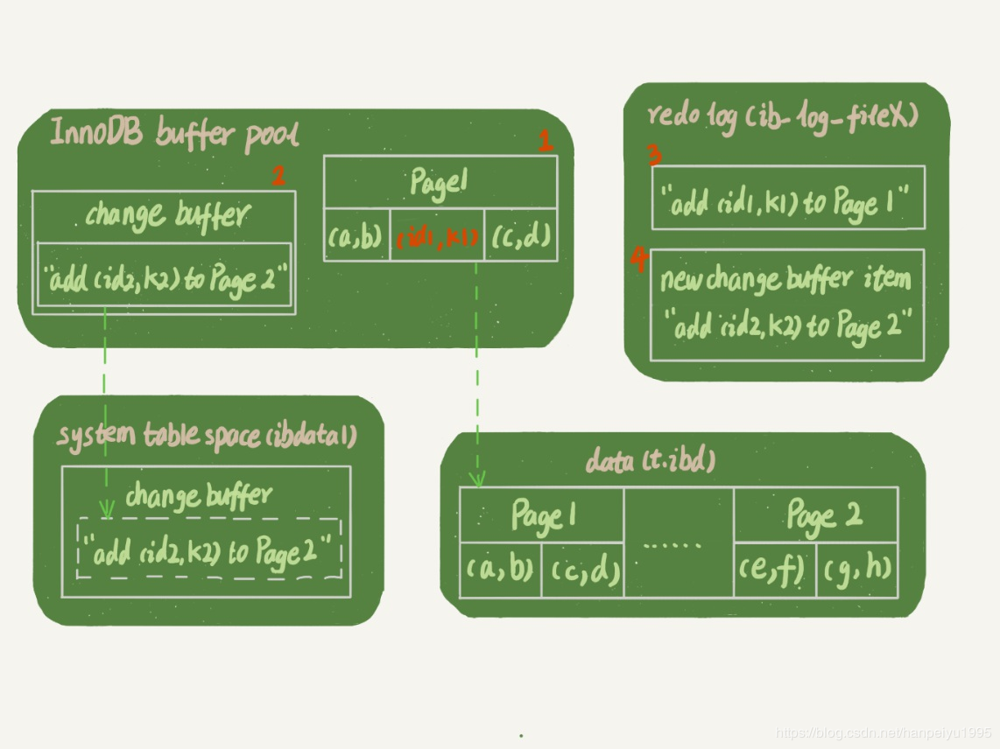
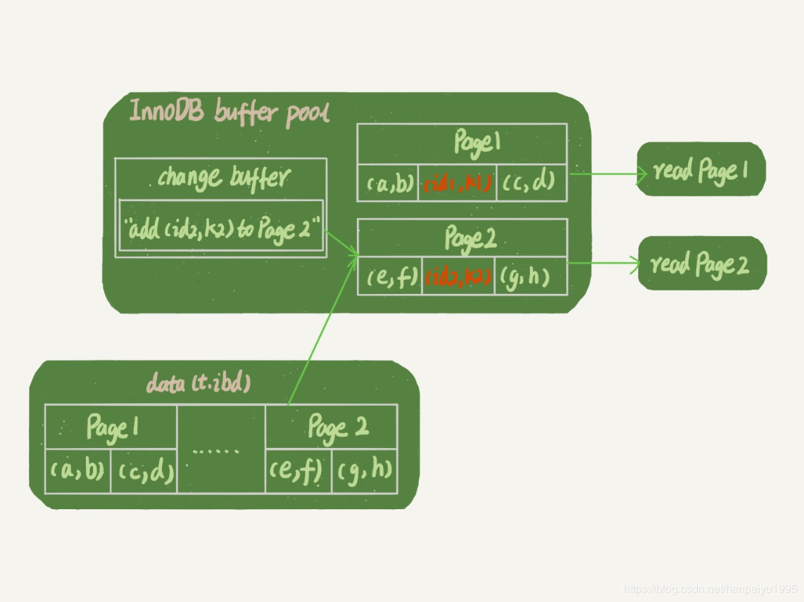
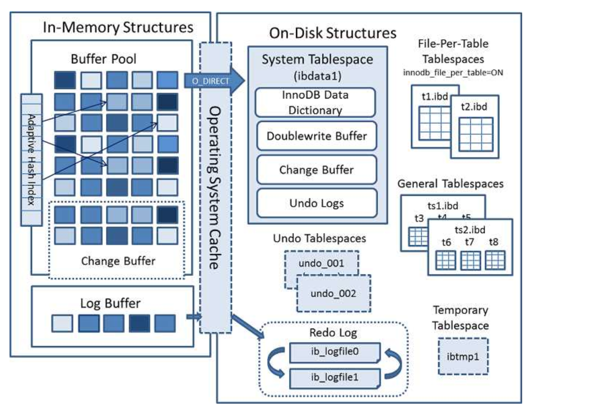
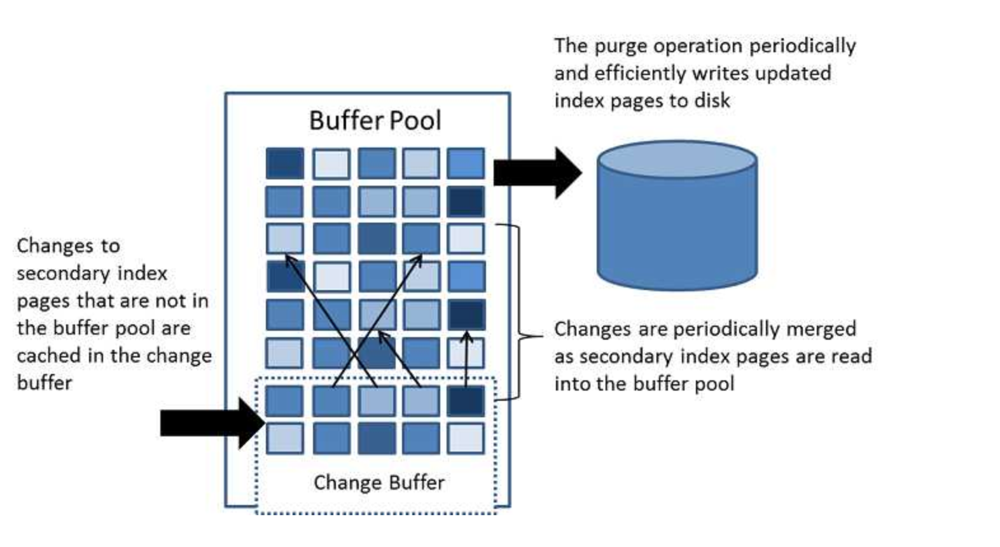

如果每一次的更新操作（例如insert、update和delete操作）都要操作次磁盘，IO成本实在太高。 InnoDB 的数据是按数据页为单位来读写的。
当需要读一条记录的时候，并不是将这个记录本身从磁盘读出来，而是以页为单位，将其整体读入内存。

insert的时候，写主键是肯定不能用change buffer了，但是同时也会要写其它索引，而其它索引中的“非唯一索引”是可以用的这个机制的；

change buffer的前身是insert buffer,只能对insert 操作优化；后来升级了，增加了update/delete的支持，名字也改叫change buffer.

##一、什么是change buffer

不止是数据页磁盘，也针对索引的数据磁盘。大部分修改索引数据页磁盘信息。

当需要更新一个记录，就是要更新一个数据页：

+ 如果数据页在内存中（buffer pool中时）就直接更新
+ 如果这个数据页还没有在内存中（没有在buffer pool中）。InooDB 会将这些更新操作缓存在 change buffer 中。在下次查询需要访问这个数据页时，将数据页读入内存，然后执行 change buffer 中与这个页有关的操作
+ 将 change buffer 中的操作应用到原数据页，得到最新结果的过程称为 merge，避免大量的磁盘随机访问I/O

而唯一索引的更新就不能使用 change buffer：对于唯一索引，所有的更新操作都要先判断这个操作是否违反唯一性约束。那么必须将数据页读入内存才能判断。比如，要插入(4,400) 这个记录，就要先判断现在表中是否已经存在 k=4 的记录，

都已经读入内存中了，那直接更新内存会更快，没有必要使用change buffer了。

所以，只有普通索引才能使用change buffer，考虑使用普通索引还是唯一索引，如果能保证不会数据重复，那么最好使用普通索引（可以使用change buffer，且两类索引查询能力没有区别）

注意：不是所有的场景用change buffer都能加速：

1. 设想一个对于写多读少的业务来说，change buffer 记录的变更越多越划算，例如账单类日志类

2. 反过来，一个业务的更新模式是写入之后马上会做查询，change buffer里的内容不多，由于马上做查询要访问数据页，这样的io次数不会减少

如果是针对非唯一索引和唯一索引的更新和delete而且条件是where 索引值=这种情况，这时候要“先读后写”，读的时候数据会读入内存，更新的时候直接改内存，就不需要change buffer了

##二、change buffer与redo log的联系

假设要在表t上执行这个插入语句，其中k是辅助索引，且为普通索引

>insert into t(id,k) values(id1,k1),(id2,k2);

假设当前 在k索引树上查找到插入位置后， k1 所在的插入位置的数据页page1在内存 (InnoDB bufferpool) 中， k2位置 所在的数据页不在内存中。它涉及了四个部分：内存、 redo log （ ib_log_fileX ）、 数据表空间（ 数据21·页储存在t.ibd中 ）、系统表空间（ ibdata1 ）。

这条更新语句做了如下的操作（按照图中的数字顺序）：

1. Page 1 在内存中（buffer pool中），直接更新内存，直接把数据插入到表t中的位置

2. Page 2 没有在内存中，就在内存的 change buffer 区域，记录下 “ 我要往 Page 2 插入一行 ” 这个信息

3. 将上述两个动作记入 redo log 中（图中 3 和 4 ）（包含了数据的变更和 change buffer 的变更）

change buffer有一部分在内存有一部分在ibdata。做purge（清除）操作,应该就会把change buffer里相应的数据持久化到ibdata。

这样的一个事务，写了两处内存（直接在内存更新和在内存中的change buffer记录），然后写了一处磁盘（两次操作合在一起写了一次磁盘中redolog）

如果之后有一个读请求：

>select * from t where k in (k1, k2) 

如果读语句发生在更新语句后不久，那么数据页还在内存中，那么此时读操作与系统表空间（ ibdata1 ）和 redo log （ ib_log_fileX ）无关了，page1处于内存中，page2不存在于内存中

读 Page 1 的时候，直接从内存返回更新后的内容，要读 Page 2 的时候，需要把 Page 2 从磁盘读入内存中，然后应用 change buffer 里面的操作日志(add 某个数据 to page2).最后生成正确的版本并返回结果

##三、change buffer与在使用relolog的意义

change buffer在内存中，主机异常重启，不会丢失 change buffer 和数据

虽然我们更新数据时只更新内存的change buffer，但是在事务提交的时候，我们把 change buffer 的操作也记录到 redo log 里了，所以崩溃恢复的时候， changebuffer 也能找回来

merge过程之后，数据页和内存中 change buffer 对应的磁盘位置都还没有修改，属于脏页。还需要各自刷新回磁盘，这就是另一个过程了。 merge 的过程不会把数据直接写回磁盘，需要后续的操作

redo log里记录了数据页的修改以及change buffer新写入的信息。

如果掉电, 持久化的change buffer数据已经purge, 不用恢复。主要分析没有持久化的数据，情况又分为以下几种：

1. change buffer写入,redo log虽然做了fsync但未commit,binlog未fsync到磁盘,这部分数据丢失

2. change buffer写入,redo log写入但没有commit,binlog以及fsync到磁盘,先从binlog恢复redo log,再从redo log恢复change buffer

3. change buffer写入,redo log和binlog都已经fsync.那么直接从redo log里恢复。

##四、Change Buffer结构图

Change Buffer 是 Buffer Pool 中的一部分，虽然 Change Buffer 名字叫 Buffer ，但是它也是可以持久化的，在右边的 System Tablespace 中可以看到持久化 Change Buffer 的空间。
触发写缓存（Change Buffer）持久化操作有以下几种情况：

1. 数据库空闲时，后台有线程定时持久化

2. 数据库缓冲池不够用时

3. 数据库正常关闭时

4. redo log 写满时

图中详细的描述了 Change Buffer 的功能，Change Buffer 中的数据最终还是会刷回到数据所在的原始数据页中，Change Buffer 数据应用到原始数据页，得到新的数据页的过程称之为 merge。merge 过程中只会将 Change Buffer 中与原始数据页有关的数据应用到原始数据页，以下三种情况会发生 merge 操作：

1、原始数据页加载到 Buffer Pool 时。
2、系统后台定时触发 merge 操作。
3、MySQL 数据库正常关闭时。
