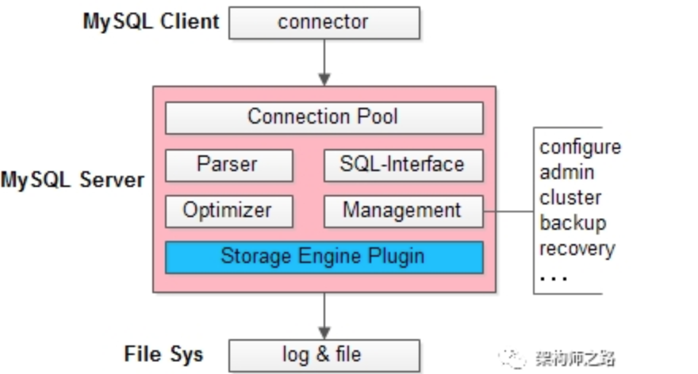
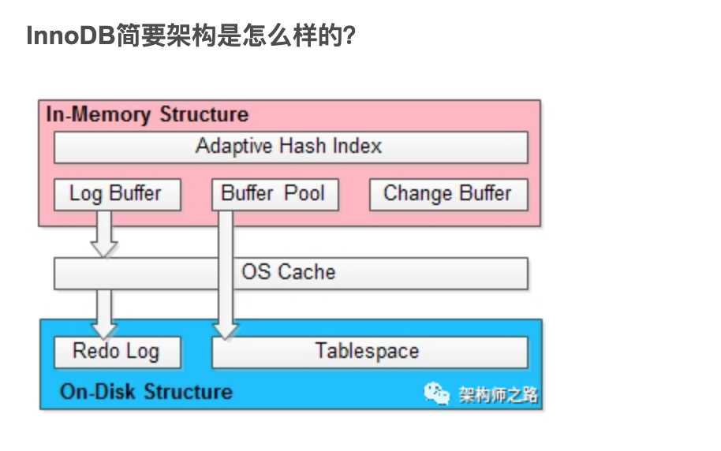
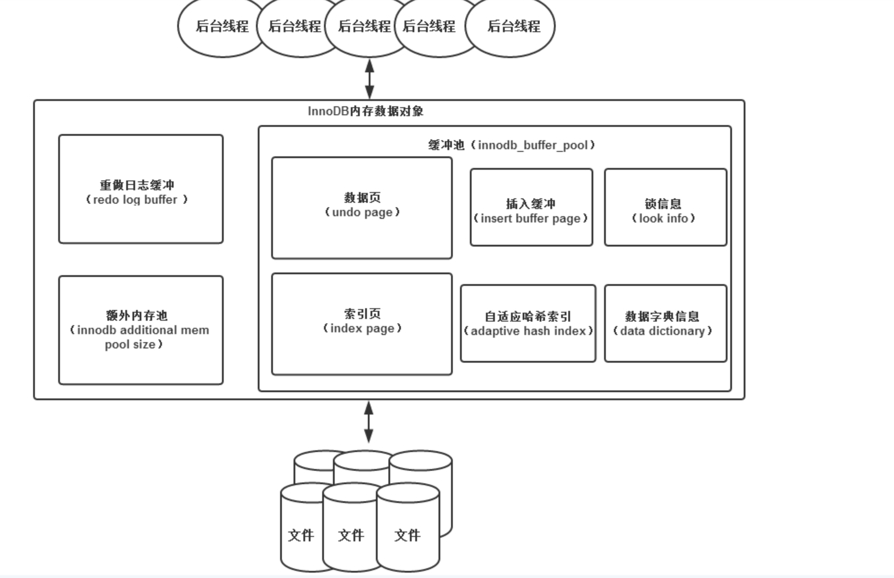

##一、MySQL简要架构是怎么样的？

MySQL整体分为三层：

（1）客户端，是各种编程语言的connector；

（2）MySQL服务，内部包含各种组件，实现各种功能；

（3）文件系统，数据存储与日志；

 
其中，MySQL服务内，可以以插件的形式，实现各种存储引擎。

在InnoDB，MyISAM，Memory…等各种存储引擎中，InnoDB是使用范围最广的。

画外音：事务，行锁，聚集索引，MVCC…众多特性让InnoDB备受青睐

##二、InnoDB简要架构

InnoDB整体也分为三层：

（1）内存结构(In-Memory Structure)，这一层在MySQL服务进程内；

（2）OS Cache，这一层属于内核态内存；

（3）磁盘结构(On-Disk Structure)，这一层在文件系统上；

这三层的交互有两类：

（1）通过OS Cache落地数据（上图中，两个短箭头）；

（2）直接O_Direct落地数据（长途中，长箭头）；

画外音：这是一个性能与一致性折衷的设计。

##三、InnoDB内存结构包含哪些核心组件？

InnoDB内存结构包含四大核心组件，分别是：

（1）缓冲池(Buffer Pool)；

（2）写缓冲(Change Buffer)；

（3）自适应哈希索引(Adaptive Hash Index)；

（4）日志缓冲(Log Buffer)；

恰好，这四大核心组件，今年都详细的写过。

###3.1、缓冲池(Buffer Pool)

目的是提升InnoDB性能，加速读请求，避免每次数据访问都进行磁盘IO。

画外音：和系统架构设计中缓存的功能有点像，避免每次访问数据库。

这里面涉及的技术点包括：预读，局部性原理，LRU，预读失败+缓冲池污染，新生代老生代双链LRU…细节参见《缓冲池(buffer pool)，彻底懂了！》。

总结：

1. 缓冲池(buffer pool)是一种常见的降低磁盘访问的机制；

2. 缓冲池通常以页(page)为单位缓存数据；

3. 缓冲池的常见管理算法是LRU，memcache，OS，InnoDB都使用了这种算法；

4. InnoDB对普通LRU进行了优化

具体方法是：

1. 将LRU分为两个部分：新生代(new sublist)，老生代(old sublist)

2. 新老生代收尾相连，即：新生代的尾(tail)连接着老生代的头(head)；

3. 新页（例如被预读的页）加入缓冲池时，只加入到老生代头部

4. 如果数据真正被读取（预读成功），才会加入到新生代的头部

5. 如果数据没有被读取，则会比新生代里的“热数据页”更早被淘汰出缓冲池

###3.2、写缓冲(Change Buffer)

目的是提升InnoDB性能，加速写请求，避免每次写入都进行磁盘IO。

画外音：我C，这个牛逼，写入居然都可以不进行磁盘IO？

细节参见《写缓冲(change buffer)，彻底懂了！》，这篇文章的细节原理，特别有意思。

###3.3、自适应哈希索引(Adaptive Hash Index)

目的是提升InnoDB性能，加速读请求，减少索引查询的寻路路径。

这里面涉及的技术点包括：聚集索引，普通索引，哈希索引…细节参见《InnoDB到底支不支持哈希索引》。

 
###3.4、日志缓冲(Log Buffer)

目的是提升InnoDB性能，极大优化redo日志性能，并提供了高并发与强一致性的折衷方案。

这里面涉及的技术点包括：redo log作用，流程，三层架构，随机写优化为顺序写，次次写优化为批量写…细节参见《事务已提交，数据却丢了，赶紧检查下LogBuffer》。
4

原文链接：https://blog.csdn.net/shenjian58/java/article/details/102577671

##四、架构

1）内存根据分工以及存储文件的不同分为缓冲池、重做日志缓冲、额外内存池：

+ 缓冲池：InnoDB引擎是基于磁盘存储的，并将其中的记录按照页的方式进行管理。由于磁盘IO的速度感人，为了提高数据库的整体性能，在内存中划了一块区域作为缓冲池。数据库读取页时，首先将从磁盘读到的页存放在缓冲池中。下次再读相同页时，首先判断该页是否在缓冲池中。若在缓冲池中，称该页被命中，直接读取缓冲池中的页。否则，读取磁盘上的页，由此提高了读取的速度。数据库修改数据操作时，首先修改在缓冲池的页，然后再异步刷新到磁盘上，从而提高改数据的速度。缓冲池中缓存的数据页类型有：索引页、数据页、undo页、插入缓冲、自适应哈希索引、InnoDB存储的锁信息、数据字典信息等。

+ 重做日志缓冲：InnoDB首先将重做日志信息放到这个缓冲区，然后按照一定频率将其刷新到重做日志文件。默认1秒钟刷新一次，因此重做日志缓冲一般不需要很大，默认8M。日志在下列3种情况下会刷新重做日志缓冲：（1）每秒将重做日志缓冲刷新到重做日志文件（2）每个事务提交时会将重做日志缓冲刷新到重做日志文件（3）当重做日志缓冲池剩余空间小于1/2时，重做日志缓冲刷新到重做日志文件。

+ 额外的内存池：在InnoDB存储引擎中，对内存的管理是通过一种称为内存堆的方式进行的。在对一些数据结构本身的内存进行分配时，需要从额外的内存池中进行申请。

2) 后台线程根据功能不同分为master Thread、IO Thread、Purge Thread、Page Cleaner Thread:

+ Master Thread:负责将缓冲池中的数据异步刷新到磁盘，保证数据的一致性，包括脏页的刷新、合并插入缓冲、UNDO夜的回收等。

+ IO Thread:在InnoDB存储引擎中大量使用异步 IO处理IO请求以提高数据库的性能，IO Thread负责这些IO请求的回调处理。IO Thread 有4类，分别为write、read、insert buffer、log IO thread。

+ Purge Thread：由于回收不再需要的undo页。

+ Page Cleaner Thread:将缓冲池中脏页（即被修改过于磁盘中数据不一致的页）刷新到磁盘中。
