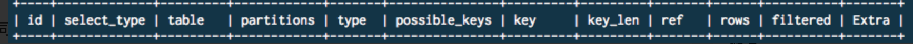
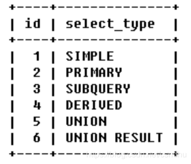
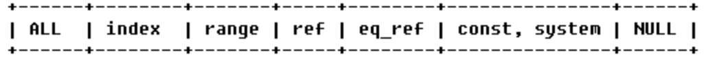
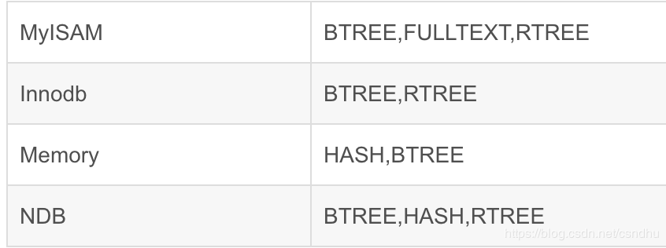

##MYSQL的执行计划

###一、什么是执行计划

执行计划就是sql的执行查询的顺序，以及如何使用索引查询，返回的结果集的行数

###二、执行计划的内容

```java
mysql> insert into index_normal values (1,'testing partitions','1995-07-17');
mysql> explain select * from index_normal where c3 = 1995-07-17 \G
*************************** 1. row ***************************
           id: 1
  select_type: SIMPLE
        table: index_normal
         type: ref
possible_keys: normal
          key: normal
      key_len: 4
          ref: const
         rows: 1
        Extra: Using where
```



①.id  sql执行计划的顺序 或子查询表的执行顺序

id一样，按照顺序执行；id越大，执行的优先级就越高（如子查询）

②.select_type  表示查询中每个select子句的类型



a.SIMPLE：查询中不包含子查询或者UNION

b.查询中若包含任何复杂的子部分，最外层查询则被标记为：PRIMARY

c.在SELECT或WHERE列表中包含了子查询，该子查询被标记为：SUBQUERY

d.在FROM列表中包含的子查询被标记为：DERIVED（衍生）

e.若第二个SELECT出现在UNION之后，则被标记为UNION；若UNION包含在  FROM子句的子查询中，外层SELECT将被标记为：DERIVED

f.从UNION表获取结果的SELECT被标记为：UNION RESULT

③.type 

MySQL在表中找到所需行的方式，又称“访问类型”，常见类型如下：



由左至右，由最差到最好

>ALL：全表扫描

>index：

+ index类型只遍历索引树

+ 索引的存在形式是文件，按存储结构划分）：FULLTEXT，HASH，BTREE，RTREE。

+ 对应存储引擎支持如下：




>range：索引范围扫描

对索引字段进行范围查询，使用in则是使用rang范围查询； 使用">" ,"<" 或者 "between" 都是可以使用索引的，但是要控制查询的时间范围，一般查询数据不要超过数据总数的 15%

>ref：非唯一性索引

类似  select count(1) from age = '20';

>eq_ref：唯一性索引扫描，对于每个索引键，表中只有一条记录与之匹配。常见于主键或唯一索引扫描


④.key

表示在执行语句用到的索引

查询中若使用了覆盖索引，则该索引仅出现在key列表中

覆盖索引：查询数据只需要通过索引就可以查询出，如55万条数据，使用索引，立刻可以查询出 2000条数据，同时Extra字段是Using index 

⑤.Extra

Using index : 使用覆盖索引的时候就会出现

using index condition：查找使用了索引，但是需要回表查询数据

Using where ：在查找使用索引的情况下，需要回表去查询所需的数据

using index & using where：查找使用了索引，但是需要的数据都在索引列中能找到，所以不需要回表查询数据

Using temporary：需要使用临时表来存储结果集，常见于排序和分组查询

Using filesort：无法利用索引完成的排序操作称为“文件排序”；

很多场景都是索引是一个字段，order by 排序的字段与索引字段不一致，导致的Using fileSort;

此时可以给排序字段和where条件字段，添加为组合索引，同时保证索引查询的数据不超过总量的15%，避免fileSort

注：回表的含义是，先根据索引查询数据，然后在根据确定的数据id和查询条件再去查询具体的数据的过程
