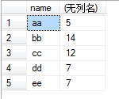
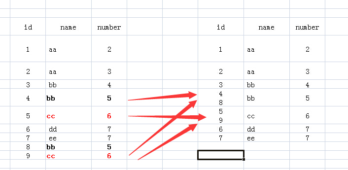
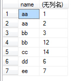

##一、groupby理解

先来看下表1，表名为test：

表1：


执行如下SQL语句：

>SELECT name FROM test groupby BY name

运行结果如表2：

表2：


可是为了能够更好的理解“group by”多个列“和”聚合函数“的应用，我建议在思考的过程中，由表1到表2的过程中，增加一个虚构的中间表：虚拟表3。下面说说如何来思考上面SQL语句执行情况：

1.FROM test：该句执行后，应该结果和表1一样，就是原来的表。

2.FROM test Group BY name：该句执行后，我们想象生成了虚拟表3，如下所图所示，生成过程是这样的：group by name，那么找name那一列，具有相同name值的行，合并成一行，如对于name值为aa的，那么<1 aa 2>与<2 aa 3>两行合并成1行，所有的id值和number值写到一个单元格里面。


 
3.接下来就要针对虚拟表3执行Select语句了：

（1）如果执行select *的话，那么返回的结果应该是虚拟表3，可是id和number中有的单元格里面的内容是多个值的，而关系数据库就是基于关系的，单元格中是不允许有多个值的，所以你看，执行select * 语句就报错了。

（2）我们再看name列，每个单元格只有一个数据，所以我们select name的话，就没有问题了。为什么name列每个单元格只有一个值呢，因为我们就是用name列来group by的。

（3）那么对于id和number里面的单元格有多个数据的情况怎么办呢？答案就是用聚合函数，聚合函数就用来输入多个数据，输出一个数据的。如cout(id)，sum(number)，而每个聚合函数的输入就是每一个多数据的单元格。

（4）例如我们执行select name,sum(number) from test group by name，那么sum就对虚拟表3的number列的每个单元格进行sum操作，例如对name为aa的那一行的number列执行sum操作，即2+3，返回5，最后执行结果如下：



（5）group by 多个字段该怎么理解呢：如group by name,number，我们可以把name和number 看成一个整体字段，以他们整体来进行分组的。如下图



（6）接下来就可以配合select和聚合函数进行操作了。如执行select name,sum(id) from test group by name,number，结果如下图：



注意：mysql对group by 进行了非ANSI标准的扩展，允许select后含有非group by 的列。

1、将获得的数据按字段A分组

　　select * from table_name where [condition] group by 字段A

2、将获得的数据按多个字段分组(需要确保使用的分组列在列清单中)

　　select * from table_name where [condition] group by 字段A, 字段B,..., 字段N

注：GROUP BY 子句使用时必须放在 WHERE 子句中的条件之后，必须放在 ORDER BY 子句之前。


##二、结论

1.单表查询中，若使用分组函数（group by），select后的字段要么作为分组依据，要么用聚合函数处理

2.多表查询中，若作为分组依据的字段在某表中是主键（primary key），则该表中的其他字段可以在多表查询select后直接引用

###2.1、单表查询中，若使用分组函数（group by），select后的字段要么作为分组依据，要么用聚合函数处理，这个是老生常谈的基础知识了，熟悉的同学就复习一下。

>select stuid,courseid,sum(score) from scores group by stuid;
这条语句会报错，courseid没有用作分组依据，也没有用聚合函数处理。因为我的表里stuid对应多个courseid，当stuid作为分组依据返回值时，一个stuid对应多个courseid，不能返回一个唯一的courseid，所以报错了。

>select stuid,count(courseid),sum(score) from scores group by stuid;
这样才正确，此时查询出的是，学生id，选课数量，总分。

###2.2、多表查询中，若作为分组依据的字段在某表中是主键（primary key），则该表中的其他字段可以在多表查询select后直接引用,什么意思呢，

下面举两个例子，例子中有表class，有字段stuid(primary key)，classid；表scores，有字段stuid(primary key)，courseid(primary id),score。

```java
select a.stuid,b.classid,count(a.courseid),sum(a.score) from 
scores as a, class as b 
where a.stuid=b.stuid group by a.stuid;
```
```java
select a.stuid,b.courseid, b.score from 
class as a,scores1 as b 
where a.stuid=b.stuid group by b.stuid,b.courseid；
```
此时查询会顺利进行，并不会报错，但是第一个查询中的class和第二个查询中的score既不是分组依据也没有被聚合函数处理，为什么就可以直接引用了呢？

我的理解是，当分组依据的字段作为主键时（注意若两个字段分组，则这两个字段都要是主键），该表中其他的字段的查询被唯一标识了，这也正是主键的作用，所以在第一个查询中，当stuid作为表class的主键时，一个stuid只对应一个classid，所以查询中当stuid作为分组依据返回一个值时，classid也返回了唯一一个值，第二个查询也是同理。

最后，如果表没有主键规定的话，老老实实用嵌套查询，当然也可以创建临时表。

##三、 SQL入门语句之ORDER BY

ORDER BY 是用来基于一个或多个列按升序或降序顺序排列数据

1、从数据库表获取全部数据按字段A的升序排列

　　select *from table_name order by 字段A ASC

2、从数据库表获取全部数据按字段A的降序排列

　　select *from table_name order by 字段A DESC

3、从数据库表获取满足条件的数据按字段A的升序排列

　　select *from table_name  where [condition] order by 字段A ASC

4、从数据库表获取满足条件的数据按字段A的升序排列

　　select *from table_name  where [condition]  order by 字段A DESC

5、将获取到的数据按多个字段的升序或降序排列(最前面的字段优先级最高,即字段A的优先级最高,先按字段A排列后字段A重复的再按字段B排列)

　　select *from table_name  where [condition] order by 字段A, 字段B,...字段N, ASC / DESC

