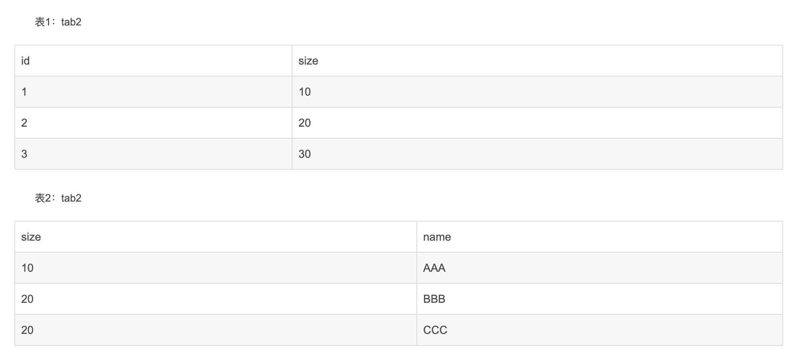
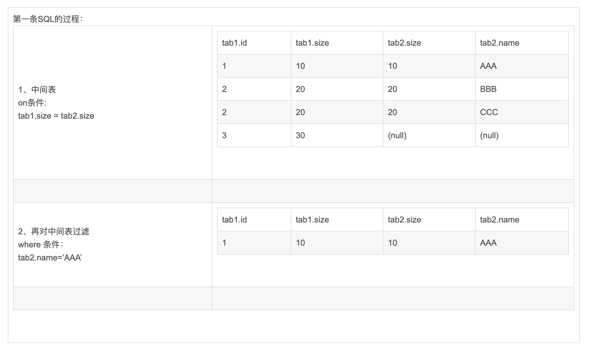
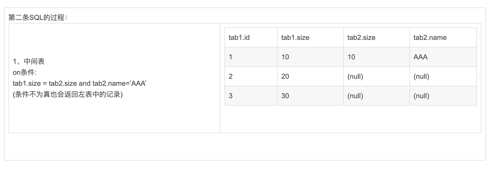

##笛卡尔积

如果表1有m行a列，表2有n行b列，两表无条件连接时会将两表里所有行两两组合到一起，所形成的表就有m*n行，a+b列。如果表1或表2的记录数很多时，连接后会形成一张非常大的表，在这种大表里查询效率特别低，所以在数据库查询时，应尽量避免笛卡尔积的出现。
在Hive的严格模式中，也专门限制了笛卡尔积。
  
这里总结了什么情况下可能产生笛卡尔积，以后在查询中应该避免。

首先问个问题，常见的左连接查询，是不是笛卡尔积。换个方式问，左连接中以左表为准，左表有m条记录，连接后的结果集是不是一定能得到m条记录？
答案是不一定，也就是说，左连接查询可能会产生笛卡尔积。

先附上结论：
连接查询时，当连接on条件是非唯一字段时，会出现笛卡尔积(局部笛卡尔积)；当连接on条件是唯一字段时，则不会出现笛卡尔积。唯一字段是针对后面一张表的。

##二、证明

证明如下：
会用到三张表，student、score、class，其中student表中sno字段唯一，score无唯一字段，class表中classID字段唯一，三张表如下所示：

1、 两表直接连接
SELECT * FROM student,class;
执行结果：

小结：两表直接连接，形成了一张18行6列的表，产生了笛卡尔积。

2、 内连接唯一字段
SELECT * FROM student JOIN class ON student.classID = class.classID;

小结：on后的连接条件是A表或B表的唯一字段，两表内连接是两表的交集，不是笛卡尔积。

3、 内连接非唯一字段
SELECT * FROM student JOIN score ON student.sno = score.sno;

现象：出现了一对多的情况。
小结：on条件连接表中非唯一字段时，结果集出现笛卡尔积（局部笛卡尔积）

4、 左连接唯一字段
SELECT * FROM student LEFT JOIN class ON student.classID = class.classID;

现象：结果集为左边表的记录数。

小结：左连接在on条件为唯一字段时，不会出现笛卡尔积。

5、 左连接非唯一字段
SELECT * FROM student LEFT JOIN score ON student.sno = score.sno;

现象：左表出现了重复记录

小结：左连接在on条件为非唯一字段时，会出现局部笛卡尔积。

##三、SQL中join操作后面的on与where的区别

join关键字的作用是将多个表按一定的条件联合起来，从而可以实现从多个表中获取数据

在join后面可以接on条件和where条件，在这里我主要就是说这两者之间的差别

关键字: on

数据库在通过连接两张或多张表来返回记录时，都会生成一张中间的临时表，然后再将这张临时表返回给用户。

在使用left jion时，on和where条件的区别如下：

1、 on条件是在生成临时表时使用的条件，它不管on中的条件是否为真，都会返回左边表中的记录。

2、where条件是在临时表生成好后，再对临时表进行过滤的条件。这时已经没有left join的含义（必须返回左边表的记录）了，条件不为真的就全部过滤掉。

假设有两张表：

两条SQL:

1. select * form tab1 left join tab2 on (tab1.size = tab2.size) where tab2.name=’AAA’
2. select * form tab1 left join tab2 on (tab1.size = tab2.size and tab2.name=’AAA’)

其实以上结果的关键原因就是left join,right join,full join的特殊性，不管on上的条件是否为真都会返回left或right表中的记录，full则具有left和right的特性的并集。 
而inner jion没这个特殊性，则条件放在on中和where中，返回的结果集是相同的。

on比where起作用更早，，先根据on条件进行多表的连接操作，生成一个临时表再通过where来筛选。