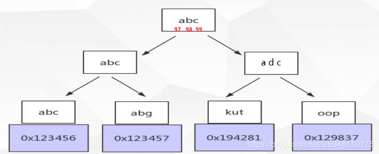

##MYSQL索引优化,不走索引的原因

###一、索引失效

1.WHERE字句的查询条件里有不等于号（WHERE column!=…），MYSQL将无法使用索引

2.类似地，如果WHERE字句的查询条件里使用了函数（如：WHERE DAY(column)=…），MYSQL将无法使用索引

3.在JOIN操作中（需要从多个数据表提取数据时），MYSQL只有在主键和外键的数据类型相同时才能使用索引，否则即使建立了索引也不会使用

4.如果WHERE子句的查询条件里使用了比较操作符LIKE和REGEXP，MYSQL只有在搜索模板的第一个字符不是通配符的情况下才能使用索引。比如说，如果查询条件是LIKE 'abc%',MYSQL将使用索引；如果条件是LIKE '%abc'，MYSQL将不使用索引。

5.在ORDER BY操作中，MYSQL只有在排序条件不是一个查询条件表达式的情况下才使用索引。尽管如此，在涉及多个数据表的查询里，即使有索引可用，那些索引在加快ORDER BY操作方面也没什么作用。

6.如果某个数据列里包含着许多重复的值，就算为它建立了索引也不会有很好的效果。比如说，如果某个数据列里包含了净是些诸如“0/1”或“Y/N”等值，就没有必要为它创建一个索引。

7.如果条件中有or(并且其中有or的条件是不带索引的)，即使其中有条件带索引也不会使用(这也是为什么尽量少用or的原因)。注意：要想使用or，又想让索引生效，只能将or条件中的每个列都加上索引

8.如果列类型是字符串，那一定要在条件中将数据使用引号引用起来,否则不使用索引

9.如果mysql估计使用全表扫描要比使用索引快,则不使用索引。


1、索引列是表示式的一部分，或是函数的一部分

如下 SQL：

>SELECT book_id FROM BOOK WHERE book_id + 1 = 5; 
或者

>SELECT book_id FROM BOOK WHERE TO_DAYS(CURRENT_DATE) - TO_DAYS(gmt_create) <= 10 
上述两个 SQL 虽然在列 book_id 和 gmt_create 设置了索引 ，但由于它们是表达式或函数的一部分，导致索引无法生效，最终导致全表扫描。

2、隐式类型转换

执行 SQL 语句

>SELECT * FROM tradelog WHERE tradeid=110717; 
交易编号 tradeid 上有索引，但用 EXPLAIN 执行却发现使用了全表扫描，为啥呢，tradeId 的类型是 varchar(32), 而此 SQL 用 tradeid 与一个数字类型进行比较，发生了隐形转换，会隐式地将字符串转成整型，如下:

>mysql> SELECT * FROM tradelog WHERE CAST(tradid AS signed int) = 110717; 
这样也就触发了上文中第一条的规则 ，即：索引列不能是函数的一部分。

3、使用 order by 造成的全表扫描

>SELECT * FROM user ORDER BY age DESC 
上述语句在 age 上加了索引，但依然造成了全表扫描，这是因为我们使用了 SELECT *,导致回表查询，MySQL 认为回表的代价比全表扫描更大，所以不选择使用索引，如果想使用到 age 的索引，我们可以用覆盖索引来代替:

>SELECT age FROM user ORDER BY age DESC 
或者加上 limit 的条件(数据比较小)

>SELECT * FROM user ORDER BY age DESC limit 10 
这样就能利用到索引。

无法避免对索引列使用函数，怎么使用索引

有时候我们无法避免对索引列使用函数，但这样做会导致全表索引，是否有更好的方式呢。

比如我现在就是想记录 2016 ~ 2018 所有年份 7月份的交易记录总数

>mysql> SELECT count(*) FROM tradelog WHERE month(t_modified)=7; 
由于索引列是函数的参数，所以显然无法用到索引，我们可以将它改造成基本字段区间的查找如下

SELECT count(*) FROM tradelog WHERE 
    -> (t_modified >= '2016-7-1' AND t_modified<'2016-8-1') or 
    -> (t_modified >= '2017-7-1' AND t_modified<'2017-8-1') or  
    -> (t_modified >= '2018-7-1' AND t_modified<'2018-8-1'); 
	
###二、前缀索引与索引选择性

之前我们说过，如于长字符串的字段(如 url)，我们可以用伪哈希索引的形式来创建索引，以避免索引变得既大又慢，除此之外其实还可以用前缀索引(字符串的部分字符)的形式来达到我们的目的，那么这个前缀索引应该如何选取呢，这叫涉及到一个叫索引选择性的概念

索引选择性：不重复的索引值(也称为基数，cardinality)和数据表的记录总数的比值，比值越高，代表索引的选择性越好，唯一索引的选择性是最好的，比值是 1。

画外音：我们可以通过 SHOW INDEXES FROM table 来查看每个索引 cardinality 的值以评估索引设计的合理性

怎么选择这个比例呢，我们可以分别取前 3，4，5，6，7 的前缀索引，然后再比较下选择这几个前缀索引的选择性，执行以下语句

```java
SELECT  
 COUNT(DISTINCT LEFT(city,3))/COUNT(*) as sel3, 
 COUNT(DISTINCT LEFT(city,4))/COUNT(*) as sel4, 
 COUNT(DISTINCT LEFT(city,5))/COUNT(*) as sel5, 
 COUNT(DISTINCT LEFT(city,6))/COUNT(*) as sel6, 
 COUNT(DISTINCT LEFT(city,7))/COUNT(*) as sel7 
FROM city_demo 
```
得结果如下

>sel3	sel4	sel5	sel6	sel7
>0.0239	0.0293	0.0305	0.0309	0.0310

可以看到当前缀长度为 7 时，索引选择性提升的比例已经很小了，也就是说应该选择 city 的前六个字符作为前缀索引，如下

ALTER TABLE city_demo ADD KEY(city(6)) 
我们当前是以平均选择性为指标的，有时候这样是不够的，还得考虑最坏情况下的选择性，以这个 demo 为例，可能一些人看到选择 4，5 的前缀索引与选择 6，7 的选择性相差不大，那就得看下选择 4，5 的前缀索引分布是否均匀了

SELECT  
    COUNT(*) AS  cnt,  
    LEFT(city, 4) AS pref 
FROM city_demo GROUP BY pref ORDER BY cnt DESC LIMIT 5 
  
可能会出现以下结果

cnt	pref
305	Sant
200	Toul
90	Chic
20	Chan

可以看到分布极不均匀，以 Sant，Toul 为前缀索引的数量极多，这两者的选择性都不是很理想，所以要选择前缀索引时也要考虑最差的选择性的情况。

前缀索引虽然能实现索引占用空间小且快的效果，但它也有明显的弱点，MySQL 无法使用前缀索引做 ORDER BY 和 GROUP BY ，而且也无法使用前缀索引做覆盖扫描，前缀索引也有可能增加扫描行数。

假设有以下表数据及要执行的 SQL

id	email
1	zhangssxyz@163.com
2	zhangs1@163.com
3	zhangs1@163.com
4	zhangs1@163.com

SELECT id,email FROM user WHERE email='zhangssxyz@xxx.com'; 

如果我们针对 email 设置的是整个字段的索引，则上表中根据 「zhangssxyz@163.com」查询到相关记记录后,再查询此记录的下一条记录，发现没有，停止扫描，此时可知只扫描一行记录，如果我们以前六个字符(即 email(6))作为前缀索引，
则显然要扫描四行记录，并且获得行记录后不得不回到主键索引再判断 email 字段的值，所以使用前缀索引要评估它带来的这些开销。

另外有一种情况我们可能需要考虑一下，如果前缀基本都是相同的该怎么办，比如现在我们为某市的市民建立一个人口信息表，则这个市人口的身份证虽然不同，但身份证前面的几位数都是相同的，这种情况该怎么建立前缀索引呢。

一种方式就是我们上文说的，针对身份证建立哈希索引，另一种方式比较巧妙，将身份证倒序存储，查的时候可以按如下方式查询:

SELECT field_list FROM t WHERE id_card = reverse('input_id_card_string'); 
这样就可以用身份证的后六位作前缀索引了，是不是很巧妙 ^_^

实际上上文所述的索引选择性同样适用于联合索引的设计，如果没有特殊情况，我们一般建议在建立联合索引时，把选择性最高的列放在最前面，比如，对于以下语句：

>SELECT * FROM payment WHERE staff_id = xxx AND customer_id = xxx; 

单就这个语句而言， (staff_id，customer_id) 和 (customer_id, staff_id) 这两个联合索引我们应该建哪一个呢，可以统计下这两者的选择性。

SELECT  
 COUNT(DISTINCT staff_id)/COUNT(*) as staff_id_selectivity, 
 COUNT(DISTINCT customer_id)/COUNT(*) as customer_id_selectivity, 
 COUNT(*) 
FROM payment 

结果为:
staff_id_selectivity: 0.0001 
customer_id_selectivity: 0.0373 
COUNT(*): 16049 
从中可以看出 customer_id 的选择性更高，所以应该选择 customer_id 作为第一列。

###三、索引设计准则：三星索引

上文我们得出了一个索引列顺序的经验 法则：将选择性最高的列放在索引的最前列，这种建立在某些场景可能有用，但通常不如避免随机 IO 和 排序那么重要，这里引入索引设计中非常著名的一个准则：三星索引。

如果一个查询满足三星索引中三颗星的所有索引条件，理论上可以认为我们设计的索引是最好的索引。

什么是三星索引?

第一颗星：WHERE 后面参与查询的列可以组成了单列索引或联合索引
第二颗星：避免排序，即如果 SQL 语句中出现 order by colulmn，那么取出的结果集就已经是按照 column 排序好的，不需要再生成临时表。
第三颗星：SELECT 对应的列应该尽量是索引列，即尽量避免回表查询。

所以对于如下语句:

>SELECT age, name, city where age = xxx and name = xxx order by age 
设计的索引应该是 (age, name,city) 或者 (name, age,city)

当然 了三星索引是一个比较理想化的标准，实际操作往往只能满足期望中的一颗或两颗星，考虑如下语句:

>SELECT age, name, city where age >= 10 AND age <= 20 and city = xxx order by name desc 
假设我们分别为这三列建了联合索引，则显然它符合第三颗星(使用了覆盖索引)，如果索引是(city, age, name)，则虽然满足了第一颗星，但排序无法用到索引，不满足第二颗星，如果索引是 (city, name, age)，则第二颗星满足了，但此时 age 在 WHERE 中的搜索条件又无法满足第一星，

另外第三颗星(尽量使用覆盖索引)也无法完全满足，试想我要 SELECT 多列，要把这多列都设置为联合索引吗，这对索引的维护是个问题，因为每一次表的 CURD 都伴随着索引的更新，很可能频繁伴随着页分裂与页合并。

综上所述，三星索引只是给我们构建索引提供了一个参考，索引设计应该尽量靠近三星索引的标准，但实际场景我们一般无法同时满足三星索引，一般我们会优先选择满足第三颗星(因为回表代价较大)至于第一，二颗星就要依赖于实际的成本及实际的业务场景考虑。


###四、列的离散性

你知道吗？即使你对数据库中你要查询的列添加了索引，它也有可能不会走索引。 这其实和一个叫 列的离散性 相关的问题。
在数据库表中，MySQL 在查询时，会对表中查询的列进行离散性计算。计算出的离散性结果越大，说明这一列的离散型越好，选择性就越好。
列的离散性计算公式为：count(distinct col) : count(col)。

MySQL 查询优化器会认为搜寻这么多的数据，离散性这么差，可选择性也很差，选择优化器认为还不如用全表扫描呢。

离散性越高，选择性就会越好，查询效率显然也会越高，索引的存在也就起到了作用。

记住这个值：【10%-15%】：

离散性在不超过全表的【10%-15%】的前提下索引才可以显示其所具有的价值。当离散度超过该值的情况下全表扫描可能反倒比索引扫描更有效。我们所追求的目标就是创建全表扫描所无法比拟的有效索引。

###五、最左匹配原则



有如下两条查询语句：

>select * from user where name = xxx;
>select * from user where name = xxx and mobileNo = xxx;

我们如果创建一个 name单列索引、再来一个name、mobileNo联合索引。虽然没有任何问题，但是通过最左匹配原则，我们就可以理解 name单列索引在此处其实是一个冗余的索引。

联合索引比对每个列分别建索引更有优势，因为索引建立得越多就越占磁盘空间，在更新数据的时候速度会更慢。另外建立多列索引时，顺序也是需要注意的，应该将严格的索引放在前面，这样筛选的力度会更大，效率更高。

重点：

多个单列索引在多条件查询时优化器会选择最优索引策略，可能只用一个索引，也可能将多个索引全用上！ 但多个单列索引底层会建立多个B+索引树，比较占用空间，也会浪费一定搜索效率，故如果只有多条件联合查询时最好建联合索引！

联合索引本质：

当创建**(a,b,c)联合索引时，相当于创建了(a)单列索引**，(a,b)联合索引以及**(a,b,c)联合索引**
想要索引生效的话,只能使用 a和a,b和a,b,c三种组合；当然，我们上面测试过，a,c组合也可以，但实际上只用到了a的索引，c并没有用到！


###六、覆盖索引

联合索引的存在，就引出了覆盖索引的概念。

如果查询列可通过索引节点中的关键字直接返回，则该索引就称之为覆盖索引。覆盖索引的出现，可减少数据库的 I/O 操作，将随机 I/O 变为 顺序 I/O，从而提高查询性能。

示例：

现在有一个 [name,mobileNo] 联合索引，如果我们通过以下语句来查询：select name,mobileNo from user where name = xxx。它会直接命中索引，直接从索引的结构中将数据返回，而不再需要遍历到叶子节点去获取数据，从而大大提高查询效率。

>select name,mobileNo from user where name = xxx and mobileNo =xxx;
这种语句也可以直接命中覆盖索引，并直接返回数据。

>select name,mobileNo from user where name = xxx and age=xx;
这种语句就不会命中覆盖索引了。因为它即使命中了 name 字段的索引，但是并没有命中 age 字段的索引，所以他不会命中覆盖索引。
