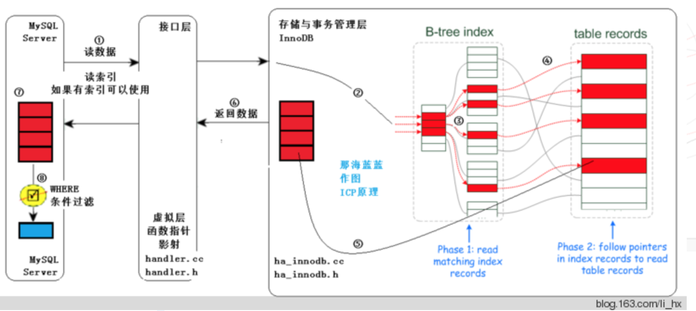
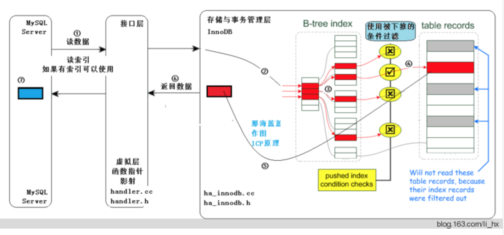

##mysql索引篇之覆盖索引、联合索引、索引下推

###一、索引

主键索引又叫聚簇索引 ，非主键索引又叫普通索引，主键索引的叶子节点存放的是整行数据，非主键索引的叶子节点存放的是主键的值。


####1.1、聚簇索引

一个表可以建立多个索引，但每一个表都有一个存储所了有数据的索引。聚簇索引在每个表中只有一个，且是建立在主键上面的，这个主键包含的列可以是被隐藏的rowid列，也可以是自增列，还可以被明确定义为不含NULL值的组合列等。称为聚簇索引、聚集索引
没有指定主键索引的时候，innodb引擎会自动创建一个主键索引。

####1.2、二级索引（聚簇索引）

除了聚簇索引外的所有索引，称为二级索引、辅助索引。二级索引建立在经常使用的列上。在统计一个表总的精确行数 count(*)，一些优化器就会选择表中最小的索引来作为统计目标索引，因为它占用空间最小，io也会最小。

二级索引又称辅助索引、非聚集索引(no-clustered index)。b＋tree树结构。然而二级索引的叶子节点不保存记录中的所有列，其叶子节点保存的是<健值，(记录)地址>。好似聚集索引中非叶子节点保存的信息，
不同的是二级索引保存的是记录地址，而聚集索引保存的是下一层节点地址。记录的地址一般可以保存两种形式。
1. 记录的物理地址，页号：槽号：偏移量
2. 记录的主键值


mysql中每个表都有一个聚簇索引（clustered index ），除此之外的表上的每个非聚簇索引都是二级索引，又叫辅助索引（secondary indexes）。

以InnoDB来说，每个InnoDB表具有一个特殊的索引称为聚集索引。如果您的表上定义有主键，该主键索引是聚集索引。如果你不定义为您的表的主键时，MySQL取第一个唯一索引（unique）而且只含非空列（NOT NULL）作为主键，InnoDB使用它作为聚集索引。
如果没有这样的列，InnoDB就自己产生一个这样的ID值，它有六个字节，而且是隐藏的，使其作为聚簇索引。

###二、覆盖索引

在之前《mysql索引初识》这篇文章中提到过，mysql的innodb引擎通过搜索树方式实现索引，索引类型分为主键索引和二级索引（非主键索引），主键索引树中，叶子结点保存着主键即对应行的全部数据；而二级索引树中，叶子结点保存着索引值和主键值，当使用二级索引进行查询时，需要进行回表操作。假如我们现在有如下表结构

```java
CREATE TABLE `user_table` (
  `id` int(11) unsigned NOT NULL AUTO_INCREMENT,
  `username` varchar(255) NOT NULL,
  `password` varchar(255) DEFAULT NULL,
  `age` int(11) unsigned Not NULL,
  PRIMARY KEY (`id`),
  key (`username`)
) ENGINE=InnoDB  DEFAULT CHARSET=utf8
```
执行语句(A) select id from user_table where username = 'lzs'时，因为username索引树的叶子结点上保存有username和id的值，所以通过username索引树查找到id后，我们就已经得到所需的数据了，这时候就不需要再去主键索引上继续查找了。

执行语句(B) select password from user_table where username = 'lzs'时，流程如下

1. username索引树上找到username=lzs对应的主键id
2. 通过回表在主键索引树上找到满足条件的数据

由上面可知，当sql语句的所求查询字段（select列）和查询条件字段（where子句）全都包含在一个索引中，可以直接使用索引查询而不需要回表。这就是覆盖索引，通过使用覆盖索引，可以减少搜索树的次数，是常用的性能优化手段。
例如上面的语句B是一个高频查询的语句，我们可以建立(username,password)的联合索引，这样，查询的时候就不需要再去回表操作了，可以提高查询效率。当然，添加索引是有维护代价的，所以添加时也要权衡一下。

###三、联合索引

mysql的b+树索引遵循“最左前缀”原则，继续以上面的例子来说明，为了提高语句B的执行速度，我们添加了一个联合索引（username,password）,特别注意这个联合索引的顺序，如果我们颠倒下顺序改成（password,username),这样查询能使用这个索引吗？答案是不能的！这是最左前缀的第一层含义：联合索引的多个字段中，只有当查询条件为联合索引的一个字段时，查询才能使用该索引。
现在，假设我们有一下三种查询情景：

+ 查出用户名的第一个字是“张”开头的人的密码。即查询条件子句为"where username like '张%'"
+ 查处用户名中含有“张”字的人的密码。即查询条件子句为"where username like '%张%'"
+ 查出用户名以“张”字结尾的人的密码。即查询条件子句为"where username like '%张'"

以上三种情况下，只有第1种能够使用（username,password）联合索引来加快查询速度。这就是最左前缀的第二层含义：索引可以用于查询条件字段为索引字段，根据字段值最左若干个字符进行的模糊查询。

维护索引需要代价，所以有时候我们可以利用“最左前缀”原则减少索引数量，上面的（username,password）索引，也可用于根据username查询age的情况。当然，使用这个索引去查询age的时候是需要进行回表的，当这个需求（根据username查询age）也是高频请求时，我们可以创建（username,password,age）联合索引，这样，我们需要维护的索引数量不变。

创建索引时，我们也要考虑空间代价，使用较少的空间来创建索引。

###四、索引下推

索引条件下推优化（Index Condition Pushdown (ICP) ）是MySQL5.6添加的，用于优化数据查询。

+ 不使用索引条件下推优化时存储引擎通过索引检索到数据，然后返回给MySQL服务器，服务器然后判断数据是否符合条件。
+ 当使用索引条件下推优化时，如果存在某些被索引的列的判断条件时，MySQL服务器将这一部分判断条件传递给存储引擎，然后由存储引擎通过判断索引是否符合MySQL服务器传递的条件，只有当索引符合条件时才会将数据检索出来返回给MySQL服务器。索引条件下推优化可以减少存储引擎查询基础表的次数，也可以减少MySQL服务器从存储引擎接收数据的次数。

网上搜了下相关的文章不少都将Index Condition Pushdown 称为索引下推优化，我认为还是索引条件下推优化更合适一些，因为这个优化技术关键的操作就是将与索引相关的条件由MySQL服务器向下传递至存储引擎，由此减少IO次数。
MySQL服务器到存储引擎是向下，传递的是与索引列相关的查询条件，所以还是索引条件下推优化更容易理解一些。

####4.1、适用条件

1. 需要整表扫描的情况。比如：range, ref, eq_ref, ref_or_null 。适用于InnoDB 引擎和 MyISAM 引擎的查询。（5.6版本不适用分区表查询，5.7版本后可以用于分区表查询）。

2. 对于InnDB引擎只适用于二级索引，因为InnDB的聚簇索引会将整行数据读到InnDB的缓冲区，这样一来索引条件下推的主要目的减少IO次数就失去了意义。因为数据已经在内存中了，不再需要去读取了。

3. 引用子查询的条件不能下推。

4. 调用存储过程的条件不能下推，存储引擎无法调用位于MySQL服务器中的存储过程。

5. 触发条件不能下推。

####4.2、工作过程

既然是优化，我们要清楚优化了些什么就要了解原本是如何工作的，所以分为两部分来描述工作过程。

不使用索引条件下推优化时的查询过程



+ 获取下一行，首先读取索引信息，然后根据索引将整行数据读取出来。
+ 然后通过where条件判断当前数据是否符合条件，符合返回数据。


使用索引条件下推优化时的查询过程



+ 获取下一行的索引信息。
+ 检查索引中存储的列信息是否符合索引条件，如果符合将整行数据读取出来，如果不符合跳过读取下一行。
+ 用剩余的判断条件，判断此行数据是否符合要求，符合要求返回数据。

 

图一：不使用ICP技术（过程使用数字符号标示，如①②③等）


过程解释：
①：MySQL Server发出读取数据的命令，这是在执行器中执行如下代码段，通过函数指针和handle接口调用存储引擎的索引读或全表表读。此处进行的是索引读。

```java
if (in_first_read)
{
in_first_read= false;
error= (*qep_tab->read_first_record)(qep_tab); //设定合适的读取函数，如设定索引读函数/全表扫描函数
}
else
error= info->read_record(info);
```
②、③：进入存储引擎，读取索引树，在索引树上查找，把满足条件的（经过查找，红色的满足）从表记录中读出（步骤④，通常有IO），从存储引擎返回⑤标识的结果。此处，不仅要在索引行进行索引读取（通常是内存中，速度快。步骤③），还要进行进行步骤④，通常有IO。
⑥：从存储引擎返回查找到的多条元组给MySQL Server，MySQL Server在⑦得到较多的元组。
⑦--⑧：⑦到⑧依据WHERE子句条件进行过滤，得到满足条件的元组。注意在MySQL Server层得到较多元组，然后才过滤，最终得到的是少量的、符合条件的元组。

图二：使用ICP技术（过程使用数字符号标示，如①②③等）


过程解释：
①：MySQL Server发出读取数据的命令，过程同图一。
②、③：进入存储引擎，读取索引树，在索引树上查找，把满足已经下推的条件的（经过查找，红色的满足）从表记录中读出（步骤④，通常有IO），从存储引擎返回⑤标识的结果。

此处，不仅要在索引行进行索引读取（通常是内存中，速度快。步骤③），还要在③这个阶段依据下推的条件进行进行判断，不满足条件的，不去读取表中的数据，直接在索引树上进行下一个索引项的判断，直到有满足条件的，才进行步骤④，这样，较没有ICP的方式，IO量减少。
⑥：从存储引擎返回查找到的少量元组给MySQL Server，MySQL Server在⑦得到少量的元组。因此比较图一无ICP的方式，返回给MySQL Server层的即是少量的、符合条件的元组。
另外，图中的部件层次关系，不再进行解释。

####4.3、示例

假设有一张people表,包含字段name、address、first_name，索引为(name,address,first_name)，然后我们执行下面的查询

>SELECT * FROM person  WHERE `name` = "1" AND `address` LIKE "%222" and first_name LIKE "%222";

如果不使用索引条件下推优化的话，MySQL只能根据索引查询出name=1的所有行，然后再依次比较是否符合全部条件。

当使用了索引条件下推优化技术后，可以通过索引中存储的数据判断当前索引对应的数据是否符合条件，只有符合条件的数据才将整行数据查询出来。
查看执行计划时发现extra一栏中有Using index condition信息，说明使用了索引下推。

####4.4、配置

索引下推优化是默认开启的。可以通过下面的脚本控制开关

>SET optimizer_switch = 'index_condition_pushdown=off'; 
>SET optimizer_switch = 'index_condition_pushdown=on';

####4.5、注意

1、索引下推优化技术其实就是充分利用了索引中的数据，尽量在查询出整行数据之前过滤掉无效的数据。

2、由于需要存储引擎将索引中的数据与条件进行判断，所以这个技术是基于存储引擎的，只有特定引擎可以使用。并且判断条件需要是在存储引擎这个层面可以进行的操作才可以，
比如调用存储过程的条件就不可以，因为存储引擎没有调用存储过程的能力。

3、innodb引擎的表，索引下推只能用于二级索引。

就像之前提到的，innodb的主键索引树叶子结点上保存的是全行数据，所以这个时候索引下推并不会起到减少查询全行数据的效果。

4、索引下推一般可用于所求查询字段（select列）不是/不全是联合索引的字段，查询条件为多条件查询且查询条件子句（where/order by）字段全是联合索引。

假设表t有联合索引（a,b）,下面语句可以使用索引下推提高效率

>select * from t where a > 2 and b > 10;

