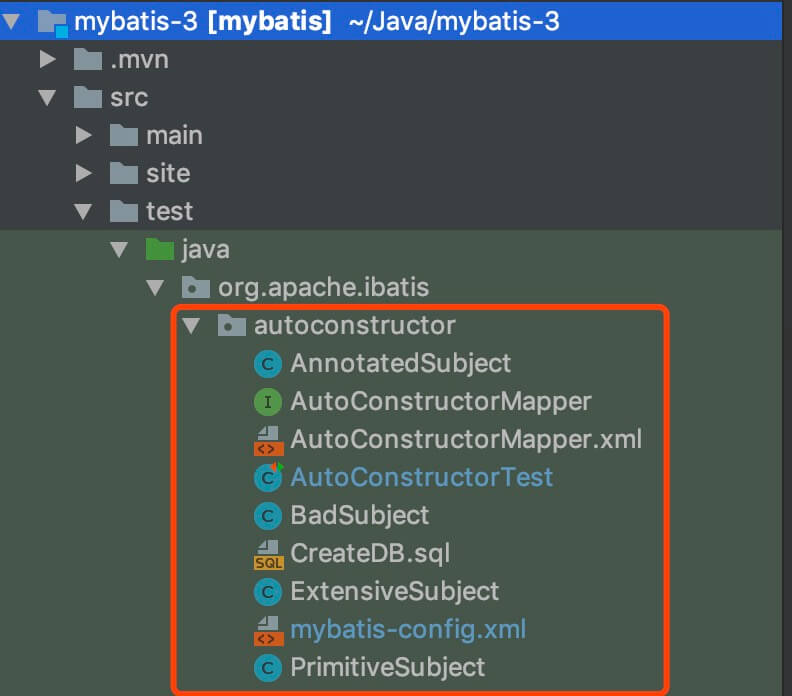

## 1. 依赖工具

- Maven
- Git
- JDK
- IntelliJ IDEA

## 2. 源码拉取

从官方仓库 https://github.com/mybatis/mybatis-3 `Fork` 出属于自己的仓库。为什么要 `Fork` ？既然开始阅读、调试源码，我们可能会写一些注释，有了自己的仓库，可以进行自由的提交。

使用 `IntelliJ IDEA` 从 `Fork` 出来的仓库拉取代码。

本文使用的 MyBatis 版本为 `3.5.0-SNAPSHOT` 。

因为 MyBatis 是有些年份的框架，所以克隆的过程可能比较慢，耐心等待。

## 3. 调试

MyBatis 想要调试，非常方便，只需要打开 `org.apache.ibatis.autoconstructor.AutoConstructorTest` 单元测试类，任意一个单元测试方法，右键，开始调试即可。

当然，考虑到让大家更好的理解 AutoConstructorTest 这个类，下面，我们还是详细解析下。AutoConstructorTest 所在在 `autoconstructor` 包下，整体结构如下：



## 4. mybatis-config.xml

`mybatis-config.xml` ，MyBatis 配置文件。XML 如下：

```xml
<!DOCTYPE configuration
        PUBLIC "-//mybatis.org//DTD Config 3.0//EN"
        "http://mybatis.org/dtd/mybatis-3-config.dtd">

<configuration>

    <!-- autoMappingBehavior should be set in each test case -->

    <environments default="development">
        <environment id="development">
            <!-- 配置事务管理 -->
            <transactionManager type="JDBC">
                <property name="" value=""/>
            </transactionManager>
            <!-- 配置数据源  -->
            <dataSource type="UNPOOLED">
                <property name="driver" value="org.hsqldb.jdbcDriver"/>
                <property name="url" value="jdbc:hsqldb:mem:automapping"/>
                <property name="username" value="sa"/>
            </dataSource>
        </environment>
    </environments>

    <!-- 扫描 Mapper 文件  -->
    <mappers>
        <mapper resource="org/apache/ibatis/autoconstructor/AutoConstructorMapper.xml"/>
    </mappers>

</configuration>
```

- 在 `<environments />` 标签中，配置了事务管理和数据源。考虑到减少外部依赖，所以使用了 [HSQLDB](https://zh.wikipedia.org/wiki/HSQLDB) 。
- 在 `<mappers />` 标签中，配置了需要扫描的 Mapper 文件。目前，仅仅扫描 `AutoConstructorMapper.xml` 文件。

## 5. AutoConstructorMapper.xml

`AutoConstructorMapper.xml` ，Mapper 文件。代码如下：

```xml
<!DOCTYPE mapper
    PUBLIC "-//mybatis.org//DTD Mapper 3.0//EN"
    "http://mybatis.org/dtd/mybatis-3-mapper.dtd">

<mapper namespace="org.apache.ibatis.autoconstructor.AutoConstructorMapper">
</mapper>
```

对应的接口为 `org.apache.ibatis.autoconstructor.AutoConstructorMapper` 。

### 5.1 AutoConstructorMapper

```java
public interface AutoConstructorMapper {

    // ========== PrimitiveSubject ==========

    @Select("SELECT * FROM subject WHERE id = #{id}")
    PrimitiveSubject getSubject(final int id);
    @Select("SELECT * FROM subject")
    List<PrimitiveSubject> getSubjects();

    // ========== AnnotatedSubject ==========

    @Select("SELECT * FROM subject")
    List<AnnotatedSubject> getAnnotatedSubjects();

    // ========== BadSubject ==========

    @Select("SELECT * FROM subject")
    List<BadSubject> getBadSubjects();

    // ========== ExtensiveSubject ==========

    @Select("SELECT * FROM extensive_subject")
    List<ExtensiveSubject> getExtensiveSubject();

}
```

使用注解的方法，编写 SQL 。

## 6. CreateDB.sql

`CreateDB.sql` 文件，用于单元测试里，初始化数据库的数据。如下：

```sql
DROP TABLE subject
IF EXISTS;

DROP TABLE extensive_subject
IF EXISTS;

CREATE TABLE subject (
  id     INT NOT NULL,
  name   VARCHAR(20),
  age    INT NOT NULL,
  height INT,
  weight INT,
  active BIT,
  dt     TIMESTAMP
);

CREATE TABLE extensive_subject (
  aByte      TINYINT,
  aShort     SMALLINT,
  aChar      CHAR,
  anInt      INT,
  aLong      BIGINT,
  aFloat     FLOAT,
  aDouble    DOUBLE,
  aBoolean   BIT,
  aString    VARCHAR(255),
  anEnum     VARCHAR(50),
  aClob      LONGVARCHAR,
  aBlob      LONGVARBINARY,
  aTimestamp TIMESTAMP
);

INSERT INTO subject VALUES
  (1, 'a', 10, 100, 45, 1, CURRENT_TIMESTAMP),
  (2, 'b', 10, NULL, 45, 1, CURRENT_TIMESTAMP),
  (2, 'c', 10, NULL, NULL, 0, CURRENT_TIMESTAMP);

INSERT INTO extensive_subject
VALUES
  (1, 1, 'a', 1, 1, 1, 1.0, 1, 'a', 'AVALUE', 'ACLOB', 'aaaaaabbbbbb', CURRENT_TIMESTAMP),
  (2, 2, 'b', 2, 2, 2, 2.0, 2, 'b', 'BVALUE', 'BCLOB', '010101010101', CURRENT_TIMESTAMP),
  (3, 3, 'c', 3, 3, 3, 3.0, 3, 'c', 'CVALUE', 'CCLOB', '777d010078da', CURRENT_TIMESTAMP);
```

* 创建了 `subject` 表，并初始化三条数据。
* 创建了 `extensive_subject` 表，并初始化三条数据。

## 7. POJO

在 AutoConstructorMapper 中，我们可以看到有四个 POJO 类。但是，从 `CreateDB.sql` 中，实际只有两个表。这个是为什么呢？继续往下看噢。

### 7.1 AnnotatedSubject

```java
package org.apache.ibatis.autoconstructor;

import org.apache.ibatis.annotations.AutomapConstructor;

public class AnnotatedSubject {

    private final int id;
    private final String name;
    private final int age;
    private final int height;
    private final int weight;

    public AnnotatedSubject(final int id, final String name, final int age, final int height, final int weight) {
        this.id = id;
        this.name = name;
        this.age = age;
        this.height = height;
        this.weight = weight;
    }

    @AutomapConstructor
    public AnnotatedSubject(final int id, final String name, final int age, final Integer height, final Integer weight) {
        this.id = id;
        this.name = name;
        this.age = age;
        this.height = height == null ? 0 : height;
        this.weight = weight == null ? 0 : weight;
    }

}
```

* 对应 `subject` 表。
* `@AutomapConstructor` 注解，表示 MyBatis 查询后，在创建 AnnotatedSubject 对象，使用该构造方法。

#### 7.1.1 PrimitiveSubject

```java
package org.apache.ibatis.autoconstructor;

import java.util.Date;

public class PrimitiveSubject {

    private final int id;
    private final String name;
    private final int age;
    private final int height;
    private final int weight;
    private final boolean active;
    private final Date dt;

    public PrimitiveSubject(final int id, final String name, final int age, final int height, final int weight, final boolean active, final Date dt) {
        this.id = id;
        this.name = name;
        this.age = age;
        this.height = height;
        this.weight = weight;
        this.active = active;
        this.dt = dt;
    }

}
```

* 对应的也是 `subject` 表。
* 和 AnnotatedSubject 不同，在其构造方法上，`weight` 和 `height` 方法参数的类型是 `int` ，而不是 Integer 。那么，如果 `subject` 表中的记录，这两个字段为 `NULL` 时，会创建 PrimitiveSubject 对象报错。

#### 7.1.2 BadSubject

```java
package org.apache.ibatis.autoconstructor;

public class BadSubject {

    private final int id;
    private final String name;
    private final int age;
    private final Height height;
    private final Double weight;

    public BadSubject(final int id, final String name, final int age, final Height height, final Double weight) {
        this.id = id;
        this.name = name;
        this.age = age;
        this.height = height;
        this.weight = weight == null ? 0 : weight;
    }

    private class Height {

    }

}
```

* 对应的也是 `subject` 表。
* 和 AnnotatedSubject 不同，在其构造方法上，`height` 方法参数的类型是 Height ，而不是 Integer 。因为 MyBatis 无法识别 Height 类，所以会创建 BadSubject 对象报错。

> 一般情况下，POJO 对象里，不使用基本类型。

### 7.2 ExtensiveSubject

```java
package org.apache.ibatis.autoconstructor;

public class ExtensiveSubject {
    private final byte aByte;
    private final short aShort;
    private final char aChar;
    private final int anInt;
    private final long aLong;
    private final float aFloat;
    private final double aDouble;
    private final boolean aBoolean;
    private final String aString;

    // enum types
    private final TestEnum anEnum;

    // array types

    // string to lob types:
    private final String aClob;
    private final String aBlob;

    public ExtensiveSubject(final byte aByte,
                            final short aShort,
                            final char aChar,
                            final int anInt,
                            final long aLong,
                            final float aFloat,
                            final double aDouble,
                            final boolean aBoolean,
                            final String aString,
                            final TestEnum anEnum,
                            final String aClob,
                            final String aBlob) {
        this.aByte = aByte;
        this.aShort = aShort;
        this.aChar = aChar;
        this.anInt = anInt;
        this.aLong = aLong;
        this.aFloat = aFloat;
        this.aDouble = aDouble;
        this.aBoolean = aBoolean;
        this.aString = aString;
        this.anEnum = anEnum;
        this.aClob = aClob;
        this.aBlob = aBlob;
    }

    public enum TestEnum {
        AVALUE, BVALUE, CVALUE;
    }

}
```

* 对应的也是 `extensive_subject` 表。
* 这是个复杂对象，基本涵盖了各种类型的数据。

## 8. AutoConstructorTest

`org.apache.ibatis.autoconstructor.AutoConstructorTest` ，单元测试类。

### 8.1 setUp

```java
private static SqlSessionFactory sqlSessionFactory;

@BeforeClass
public static void setUp() throws Exception {
    // create a SqlSessionFactory
    // 创建 SqlSessionFactory 对象，基于 mybatis-config.xml 配置文件。
    try (Reader reader = Resources.getResourceAsReader("org/apache/ibatis/autoconstructor/mybatis-config.xml")) {
        sqlSessionFactory = new SqlSessionFactoryBuilder().build(reader);
    }

    // populate in-memory database
    // 初始化数据到内存数据库，基于 CreateDB.sql SQL 文件。
    BaseDataTest.runScript(sqlSessionFactory.getConfiguration().getEnvironment().getDataSource(),
            "org/apache/ibatis/autoconstructor/CreateDB.sql");
}
```

* 创建 SqlSessionFactory 对象，基于 `mybatis-config.xml` 配置文件。
* 初始化数据到内存数据库，基于 `CreateDB.sql` SQL 文件。

### 8.2 测试方法

右键任一单元测试方法，愉快的调试起来把。
